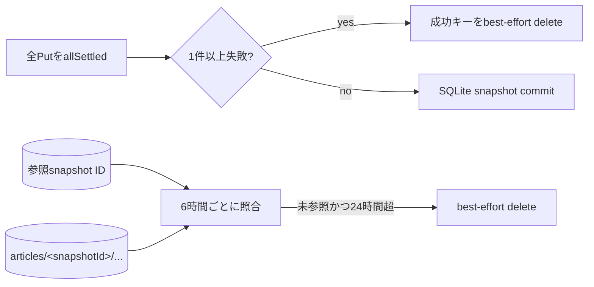

# ADR-0066: 未参照の記事archive objectを二段階で回収する

- Status: Proposed
- Date: 2026-08-19
- Decision owners: Content Platform
- Supersedes: N/A
- Superseded by: N/A
- Related: Issue #22、ADR-0011、ADR-0012、ADR-0065

## コンテキストと変更契機

記事captureはraw、replay、Markdown、assetをsnapshot単位のS3 prefixへ並列保存し、全保存の成功後だけSQLiteへsnapshotをcommitする。従来の`Promise.all`は1件のPut失敗で早期rejectし、既に成功したobjectを削除しなかった。process停止やcapture成功後のDB commit失敗でも、SQLiteから辿れないobjectが残り得る。

## 決定

capture内の補償と、SQLiteを正本にした定期reconciliationを組み合わせる。

- Putはすべてsettleさせ、成功したキーだけを即時削除する。削除にはcaptureの中断済みsignalを再利用せず、最大10秒の独立signalを使う。
- 定期処理はSQLiteの全`article_snapshots.snapshot_id`を参照集合とし、S3の`articles/`をページング走査する。UUID v4 snapshot prefix、未参照、`LastModified`が保持期限より古い、の3条件を満たすobjectだけを削除する。
- 既定は6時間間隔・24時間保持とし、`CONTENT_ARCHIVE_CLEANUP_INTERVAL_MS`と`CONTENT_ARCHIVE_ORPHAN_RETENTION_MS`で変更できる。
- Deleteは最大16並列に抑える。個別Delete失敗はcleanup全体を失敗へ変えず、`object.cleanup{trigger,cleanup.result}`と`object.cleanup.failed`へ件数だけを記録する。object key、owner、URLはtelemetryへ出さない。ListまたはSQLite参照取得の失敗はcycle失敗として次周期へ持ち越す。

## 判断要因

- S3とSQLiteを同一transactionにできないため、補償とreconciliationの両方が必要。
- in-flight captureを誤削除しない保持期間が必要。
- cleanup障害でcaptureの本来の失敗理由やservice可用性を上書きしない。
- ownerやobject keyをmetric labelへ載せず、cardinalityと機密性を維持する。

## 却下案

| 案 | 却下理由 | 再検討条件 |
| --- | --- | --- |
| Putを逐次実行して失敗時に停止 | 保存時間がasset数に比例し、30秒deadlineを圧迫する | S3がatomic batch Putを提供する |
| 即時cleanupだけ | process停止、DB commit失敗、Delete失敗を回収できない | S3とSQLiteを同一transactionへ統合する |
| S3 lifecycleで`articles/`を一律削除 | 参照中のarchiveも期限で消すため不変条件を壊す | 参照objectを別bucket/prefixへ昇格できる |
| 保持期間なしで未参照を即時削除 | commit直前のin-flight snapshotと区別できない | durable staging manifestを導入する |

## 結果

### 利点

- 部分Put失敗の大半をcapture内で即時回収できる。
- process停止、commit失敗、過去のDelete失敗も24時間後に再回収できる。
- cleanup失敗率と削除数を低cardinality telemetryで追跡できる。

### 欠点とリスク

- 6時間ごとに`articles/` prefix全体とSQLite参照集合を走査する。
- 未参照objectは最大で保持期間と次周期の合計だけ残る。
- S3の`LastModified`が欠落したobjectとUUID形式外のkeyは安全側に倒して自動削除しない。

## 影響と同期

| 対象 | 必要な変更 | 状態 | 証拠 |
| --- | --- | --- | --- |
| 設計書 | 二段階cleanupと正本を明記 | Done | `docs/design.md`、`docs/architecture.md` |
| ドメイン/ユースケース | N/A — archive結果語彙は不変 | Done | capture error contract差分なし |
| OpenAPI/外部契約 | N/A — HTTP shape/statusは不変 | Done | generated OpenAPI差分なし |
| コード/ポート | SQLite参照列挙とS3 reconciliationを追加 | Done | Content archive store / capture resource |
| データ/ストレージ | N/A — migrationとbucket構成は不変 | Done | schema差分なし |
| 実行/配備 | interval/retention設定と定期loopを追加 | Done | Content runtime / `.env.example` |
| 認証/セキュリティ | key/owner/URLをtelemetryへ出さない | Done | observability privacy test |
| フロント/品質保証 | N/A — UI契約は不変 | Done | Web差分なし |
| テスト/運用 | 部分Put、Delete失敗、保持期限、DB参照保護を検証 | Done | Content adapter/runtime tests、運用手順 |

## 再検討条件

- `articles/`走査が1周期で5分または10万objectを超える。
- `object.cleanup{cleanup.result="failed"}`が3周期連続で1以上になる。
- 保持期間内の未参照容量がobject-store予算の5%を超える。
- S3 inventory、event notification、durable staging manifestが利用可能になる。

## 受け入れゲートと未決事項

- None。

## 検証証拠

- Red: 部分Put成功後にDeleteが0件、定期cleanup/DB参照列挙が未実装。
- Green: capture、S3 sweep、SQLite参照、loop、telemetry、envのunit tests。
- `pnpm --filter content-knowledge test` / `typecheck` / `lint`。
- `pnpm --filter @news-podcast/observability test` / `typecheck` / `lint`。
