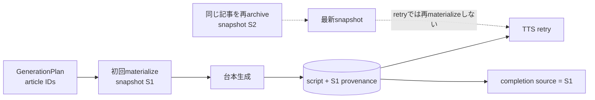

# ADR-0067: 台本checkpointを生成元snapshotへ固定する

- Status: Accepted
- Date: 2026-08-19
- Decision owners: Episode Production / Architecture
- Supersedes: N/A
- Superseded by: N/A
- Related: Issue #37、ADR-0007、ADR-0016、ADR-0038、ADR-0059、ADR-0062

## コンテキストと変更契機

Episode Productionは`GenerationPlan`へ記事IDをfirst-write-winsで保存する一方、本文materializeでは記事ごとの最新snapshotを読む。音声合成が一時失敗した後は台本checkpointを再利用するが、従来はretryでも本文を再materializeしたため、その間に同じ記事を再archiveすると、S1から作った台本へS2の`snapshotId`をcompletion sourceとして付けていた。

台本と公開出典が異なる版を指す状態は、保存版による監査と説明可能性を壊す。

## 決定

台本checkpointを`script`と、その台本が実際に採用したsource provenanceの不可分な組として保存する。sourceは`articleId`、`snapshotId`、URL、title、任意の公開日時を持つ。

- 初回はmaterialize後、台本の`sourceUrls`を入力記事へ照合してから、採用sourceのprovenanceと台本を同時にcheckpointへ保存する。
- checkpointがあるretryはContent Knowledgeを再呼び出さず、保存済みsourceだけを台本検証、音声合成、completionへ使う。
- checkpoint sourceが空、または台本のURLと一致しない場合は`invalid_script_sources`として公開前に失敗させる。
- JSON envelopeは既存の`episode_execution_checkpoints.script`列へ保存する。公開契約とDB列のmigrationは不要。

## 判断要因

- 台本とsnapshot provenanceは同じ再開境界で確定する必要がある。
- retry時の外部provider費用を抑えながら、出典を再現可能にする。
- Content Knowledgeへ過去snapshot指定RPCを追加せず、Context間契約を拡張しない。
- lease tokenによる既存のcheckpoint fencingをそのまま利用する。

## 却下案

| 案 | 却下理由 | 再検討条件 |
| --- | --- | --- |
| GenerationPlanへsnapshot IDを保存 | Planは本文materialize前に確定し、台本が実際に採用したsource集合もまだ不明 | planningとmaterializeを同じ原子的境界へ統合する |
| retryごとに最新snapshotで台本・辞書・音声を全再生成 | 生成費用が増え、checkpoint再開の目的を失う | snapshot変更を番組へ即時反映する要件が優先される |
| Content RPCへsnapshot指定materializeを追加 | retryに不要な本文まで再取得し、Context間契約を拡張する | checkpointから本文生成自体を再開する要件が生じる |
| URLだけをcheckpointへ保存 | 同じURLに複数snapshotがあるため版を識別できない | ContentがURLを永久に版一意へする |

## 結果

### 利点

- retryを跨いでも台本、音声、completion sourceが同じsnapshotへ固定される。
- checkpoint再開時は本文取得を省略し、Content障害の影響と処理時間を減らせる。
- DB migrationなしで既存のlease fencingと原子的な成功commitを維持できる。

### 欠点とリスク

- checkpoint JSONがsource metadata分だけ増える。
- provenanceを持たない旧形式checkpointは安全に再開できないため、decode失敗として有界なjob failureになる。
- checkpoint後のarchive更新は、意図どおりそのjobへ反映されない。

## 影響と同期

| 対象 | 必要な変更 | 状態 | 証拠 |
| --- | --- | --- | --- |
| 設計書 | retry時のsnapshot固定境界を明記 | Done | `docs/design.md`、`docs/architecture.md` |
| ドメイン/ユースケース | checkpointへsource provenanceを追加 | Done | Episode execution port |
| OpenAPI/外部契約 | N/A — HTTP/NATS shapeは不変 | Done | generated OpenAPI差分なし |
| コード/ポート | retryでcheckpoint sourceを再利用 | Done | `execute-job.ts` |
| データ/ストレージ | JSON envelope変更、DB列追加なし | Done | SQLite execution repository test |
| 実行/配備 | N/A — 設定とservice構成は不変 | Done | runtime差分なし |
| 認証/セキュリティ | N/A — owner/lease検証は既存境界を維持 | Done | execution tests |
| フロント/品質保証 | N/A — completion source shapeは不変 | Done | Library/Web契約差分なし |
| テスト/運用 | S1 checkpoint後にS2が現れるretryを検証 | Done | Episode Production application/repository tests |

## 再検討条件

- checkpoint source metadataがjob DB容量の10%を超える。
- 台本生成途中からの再開に、source本文そのもののcheckpointが必要になる。
- Content Knowledgeがsnapshot ID指定の有界materialize契約を提供する。

## 受け入れゲートと未決事項

- None。

## 検証証拠

- Red: S1台本checkpoint後のretryがcompletion sourceへS2を設定した。
- Green: retryはmaterializeを再実行せず、S1 provenanceでcompletionを作る。
- `pnpm --filter @news-podcast/episode-production test` / `typecheck`。
- `pnpm lint` / `pnpm format:check` / functional E2E。
