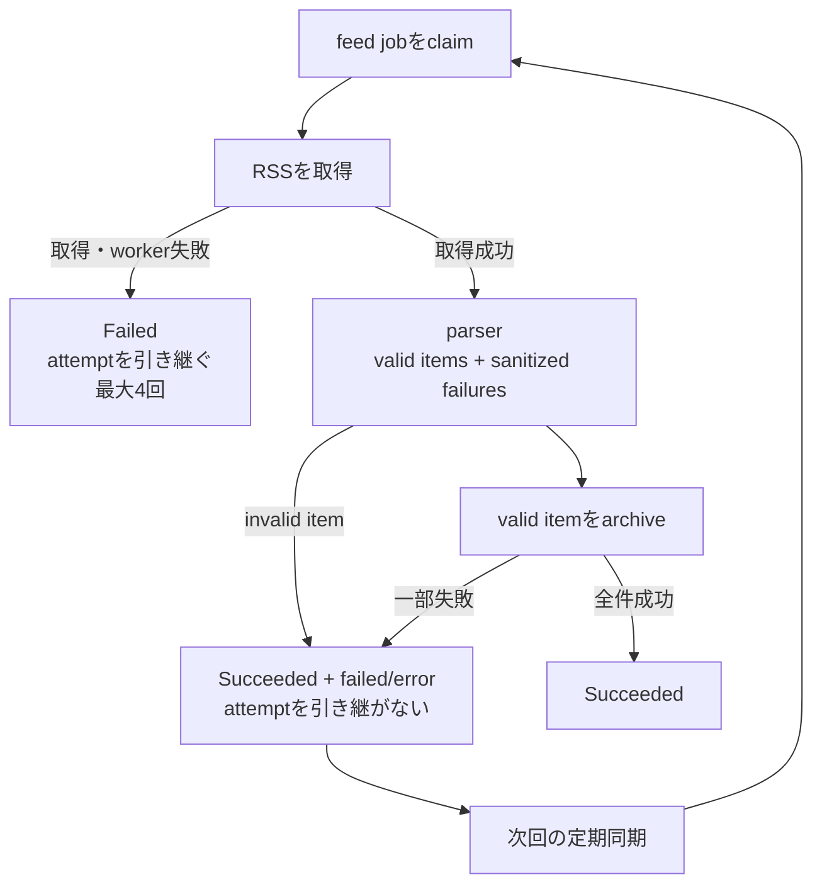

# ADR-0068: 個別記事の同期失敗をfeed継続性から分離する

- Status: Accepted
- Date: 2026-08-19
- Amended: 2026-08-20（Issue #48: parser validation failureを同期結果へ保持）
- Decision owners: Content Knowledge / Architecture
- Supersedes: N/A
- Superseded by: N/A
- Related: Issue #38、Issue #48、ADR-0012、ADR-0041

## コンテキストと変更契機

RSS同期jobはfeed内の個別記事を順にarchiveする。従来は1件でもarchiveに失敗するとjob全体を`Failed`にし、定期cycleごとに試行回数を引き継いでいた。そのため恒久的に取得できない記事が1件あるだけで4回の上限へ達し、同じfeedの新着記事を以後同期できなかった。

feedの取得不能と個別記事の取得不能では、影響範囲と回復条件が異なる。両者を同じjob failureとして扱うと、一部失敗がfeed全体の可用性を奪う。

さらにRSS XML自体が整形式でも、itemのtitle/linkが欠落・不正な場合、parserがitemを無言で除外していた。全itemが不正でも`discovered=0, failed=0`となり、空のfeedと契約違反feedを利用者・運用者が区別できなかった。

## 決定

poll結果へ失敗scopeを付け、feed全体の失敗と個別記事の失敗を永続queueの完了境界で分離する。

- feed取得失敗、catalog永続化失敗、workerの未捕捉失敗は`Feed` scopeとし、jobを`Failed`へ遷移させる。既存どおり試行回数を引き継ぎ、初回を含む最大4回で停止する。
- 個別記事のvalidation・archive失敗は`Item` scopeとし、成功件数・失敗件数・errorを保持したdegradedな`Succeeded`へ遷移させる。次回enqueueでは試行回数をリセットし、定期同期を継続する。
- parserは`items`と`failures`を同じ結果で返す。title/link欠落、非HTTP(S) URL、title長超過は定数reasonだけへsanitizeし、原文URL・title・bodyをerrorやtelemetryへ渡さない。不正itemも`discovered`と`failed`へ1件ずつ数える。
- Webは`Succeeded && failed > 0`を警告表示し、失敗記事数と既知のsanitized reasonを利用者へ示す。`Failed`はfeed全体の失敗表示を維持する。HTTP/NATS APIは既存`error` fieldで同じreasonを返す。
- runtimeはdegraded completionをwarningの`rss.sync.degraded`、feed scope failureを`rss.sync.failed`として記録し、それぞれ`failure.stage=item / feed`を付ける。記事URLやIDは記録しない。
- 公開status enum、HTTP/NATS契約、DB schemaは変更しない。既存の`status`、`failed`、`error`で表現する。

## 判断要因

- 1件の恒久的な記事障害が、同じfeedの将来記事を停止させてはならない。
- feed全体の障害には有界再試行を残し、無制限の外部アクセスを避ける。
- 部分失敗を隠さず、利用者と運用者の双方が識別できるようにする。
- 既存のlease fencingと公開契約を維持し、変更範囲を失敗分類へ限定する。

## 却下案

| 案 | 却下理由 | 再検討条件 |
| --- | --- | --- |
| 1件の失敗でjob全体を`Failed`にする | 4回でfeedが恒久停止し、新着記事まで失う | 個別記事を独立jobへ分離する |
| 個別記事専用のretry/quarantine tableを追加する | 現在は次回RSS取得で同じ項目を再処理でき、schemaと運用負荷が先行する | 反復失敗の外部アクセス費用がSLOを超える |
| 個別記事失敗を成功として完全に隠す | 利用者が記事欠落を認識できず、運用監視もできない | N/A |
| 個別記事失敗でもattemptだけリセットして`Failed`にする | UIと自動再投入がfeed障害と区別できず、状態契約が曖昧になる | 公開statusへ`Degraded`を追加する |

## 結果

### 利点

- 恒久的に失敗する記事があっても、次回以降の新着記事を同期できる。
- feed障害の有界再試行とlease fencingはそのまま維持される。
- queue row、UI、telemetryで部分失敗を識別できる。
- valid/invalid混在feedはvalid itemのarchiveを継続し、全件不正feedも正常0件には見えない。

### 欠点とリスク

- 同じ壊れた記事を定期cycleごとに再試行する可能性がある。
- `Succeeded`が完全成功と部分成功の両方を表すため、利用側は`failed`件数も確認する必要がある。
- 最後のerrorだけを保持する既存schemaでは、複数記事の失敗詳細を列挙できない。

## 影響と同期

| 対象 | 必要な変更 | 状態 | 証拠 |
| --- | --- | --- | --- |
| 設計書 | failure scopeとdegraded completionを明記 | Done | `docs/design.md`、`docs/architecture.md` |
| ドメイン/ユースケース | poll failureとoutcomeへscopeを追加し、invalid itemも集計 | Done | `poll-subscriptions.ts`、`feed-sync-worker.ts` |
| OpenAPI/外部契約 | shapeは不変。既存`failed`/`error`で件数・sanitized reasonを返す | Done | generated OpenAPI差分なし |
| コード/ポート | parser結果をvalid itemsとvalidation failuresへ分離し、Item scopeだけをdegradedな`Succeeded`として完了 | Done | RSS reader、feed sync queue repository |
| データ/ストレージ | N/A — 既存status/failed/error列を利用 | Done | migration差分なし |
| 実行/配備 | degraded telemetryを追加 | Done | `rss.sync.degraded` |
| 認証/セキュリティ | N/A — owner、SSRF、lease境界は不変 | Done | 既存safe reader境界 |
| フロント/品質保証 | 部分失敗件数とsanitized reasonを警告表示 | Done | subscription item tests |
| テスト/運用 | 再試行継続、missing title/link、非HTTP URL、長すぎるtitle、mixed/all-invalidを検証 | Done | parser / poll / worker / SQLite tests |

## 再検討条件

- 同一記事の反復失敗がfeed polling時間または外部アクセスSLOを超える。
- 複数の個別失敗理由を保持・再処理する運用要件が生じる。
- 公開API利用者が明示的な`Degraded` statusを必要とする。

## 受け入れゲートと未決事項

- None。

## 検証証拠

- Red: 同じ記事が4 cycle失敗すると5 cycle目がclaimされず、新着記事を取得できなかった。
- Green: 個別記事失敗をdegradedな`Succeeded`として完了し、5 cycle目の新着記事をarchiveできた。
- Red: 不正RSS itemがparserで消え、mixed feedが`discovered=1, failed=0`、全件不正が正常0件になった。
- Green: parser validation failureを定数reasonで保持し、mixed/all-invalid双方を`discovered`/`failed`とUI/APIへ反映した。
- Content Knowledge、Web、Observabilityのunit/integration testとtypecheck。
- `pnpm lint` / `pnpm format:check` / functional E2E。
