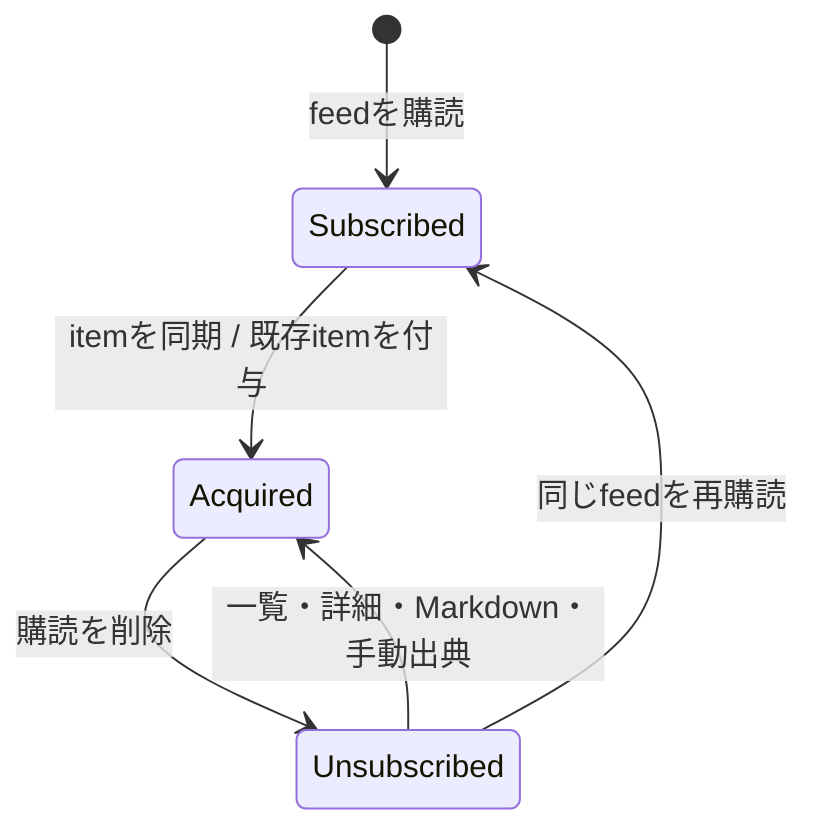

# ADR-0069: 購読と過去記事への恒久アクセス権を分離する

- Status: Accepted
- Date: 2026-08-19
- Decision owners: Content Knowledge / Architecture
- Supersedes: N/A
- Superseded by: N/A
- Related: Issue #39、ADR-0007、ADR-0012、ADR-0062、ADR-0067

## コンテキストと変更契機

記事一覧・詳細・Markdown・手動生成の所有判定は、`feed_items`と現在の`feed_subscriptions`のinner joinだけで決まっていた。購読を削除するとsnapshot、owner状態、Episode sourceは残る一方、本人から記事が不可視になり、同じfeedを再購読すると再び見える不整合があった。

購読解除は将来の同期と自動番組対象から外す操作であり、既に保存した記事や完成済みEpisodeの保存版出典を失う操作ではない。

## 決定

現在の購読と、ownerが一度取り込んだ記事への恒久アクセス権を別の関係として保存する。

- Content Knowledgeへ`article_owner_access(owner_id, article_id, acquired_at)`を追加する。
- RSS itemのcatalog upsert時に、そのfeedを現在購読するowner全員へaccessを冪等付与する。
- 既存feedを購読した時は、そのfeedに保存済みの全itemへaccessを冪等付与する。
- 購読解除は`feed_subscriptions`だけを削除し、access、owner state、snapshot、tag、enrichment結果を保持する。
- 記事一覧・facets・詳細・Markdown・状態変更・tag・明示的enrichment・手動生成の指定記事はaccessで認可する。
- 自動生成候補と将来の同期は、有効な購読を引き続き要求する。
- 既存DBは現在の購読×記事と既存`article_owner_states`からaccessをbackfillする。別serviceにだけ残る過去Episode sourceからの逆向き移行は行わない。
- 公開HTTP/NATS shapeは変更しない。解除確認UIは、保存記事と過去Episode出典が残ることを明示する。

## 判断要因

- 外部リンク失効後も、取り込み時点の保存版を本人が確認できること。
- 購読解除の将来効果と、過去コンテンツの参照権を混同しないこと。
- owner間のアクセスを明示的な複合主キーで分離すること。
- 再購読・RSS再取得でaccess行を重複させないこと。

## 却下案

| 案 | 却下理由 | 再検討条件 |
| --- | --- | --- |
| `feed_subscriptions`をsoft deleteする | 過去参照と将来同期の責務が同じ行へ残り、全queryでenabled条件を誤りやすい | 購読履歴そのものの監査要件が生じる |
| 保存・あとで読む記事だけを解除時にaccessへ移す | Episode sourceや未保存の閲覧履歴が欠落し、削除transactionが他集約へ依存する | 保持対象を利用者が個別選択する製品要件になる |
| `article_owner_states`をaccess兼用にする | 状態未変更の記事には行がなく、状態と認可の意味が混ざる | owner stateを必ず全記事へ作る契約へ変更する |
| 解除時にsnapshotとstateを削除する | UI説明と保存版provenanceの価値に反する | 明示的なデータ削除機能として別操作を設計する |

## 結果

### 利点

- 解除後も保存記事、詳細、Markdown、過去Episodeの保存版リンクを参照できる。
- 自動生成は解除済みfeedを候補にせず、将来効果を維持する。
- 再購読と再同期は複合主キーで冪等になる。

### 欠点とリスク

- owner×article分のaccess行が増える。
- 記事削除ポリシーを将来追加する場合、accessを明示的に失効させる必要がある。
- migration前に購読解除済みで、Content側にowner stateもない記事は自動backfillできない。

## 影響と同期

| 対象 | 必要な変更 | 状態 | 証拠 |
| --- | --- | --- | --- |
| 設計書 | 購読とaccessの責務を分離 | Done | `docs/design.md`、`docs/architecture.md` |
| ドメイン/ユースケース | N/A — 公開domain shapeは不変 | Done | 既存Article view |
| OpenAPI/外部契約 | N/A — endpointとresponseは不変 | Done | generated OpenAPI差分なし |
| コード/ポート | owner-scoped queryをaccessへ切替 | Done | article library/catalog/taxonomy/enrichment repositories |
| データ/ストレージ | access tableとbackfill migration | Done | Content Knowledge migration |
| 実行/配備 | 起動時migrationで適用 | Done | 共通Drizzle migrator |
| 認証/セキュリティ | `(owner_id, article_id)`でowner分離 | Done | unsubscribe/owner isolation tests |
| フロント/品質保証 | 解除後に残るデータを確認文へ明記 | Done | SubscriptionItem test |
| テスト/運用 | 解除→参照→自動候補除外→再購読を検証 | Done | SQLite article library integration test |

## 再検討条件

- access行がContent DB容量の20%を超える。
- 利用者が記事単位で保存版を完全削除する要件が生じる。
- Episode LibraryからContent accessへ履歴を再構築するcross-context migrationが必要になる。

## 受け入れゲートと未決事項

- None。

## 検証証拠

- Red: 購読削除後、保存記事一覧が空になり、詳細・Markdown・手動出典もNotFoundになった。
- Green: durable accessで解除後も参照でき、自動生成候補だけは空になる。再購読後も記事は1件のまま。
- migration backfill、owner isolation、Content Knowledge/Webのunit/integration test。
- `pnpm lint` / `pnpm architecture:check` / `pnpm format:check` / functional E2E。
