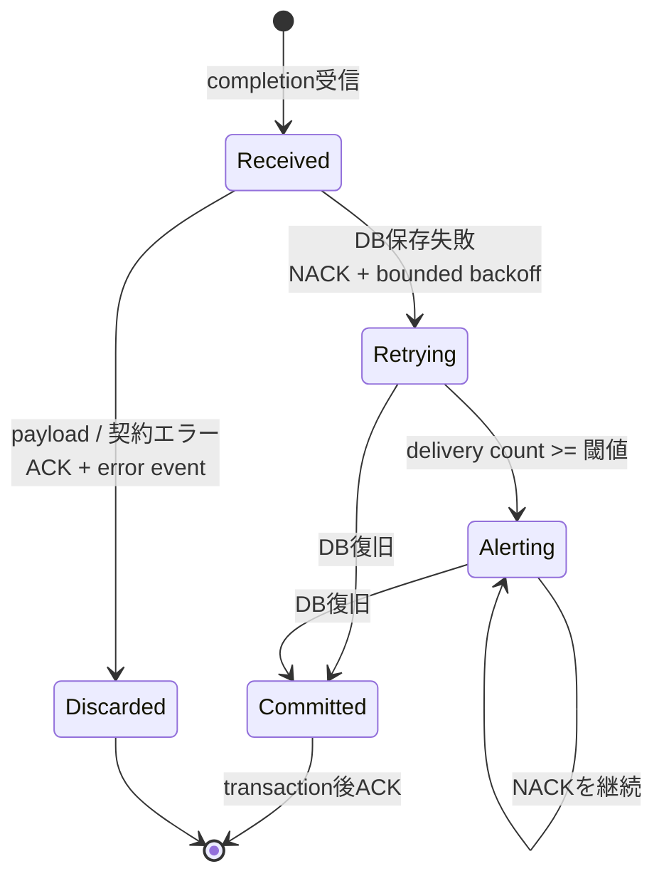

# ADR-0070: Episode完了配送の監視閾値と復旧上限を分離する

- Status: Accepted
- Date: 2026-08-19
- Decision owners: Episode Library / Architecture
- Supersedes: N/A
- Superseded by: N/A
- Related: Issue #40、ADR-0036、ADR-0040、ADR-0052

## コンテキストと変更契機

Episode Productionは生成成功後にcompletion outboxを`Published`へ進め、Episode LibraryはJetStreamのdurable consumerから完成Episodeを保存する。Library DBの一時障害が従来の`max_deliver=10`を超えると、Production側は既にpublish済みのため再送元がなく、成功済みEpisodeがLibraryへ永久に現れなかった。

## 決定

一時的な保存障害の復旧上限と、運用上の異常検知閾値を分離する。

- JetStream consumerは`max_deliver=-1`とし、保存障害の再配送を打ち切らない。
- `EPISODE_LIBRARY_COMPLETION_MAXIMUM_DELIVERIES`は配信停止上限ではなく、異常通知を開始する1-based delivery countとして扱う。
- `CompletionStoreFailure`だけを一時障害とし、上限付き指数backoffでNACKする。
- JSON、protocol、producer、materialization、domain contractの決定的エラーはACKして破棄し、`episode_library.completion.discarded`へfailure tagと、検証済みのmessage・correlation・episode IDを記録する。
- 閾値到達後もNACKを継続し、各試行を`episode_library.completion.redelivery_threshold_exceeded`で検知可能にする。
- LibraryのinboxとEpisode保存は同一transactionかつmessage IDで冪等なため、DB復旧後の再配送を重複なくcommitする。

## 判断要因

- Production outboxがpublish済みでも、Library単独で自動復旧できること。
- 一時的DB障害と決定的なpoison payloadを同じ再試行方針にしないこと。
- 再配送回数を低cardinalityな監視情報として残すこと。
- 公開HTTP、NATS payload、DB schemaを変更しないこと。

## 却下案

| 案 | 却下理由 | 再検討条件 |
| --- | --- | --- |
| 有限`max_deliver`を維持 | 上限到達後に再送主体がなく、成功Episodeを永久欠落させる | durableなredrive主体を別途導入する |
| 全失敗を無制限再配送 | 壊れたpayloadがconsumerを占有し、復旧不能な再試行を続ける | protocol別DLQと修復手順を導入する |
| LibraryがProduction DBを走査するreconciler | bounded context間のDB所有権を破り、二つの回復経路を持つ | completion query APIと照合SLOを正式契約にする |
| DLQへ移して手動redrive | 自動復旧せず、運用者不在時の欠落時間が伸びる | 監査・隔離・任意payload修復が製品要件になる |

## 結果

### 利点

- DB停止が監視閾値を超えても、復旧後にEpisodeが自動でLibraryへ現れる。
- poison payloadはACKされ、無限再配送を起こさない。
- 閾値超過、通常NACK、破棄、ACKを別eventで観測できる。

### 欠点とリスク

- 長期DB障害中はpending completionとerror logが増え続ける。
- `CompletionStoreFailure`に恒久的なstorage破損が含まれる場合、運用修復まで再配送が続く。
- 環境変数名`MAXIMUM_DELIVERIES`と実際の「監視閾値」に互換性上のずれが残る。

## 影響と同期

| 対象 | 必要な変更 | 状態 | 証拠 |
| --- | --- | --- | --- |
| 設計書 | completion復旧状態遷移を追記 | Done | `docs/design.md`、`docs/architecture.md` |
| ドメイン/ユースケース | N/A — Episode/inbox契約は不変 | Done | 既存completion use case |
| OpenAPI/外部契約 | N/A — payloadとendpointは不変 | Done | protocol差分なし |
| コード/ポート | 一時障害だけNACK、終端障害をACK | Done | completion handler / loop |
| データ/ストレージ | N/A — migration不要 | Done | schema差分なし |
| 実行/配備 | JetStreamを無制限配送へ変更 | Done | consumer config test |
| Observability | ACK/NACK/破棄/閾値超過eventを契約化 | Done | observability contract test |
| テスト/運用 | 閾値3回失敗後の4回目復旧を検証 | Done | unit / NATS integration test |

## 再検討条件

- completion backlogの隔離・並列処理が必要になる。
- payloadを修復してredriveする監査要件が生じる。
- 永続的storage failureをtyped分類できるようになる。
- 閾値超過eventをalertへ接続しても復旧時間SLOを満たせない。

## 受け入れゲートと未決事項

- None。

## 検証証拠

- Red: delivery 1〜3の保存失敗後、有限`max_deliver`ではdelivery 4を受信できなかった。
- Green: delivery 3で閾値超過を通知し、delivery 4で保存・ACKしてEpisodeを復旧する。
- invalid JSONはACK・破棄され、再配送しない。
- Episode Library unit/typecheck、Observability contract、NATS integration、functional E2E。
