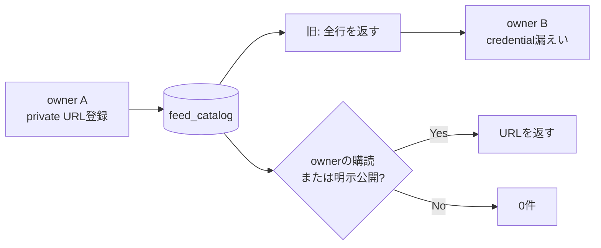

# ADR-0071: ユーザー登録RSS URLをprivate-by-defaultにする

- Status: Accepted
- Date: 2026-08-20
- Decision owners: Content Knowledge / Security / Architecture
- Supersedes: N/A
- Superseded by: N/A
- Related: Issue #43、ADR-0005、ADR-0012、ADR-0069

## コンテキストと変更契機

認証済みownerが登録した任意RSS URLは、所有者情報を持たない`feed_catalog`へ保存されていた。`listCatalog(ownerId, query)`はownerを使わず全行を返すため、private feedのquery tokenやpath credentialを別ownerが`GET /v1/feeds`から取得できた。

## セキュリティ不変条件

- 任意登録URLは、登録したownerが明示的に購読している間は本人だけがcatalogから取得できる。
- 別ownerが同じURLを自分で入力して購読した場合は、そのownerにも同じcanonical feedを返してよい。既知の秘密を再入力した主体へ新しい情報は開示しない。
- cross-owner catalogへ出すfeedは、private登録と独立した明示公開状態を必要とする。
- 内部pollingと、owner-scopedな購読・同期job・記事facetは従来どおり動作する。

## 決定

`feed_catalog`をcanonical feedの内部正本として維持し、cross-owner公開状態を`public_feed_listings`へ分離する。

| 状態 | owner本人 | 別owner | polling |
| --- | --- | --- | --- |
| private + 本人が購読中 | 表示 | 非表示 | enabledなら実行 |
| private + 別ownerも同じURLを直接登録 | 両ownerへ各自表示 | 未登録ownerには非表示 | enabledなら実行 |
| public listingあり | 表示 | 表示 | enabled購読があれば実行 |
| public listing解除 | 本人の購読中だけ表示 | 非表示 | 購読状態を維持 |

- `listCatalog`は`public_feed_listings`に存在するfeed、またはrequest owner自身の`feed_subscriptions`に存在するfeedだけを返す。
- URL検索条件は、この可視性条件とANDでDB queryへ適用する。query/pathにcredentialらしい文字列があっても別ownerへ候補を返さない。
- user-facingな任意登録処理はpublic listingを作らない。現在は公開化APIも提供しないため、deny-by-defaultで閉じる。
- 将来公開化する場合は、認証なしで取得できること、userinfo・query credential・fragmentがないこと、pathにprovider固有credentialがないことをprovider契約または手動証拠で確認し、ownerの明示同意と監査主体を保存してからlistingを作る。
- 公開解除はlisting行だけを削除する。既存ownerの購読、同期、保存記事は削除しない。
- migrationは既存`feed_catalog`からlistingを推測・backfillせず、全件をprivateとして開始する。host名やURL形状による自動公開判定はしない。

## 判断要因

- token名は任意でpathにも埋め込めるため、credential文字列のblacklistでは完全に分類できない。
- fetchに必要なprivate URLを加工すると購読自体を壊すため、保存値のredactionではなく認可queryで閉じる必要がある。
- polling workerには完全URLが必要だが、その内部利用とcross-owner表示は別責務である。
- 既存データを公開と推測するよりcatalog候補が減る方が安全で、URL直接登録という正規経路は残る。

## 却下案

| 案 | 却下理由 | 再検討条件 |
| --- | --- | --- |
| queryだけ削除して共有 | private feedを取得不能にし、path credentialも漏れる | providerが公開URLとfetch URLを別契約で提供する |
| tokenらしいparameter/pathをblacklist | 任意名・encoding・path形式を網羅できず、誤検知もある | 標準化されたcredential schemaが導入される |
| `feed_catalog.owner_id`を追加 | 同じcanonical URLを複数ownerが直接登録する正規利用を表せない | feed storage自体をownerごとに完全複製する |
| 既存feedをqueryなしならpublic backfill | path credentialや非公開network feedを誤公開する | 全既存feedについて公開証拠と同意を取得できる |
| catalog endpointを廃止 | 漏えいは止まるが、明示公開feedの発見ユースケースまで失う | 媒体発見機能を製品から削除する |

## 結果

### 利点

- owner Aのquery/path credentialをowner Bの検索・候補・購読導線へ渡さない。
- 内部canonical dedupeとpollingを維持したまま、表示認可だけを分離できる。
- 公開・解除が1行の明示状態となり、暗黙のURL形状判定を排除できる。

### 欠点とリスク

- migration直後は共有catalogが空になり、新規ownerはURL直接登録を使う。
- 公開化workflowを実装するまでは`public_feed_listings`をapplicationから作成できない。
- databaseへ直接不正なlistingを追加できる運用主体は、将来の公開判定手順を順守する必要がある。

## 影響と同期

| 対象 | 必要な変更 | 状態 | 証拠 |
| --- | --- | --- | --- |
| 設計書 | private/public catalog規則を追記 | Done | `docs/design.md`、`docs/architecture.md` |
| ドメイン/ユースケース | N/A — URL・購読shapeは不変 | Done | existing schemas |
| OpenAPI/NATS契約 | N/A — response shapeは不変、結果集合だけowner-scoped | Done | generated contract差分なし |
| コード/ポート | catalog queryにowner/public visibilityを追加 | Done | subscription repository |
| データ/ストレージ | 空のpublic listing relationを追加 | Done | Content migration |
| 実行/配備 | 起動時migration、既存feedはprivate | Done | migration test |
| 認証/セキュリティ | query/path secretのcross-owner非表示 | Done | SQLite integration test |
| フロント | 公開候補がない場合は既存のURL直接登録を利用 | Done | existing empty-catalog state |
| テスト/運用 | private/public/解除/同URL直接登録を検証 | Done | repository integration tests |

## 再検討条件

- 公開feedの申請・審査・同意UIを実装する。
- private fetch URLと公開canonical URLを別々に保持するprovider契約が必要になる。
- operatorによる公開listingの監査logと承認者情報が必要になる。
- catalog候補減少が購読成功率SLOへ影響する。

## 受け入れゲートと未決事項

- 公開化writerは意図的に未実装。実装時は同意・検証・監査を別ADRで確定する。

## 検証証拠

- Red: owner Aの`?token=owner-a-secret`付きURLがowner Bのcatalogへ返った。
- Green: query tokenとpath secretの検索はいずれもowner Bへ0件、owner Aへは表示される。
- 正規利用: owner Bが同じURLを直接登録した場合は自分の購読として取得できる。
- 明示公開listingはowner Bへ表示され、listing削除後は即座に非表示になる。
- migrationは既存feedを保持し、public listingを0件で開始する。
