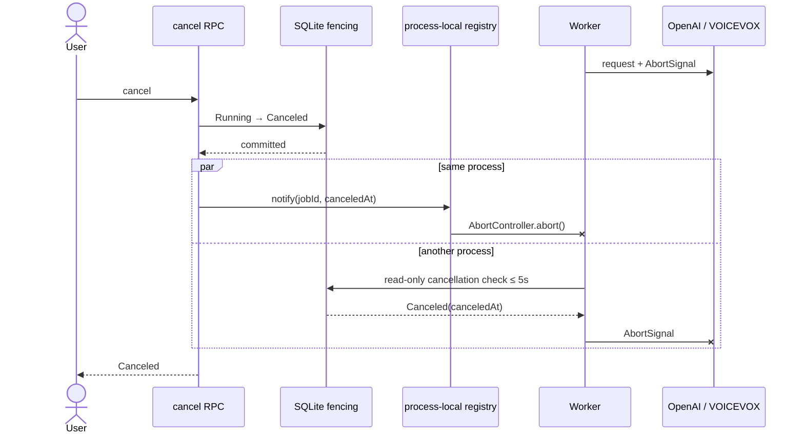

# ADR-0072: Episode取消を実行中providerへ即時伝播する

- Status: Accepted
- Date: 2026-08-20
- Decision owners: Episode Production / Architecture
- Supersedes: N/A
- Superseded by: N/A
- Related: Issue #45、ADR-0016、ADR-0040、ADR-0052

## コンテキストと変更契機

cancel RPCはSQLiteのjobを`Canceled`へ遷移してlease tokenを即座にfenceしていたが、実行中workerの`AbortController`は次のheartbeatまで更新を知らなかった。既定heartbeatは60秒であり、その間もOpenAI / VOICEVOX requestと課金対象処理が継続した。

## 決定

永続状態を正本に保ったまま、同一processの通知と別processの短周期確認を組み合わせる。

- cancel永続化成功後、RPC返信前にprocess-local registryへ通知する。
- workerは実行中jobだけをregistryへ登録し、通知時にproviderへ渡した同じ`AbortSignal`をabortする。
- 別processまたは通知競合に備え、leaseを延長しないread-only checkを既定250ms、設定可能上限5,000msで行う。
- registryは高速化経路であり正本ではない。process再起動・通知欠落時もSQLite checkで収束する。
- success、checkpoint、音声参照、completion outboxのcommitは既存のlease token fencingを変更しない。
- `episode.cancellation.propagation.duration`へ`canceledAt`からabortまでの時間と低cardinalityな`source`を記録する。

## 判断要因

- 同一processではcancel commit直後に外部requestを停止すること。
- multi-processでもheartbeat 60秒に依存せず、設定契約で上限を保証すること。
- cancellation確認のためだけにlease期限を書き換えないこと。
- 通知欠落が永続状態やcommit安全性を壊さないこと。

## 却下案

| 案 | 却下理由 | 再検討条件 |
| --- | --- | --- |
| heartbeatを250msへ短縮 | 不要なSQLite writeとlease延長が増え、取消確認と所有権更新を分離できない | lease backendが高頻度更新を前提に変わる |
| process-local通知だけ | 別processのRPC、再起動、登録前競合で通知を失う | workerとRPCが常に同一processと保証される |
| NATSで取消eventを配送 | 追加consumer・順序・再配送契約が必要で、SQLite正本との二重調停になる | worker数が増えSQLite poll負荷がSLOを阻害する |

## 結果

### 利点

- 同一processではcancel応答前に実行中providerへabortが到達する。
- 別processでも最大5秒の設定契約内で取消を検知する。
- 外部APIコストとCPU消費を抑え、fencing安全性は維持する。

### 欠点とリスク

- 実行中jobごとに既定4回/秒のSQLite readが増える。
- event loop停止中はwall-clock上の5秒SLAを保証できない。
- provider側がAbortSignalを無視した場合、commitは防げるが相手側処理の停止までは保証できない。

## 影響と同期

| 対象 | 必要な変更 | 状態 | 証拠 |
| --- | --- | --- | --- |
| 設計書 | cancel伝播経路と5秒上限を追記 | Done | `docs/design.md`、`docs/architecture.md` |
| ドメイン/ユースケース | Canceled永続状態は不変 | Done | 既存state machine |
| OpenAPI/外部契約 | N/A — endpoint / payload不変 | Done | protocol差分なし |
| コード/ポート | registry、read-only check、worker raceを追加 | Done | runtime / execution repository |
| データ/ストレージ | N/A — migration不要 | Done | 既存job documentを読む |
| 実行/配備 | cancellation poll環境変数を追加 | Done | `.env.example` |
| Observability | cancel→abort latency metricを追加 | Done | observability contract |
| テスト/運用 | 同一process即時・別process250ms・上限拒否を検証 | Done | worker / RPC / env tests |

## 再検討条件

- worker並列数によりSQLite poll負荷が許容値を超える。
- 5秒未満のmulti-process SLOを永続的に要求する。
- providerがAbortSignalを受理しても課金処理を停止しないことが判明する。

## 受け入れゲートと未決事項

- None。

## 検証証拠

- Red: cancel RPCは永続化後にworkerを通知せず、poll間隔とlatency metricも存在しなかった。
- Green: 同一processはheartbeat renewalなしで即時abortし、別processは250ms checkでabortする。
- OpenAI / VOICEVOXの既存cancellation testsで同じAbortSignalのHTTP処理への伝播を確認する。
- cancel後のlease assertionとcancellation check、fenced checkpoint / completion testsを維持する。
