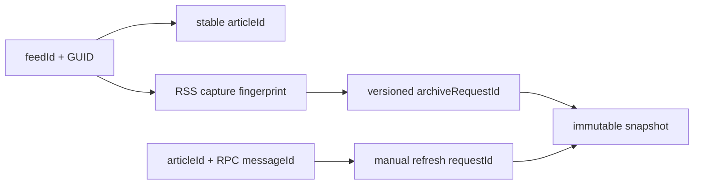

# ADR-0073: 記事identityとcapture intent versionを分離する

- Status: Accepted
- Date: 2026-08-20
- Decision owners: Content Knowledge / Architecture
- Supersedes: N/A
- Superseded by: N/A
- Related: Issue #46、ADR-0012、ADR-0062、ADR-0067

## コンテキストと変更契機

RSS同期は`feedId + GUID`から`articleId`と`archiveRequestId`の両方を固定生成していた。同じGUIDの記事でタイトル・URL・本文が更新されてもarchive lookupは初回requestを返し、catalogだけが更新されてlatest snapshotとPodcast入力は古い版に固定された。手動archiveもarticle単位の固定requestだったため明示refreshできなかった。

## 決定

article identityとcapture intent versionを別の決定関数にする。

- `articleId = hash(feedId, GUID)`は更新前後で不変にする。
- RSSのcanonical URL、title、published/updated時刻、description/content/encoded/summaryを正規化JSONにし、SHA-256 fingerprintを作る。
- feed captureの`archiveRequestId = hash(feedId, GUID, fingerprint)`とする。
- `feed_items.capture_fingerprint`はnullableで保持し、archive成功後にだけ更新する。失敗時は旧fingerprintを残して次回pollで再試行する。
- migration直後の`NULL`は、latest snapshotのURL・titleが現在値と一致すれば既存版をbaselineとして再取得せずfingerprintだけを記録する。不一致なら更新とみなして新snapshotを作る。
- 手動refreshは`articleId + RPC messageId`からrequest IDを作る。同じdelivery retryは冪等、新しい利用者操作は新snapshotになる。
- snapshotは追記のみとし、latest queryは既存の`captured_at DESC, snapshot_id DESC`を維持する。
- Episodeのcheckpoint済みsnapshot provenanceは更新せず、新しい生成だけが新しいlatest snapshotを選ぶ。

### 状態遷移表

| 入力 | articleId | archiveRequestId | 結果 |
| --- | --- | --- | --- |
| 同じGUID・同じfingerprintのretry | 同じ | 同じ | `AlreadyArchived` |
| 同じGUID・fingerprint更新 | 同じ | 新規 | 新snapshotを追加 |
| legacy `NULL`・latest URL/title一致 | 同じ | 既存 | 再取得せずfingerprintをbaseline化 |
| legacy `NULL`・latest URL/title不一致 | 同じ | 新規 | 新snapshotを追加 |
| 新しいGUID | 新規 | 新規 | 新記事・新snapshot |
| 同じmanual RPC deliveryのretry | 同じ | 同じ | `AlreadyArchived` |
| 新しいmanual refresh操作 | 同じ | 新規 | 新snapshotを追加 |

## 判断要因

- GUIDを記事identityとして保ち、一覧・owner access・Episode provenanceを分断しないこと。
- 実更新とtransport retryを決定的に区別すること。
- RSS本文をDBやtelemetryへ複製せず、固定長fingerprintだけをintent導出に使うこと。
- 既存snapshot schemaとlatest queryを再利用しつつ、nullable fingerprint列で段階移行すること。

## 却下案

| 案 | 却下理由 | 再検討条件 |
| --- | --- | --- |
| 毎pollで必ずsnapshot追加 | retry・定期pollごとに同一objectとDB行が増える | origin側version情報が一切得られないfeedだけのopt-in要件が生じる |
| GUID変更を要求 | publisher実装に依存し、一般的な同一GUID更新を取り込めない | N/A |
| catalog metadataだけ更新 | snapshot本文とEpisode入力が古いままになる | N/A |
| article HTTP ETagだけで判定 | capture前lookupを使えず、HEAD非対応originも多い | conditional captureの費用対効果がRSS fingerprintより優れる |

## 結果

### 利点

- 同じGUIDの実更新をimmutableな別snapshotとして保存できる。
- 同一RSS配送とRPC retryは重複snapshotを作らない。
- latest記事取得と将来のEpisodeは更新版を使い、既存Episode provenanceは版固定を維持する。

### 欠点とリスク

- RSSがcapture関連fieldを一切変えずorigin本文だけを変えた場合は検知できない。
- 意味のないupdated時刻変更でも新snapshotになる。
- 手動refresh連打は操作ごとに意図どおりsnapshotを追加する。
- legacy baselineではURL・title以外の過去RSS fieldを復元できないため、その2項目が一致する既存snapshotを現在版として扱う。

## 影響と同期

| 対象 | 必要な変更 | 状態 | 証拠 |
| --- | --- | --- | --- |
| 設計書 | identity/versionと状態遷移を追記 | Done | `docs/design.md`、`docs/architecture.md` |
| ドメイン/ユースケース | FeedItemへSHA-256 fingerprintを追加 | Done | RSS parser / poll use case |
| OpenAPI/外部契約 | N/A — endpoint / response不変 | Done | protocol差分なし |
| コード/ポート | feed/manual request ID導出をversion化 | Done | identity / article library ports |
| データ/ストレージ | nullable `capture_fingerprint`を追加し、成功後更新・legacy baselineを行う | Done | Drizzle migration / article catalog repository |
| Observability | N/A — 本文/fingerprintをtelemetryへ出さない | Done | metric/log差分なし |
| テスト | update/retry/manual/latest/provenance回帰 | Done | parser / identity / polling integration / existing generation tests |

## 再検討条件

- RSS field不変のorigin本文更新を取り込む必要が高まる。
- ETag / Last-Modifiedを安全なconditional capture契約へ追加できる。
- fingerprint対象fieldのpublisher差異でsnapshot churnがSLOを超える。

## 受け入れゲートと未決事項

- RSS metadata不変のorigin-only更新検知は今回の対象外。conditional capture導入時に再検討する。

## 検証証拠

- Red: fingerprint変更後も同じarchive request、manual操作も固定request、本文fingerprintなし。
- Green: v1→legacy baseline→v2→retryでsnapshot数は`1→1→2→2`、latest queryはv2を返す。
- Review regression: migration直後の全件再取得を防ぎ、Atom XHTMLのelement名・属性変更をfingerprintへ含める。
- 既存のlatest automatic/selected generationとEpisode snapshot provenance testsを維持する。
