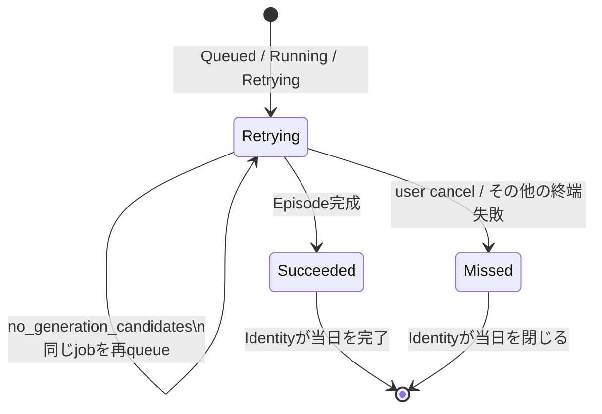

# ADR-0074: 日次予約をEpisode終端結果まで追跡する

- Status: Accepted
- Date: 2026-08-20
- Decision owners: Episode Production / Identity Access / Architecture
- Related: Issue #47、ADR-0037、ADR-0044

## コンテキスト

従来はscheduled jobの作成直後にIdentity Accessの`lastScheduledLocalDate`を進めていた。そのため候補記事なしで直後に失敗しても、その日はdueとして再発見されず、後から記事が到着しても番組を生成できなかった。

## 決定

`scheduled:{ownerId}:{localDate}`を日次schedule intentの永続的な相関キーとし、Episode Productionが同じjobの終端結果まで調整する。Identity Accessはdue判定と「当日を閉じる」操作を所有し、jobの状態機械はEpisode Productionが所有する。

| job結果 | 当日ルール | UI / metric |
| --- | --- | --- |
| `Queued` / `Running` / `Retrying` | dueを維持し、同じ冪等jobを監視 | `retrying` / 再調整中 |
| `Succeeded` | `lastScheduledLocalDate`を更新 | `succeeded` / 完了 |
| `Failed(no_generation_candidates)` | 同じjob IDをattempt 0へ戻して次tickで再実行 | `retrying` / 再調整中 |
| その他の`Failed` | 当日を閉じる | `missed` / 未達 |
| `Canceled(requested_by_user)` | 利用者意思を尊重して当日を閉じる | `missed` / 未達 |
| `Canceled(service_shutdown)` | 同じjobを再queueして再起動後に回復 | `retrying` / 再調整中 |
| RPC / storage失敗 | dueを維持して次tickで再調整 | `failed` metric |

候補なしの再queueはSQLite transactionで既存scheduled jobだけを更新し、`createdAt / enqueuedAt`を再投入時刻へ進めて各回の30分deadlineを更新する。job IDと日次冪等キーを維持するため同日重複生成はなく、再起動後もDBのFailed状態から回復できる。自動回復対象への手動retryは拒否して別jobとの競合を防ぐ。新しいQueued AG-UI snapshotには再投入時刻を含む一意event keyを付ける。

## 却下案

| 案 | 却下理由 |
| --- | --- |
| job作成を日次完了とする | Episode未完成を業務完了として扱う |
| 失敗ごとに新jobを作る | 日次intentとの相関と重複防止が複雑になる |
| 全終端失敗を無期限再試行する | provider設定不備などで無限実行になる |
| Identity Accessへjob状態を複製する | Productionの状態機械と二重正本になる |

## 影響と同期

| 対象 | 変更 | 状態 |
| --- | --- | --- |
| Episode Production | 終端結果の調整、候補なし再queue | Done |
| Identity Access | due / 当日close責務を維持、契約変更なし | Done |
| REST / Web | `trigger`と`scheduleStatus`を公開し3状態を表示 | Done |
| Observability | `episode.schedule.outcomes{schedule.outcome}`とdashboard | Done |
| Storage | 既存job rowを利用、migrationなし | Done |
| Tests | Red→Green、状態遷移、再起動回帰 | Done |

## 再検討条件

- 候補なし再試行へ日次の明示deadlineや通知チャネルが必要になる。
- provider失敗にも管理者設定可能なscheduled再実行回数を導入する。
