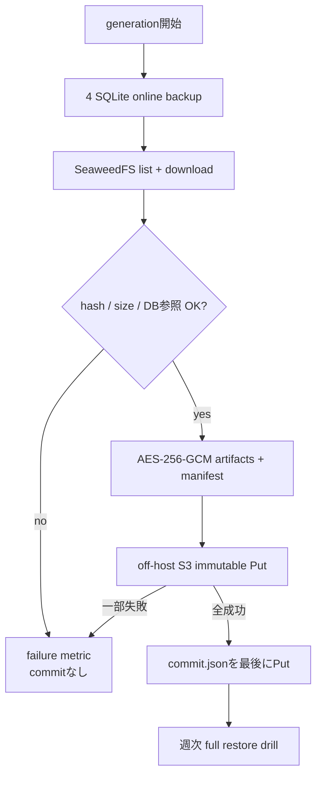

# ADR-0075: 4 SQLiteとObjectStoreをcommit marker付き同一世代で保護する

- Status: Accepted
- Date: 2026-08-20
- Decision owners: Platform / Identity Access / Content Knowledge / Episode Production / Episode Library
- Supersedes: N/A
- Superseded by: N/A
- Related: Issue #15、ADR-0011、ADR-0039、`docs/operations/service-state-recovery.md`

## コンテキストと変更契機

記事snapshotと完成音声は製品の永続資産だが、supported Composeには4つのservice SQLiteとSeaweedFSを同じ復旧世代として自動保護する仕組みがなかった。DBだけ、またはobjectだけを復元すると、記事archiveやEpisode audioの参照先が欠ける。従来のservice別CLIはonline SQLite backupと型違いrestore拒否を提供するが、外部保管、世代commit、定期drill、参照整合性を保証しない。

## 決定

Operations境界に`apps/state-backup`を置く。24時間ごとに4 DBをonline backupした後、SeaweedFS bucketを列挙・取得し、DBが持つ全article archive・Episode audio参照を照合する。成果物とmanifestをclient-side AES-256-GCMで暗号化し、sourceと異なるoff-host S3 bucketへimmutable Putする。全Put成功後の`commit.json`だけを成功境界とする。

| policy | 値 | 強制方法 |
| --- | --- | --- |
| RPO | 24時間 | scheduler + 25時間alert |
| RTO | 4時間 | runbookの最新世代restore/cutover/read smoke |
| 保持 | 直近30成功世代 | 外部bucket lifecycle。35日未満には削除しない |
| 改変不能 | 35日 | S3 Object Lock `COMPLIANCE`を各objectへ指定 |
| 暗号化 | AES-256-GCM、32 byte鍵 | Compose secret、manifestを含むclient-side暗号化 |
| 外部保管 | sourceと異なるS3 endpoint/bucket | 起動時に宛先差分、versioning、Object Lockを検査 |
| drill | 7日ごと | 最新commit世代の全DB・全object・全永続参照を検査 |

manifestは4 DBのprofile、必須table、`user_version`、SHA-256、sizeと、object inventory fingerprint、各object key/ETag/SHA-256/size、article/Episode参照件数、policyを持つ。途中prefixは残り得るがcommit markerがないため、成功metricとrestore候補にはならない。

## 判断要因

- 利用者価値を構成するmetadataとbinaryを同じ復旧単位にする。
- live SQLiteを停止せず一貫したDB copyを作る。
- 外部S3管理者にもmanifestや利用者資産の平文を見せない。
- 世代の成功・失敗を低cardinality metricと構造化logで判定できる。

## 却下案

| 案 | 却下理由 | 再検討条件 |
| --- | --- | --- |
| SQLiteだけを定期backup | archive/audio欠損を検出・復旧できない | ObjectStoreを廃止する |
| SeaweedFS volumeをlive tar | 書き込み中の内部file整合性とS3意味論を保証できない | SeaweedFS公式の検証済みatomic snapshotを採用する |
| 同一hostの別volumeへ保存 | host・credential・volume障害を分離できない | 災害境界がhost外に変わることはない |
| server-side encryptionだけ | 外部S3 account侵害時に平文へ到達できる | client-side暗号化を不要とするrisk承認がある |
| upload開始を成功とする | partial世代をrestore候補にして欠損を隠す | 採用しない |

## 結果

### 利点

- commit markerが完全世代とpartial uploadを機械的に分離する。
- drillがDBファイルだけでなく利用者が再生・閲覧する永続参照まで検証する。
- source側と外部保管側のcredential、host、暗号鍵を分離できる。

### 欠点とリスク

- 全objectを世代ごとに取得・暗号化するため、容量と転送量は増える。
- 暗号鍵を失うと全世代を復元できず、鍵rotationは保持期間と調整が必要になる。
- S3 lifecycleの30成功世代維持は外部bucket側の設定・監査を必要とする。
- SQLite backup後からobject inventory完了までの変更は、size/ETag/hashとDB参照照合でfail closedするが、業務書き込みを横断transactionにはしない。

## 影響と同期

| 対象 | 必要な変更 | 状態 | 証拠 |
| --- | --- | --- | --- |
| 設計書 | coordinated durability境界と完成状態 | Done | `docs/architecture.md` |
| ドメイン/ユースケース | N/A — Operationsが各Contextの永続契約を読み取り検証 | Done | service DB schema |
| OpenAPI/外部契約 | N/A — 公開HTTP API変更なし | Done | N/A |
| コード/ポート | coordinator、S3 source/archive adapter、scheduler | Done | `apps/state-backup/src` |
| データ/ストレージ | 暗号化manifest、commit marker、Object Lock | Done | coordinator/S3 adapter tests |
| 実行/配備 | `backup` Compose profile、secret、read-only DB mounts | Done | `compose.yaml`、`compose.observability.yaml` |
| 認証/セキュリティ | source/archive credentials分離、client-side encryption | Done | runtime config、startup gate |
| フロント/品質保証 | N/A — UI変更なし | Done | N/A |
| テスト/運用 | Red→Green、runbook、metrics、alerts | Done | `pnpm --filter @news-podcast/state-backup test`、`pnpm observability:validate` |

## 再検討条件

- 増分backupまたはprovider-native snapshotで同じ参照整合性を証明でき、転送量を50%以上削減できる。
- object総量により24時間以内のfull generationが2回連続で完了しない。
- managed backup serviceがclient-side encryption、commit境界、full restore drillを同等に提供する。

## 受け入れゲートと未決事項

- 外部bucket ownerはversioning、Object Lock、35日未満に削除しないlifecycle、30成功世代維持を配備前に確認する。
- 未決事項なし。

## 検証証拠

- `pnpm --filter @news-podcast/state-backup test`
- `docker compose --profile backup config --quiet`
- `pnpm observability:validate`
