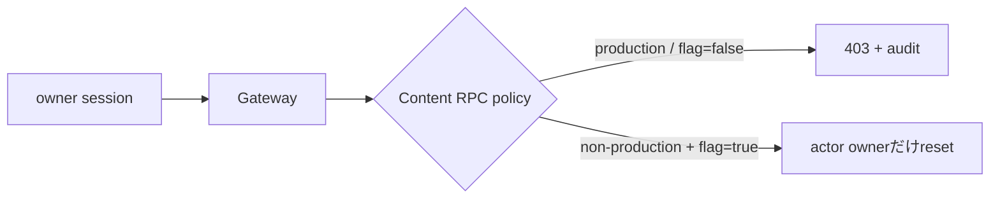

# ADR-0076: AI記事補完の日次枠resetをserver側でfail closedにする

- Status: Proposed
- Date: 2026-08-23
- Decision owners: Product owner / Platform
- Supersedes: N/A
- Superseded by: N/A
- Related: Issue #71、ADR-0063、`POST /v1/me/enrich/reset-daily`

## コンテキストと変更契機

日次枠resetは通常のowner sessionだけで公開APIから実行でき、Webの`import.meta.env.DEV`による非表示だけがproductionでの抑止になっていた。APIを直接呼べば同日に何度でも上限を解除できるため、費用境界として成立しない。

## 決定

Content Knowledgeのowner RPC境界でresetを既定拒否する。非productionかつ`CONTENT_ENRICH_RESET_ENABLED=true`を明示した場合だけ、認証actor自身のowner枠をresetできる。productionと有効flagの組み合わせは起動時に拒否する。Gatewayは拒否をredactせず専用403 Problemへ変換し、Webからreset操作を除く。

成功・拒否はactor、owner、環境、理由を監査ログへ記録する。回数metricはowner IDをlabelにせず、環境・結果・理由だけを持つ。

## 判断要因

- browser build設定を認可境界にしない。
- Gatewayを迂回する内部RPCでも同じ不変条件を守る。
- 開発時の明示的なowner別resetは維持する。
- owner IDによるmetric cardinality増加を避ける。

## 却下案

| 案 | 却下理由 | 再検討条件 |
| --- | --- | --- |
| DEV時だけボタンを表示 | API直呼びを防げず、現状の脆弱性が残る | N/A |
| endpointを完全削除 | 決定論的な開発検証で枠を戻す経路も失う | 開発用resetが不要になる |
| 通常ownerとは別にadmin APIを追加 | admin identity・権限・監査の契約が未定義で本Issueには過剰 | 運用者によるproduction reset要件が承認される |

## 結果

### 利点

- productionの通常sessionと内部RPCの双方でresetを拒否できる。
- 設定取り違えはReady前に失敗する。
- 許可・拒否を監査し、異常回数をalertへ利用できる。

### 欠点とリスク

- 開発者はresetが必要な実行だけflagを明示する必要がある。
- production運用者向けresetは提供しない。

## 影響と同期

| 対象 | 必要な変更 | 状態 | 証拠 |
| --- | --- | --- | --- |
| 設計書 | reset認可境界を明記 | Done | `docs/design.md` |
| ドメイン/ユースケース | owner別reset自体は不変 | Done | ADR-0063 |
| OpenAPI/外部契約 | 403 Problemを追加 | Done | `packages/contracts/openapi/openapi.json` |
| コード/ポート | Content RPC policyとGateway変換 | Done | `runtime/rpc/personalization.ts`、`enrichment-ports.ts` |
| データ/ストレージ | N/A — schemaは変更しない | Done | N/A |
| 実行/配備 | fail-closed flagを追加 | Done | `.env.example`、`compose.yaml` |
| 認証/セキュリティ | 通常ownerのproduction resetを拒否 | Done | RPC/Gateway tests |
| フロント/品質保証 | DEV表示とmutationを削除 | Done | `apps/web/src/routes/_authenticated/settings` |
| テスト/運用 | 状態遷移、監査、403を検証 | Done | Content/Gateway tests |

## 再検討条件

- productionで日次枠を戻す運用要件とadmin認可主体が承認される。
- reset endpointを使わない決定論的なtest fixtureが整備される。

## 受け入れゲートと未決事項

- None

## 検証証拠

- `pnpm --filter @news-podcast/content-knowledge test`
- `pnpm --filter @news-podcast/gateway test`
- `pnpm contract:check`
- `pnpm typecheck`
