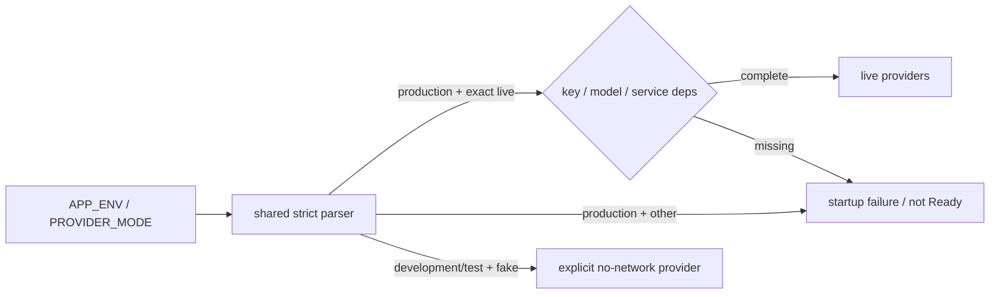

# ADR-0077: productionのprovider modeを共有境界でfail closedにする

- Status: Accepted
- Date: 2026-08-23
- Decision owners: Product owner / Platform
- Supersedes: N/A
- Superseded by: N/A
- Related: Issue #78、ADR-0038、ADR-0047、`APP_ENV`、`PROVIDER_MODE`

## コンテキストと変更契機

Episode Productionは`PROVIDER_MODE=live`以外をすべてfakeへ読み替え、Content Knowledgeも`live + key`以外をoffline providerへ倒していた。productionで未指定、typo、大文字違い、fakeがReadyになり、fake成果物を正常なEpisodeとして公開できた。

## 決定

Content KnowledgeとEpisode Productionは`@news-podcast/service-runtime`の同じprovider mode parserを使う。

- `APP_ENV`は`development | test | production`だけを受理し、未指定はdevelopmentとする。
- `PROVIDER_MODE`は`fake | live`だけを受理し、非productionの未指定はfakeとする。
- productionは厳密なliveだけを受理する。
- liveはOpenAI API keyとmodelを含む各serviceの必須依存をReady前に検証する。
- 成功構成は`provider.configuration` log/metricへ`app.env`と`provider.mode`だけを記録し、secretを含めない。

## 判断要因

- fake成果物をproductionの正常成果物として公開しない。
- serviceごとのtypo fallbackをなくし、同じ状態遷移を適用する。
- local/CIの外部API不要なfake経路は維持する。
- health checkより前に設定事故を検出する。

## 却下案

| 案 | 却下理由 | 再検討条件 |
| --- | --- | --- |
| productionでもfakeを警告だけで許可 | 正常成果物との区別がなく、利用者へfakeを配信できる | fake成果物を隔離するpreview productが定義される |
| 各serviceで個別判定 | 新serviceや変更時に意味論がdriftする | N/A |
| 未知値をfakeへ倒す | typoを安全な停止でなく正常起動として隠す | N/A |

## 結果

### 利点

- productionでfake/typo/未設定がReadyにならない。
- ContentとProductionのprovider選択が同じ状態遷移になる。
- 配備済みの成功modeをsecretなしで観測できる。

### 欠点とリスク

- 旧来の暗黙fake起動に依存するproduction環境は起動しなくなる。
- production以外で未知値を使っていた環境も設定修正が必要になる。

## 影響と同期

| 対象 | 必要な変更 | 状態 | 証拠 |
| --- | --- | --- | --- |
| 設計書 | provider状態遷移を明記 | Done | `docs/design.md`、`docs/development.md` |
| ドメイン/ユースケース | N/A — 生成処理は不変 | Done | N/A |
| OpenAPI/外部契約 | N/A — HTTP shapeは不変 | Done | contract差分なし |
| コード/ポート | 共有strict parserを導入 | Done | `packages/service-runtime/src/provider-mode.ts` |
| データ/ストレージ | N/A — schema変更なし | Done | migration差分なし |
| 実行/配備 | production live-onlyをReady前に検証 | Done | Content/Production env readers |
| 認証/セキュリティ | fake成果物のproduction公開をfail closedで防止 | Done | 状態遷移tests |
| フロント/品質保証 | N/A — Web契約は不変 | Done | N/A |
| テスト/運用 | app env × mode × credentialを検証し計装 | Done | runtime/service tests |

## 再検討条件

- productionで隔離されたfake previewを提供するproduct要件が承認される。
- `staging`など新しいapp environment語彙を追加する。

## 受け入れゲートと未決事項

- None

## 検証証拠

- `pnpm --filter @news-podcast/service-runtime test`
- `pnpm --filter @news-podcast/content-knowledge test`
- `pnpm --filter @news-podcast/episode-production test`
- `pnpm --filter @news-podcast/observability test`
- `pnpm typecheck`
