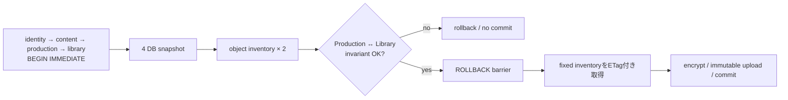

# ADR-0078: coordinated backupをSQLite write barrierと横断不変条件で固定する

- Status: Accepted
- Date: 2026-08-23
- Decision owners: Platform / Episode Production / Episode Library
- Supersedes: ADR-0075の「業務書き込みを横断transactionにしない」部分
- Superseded by: N/A
- Related: Issue #80、ADR-0075、`docs/operations/service-state-recovery.md`

## コンテキストと変更契機

ADR-0075は4 DBを同じmanifestへ格納したが、snapshot時点は揃えていなかった。Productionを`Running`でcopyした後にcompletionがLibraryへ届くと、LibraryだけがEpisodeを持つ前方skewを正常世代としてcommitできた。復元後の再実行は同じ`messageId=jobId`へ異なるcompletionを送り、Library inboxのpayload fingerprintと矛盾する。

## 決定

4 SQLiteへ固定順で`BEGIN IMMEDIATE`を取得し、同時にwriterをquiesceする。barrier内で4 DBをonline backupし、SeaweedFS inventoryを2回取得してfingerprint一致を確認する。barrier解放後は固定inventoryだけをETag・size付きで取得し、途中変更は世代拒否とする。

横断不変条件`production-completion-v1`をgeneration作成時とrestore drillの両方で強制する。

| 状態 | 必須条件 |
| --- | --- |
| Production `Succeeded` | 同じjob/episodeのCompletion Outboxが存在する |
| published Outbox | Library InboxとEpisodeへ同じjob/episode/payloadでmaterialize済み |
| Library Inbox | 対応するProduction `Succeeded` / OutboxとEpisodeが存在する |
| Library Episode | 対応するInboxが存在する |
| payload | Outbox envelopeから再計算したfingerprintがInbox `payload_hash`と一致する |

barrierは既定30秒、最大120秒である。取得失敗、時間超過、inventory変化、object変化、横断不変条件違反は低cardinalityな`reason`で拒否し、commit markerを作らない。

## 判断要因

- 復元可能性をmanifest内の同一logical cutで証明する。
- service APIへ管理用quiesce endpointを増やさず、SQLiteのwriter serializationを利用する。
- object binary転送中までwriterを止めず、barrier時間をDB copyとinventory取得へ限定する。
- 旧世代もrestore drill時の横断検査でfail closedにする。

## 却下案

| 案 | 却下理由 | 再検討条件 |
| --- | --- | --- |
| DBを再copyしてhash一致を待つ | writeが往復して同じ状態へ戻る場合をepochとして証明できない | 各serviceがmonotonic epochを同一契約で永続化する |
| service別quiesce HTTP API | 認証・部分停止・解除失敗の新しい運用面を増やす | SQLite以外のwrite ownerへ移行する |
| IDだけの横断照合 | 同じmessage ID/episode IDでpayloadが異なる矛盾を見逃す | Inbox fingerprint契約を廃止する |
| object download完了までbarrier保持 | 大容量転送中に全service writeを止め、可用性を損なう | atomic provider snapshotを採用する |

## 結果

### 利点

- 前方skewはgeneration commit前とrestore drillの両方で拒否される。
- object listingとDB snapshotが同じbarrier境界へ入る。
- barrier/backup時間と拒否理由をmetric・alert・構造化logで追跡できる。

### 欠点とリスク

- barrier中は4 serviceのSQLite writeが待機する。
- state-backupはlock取得のためsource volumeへのwrite-capable mountを必要とする。ただし実行するSQLは`BEGIN IMMEDIATE`と`ROLLBACK`だけである。
- published completionがLibraryへ未到達の短い区間では安全側にgenerationを拒否し、schedulerが再試行する。

## 影響と同期

| 対象 | 必要な変更 | 状態 | 証拠 |
| --- | --- | --- | --- |
| 設計書 | logical cutと横断不変条件を明記 | Done | architecture / runbook |
| ドメイン/ユースケース | N/A — backup operations境界のみ | Done | N/A |
| OpenAPI/外部契約 | N/A — HTTP shape不変 | Done | contract差分なし |
| コード/ポート | barrier、inventory epoch、横断validator | Done | `apps/state-backup/src/consistency.mjs`、`coordinator.mjs` |
| データ/ストレージ | manifest schema v2へconsistency証拠を追加 | Done | coordinator tests |
| 実行/配備 | source volumeをlock取得可能にしtimeoutを設定 | Done | Compose / `.env.example` |
| 認証/セキュリティ | 管理HTTP endpoint追加なし | Done | N/A |
| フロント/品質保証 | N/A | Done | N/A |
| テスト/運用 | race、legacy skew drill、metric、alert、RPO/RTO更新 | Done | state-backup tests / runbook |

## 再検討条件

- 4 DBのbarrierが25秒を超える、またはRPO内のgenerationが2回連続で拒否される。
- SQLite以外のtransaction owner、provider-native atomic snapshot、共通monotonic epochへ移行する。

## 受け入れゲートと未決事項

- None

## 検証証拠

- `pnpm --filter @news-podcast/state-backup test`
- `docker compose --profile backup config --quiet`
- `pnpm observability:validate`
