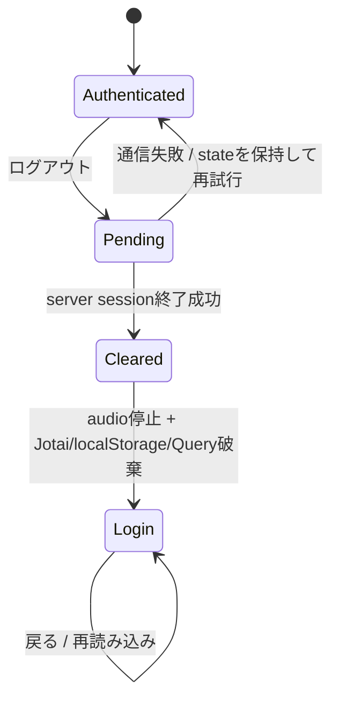

# ADR-0078: session終了成功後にowner stateを原子的に破棄する

- Status: Accepted
- Date: 2026-08-23
- Decision owners: Product owner / Security / Web
- Supersedes: N/A
- Superseded by: N/A
- Related: ADR-0005、ADR-0047、ADR-0064、Issue #73

## コンテキストと変更契機

serverにはBetter Authと開発認証のsession終了経路があるが、Webに操作が無かった。共有端末でowner Aからowner Bへ切り替えると、origin単位の再生記録とmemory上のQuery/Jotai stateがowner Bへ残る危険がある。

## 決定

認証済みshellのdesktop sidebarとmobile headerに、キーボードで操作できるログアウトを置く。公開認証状態の`loginMethods`から終了経路を選び、HttpOnly Cookieの値はclientから推測しない。

- 開発認証とBetter Authが併設される場合はBetter Auth `signOut`を先に行い、成功後に`POST /api/dev/logout`を行う。dev Cookieが主体解決で優先されるため、この順序なら最初の失敗時はdev ownerを保持し、後段の失敗時もdev ownerから別ownerへ切り替わらない。
- session終了が成功するまでowner stateを消さない。失敗時は認証済み表示を保持し、同じ操作から再試行できる。
- 成功時は再生を停止してaudio resourceをunloadし、owner依存Jotai state、`player.track` / `player.progress`、TanStack Query cacheを破棄する。
- 最後に`window.location.replace("/login")`でdocumentを置き換え、historyやBFCacheから保護画面を再利用させない。
- 成否は秘密やowner IDを含めず`logout.result`へ記録する。重複操作はpending中無効にする。

## 判断要因

- server sessionの失効とclient上の終了表示を一致させる。
- owner Aのprivate stateをowner Bへ渡さない。
- Better Authと開発認証を同じUI契約で扱う。

## 却下案

| 案 | 却下理由 | 再検討条件 |
| --- | --- | --- |
| cacheだけ消して先にloginへ移る | server失敗を終了済みと誤表示し、保護routeを再利用できる | N/A |
| Cookie名をclientで見てendpointを選ぶ | HttpOnly Cookieを読めず、認証実装へUIを結合する | N/A |
| dev logout後にBetter Authを終了 | 後段の失敗時、主体だけが背後の別ownerへ切り替わる | 認証方式間の主体優先がなくなった時 |
| query invalidationだけ行う | owner Aの値を再取得まで表示し、Jotai/localStorageも残る | owner単位で完全分離したcache/storageへ移行した時 |

## 結果

### 利点

- session、画面、memory、端末永続化が同じowner境界で切り替わる。
- 通信失敗は再試行でき、owner状態を早まって失わない。

### 欠点とリスク

- logout時は全Query cacheを捨てるため、次ownerは全データを再取得する。
- 別タブの既表示DOMは即時には閉じない。server認可は失効するが、全タブ同期は将来課題である。

## 影響と同期

| 対象 | 必要な変更 | 状態 | 証拠 |
| --- | --- | --- | --- |
| 設計書 | session終了順序とowner state境界 | Done | `docs/design.md` |
| ドメイン/ユースケース | N/A — serverの既存session終了契約を利用 | Done | N/A |
| OpenAPI/外部契約 | N/A — Better Auth生成契約と開発専用経路のまま | Done | N/A |
| コード/ポート | endpoint選択とlogout action | Done | `apps/web/src/features/auth` |
| データ/ストレージ | owner依存の再生永続値を破棄 | Done | `apps/web/src/features/player/atoms.ts` |
| 実行/配備 | N/A — 新規設定なし | Done | N/A |
| 認証/セキュリティ | session成功後だけclient state破棄 | Done | `apps/web/src/features/auth/api/logout.ts` |
| フロント/品質保証 | desktop/mobile導線、再試行、固定playerとの非重複 | Done | `LogoutButton`、`AppShell` |
| テスト/運用 | unit、fake session契約、owner A→B E2E | Done | `logout.test.ts`、`fake-api.contract.test.ts`、`local-flow.spec.ts` |

## 再検討条件

- 複数タブを即時に閉じる要件が生じた場合、`BroadcastChannel`等のlogout通知を追加する。
- owner単位に暗号化・partitionしたclient storageを導入した場合、全消去範囲を再評価する。

## 受け入れゲートと未決事項

- None

## 検証証拠

- `pnpm --filter web test`
- `pnpm --filter web test:e2e`
- `pnpm --filter web test:visual`
