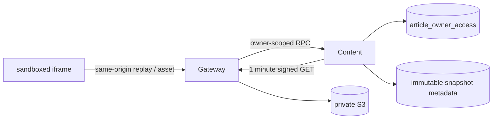

# ADR-0079: owner限定private artifactをGateway経由で配信する

- Status: Accepted
- Date: 2026-08-23
- Decision owners: rai
- Supersedes: [ADR-0055](0055-same-origin-web-and-audio-delivery.md)
- Superseded by: N/A
- Related: [Issue #74](https://github.com/r4ai/news-podcast/issues/74)、[ADR-0069](0069-separate-subscription-from-article-access.md)、[design.md](../design.md) §5/8.2

## Context and change trigger

Captureは`replay/index.html`と相対参照するassetをprivate S3へ保存していたが、owner認可付きread経路がなく、Webは保存成功後もreplayを表示できなかった。ADR-0055のsame-origin proxyは音声だけを対象にしていた。

## Decision

音声の既存規則を維持し、記事replayにも同じprivate artifact配信境界を適用する。Content Knowledgeは`article_owner_access`、snapshot ID、保存済みobject metadataの完全一致を確認して1分の内部署名URLを発行する。Gatewayは署名URLを公開せず、同一originのsnapshot routeからstreamする。

| Object | Gateway limit | Response policy |
| --- | ---: | --- |
| replay HTML | 5 MiB | stored Content-Type、CSP `sandbox`/`default-src 'none'`、`nosniff` |
| captured asset | 20 MiB | exact hashed filename、stored Content-Type、`nosniff` |

両方とも`private, no-store`とし、upstreamの`Content-Length`が保存metadataと一致しない応答は503へ閉じる。Web iframeにも`sandbox=""`を付け、失敗時は再試行、Markdown、元記事への回復導線を出す。

## Decision drivers

- 元URL失効後も保存済みHTML/CSS/画像を読めること。
- 購読解除後も残る`article_owner_access`とread認可を一致させること。
- active content、内部hostname、署名URL、object keyをブラウザへ公開しないこと。
- 配信byte数とContent-Typeを保存時metadataで拘束すること。

## Rejected alternatives

| Alternative | Reason rejected | Reconsider when |
| --- | --- | --- |
| HTMLを`srcDoc`へ注入 | 相対assetの基準URLを失い、親側生成HTMLとの境界も曖昧 | 完全な単一file archiveへ形式変更する |
| S3署名URLをWebへ返す | 内部構成・別origin・署名credentialを公開する | owner認可付きCDN cookieへ移行する |
| Gatewayへobject bodyをNATS転送 | message上限とmemory使用量を大objectへ結合する | RPCがbounded streamingを標準化する |

## Consequences

### Positive

- 保存済みsnapshotだけでHTML/CSS/画像を再生できる。
- 不存在と別ownerを同じ404へ正規化し、unsubscribe後の本人権限は維持する。
- private S3と公開HTTP契約を分離したまま将来のCDN移行ができる。

### Negative and risks

- replay表示ごとにContent RPC、署名、Gateway転送が必要になる。
- Gateway帯域が増え、5/20 MiBを超える既存objectはfail closedになる。
- iframe sandboxにより保存ページのJavaScript・form・外部通信は動作しない。

## Impact and synchronization

| Surface | Required change | Status | Evidence |
| --- | --- | --- | --- |
| Design documents | owner replay flowとREST規則 | Done | `docs/design.md`、`docs/architecture.md` |
| Domain and use cases | snapshot object lookup + replay signing | Done | `article-library.ts` |
| OpenAPI and external contracts | resolve/replay/asset 3 route | Done | `packages/contracts/openapi/openapi.json` |
| Application code and ports | Content RPC + Gateway proxy | Done | `packages/protocols`、`apps/gateway` |
| Data and storage | N/A — 既存snapshot JSONとowner accessを利用 | Done | SQLite integration test |
| Runtime and deployment | S3 presigner dependency | Done | Content composition root |
| Authentication and security | owner join、CSP、sandbox、size/type検証 | Done | Content/Gateway tests |
| Frontend and quality assurance | loading/error/retry/Markdown fallback | Done | Web component/hook/E2E tests |
| Tests and operations | proxy outcome/duration structured log | Done | `article.replay_proxy` |

## Reconsideration conditions

- replay proxy帯域がGatewayのSLOを継続して圧迫する。
- 5/20 MiB上限による正当なsnapshot失敗率が1%を超える。
- owner認可付きCDNが内部署名URLを非公開のまま提供できる。

## Acceptance gates and open questions

- None

## Validation evidence

- Content SQLite/RPC focused tests、Gateway HTTP focused tests。
- Web component/hook tests、Playwright local-flow 35/35。
- `pnpm contract:check`、`pnpm architecture:check`。
