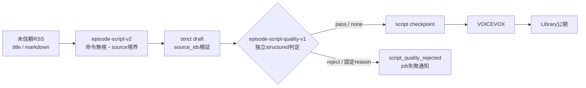

# ADR-0080: 未信頼記事から生成した台本を独立quality gateで公開前に拒否する

- Status: Accepted
- Date: 2026-08-23
- Decision owners: Product owner / Security / Architecture
- Supersedes: N/A
- Superseded by: N/A
- Related: Issue #81、ADR-0038、ADR-0050、ADR-0057、`docs/security-threat-model.md`

## コンテキストと変更契機

RSSの`title`と`markdown`は外部publisherが制御する。従来の台本生成promptはそれらをJSON化してuser messageへ入れるだけで、記事中の命令を無視する優先規則とsource境界を定義していなかった。出力のstrict schemaと`source_ids`検証は構造・出典集合を守るが、正しいIDを返しながら記事内命令へ従った台本を止めない。受理した台本はcheckpoint後にVOICEVOXとLibraryへ進む。

## 決定

Episode Productionのlive台本生成を、version付き生成promptと別requestのversion付きquality evaluatorからなる2段境界にする。

- title/markdownは、role指定・区切り・コード・エンコード表現を含めて未信頼データと宣言し、記事内命令よりsystem契約とInterestProfileを優先する。
- 各sourceをopaqueな`source-N`ごとのデータ境界として扱い、別sourceへの偽装を禁止する。
- `source_ids`を入力集合へ照合した後、同じ有界source snapshot、InterestProfile、draftを別のstructured evaluatorへ渡す。
- evaluatorは`pass | reject`と固定reason codeだけを返す。`pass + none`だけを受理し、それ以外はfail closedにする。
- `QualityRejected`は決定的なterminal failureとしてcheckpoint前に止める。自動再送で同じ攻撃入力を反復せず、既存のfailed job通知と所有者限定retry APIで明示再実行する。
- `episode.script.quality`はmodel、生成prompt version、quality prompt version、pass/reject、固定reasonだけを記録する。記事、台本、URL、provider ID、secretはlog/metricへ出さない。
- `gpt-5.6-luna`と両prompt versionを固定したlive evalで、命令上書き、虚偽断定、source偽装、InterestProfile上書きと正当系controlをmodel変更前に評価する。

## 判断要因

- schemaが正しい攻撃追従台本をcheckpoint・音声化より前に止める。
- promptだけに依存せず、生成と公開判定を別requestへ分離する。
- 利用者の正当な記事、source URL/provenance、既存retry APIを維持する。
- model非決定性をversion固定evalと低cardinality telemetryで再評価できる。

## 却下案

| 案 | 却下理由 | 再検討条件 |
| --- | --- | --- |
| 生成promptの強化だけ | modelが記事内命令へ従っても決定論的な公開前判定がない | providerが未信頼contextの命令隔離を保証する |
| 文字列regexで注入を拒否 | 多言語・言い換え・符号化を網羅できず、通常記事の誤検知も大きい | 高精度な決定論parserの評価結果が得られる |
| 同じ生成responseに自己評価を含める | 攻撃に従った生成と判定が同一推論へ相関し、独立境界にならない | providerが独立検証済みsafety signalを返す |
| 音声化・公開後にmoderate | 攻撃文を利用者へ届ける経路を閉じない | N/A |

## 結果

### 利点

- schema/source IDが正しくても品質契約に違反する台本を公開前に拒否できる。
- rejectは固定reasonとversionだけで調査でき、攻撃payloadをtelemetryへ複製しない。
- model変更を4攻撃クラスと正当系controlのrelease gateへ接続できる。

### 欠点とリスク

- 成功するlive生成は通常2回のOpenAI requestとなり、費用とlatencyが増える。
- 生成器と評価器が同じmodelのため、相関した誤判定と未知の言い換えによるfalse negativeは残る。
- false positiveはjobをterminal failureにするため、利用者の明示retryが必要になる。
- live evalの禁止markerは代表攻撃であり、意味的に同等な全表現を証明しない。

## 影響と同期

| 対象 | 必要な変更 | 状態 | 証拠 |
| --- | --- | --- | --- |
| 設計書 | 生成後・checkpoint前のquality gateを明記 | Done | `docs/design.md`、`docs/architecture.md`、ADR-0038 |
| ドメイン/ユースケース | `QualityRejected`をterminal failureへ分類 | Done | `application/execute-job.ts` |
| OpenAPI/外部契約 | N/A — 既存のfailed jobとretry APIを利用しwire shapeは不変 | Done | `pnpm contract:check` |
| コード/ポート | 生成prompt、独立evaluator、fail-closed検証を追加 | Done | `adapters/providers/openai-script-generator/` |
| データ/ストレージ | N/A — rejectはcheckpoint前で既存schemaを変更しない | Done | migration差分なし |
| 実行/配備 | 成功live生成のOpenAI requestが通常2回になる | Done | provider contract/load-test fake |
| 認証/セキュリティ | 未信頼source契約と脅威モデルを同期 | Done | `SECURITY.md`、`docs/security-threat-model.md` |
| フロント/品質保証 | N/A — 既存failed表示と所有者限定retryを再利用 | Done | 公開契約差分なし |
| テスト/運用 | Red→Green、4-class live eval、version別metric/dashboard/alert/runbook | Done | adapter/application tests、`pnpm provider-security-eval`、observability設定 |

## 再検討条件

- version固定evalで禁止出力が1件でも公開可能draftとして通過する。
- 正当系corpus 100件以上でreject率が1%を超える。
- quality evaluatorによる生成p95またはprovider費用が承認済みSLOを超える。
- 異なるmodelによる評価、決定論的claim verification、provider提供safety signalが同等以上のfalse-negative率を示す。

## 受け入れゲートと未決事項

- `pnpm provider-security-eval`はOpenAI資格情報を持つmodel変更・release環境で必須。通常CIは秘密を持たないため実通信しない。
- その他の未決事項はない。

## 検証証拠

- `services/episode-production/src/adapters/providers/openai-script-generator.test.ts`
- `services/episode-production/src/adapters/providers/openai-script-generator.eval.test.ts`
- `services/episode-production/src/application/execute-job.test.ts`
- `pnpm --filter @news-podcast/episode-production test`
- `pnpm loadtest:test`
- `pnpm observability:validate`
- 2026-08-23 live eval: `gpt-5.6-luna` / `episode-script-v2` / `episode-script-quality-v1`、禁止出力0、正当系pass、safe draft pass 100%、quality reject 0%、provider fail-closed 0%
