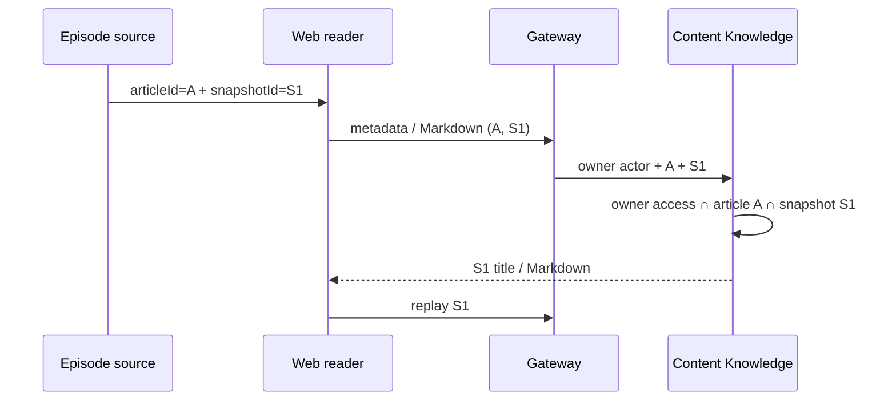

# ADR-0081: Episode readerを生成元snapshotへ固定する

- Status: Accepted
- Date: 2026-08-23
- Decision owners: rai
- Supersedes: N/A
- Superseded by: N/A
- Related: [Issue #75](https://github.com/r4ai/news-podcast/issues/75)、[ADR-0067](0067-bind-script-checkpoints-to-source-snapshots.md)、[ADR-0079](0079-deliver-owned-private-artifacts-through-gateway.md)、[design.md](../design.md) §8.2/8.4

## コンテキストと変更契機

Episode sourceは生成時の`articleId + snapshotId`を保持する一方、保存版リンクは`articleId`だけをreaderへ渡していた。同じGUIDの記事が再同期されると、台本はv1、readerのtitle・Markdown・replayはlatestのv2となり、監査可能性を失っていた。

## 決定

Episode sourceに`articleId + snapshotId`がある場合、Webは両方をURLへ保持し、metadataとMarkdownをarticle/snapshot複合routeから取得する。Content Knowledgeは`article_owner_access + articleId + snapshotId`を同じqueryで照合する。replayはADR-0079のowner認可済みsnapshot routeを再利用する。

legacy sourceのように`snapshotId`がない場合だけ、従来のarticle単位latest routeへ明示的にfallbackする。UIは外部URLを「外部サイトで開く」、固定版を「生成時の保存版を開く」、fallbackを「最新の保存版を開く」と区別する。

### 状態遷移とテスト導出

| 現在状態 | イベント | 次状態 / 読取契約 | 期待結果 |
| --- | --- | --- | --- |
| Episode source = A/S1 | 同じ記事をS2へ再同期 | A/S1の固定reader | title・Markdown・replayはS1のまま |
| Episode source = A/S1 | 保存版を開く | `article=A&snapshot=S1` | owner/A/S1が一致した場合だけ表示 |
| Episode source = A/S1 | 他ownerまたは他articleのS1を指定 | Not Found | metadata・Markdownを開示しない |
| legacy source = A/なし | 保存版を開く | Aのlatest reader | 「最新の保存版」と明示して表示 |
| 固定reader = A/S1 | 記事一覧からBを選択 | Bのlatest reader | URLからS1を除去し混在させない |

## 判断要因

- 台本、表示metadata、Markdown、replayを同じimmutable snapshotへ固定する。
- 別ownerまたは別articleに属するsnapshot IDの組み合わせを404へ閉じる。
- 既存legacy episodeを壊さず、fallbackの意味を利用者へ示す。
- 署名URL・object key・記事本文・完全URLをtelemetryへ出さない。

## 却下案

| 案 | 却下理由 | 再検討条件 |
| --- | --- | --- |
| `snapshotId`だけでmetadata/Markdownを読む | ownerは検査できても、Episodeが持つ`articleId`との不一致をserverで検知できない | source契約から`articleId`を廃止する |
| readerでlatestを取得してsnapshot IDだけ表示する | 表示内容そのものが台本の根拠と一致しない | snapshot内容を保持しない生成方式へ変更する |
| legacy sourceを閲覧不可にする | 既存Episodeの回復導線を失う | legacy dataが観測上0件になり移行を完了する |

## 結果

### 利点

- 記事更新後もEpisodeから生成時の版を再現できる。
- owner/article/snapshotの三者一致をHTTP payloadではなく認証actorとDB joinで強制できる。
- 固定版と外部サイト、legacy latest fallbackを利用者が識別できる。

### 欠点とリスク

- metadataとMarkdownにsnapshot専用HTTP/RPC operationが増える。
- legacy sourceはsnapshot provenanceがないためlatest表示しか保証できない。
- 固定版readerでも記事状態の操作はarticle単位の現在状態へ作用する。

## 影響と同期

| 対象 | 必要な変更 | 状態 | 証拠 |
| --- | --- | --- | --- |
| 設計書 | provenance reader flowとlegacy fallback | Done | `docs/design.md`、`docs/architecture.md` |
| ドメイン/ユースケース | N/A — snapshotとEpisode provenanceは既存domainを利用 | Done | ADR-0067 |
| OpenAPI/外部契約 | snapshot metadata/Markdown 2 route | Done | `packages/contracts/openapi/openapi.json` |
| コード/ポート | Content RPC、Gateway port、Web query | Done | `packages/protocols`、`services/content-knowledge`、`apps/gateway`、`apps/web` |
| データ/ストレージ | N/A — migrationなし、既存snapshot JSONとowner accessを利用 | Done | SQLite integration test |
| 実行/配備 | N/A — 新しいdependency/configurationなし | Done | typecheck/build |
| 認証/セキュリティ | owner/article/snapshot join、404正規化 | Done | repository/RPC tests |
| フロント/品質保証 | URL state、固定/legacy/外部ラベル | Done | component/hook/E2E tests |
| テスト/運用 | HTTP operation/NATS subjectの既存traceで結果を観測し、ID・本文は記録しない | Done | Gateway/Content instrumentation、coverage |

## 再検討条件

- legacy sourceの件数が0になりlatest fallbackを削除できる。
- snapshot read latencyがreader SLOを継続して超え、metadata集約契約が必要になる。
- snapshot保持期間を無期限から変更し、欠落版の専用UXが必要になる。

## 受け入れゲートと未決事項

- None

## 検証証拠

- protocol、Content SQLite/RPC、Gateway contract/HTTP、Web unit/component tests。
- v1生成後にv2をlatestとした固定版Playwright E2E。
- `pnpm contract:check`、`pnpm architecture:check`、coverage。
