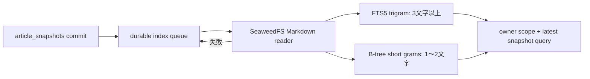

# ADR-0082: 最新記事Markdownを永続索引で検索する

- Status: Accepted
- Date: 2026-08-23
- Decision owners: Platform
- Supersedes: N/A
- Superseded by: N/A
- Related: Issue #72、ADR-0020（旧構成で未実装のまま失効）、ADR-0043、`GET /v1/me/articles`

## コンテキストと変更契機

記事検索はUIで「タイトルや本文」を約束していたが、実装はtitle・source URL・owner tagへの`LIKE`だけだった。Markdown原本はSeaweedFS、snapshot metadataとowner accessはContent KnowledgeのSQLiteにあり、query時の全object走査はできない。

## 決定

ownerがアクセス可能な記事について、`captured_at DESC, snapshot_id DESC`で決める**最新snapshotの保存済みMarkdown本文**をliteral部分一致検索する。

- snapshot INSERT triggerとmigration backfillがdurable queueへ投入する。
- 3文字以上はFTS5 trigram、1〜2文字は`(gram, snapshot_id)`索引を使う。本文への`LIKE`走査はしない。
- FTS入力は二重引用符を二重化したliteral phraseとし、空白・`OR`・`NEAR`・`*`・引用符を構文として実行しない。SQLite FTSが受理できないNULを含むC0制御文字とDELはHTTP/RPC両境界で拒否する。
- object取得成功後、FTS・short gram更新とqueue削除を同一transactionで行う。失敗はsanitized reasonとattemptだけを保存し、bounded workerが再試行する。
- short gramはSQLiteのパラメータ上限を超えない固定件数に分割し、同一transaction内で投入する。cycle終了時に`article.search_body.queue.depth`をgaugeとして観測する。
- title・source URL・owner tagは既存のescaped `LIKE`を維持する。

| 状態 | 永続状態 | 次の遷移 |
| --- | --- | --- |
| Pending | queue行あり | index成功 / object失敗 |
| Indexed | FTS/gramあり、queue行なし | 新snapshot commit |
| Retry | queue行あり、attempt増加 | 次cycle |
| Superseded | 旧snapshot indexあり | queryは最新snapshotだけ参照 |

## 判断要因

- 日本語を分かち書きなしの部分一致で探せること。
- 全Markdownをqueryごとに取得・走査しないこと。
- archive成功とobject store一時障害を分離し、再起動後もbackfillできること。
- owner境界と既存の最新snapshot表示契約を変えないこと。

## 却下案

| 案 | 却下理由 | 再検討条件 |
| --- | --- | --- |
| メモリ内filter | 未読込ページ・再起動・複数instanceで不整合 | N/A |
| 本文`LIKE '%q%'` | 全本文走査になり索引要件を満たさない | 記事数が常に極小と契約化される場合 |
| `unicode61`だけ | 日本語の任意部分一致を満たさない | tokenizer要件が単語一致へ変わる場合 |
| 全snapshotを検索 | 一覧表示中の最新版と異なる本文でhitする | 版固定snapshot検索APIを別に追加する場合 |
| archiveを索引成功まで失敗扱い | object一時障害で保存済み記事自体を失敗にする | DBとobjectを原子的に保存できる基盤へ移行する場合 |

## 結果

### 利点

- body-only語、日本語、短語、特殊文字を永続索引から検索できる。
- queueにより既存snapshot、再起動、object障害を回復できる。
- owner accessと最新snapshotの既存joinが検索境界にも適用される。

### 欠点とリスク

- Markdown本文に加えてFTSと1〜2文字gramを保持するためSQLite容量が増える。
- commitからworker成功まで短い検索反映遅延がある。
- 旧snapshot索引も保持するため、snapshot増加時はretentionを再評価する。

## 影響と同期

| 対象 | 必要な変更 | 状態 | 証拠 |
| --- | --- | --- | --- |
| 設計書 | 最新本文・owner scope・非同期索引を明記 | Done | `docs/design.md`, `docs/architecture.md` |
| ドメイン/ユースケース | bounded index cycleと失敗遷移 | Done | `application/article-search-index.ts` |
| OpenAPI/外部契約 | `q`の検索対象・literal部分一致を明記 | Done | `apps/gateway/src/contract.ts` |
| コード/ポート | repository、worker、検索述語 | Done | `services/content-knowledge/src/` |
| データ/ストレージ | queue、FTS5、short grams、trigger/backfill | Done | `services/content-knowledge/drizzle/migrations/20260823*` |
| 実行/配備 | batch/interval/backoff設定 | Done | `.env.example`, `runtime/env.ts` |
| 認証/セキュリティ | 既存owner access joinを維持、本文をtelemetryへ出さない | Done | adapter/observability tests |
| フロント/品質保証 | 既存の検索中・0件・取得失敗境界を維持 | Done | `apps/web/.../article-list.tsx` |
| テスト/運用 | unit/SQLite結合/実stack E2E/coverage | Done | `sqlite-article-search-index.test.ts`, `functional-stack-e2e.ts` |

## 再検討条件

- SQLite容量またはindex cycle lagが運用SLOを超える。
- snapshot retention導入後も旧indexが回収されない。
- SQLite以外の検索backendまたは版固定snapshot検索APIを導入する。

## 受け入れゲートと未決事項

- None

## 検証証拠

- `pnpm --filter @news-podcast/content-knowledge test`
- `pnpm test:e2e:functional`
- `pnpm contract:check`
- `pnpm test:coverage:functional`
