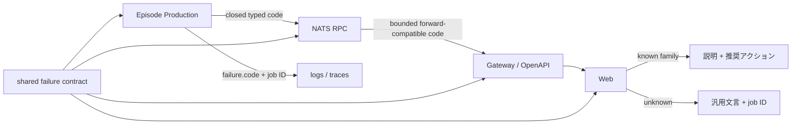

# ADR-0083: Episode生成失敗コードと利用者向け復旧案内を分離する

- Status: Accepted
- Date: 2026-08-23
- Decision owners: Product owner / Episode Production / Gateway / Web
- Supersedes: N/A
- Superseded by: N/A
- Related: Issue #79、ADR-0016、`packages/contracts/src/episode-failure.ts`

## コンテキストと変更契機

Episode ProductionとGatewayは`job_deadline_exceeded`などの`snake_case`を公開していたが、Webの文言表は`job-deadline-exceeded`などの旧`kebab-case`を持っていた。既知コードが一致せず、Gatewayの`failure.message`へ複製した内部識別子がそのまま画面に表示された。さらに、任意文字列型では新しい生成コードを追加してもProduction、RPC、OpenAPI、Webの同期漏れを型検査できなかった。

## 決定

`@news-podcast/contracts/episode-failure`をProductionが生成できる唯一の失敗コード集合とする。各コードは利用者の次の行動を決める有限familyへ分類する。一方、rolling deploymentで新しいProductionと古いGatewayが一時的に共存できるよう、RPCと公開HTTP/AG-UIの受信境界は長さを制限した未知コードもdecodeする。Webは既知familyを日本語の説明と`retry / reselect / admin`へ変換し、未知コードでは上流の`failure.message`を表示せず、安全な汎用文言とjob IDへ縮退する。

内部コードはProductionの構造化log・trace属性へ残し、利用者向け文言とは分離する。Browser telemetryは既知コードだけを`failure.code`へ記録し、未知値は`unknown`へ畳んで任意文字列をtelemetryへ持ち込まない。相関用`job.id`はlog・traceにだけ残し、高cardinalityなmetric属性からは除外する。

## 判断要因

- コード追加時に全境界の同期漏れを型検査と契約テストで検出する。
- 利用者には原因と次の行動を示し、内部識別子・provider detail・保存先を表示しない。
- 運用者はjob IDと`failure.code`でlog・traceを相関できる。

## 却下案

| 案 | 却下理由 | 再検討条件 |
| --- | --- | --- |
| Webだけで`snake_case`文字列表を増やす | Productionの新コード追加を検出できず、生成側のclosed contractを持てない | 全生成コードが別のversion付きProblem契約へ移る |
| Gatewayで日本語文言へ変換する | APIが表示言語を所有し、多言語化と運用識別子を混同する | Gatewayがlocale別presentation APIを所有する |
| `failure.message`をそのまま表示する | 内部コードやprovider/storage detailを漏らす | messageがlocale別・公開安全な契約として独立検証される |

## 結果

### 利点

- Productionの契約外コード、重複コード、未分類コードをテスト・型検査で検出できる。
- deadline、provider、入力、候補、checkpoint/storageの各障害で説明と復旧操作が一致する。
- 未知コードでも画面は安全に縮退し、問い合わせ可能性を失わない。

### 欠点とリスク

- 新しい失敗コードは共有契約とfamily分類を同じ変更で更新する必要がある。
- 新しいBackendと古いWebの組み合わせでは未知コード用の汎用文言になる。

## 影響と同期

| 対象 | 必要な変更 | 状態 | 証拠 |
| --- | --- | --- | --- |
| 設計書 | failure codeと表示責任を明記 | Done | `docs/design.md`、`docs/architecture.md` |
| ドメイン/ユースケース | Production failureを共有型へ制限 | Done | `episode-job.ts`、`execution.ts` |
| OpenAPI/外部契約 | 既知集合を文書化し、boundedな未知値も受理 | Done | generated OpenAPI |
| コード/ポート | Productionをclosed、受信境界をforward-compatibleにする | Done | contracts/protocols/gateway/web |
| データ/ストレージ | N/A — DB列と保存JSONの形は不変 | Done | migration差分なし |
| 実行/配備 | N/A — 新しい環境変数・serviceなし | Done | Compose差分なし |
| 認証/セキュリティ | 未知message/codeを画面・Browser telemetryへ出さない | Done | Web model tests |
| フロント/品質保証 | 説明、アクション、問い合わせIDを検証 | Done | component test、Playwright E2E |
| テスト/運用 | code分類、境界、observabilityを検証 | Done | contracts/Production/Gateway/Web tests |

## 再検討条件

- locale別文言をserver-drivenに配信する要件が発生する。
- failure codeの互換versionを同時に複数運用する必要が生じる。
- unknown codeの発生率が0.1%を超え、rolling deploy以外の原因が確認される。

## 受け入れゲートと未決事項

- None

## 検証証拠

- Contract uniqueness/classification test。
- Production、protocol、Gateway、Webのtypecheck/unit/component test。
- deadline失敗のPlaywright E2E。
