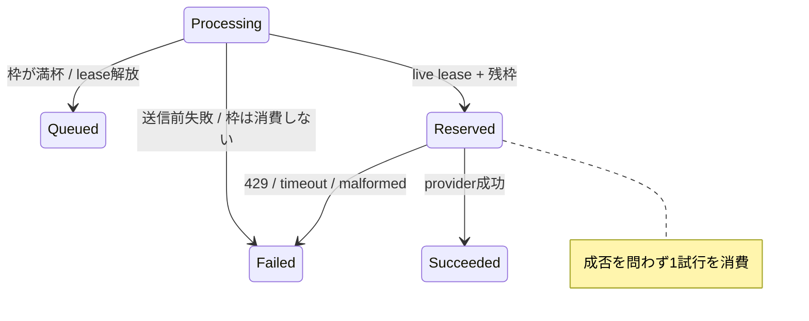

# ADR-0084: AI記事補完の有料試行をprovider送信前に予約する

- Status: Accepted
- Date: 2026-08-23
- Decision owners: Product owner / Content Knowledge / Web / SRE
- Supersedes: ADR-0063の「成功完了時に日次枠を消費する」決定
- Superseded by: N/A
- Related: Issue #86、ADR-0021、ADR-0024、ADR-0063、ADR-0076

## コンテキストと変更契機

従来の`daily.used`は成功完了だけを数えていた。providerへ送信した429、timeout、不正応答は外部コストを発生させ得るのに枠を消費せず、queue retryを繰り返して日次上限を越えられた。表示も成功件数とコスト境界を混同していた。

## 決定

`CONTENT_ENRICH_DAILY_LIMIT`をowner別・UTC日付別の「providerへ送信する有料試行」のhard limitとする。本文、語彙、InterestProfile、provider入力schemaを確定した後、送信直前に次を単一SQLite transactionで行う。

1. targetが期限内の`Processing` leaseを保持することを確認する。
2. `(owner_id, local_date)`の試行数を`limit`未満の場合だけ原子的に1加算する。
3. 枠が尽きていればleaseを`Queued`へ戻し、providerを呼ばない。

物理列`processed_count`は既存DB互換のため維持するが、コード上は`attemptedCount`として扱う。公開`daily.used`も成功件数ではなく有料試行数である。Webは単位を「AI試行・回」と表示する。`article.enrich.attempt` metricは`reserved|budget_exhausted`だけを属性に持ち、owner IDは記録しない。

## 状態遷移

| 境界 | provider送信 | 日次枠 | queue結果 |
| --- | --- | --- | --- |
| 本文取得・入力validation失敗 | なし | 消費しない | Failed |
| lease失効 | なし | 消費しない | reconcile対象 |
| 残枠なし | なし | 消費しない | Queuedへ戻す |
| 成功 | あり | 1消費 | Succeeded |
| 429 / timeout | あり | 1消費 | retryable Failed |
| malformed / schema不一致 | あり | 1消費 | terminal Failed |

## 判断要因

- 外部コストが起き得る送信回数をhard boundaryにする。
- 送信前の内部失敗を利用者へ誤課金しない。
- 複数workerでもcheckとincrementを分離しない。

## 却下案

| 案 | 却下理由 | 再検討条件 |
| --- | --- | --- |
| 失敗完了時に加算 | 同時workerが残枠を確認してから複数送信できる | providerが予約token付きquotaを提供する |
| claim時に一括予約 | 本文取得やvalidation失敗まで誤計上する | provider送信前の全処理をclaim前へ移せる |
| 成功件数と試行数を同じ値で表示 | コスト境界と成果を誤認させる | N/A |

## 結果

### 利点

- provider障害中も日次上限を越えて送信しない。
- 成功率はqueue結果、費用境界は試行数として分離できる。
- 水平実行時もSQLite transactionがowner別枠を直列化する。

### 欠点とリスク

- providerが課金前に接続失敗した場合も、安全側に1試行を消費する。
- 予約後にprocessが停止しても枠は返却しないため、当日の処理可能数が減る。
- 物理列名は互換性上`processed_count`のままである。

## 影響と同期

| 対象 | 必要な変更 | 状態 | 証拠 |
| --- | --- | --- | --- |
| 設計/ADR | 成功件数と有料試行を分離 | Done | 本ADR、ADR-0063、design/architecture |
| Application Port | 送信直前の`reserveAttempt` | Done | `application/enrichment.ts` |
| SQLite | live lease検証と条件付きincrement | Done | `enrichment-queue/budget.ts` |
| OpenAPI/Web | `daily.used`の意味と表示単位を同期 | Done | Gateway contract、generated OpenAPI、Web components |
| Observability | 予約・枯渇を低cardinality metric化 | Done | `article.enrich.attempt` |
| テスト | 成功、429、timeout、malformed、lease失効、上限を固定 | Done | Application/SQLite/Web tests |

## 再検討条件

- providerが課金成立を示すusage receiptを提供する。
- UTCではなくowner timezoneで枠を切り替える。
- 全owner共通のprovider予算上限が必要になる。

## 受け入れゲートと未決事項

- None

## 検証証拠

- Content Knowledge application/SQLite tests and coverage。
- Web component tests。
- workspace format/lint/typecheck/test、functional E2E。
