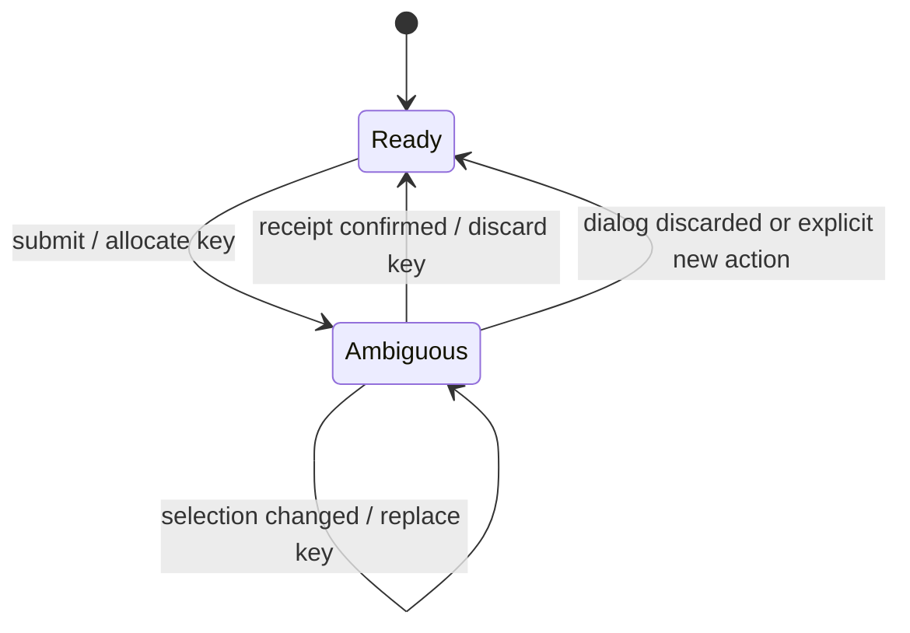

# ADR-0085: Bind idempotency keys to logical generation actions

- Status: Accepted
- Date: 2026-08-23
- Decision owners: Project maintainers
- Supersedes: [ADR-0002](0002-openapi-async-jobs.md) retry-key optionality only
- Superseded by: N/A
- Related: [Issue #85](https://github.com/r4ai/news-podcast/issues/85), [design](../design.md), [architecture](../architecture.md)

## Context and change trigger

Episode Production already makes `(owner, operation scope, key, request fingerprint)` durable and idempotent. The Web previously generated a key inside every submit call, however. If the server accepted a job but its HTTP response was lost, a user retry created another costly LLM/VOICEVOX job. Failed-job retry also omitted the key and relied on a fresh Gateway fallback for every HTTP attempt.

## Decision

One Web logical action owns one opaque idempotency key:

- Manual create uses the sorted article-ID set as its logical input signature. A changed selection allocates a new key.
- A failed-job retry uses the source job ID as its logical input signature.
- Receipt confirmation, dialog destruction, and an explicit new-generation action discard the current key.
- `POST /v1/episode-jobs/{jobId}/retry` requires `Idempotency-Key`; the Gateway no longer invents a fallback.
- Episode Production records `operation=create|retry` and `outcome=accepted|replay|conflict` at the durable decision boundary. The key, owner ID, and request fingerprint are excluded from this event.

This required-header contract is the prerequisite for Issue #92: every retry caller must identify its logical HTTP operation explicitly.

## Decision drivers

- Prevent duplicate high-cost generation after an accepted response is lost.
- Keep retry semantics identical across Web, Gateway, and Episode Production.
- Make replay and conflict rates observable without leaking correlation secrets or high-cardinality identifiers.

## Rejected alternatives

| Alternative | Reason rejected | Reconsider when |
| --- | --- | --- |
| Generate a key per HTTP call | Treats transport retry as a new business action and duplicates work | Never while create remains idempotent |
| Keep Gateway-generated retry fallback | The stateless Gateway cannot identify two attempts of one logical browser action | A durable server-issued operation token replaces the client key |
| Persist pending keys in browser storage | Extends keys across reload/account boundaries and adds cleanup/security complexity | Product requirements demand recovery after browser restart |

## Consequences

### Positive

- An accepted request whose response is lost converges to one receipt and one job.
- Selection changes and explicit new actions still create independent jobs.
- Operators can distinguish accepted, replayed, and conflicting requests without seeing the key.

### Negative and risks

- All retry API clients must now send `Idempotency-Key`.
- A full browser reload discards an ambiguous in-memory operation; recovery across reload remains out of scope.

## Impact and synchronization

| Surface | Required change | Status | Evidence |
| --- | --- | --- | --- |
| Design documents | Define logical-action lifetime and required retry key | Done | `docs/design.md`, `docs/architecture.md` |
| Domain and use cases | N/A — durable owner/scope/key semantics are unchanged | Done | Existing Episode Production model |
| OpenAPI and external contracts | Make retry key required and document replay/conflict | Done | `apps/gateway/src/contract.ts`, generated OpenAPI |
| Application code and ports | Remove Gateway fallback; send stable keys from Web | Done | Gateway handler, `use-generation.ts` |
| Data and storage | N/A — existing unique scope and fingerprint remain authoritative | Done | SQLite job repository |
| Runtime and deployment | N/A — no configuration or topology change | Done | Existing runtime |
| Authentication and security | Exclude key and owner from idempotency telemetry | Done | Repository observation test, observability event contract |
| Frontend and quality assurance | Model key lifetime and response-loss replay | Done | unit, hook integration, Playwright E2E |
| Tests and operations | Contract, integration, E2E, coverage, repository telemetry | Done | Validation commands below |

## Reconsideration conditions

- Product requirements add recovery of an ambiguous submission after a page reload.
- Replay or conflict telemetry requires aggregation across multiple services rather than the durable decision boundary.
- A server-issued operation token replaces caller-owned idempotency keys.

## Acceptance gates and open questions

- None.

## Validation evidence

- `pnpm --filter web test`
- `pnpm --filter web exec playwright test --config playwright.e2e.config.ts --grep "response loss"`
- `pnpm --filter @news-podcast/gateway test`
- `pnpm --filter @news-podcast/episode-production test`
- `pnpm contract:check`
