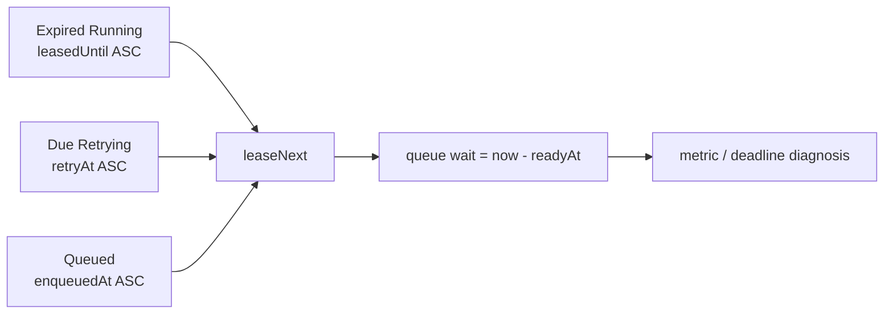

# ADR-0086: Episode leaseを優先度とready時刻で決定する

- Status: Accepted
- Date: 2026-08-23
- Decision owners: Product owner / Episode Production
- Supersedes: N/A
- Superseded by: N/A
- Related: Issue #91、ADR-0016

## コンテキストと変更契機

Episode workerは単一flightだが、従来のlease queryは状態優先度の後をUUID v4の`jobId`で並べていた。このため後発jobが先行でき、`createdAt + 30分`のend-to-end deadlineを待機中に消費する古いjobがstarvationする余地があった。既存の`episode.queue.oldest.age`は状態ごとの最古時刻を示す一方、実際のlease順はその時刻と一致していなかった。

## 決定

lease対象と同一優先度内の順序を次の契約に固定する。業務時刻が同じ場合だけ`jobId`を決定的tie-breakerに使う。

| 優先度 | 対象 | ready時刻 | 状態内の順序 |
| ---: | --- | --- | --- |
| 0 | 期限切れ`Running` | `leasedUntil` | ready時刻、`jobId`の昇順 |
| 1 | dueな`Retrying` | `retryAt` | ready時刻、`jobId`の昇順 |
| 2 | `Queued` | `enqueuedAt` | ready時刻、`jobId`の昇順 |

SQLiteにはqueryの`CASE status`、状態別ready時刻、`jobId`と同じ式indexを置く。query planがこのindexをscanし、ORDER BY用temporary B-treeを作らないことをmigration integration testで契約化する。lease時には選択に使った`readyAt`をruntimeへ返し、`episode.queue.wait.duration`を記録する。`job_deadline_exceeded`は`episode.deadline.exceeded`でも数える。

## 判断要因

- 古いready jobを後発jobから保護し、単一flight workerでstarvationを防ぐ。
- deadlineを多く消費した回収jobとdue retryを、新規投入より先に進める。
- oldest age、実際のlease、queue waitを同じ状態別時刻で説明可能にする。
- indexとORDER BYのdriftをquery planで検出する。

## 却下案

| 案 | 却下理由 | 再検討条件 |
| --- | --- | --- |
| `jobId`順を維持 | UUID v4は業務順序を表さずstarvationを防げない | 時系列UUIDを外部契約として強制する |
| 全状態を`createdAt`だけでFIFO | retry due前の実行やexpired lease回収遅延を招く | 状態別ready時刻を廃止する |
| application memory queue | crash後に順序を復元できず複数processと一致しない | durable brokerを唯一のlease元にする |

## 結果

### 利点

- 同一優先度の古いjobは継続投入があっても先にleaseされる。
- recovery、retry、queueの優先関係と待機時間をSQL・test・telemetryで追跡できる。

### 欠点とリスク

- 式indexはterminal rowも含み、job総数に比例した追加容量を使う。
- 優先度0のexpired leaseが継続発生する場合、新規queueは遅延する。これは回収優先の意図した結果であり、lease回収metricで診断する。

## 影響と同期

| 対象 | 必要な変更 | 状態 | 証拠 |
| --- | --- | --- | --- |
| 設計書 | lease順序と観測契約 | Done | `docs/design.md`、本ADR |
| ドメイン/ユースケース | `LeasedExecution.readyAt` | Done | application execution port |
| OpenAPI/外部契約 | N/A — 内部worker leaseのみ | Done | API schema差分なし |
| コード/ポート | 状態優先度、ready時刻、tie-breaker | Done | persistence/runtime adapters |
| データ/ストレージ | ORDER BY対応式index | Done | `20260823112312_cloudy_chronomancer` |
| 実行/配備 | N/A — worker topologyは単一flightのまま | Done | service runtime差分なし |
| 認証/セキュリティ | N/A — owner/data境界の変更なし | Done | job IDをmetric labelにしない |
| フロント/品質保証 | N/A — 公開状態契約の変更なし | Done | repository/worker tests |
| テスト/運用 | FIFO、starvation、query plan、telemetry | Done | Vitest、coverage、observability validation |

## 再検討条件

- expired `Running`の継続発生でQueuedのSLO違反が反復する。
- queue wait p95またはoldest ageが24分を継続して超え、複数worker化が必要になる。
- SQLite以外のdurable brokerをleaseの正本へ移す。

## 受け入れゲートと未決事項

- None

## 検証証拠

- `pnpm --filter @news-podcast/episode-production test`
- `pnpm --filter @news-podcast/episode-production typecheck`
- `pnpm --filter @news-podcast/observability test`
- `pnpm observability:validate`
