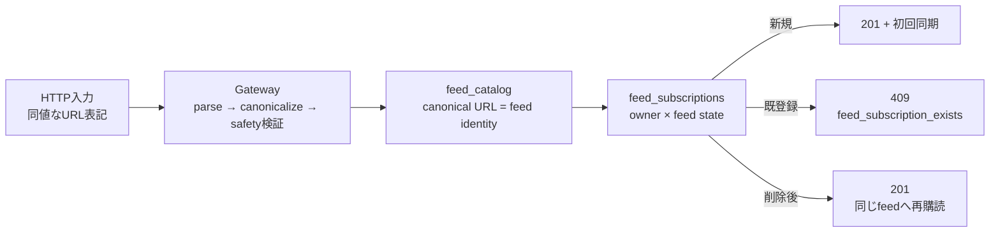

# ADR-0087: RSS URLをHTTP境界でcanonicalizeしてfeed identityへ変換する

- Status: Accepted
- Date: 2026-08-23
- Decision owners: Gateway / Content Knowledge / Web / Architecture
- Supersedes: N/A
- Superseded by: N/A
- Related: Issue #93、Issue #88、ADR-0012、ADR-0069、ADR-0071

## コンテキストと変更契機

Webはブラウザが有効と認めるHTTP(S) URLを送る一方、GatewayとContent Knowledgeは`URL.href`との文字列完全一致を要求していた。このため末尾slash省略、hostの大文字、HTTPS既定portなど、同じresourceを指す有効URLがHTTP契約で拒否された。またrepositoryの`Existing`結果はRPCで`Added`へ潰され、取得不能と非RSS/Atom応答は同期jobに残ってもWebで区別できなかった。

## 決定

Gatewayの購読登録HTTP payloadを、WHATWG URLで1回canonicalizeしてからprotocol、userinfo、fragment、canonical後の長さを検証する。RPC、Content Knowledge domain、DB、HTTP responseはcanonical-onlyとし、入力の暗黙修復を繰り返さない。

- canonicalizationはhost casing、既定port、空path、path/queryの必要なpercent-encodingをWHATWG URLに従って収束させる。queryの順序や意味を独自に変更しない。
- `http:` / `https:`以外、userinfo、fragment、canonical後2,048文字超を拒否する。query/pathはprivate feedに必要なため削除しない。
- DBのfeed重複はcanonical URL、ownerの既登録は`owner_id + feed_id`で判定する。
- 同じownerの既登録は`Existing`をRPCで保持しHTTP 409へ変換する。同期jobとwake通知は再発火しない。
- 購読削除後の再登録は同じfeed identityへ新しいowner subscriptionを作る。pause/resume semanticsを扱うIssue #88はURL identityを変更せず、owner subscriptionの`enabled`状態だけを変更する。
- 非RSS/Atom応答と取得不能は非同期同期jobのsanitized reasonで区別して表示する。登録HTTPはfeed本文を同期取得しない。

## 判断要因

- 同じresourceを別表記で重複保存しないこと。
- credentialとfragmentを拒否し、private query/pathを壊さないこと。
- 非同期RSS同期を維持し、登録requestを外部network待ちにしないこと。
- feed identityとowner subscription stateを分離し、#88の状態変更と競合させないこと。

## 却下案

| 案 | 却下理由 | 再検討条件 |
| --- | --- | --- |
| Webだけでcanonicalize | API clientごとに結果が変わり、HTTP契約とDB identityを保証できない | Web以外のHTTP clientを禁止できる |
| 各service境界で毎回canonicalize | 内部不正値を暗黙修復し、責任境界と障害検知が曖昧になる | 複数外部ingressがcanonical値を生成する |
| queryをsortまたは削除 | query順序やtokenがresource identityに影響するfeedを壊す | provider契約でquery非依存が保証される |
| 登録時に同期fetchしてRSS判定 | 外部network障害が登録latencyと可用性を支配し、既存durable queue設計に反する | 同期検証を必須とする製品SLOが承認される |
| 既登録を201成功にする | 利用者が新規登録とno-opを区別できず、不要な初回同期を誘発する | 登録APIを明示的なidempotent PUTへ変更する |

## 結果

### 利点

- 一般的な有効URL表記が同じfeed identityとowner重複へ収束する。
- 内部契約はcanonical-onlyのまま、不正永続値を検出できる。
- URL不正・禁止、既登録、取得不能、非RSS/Atomを利用者が区別できる。

### 欠点とリスク

- WHATWG URLのcanonicalization規則が外部入力契約の一部になる。
- 既に非canonicalな行がDBへ直接投入されている場合は自動移行しない。
- 登録直後の201はRSSとしての同期成功を意味せず、job状態の確認が必要である。

## 影響と同期

| 対象 | 必要な変更 | 状態 | 証拠 |
| --- | --- | --- | --- |
| 設計書 | identity/state/error契約を追記 | Done | `docs/design.md`、`docs/architecture.md` |
| ドメイン/ユースケース | canonical-only不変条件を維持 | Done | `domain/subscription.ts` |
| OpenAPI/外部契約 | 入力説明と409 variantを追加 | Done | generated OpenAPI/contracts |
| コード/ポート | HTTP変換、`Existing`伝播、409変換 | Done | Gateway / protocols / Content RPC |
| データ/ストレージ | N/A — 既存unique keyをcanonical入力で利用 | Done | `feed_catalog.feed_url` |
| 実行/配備 | N/A — migrationと環境変数の変更なし | Done | N/A |
| 認証/セキュリティ | protocol/userinfo/fragment/length検証を維持 | Done | contract safety tests |
| フロント/品質保証 | placeholder、事前検証、error/job reason表示 | Done | Web component/hook tests |
| テスト/運用 | contract・HTTP・RPC・repository・Webを検証 | Done | package tests and coverage |

## 再検討条件

- WHATWG URLとprovider固有canonical URLが異なり、同一feedの重複率が1%以上になる。
- redirect先をfeed identityに採用する要件が生じる。
- 既存DBから非canonical URLが1件以上検出される。
- 登録完了前の同期検証を要求する製品SLOが承認される。

## 受け入れゲートと未決事項

- None。

## 検証証拠

- Red: 末尾slash省略、大文字host、HTTPS既定port、spaceを含むpath/queryがcontractと実HTTPで拒否された。
- Green: 代表URLがcanonical値でportへ渡り、userinfo・fragment・非HTTP・長さ超過は拒否された。
- canonical重複は`Existing` 409へ収束し、削除後は同じfeed IDへ再購読できる。
- 同期jobの`Unavailable` / `Timeout` / `HttpStatus`と`MalformedResponse`をWebで別文言にした。
