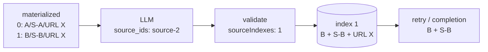

# ADR-0090: LLMのsource identityを位置でsnapshotへ固定する

- Status: Accepted
- Date: 2026-08-24
- Decision owners: Episode Production / Architecture
- Supersedes: ADR-0067
- Superseded by: N/A
- Related: Issue #87、ADR-0016、ADR-0059、ADR-0062、ADR-0080、ADR-0081

## コンテキストと変更契機

ADR-0067は台本と採用snapshot provenanceを同じcheckpointへ固定したが、初回対応付けでは検証済みLLM `source_ids`をURLへ変換し、そのURLでmaterialized記事を逆引きしていた。`source_url`は記事identityではなく、異なる記事A/Bが同じURL Xを持てる。LLMが`source-2`を選んでもURL一致の先頭Aを保存し、台本とEpisode sourceの監査可能性を壊していた。

## 決定

検証済み`source_ids`をmaterialized入力配列の0-based位置へ変換し、そのsource indexをsnapshot provenanceと一緒にcheckpointへ保存する。URLは表示・外部導線に限り、identityの逆引きには使用しない。

- OpenAI adapterはopaqueな`source-N`を入力配列のindexへ検証付きで変換し、`GeneratedScript.sourceIndexes`として返す。
- 初回実行はindexでmaterialized記事へ直接対応付ける。
- checkpointは台本の`sourceIndexes`と、同じ`sourceIndex`を持つ採用sourceの`articleId`、`snapshotId`、URL、title、任意の公開日時を不可分に保存する。
- retryは再materializeせず、indexが一致するcheckpoint provenanceだけをcompletionへ使う。
- source indexが空、負数、小数、範囲外、重複、またはcheckpoint provenanceと不一致なら`invalid_script_sources`として下流provider実行前にfail closedする。
- `sourceIndex`を持たない旧checkpointはidentityを証明できないため、decode failureとして有界に終了する。
- 公開HTTP/NATS/OpenAPI、Episode completion、Library、Webのshapeは変更しない。完全URL、記事identity、source indexを新たなtelemetry属性へ記録しない。

## 判断要因

- 同一URLでもLLMが選んだ記事identityとsnapshotを一意に復元できること。
- retry後も初回と同じ対応を再検証できること。
- provider内部IDを公開契約へ漏らさず、配列位置という小さな内部契約へ変換すること。
- URL一意性というContent Knowledgeに存在しない制約へ依存しないこと。

## 却下案

| 案 | 却下理由 | 再検討条件 |
| --- | --- | --- |
| URLで逆引きを継続 | 同じURLのA/Bを区別できず、本障害を解消しない | URLが記事identityとして一意になる |
| `source-2`文字列を全層へ保存 | provider表現がapplication/persistenceへ漏れ、構文検証が各層へ分散する | 複数provider間で共通opaque ID契約が必要になる |
| `articleId`をLLMへ渡して返させる | 内部identityを未信頼providerへ公開し、再生成・偽装検証が必要になる | providerが記事identityを直接参照する製品要件が生じる |
| 採用source全件だけを順序保存 | 台本側identityとの照合キーがなく、checkpoint改変・不整合を検出できない | checkpoint envelopeを別の署名済み形式へ置換する |

## 結果

### 利点

- 同一URLの複数記事でも、選択された`articleId + snapshotId`を正しく固定できる。
- 初回、checkpoint、retry、completionの対応を同じsource indexで検証できる。
- Episode LibraryとWebは既存completion契約のまま正しい保存版を参照する。

### 欠点とリスク

- checkpoint JSONへsource indexが増える。
- deployment時点の旧checkpointは安全な自動移行ができず、有界なdecode failureになる。
- materialized配列の並びは台本生成request中に不変である必要がある。

## 影響と同期

| 対象 | 必要な変更 | 状態 | 証拠 |
| --- | --- | --- | --- |
| 設計書 | URLとsource identityを分離 | Done | `docs/design.md`、`docs/architecture.md` |
| ドメイン/ユースケース | GeneratedScriptとcheckpointへsource indexを保持 | Done | Episode Production ports / execute-job |
| OpenAPI/外部契約 | N/A — HTTP/NATS/completion shapeは不変 | Done | generated OpenAPI差分なし |
| コード/ポート | provider検証後からretryまでindex対応 | Done | OpenAI/fake adapters、`execute-job.ts` |
| データ/ストレージ | checkpoint JSON envelope更新、DB列追加なし | Done | SQLite execution repository test |
| 実行/配備 | 旧checkpointはdecode failure | Done | bounded persistence failure contract |
| 認証/セキュリティ | owner/lease境界を維持 | Done | execution tests |
| Observability | 新規属性なし、既存failure codeを使用 | Done | telemetry差分なし |
| フロント/品質保証 | completion以降のshape不変 | Done | Library/Web既存契約 |
| テスト/運用 | 同一URL source-2、retry、不正index状態表 | Done | provider/application/persistence tests |

## 再検討条件

- 複数providerで入力sourceの並べ替えが必要になる。
- checkpoint schemaの後方互換migrationが製品要件になる。
- source identityを公開APIへ露出する要件が生じる。

## 受け入れゲートと未決事項

- None。

## 検証証拠

- Red: URL Xを共有するA/Bで`source-2`がURL Xへ潰れ、A/S-Aがcompletionへ保存された。
- Green: `source-2 → index 1`をcheckpoint/retryまで保持し、B/S-Bがcompletionへ保存される。
- 空、負数、小数、範囲外、重複、checkpoint不一致を`invalid_script_sources`へ分類する。
- `pnpm test` / `pnpm lint` / `pnpm format:check` / `pnpm contract:check` / `pnpm typecheck`。
