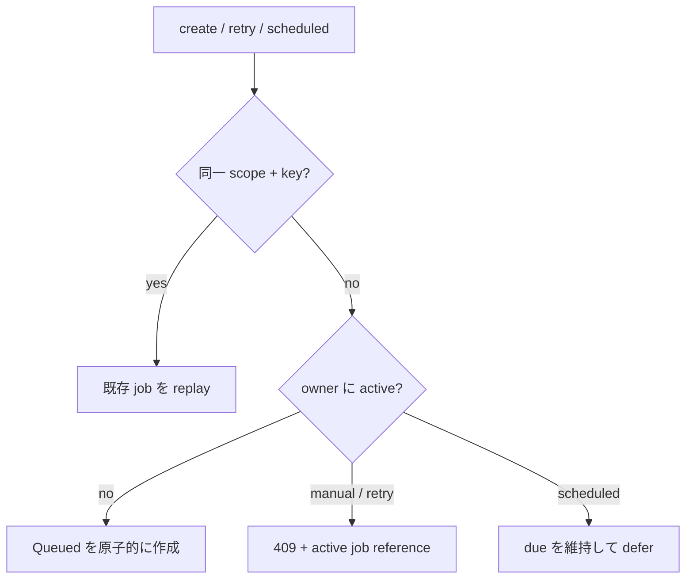

# ADR-0091: owner の active episode job を1件に制限する

- Status: Accepted
- Date: 2026-08-24
- Decision owners: Episode Production / Gateway / Web
- Supersedes: N/A
- Superseded by: N/A
- Related: Issue #92、[ADR-0085](0085-bind-idempotency-keys-to-logical-generation-actions.md)、[ADR-0086](0086-order-episode-leases-by-ready-time.md)

## コンテキストと変更契機

同じownerに複数の`Queued` / `Running` / `Retrying`が存在でき、Webが新しいterminal jobだけを追跡すると古いactive jobを見失った。さらにmanual、scheduled、retryが同時にprovider費用とqueue枠を占有できた。

## 決定

activeを`Queued | Running | Retrying`と定義し、ownerごとの上限を1件とする。同じoperation scopeと`Idempotency-Key`はactive判定より先にreplayする。異なるmanual/retry要求は既存active jobの`id`と`href`を含む`409 owner_active_job_exists`、scheduled要求は失敗にせずdueのまま次tickへ延期する。

application transactionで説明可能な競合を返し、SQLiteのINSERTおよびterminal→active UPDATE triggerを最終原子ガードとする。移行前の重複activeは起動を拒否せず自然にterminalへdrainさせ、新規activeだけを禁止する。Webは移行安全策として一覧の新しさよりactive状態を優先して追跡する。

## 状態遷移契約

| 既存状態 | 異なるmanual/retry | scheduled回復 | terminal化後の新規要求 |
| --- | --- | --- | --- |
| Queued | 409 | defer | N/A |
| Running | 409 | defer | N/A |
| Retrying | 409 | defer | N/A |
| Succeeded | accept | accept | accept |
| Failed | accept | accept | accept |
| Canceled | accept | accept | accept |

## 判断要因

- owner単位でqueue占有とprovider費用の並行発生を上限1にできる。
- ADR-0085のresponse-loss replayを壊さない。
- global workerのready-time FIFOはADR-0086のまま維持する。
- active件数、admission rejection、owner oldest queue ageを観測できる。

## 却下案

| 案 | 却下理由 | 再検討条件 |
| --- | --- | --- |
| 複数activeをWebだけで表示 | quotaと公平性を保証せず、全clientが複数jobを管理する | owner並列生成が商品要件になる |
| HTTP層だけで事前確認 | manual×scheduledや複数processの競合を原子的に防げない | N/A |
| partial unique indexのみ | 移行前の重複activeがあるDBでmigrationが失敗する | 重複が存在しないことを配備前に保証できる |

## 結果

### 利点

- 2 tab、manual×scheduled、retry競合が同じ契約へ収束する。
- 新しいterminal jobが古いactive jobを隠さない。

### 欠点とリスク

- ownerは意図的に並列生成できない。
- 移行前の重複はdrain完了までmetric上1を超え得る。

## 影響と同期

| 対象 | 必要な変更 | 状態 | 証拠 |
| --- | --- | --- | --- |
| 設計書 | active=1、競合規則 | Done | `docs/design.md`, `docs/architecture.md` |
| ドメイン/ユースケース | typed active conflict、scheduled defer | Done | Episode Production tests |
| OpenAPI/外部契約 | active参照付き409 | Done | generated OpenAPI、Gateway contract test |
| コード/ポート | RPC/Gateway/Web同期 | Done | typecheck、integration tests |
| データ/ストレージ | 原子的trigger | Done | schema migration test |
| 実行/配備 | legacy重複をdrain | Done | triggerは新規遷移だけを拒否 |
| 認証/セキュリティ | owner境界を維持 | Done | owner-scoped repository tests |
| フロント/品質保証 | active-first追跡 | Done | hook/component tests |
| テスト/運用 | 状態表、metric/event | Done | `pnpm test:coverage` |

## 再検討条件

- owner並列生成が明示的な商品要件になる。
- owner queue age SLOが単一flightにより恒常的に違反する。

## 受け入れゲートと未決事項

- None

## 検証証拠

- `pnpm typecheck`
- `pnpm lint`
- `pnpm test:coverage`
- `pnpm contract:check`
- GitHub Actions CI
