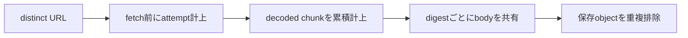

# ADR-0092: archiveの取得予算と保存重複排除を分離する

- Status: Accepted
- Date: 2026-09-11
- Decision owners: Content Platform
- Supersedes: [ADR-0014](0014-static-archive-completeness.md)のresource上限計上規則
- Superseded by: N/A
- Related: #113、`docs/design.md` §8.2

## 変更契機と決定

別URLが同じbodyを返すと、digest重複排除でdownload・保持メモリ上限を迂回できた。#113の修正として、保存重複排除とは独立に取得予算を強制する。

| 状態 | 遷移・制限 |
| --- | --- |
| 同じURLの再参照 | 追加取得しない |
| 別URL・取得失敗・CSS依存 | fetch前に1 attempt計上、既定512件 |
| body取得 | 単体20 MiBと残り累積100 MiBの小さい方でstreamを制限 |
| decoded chunk | digest判定前に毎回計上。超過chunkは計測してcancelし、保持しない |
| body保持 | digestごとに1 byte列。CSS書換後を含め累積予算の2倍まで |
| 上限超過 | ResourceLimitでcapture終了、S3書込なし |
| 通常の主要CSS取得失敗 | reader viewへfallback |

## 判断要因・却下案・結果

メモリと帯域の有限性を優先する。digest単位だけの計上は別URLで迂回できるため却下。disk spoolは今回は採用せず、逐次読込のchunkと結合時の一時copyを含む明示的なasset buffer予算を使う。読込中は既存bodyに加え最大で単体制限の2倍の一時bufferが存在する。これはasset byte列の制限であり、DOM・CSS parser・runtime・network内部bufferを含むprocess RSSの上限ではない。

重複画像が多い正常記事も取得予算を消費する。CSSの相対URLは元URLごとに解決し、書換後のbodyもdigestで共有する。安全な保存形式とpublic error契約は維持する。

## 影響と同期

| 対象 | 状態・証拠 |
| --- | --- |
| 設計 | `docs/design.md`、ADR-0014の後継リンク |
| 実装 | `http-s3-article-capture.ts`、capture終了時にDOMを解放 |
| 運用 | `archive.assets.attempted`、`downloaded_bytes`、`retained_bytes`累積counterと`archive.assets.budget`ログ。`archive.assets.limit`は固定reasonのみで計上し、URL・ownerをlabelにしない |
| テスト | distinct duplicate・境界値・取得失敗・recursive CSS・gzip decoded bytes |
| OpenAPI・DB・認証・UI・配備 | N/A — schema、保存key、既存設定の変更なし |

## 再検討条件

正常記事のlimit失敗が継続する場合、metricとRSS計測からspoolやprocess隔離を検討する。予算自体を無制限にはしない。

## 受け入れゲートと未決事項

None — #113の受け入れ条件に沿う修正。

## 検証証拠

- 修正前に重複bodyのcount/bytes再現テスト2件が失敗。
- `pnpm --filter @news-podcast/content-knowledge test`
- `pnpm --filter @news-podcast/content-knowledge typecheck`
