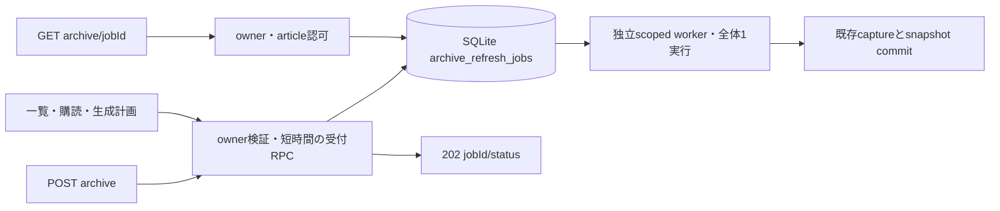

# ADR-0093: 手動archiveを有界な永続キューへ隔離する

- Status: Accepted
- Date: 2026-09-11
- Decision owners: Content Platform
- Supersedes: [ADR-0065](0065-bound-manual-archive-rpc-deadline.md)
- Superseded by: N/A
- Related: #112、ADR-0092

## 変更契機

1 ownerの遅いcaptureが共有逐次RPCを占有し、別ownerの記事・購読・生成計画を遅延させる。同期RPCのtimeout延長だけでは解決しない。

## 決定

| 遷移 | 契約 |
| --- | --- |
| 未受付→queued | owner/article権限を検証し、immediate transactionで受付 |
| 同一owner/articleがactive | message IDが違っても既存receiptを再利用 |
| 容量・rate超過 | 追加captureを作らず503、固定reasonの拒否metric |
| queued→processing | SQLite stateを共有するworker全体で1実行 |
| processing→succeeded/failed | 完了状態を保持。期限切れ・停止はdeadline/canceled |
| プロセス強制停止 | processingを他workerへ再割当しない。受付deadline後にfailedとし、明示POSTで新規受付 |
| 期限超過 | queued/processingをfailedへ遷移、遅い完了で復活しない |
| 24時間経過 | terminal receiptを削除し、GETは404 |

受付は全体32件・owner 2件、直近60秒の新規受付は全体60件・owner 4件。active再送はrateを消費しない。受付から120秒、実行30秒の短い方で中断する。captureはこれまでの安全なfetchとresource上限を維持する。1つのContent SQLite stateを正本にする既存配備契約を前提とし、別DBを持つ独立配備を跨ぐglobal制限とはしない。

HTTP POSTの契約は同期200から非同期202へ変更する。status取得はownerと記事アクセスを毎回検証する。Gatewayは通常RPC timeoutで受付を待ち、capture完了は待たない。現在のWebにはこのPOSTの呼び出し元がないため、生成済み型だけを同期する。

## 判断要因・却下案

| 案 | 判断 |
| --- | --- |
| 共通RPCを単に並列化 | 無制限captureによるメモリ・帯域競合を招くため却下 |
| subjectだけ追加して同じ逐次receiverへ接続 | 同じhead-of-line blockingが残るため却下 |
| メモリqueue | 再起動時にreceiptと受付制限を失うため却下 |
| processingを自動再実行 | 外部保存の重複と長時間占有を避け、期限後の明示再受付を採用 |

## 結果と運用

別ownerのcontrol/read RPCはcapture待ちから独立する。新規HTTPクライアントは202のjobIdを使ってstatusをpollする必要がある。queue満杯またはrate超過の503は時間を置いて再試行する。クラッシュ直前にsnapshotがcommitされた場合、receiptがfailedでもsnapshotが残る可能性がある。記事詳細で最新snapshotを確認してから再受付する。

`archive.refresh`は受付・再利用・拒否・開始・成功・失敗・deadline・cancelを数える。`archive.refresh.wait`は開始時の待ち時間ヒストグラム、`archive.refresh.jobs{state=queued|processing|expired}`はキュー状態を示す。expiredは保持期間内のdeadline失敗数。owner、記事ID、URLはmetric labelに入れない。

## 影響と同期

| 対象 | 状態 |
| --- | --- |
| SQLite | archive_refresh_jobsとactive unique/indexを追加。起動migration |
| HTTP・protocol | POST 202、GET receipt、生成済みOpenAPI/types |
| runtime | 共有RPCの受付と独立worker。scoped shutdownで中断 |
| 設計 | design.md、architecture.md、ADR-0065の後継リンク |
| Web | N/A — 手動archive POST呼び出し元なし。既存閲覧・生成は変更なし |
| テスト | 受付、owner隔離、rate、期限、worker障害、slow capture中の別owner一覧、HTTP202/status |

## 再検討条件

正常なrefreshが頻繁に容量・120秒deadlineへ達する場合、待ち時間と実メモリから実行並列数・fair scheduling・disk spoolを検討する。独立DB構成へ変更する場合はglobal admissionの正本を再設計する。

## 受け入れゲートと未決事項

None — #112が要求する非同期receiptと有界隔離を実装する。

## 検証証拠

- capture待ちで受付が返らない再現テストの失敗→成功。
- 実SQLiteキューと共通RPC loopで、owner Aのcapture停止中にowner Bの一覧が返信。
- Content Knowledge/Gateway tests、contract生成、typecheck、lint。
