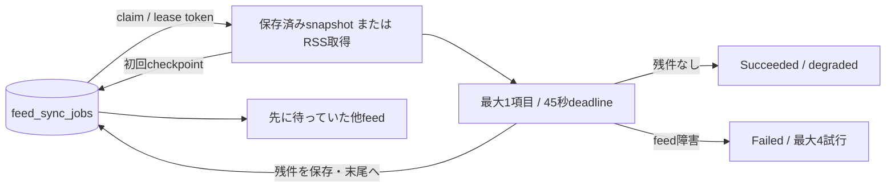

# ADR-0094: RSS同期を有界な処理単位へ分割し永続的に順番を譲る

- Status: Accepted
- Date: 2026-09-11
- Decision owners: Content Knowledge / Architecture
- Supersedes: [ADR-0041](0041-durable-rss-sync-queue.md) の無期限実行・lease重複リスク、[ADR-0068](0068-isolate-feed-item-sync-failures.md) の全項目連続実行
- Superseded by: N/A
- Related: Issue #115、[ADR-0092](0092-charge-archive-downloads-before-deduplication.md)

## 変更契機

30秒かかる記事が11件あるfeedは、1回のclaimで330秒を占有し、5分leaseを越えて他feedと別workerへ影響した。RSS本文のbyte制限だけでは記事数・archive回数を制限できない。

## 決定

正規化済みRSS snapshotをSQLiteへ保存し、1回のclaimではvalid/invalidを合わせて最大1項目だけ処理する。残件と累積件数を完了transactionで保存し、単調増加する`ready_sequence`でキュー末尾へ戻す。RSSを再取得してoffsetだけ進める方式は採らない。

| 境界 | 上限・動作 |
| --- | --- |
| 受付 | active全体6件、購読ownerあたり2件。同じfeedは既存jobを再利用。手動受付超過は503、定期投入は次のcycleへ延期 |
| RSS | HTTP最大10秒・2 MiB。valid/invalidを合わせて1,000項目超は`ResourceLimit`。正規化snapshotは4 Mi文字以内 |
| 1 claim | 最大1項目、archive最大30秒、全体45秒。RSS・archiveへEffectのabort signalを伝播 |
| Download | RSS 2 MiB + 1記事の設定済みHTML上限 + asset総量上限。既定は2 + 5 + 100 = 107 MiB。asset試行も既定512回で上限化（ADR-0092） |
| Lease | 300秒。deadline後のcleanup最大10秒を含めても期限より短い。checkpoint・完了はtoken/status/有効期限すべてでfence |
| Cycle | 最大6 claim。上限到達時は100ms後に継続。完了feedの自動再投入は完了から最低5分空け、未処理feedを優先 |
| 継続 | snapshotを再取得せず再開。通常yieldではattemptを消費せず、crash回収・feed障害だけ最大4試行へ数える |

正常稼働するworkerで、受付済みjobの各処理単位は先行最大5件を待つ。45秒とcleanup余裕10秒を合わせた275秒を基準に、`rss.sync.queued_age`の5分超を調査する。worker停止・基盤障害、受付を延期したfeedはこの待機目標の対象外。無効化された待機jobは解放し、実行中jobは終了・lease回収まで受付枠を保持する。共有feedは受付枠のある有効ownerが1人以上いれば受け付ける。

## 状態遷移と検証

| 現在 | 入力 | 次状態 | 保存・検証 |
| --- | --- | --- | --- |
| Queued | claim | Processing | attempt + 1、固有token |
| Processing | 初回RSS取得 | Processing | 副作用より先にsnapshotを保存 |
| Processing | 1項目完了・残件あり | Queued | 残件・累積件数をatomic保存、末尾へ、attempt - 1 |
| Processing | 最終項目の成功/Item失敗 | Succeeded | degradedも次の定期同期を継続 |
| Processing | Feed失敗/deadline | Failed | snapshotを保持、再試行時に再開 |
| Processing | lease期限到達 | Queued / Failed | 次workerの回収時に再試行、4回到達ならFailed |
| 任意 | 期限切れ/置換済みtokenの書込 | 不変 | StaleLease。期限ちょうども拒否 |

## 判断要因・却下案

| 案 | 却下理由 | 再検討条件 |
| --- | --- | --- |
| leaseだけを延長 | 他feedの待機時間は改善しない | 有界処理を維持したうえで時間設定を見直す場合 |
| heartbeatだけを追加 | 大量項目によるworker占有が続く | 分割できない長時間処理が必要になった場合 |
| RSSを毎回取り直しoffsetを保存 | feedの順序変更で項目を飛ばす | immutableな上流cursorが得られる場合 |
| 無制限並列archive | HTTP・メモリ負荷を増幅する | 負荷測定に基づく有界並列性が必要な場合 |

## 結果・リスク

SQLiteへのcheckpoint書込は増える。1,000項目超のfeedは縮小が必要で、受付超過時の手動操作は再試行が必要。crashがarchive commitとqueue更新の間に起きた場合、現在の1項目を再実行し得るため、既存のarchive identityによる冪等性を使う。異なるSQLiteコピー間の排他は提供せず、同じContent stateを使うworker間でleaseを共有する。

## 影響と同期

| 対象 | 対応・証拠 |
| --- | --- |
| 設計 | `docs/design.md`、`docs/architecture.md`、旧ADRのsupersession |
| Application | `feed-batch.ts`、`feed-sync-worker.ts`。既存Item/Feed失敗分類を維持 |
| Storage | `ready_sequence`、`ready_at`、`continuation_json` migration。既存jobも再開可能 |
| Runtime | production pollerをbatchへ接続。公開HTTP/NATSのshapeは不変 |
| Observability | `rss.sync.batch`（completed/budget/lease_lost）、duration、queued_age、processed、deferred。URL/ownerのmetric labelなし |
| Tests | SQLite境界・受付、11件slow + healthy、worker再生成、1,000 invalid、HTTP abort、既存poller回帰 |

## 再検討条件・未決事項

受付拒否が継続する、待機目標を超える、snapshotの大きいfeedが必要になった場合に、ownerごとの公平queueと有界worker poolを再評価する。未決事項なし。

## 検証証拠

- Red: 1,001 invalid項目が受理され、未回収の期限切れleaseで完了を書き込めた。
- Green: 上限拒否と期限境界fencing。11 slow項目より先にhealthy feedを実行し、worker再生成後も残件を欠落・重複なく再開。
- Content Knowledgeのunit/integration、型検査、coverage、lint、migration検査を実施。PRのCI結果を最終証拠とする。
