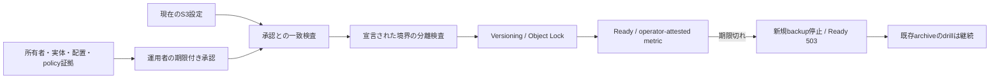

# ADR-0095: Backup先の独立性を設定に結び付いた運用承認で管理する

- Status: Accepted
- Date: 2026-09-12
- Decision owners: Platform / Operations
- Supersedes: [ADR-0075](0075-coordinate-durable-state-backup-generations.md) のendpoint比較によるoff-host/credential独立性の保証
- Superseded by: N/A
- Related: Issue #118、[復旧runbook](../operations/service-state-recovery.md)

## 変更契機

異なるDNS名が同じbackend/accountを指しても、従来のURL文字列比較を通過した。versioning/Object Lockはsourceとの独立性を証明しない。S3互換providerの物理配置・管理権限を共通APIで確認する方法はない。

## 決定

本実装は全providerを`operator-attested`として扱う。起動前に最大90日の証拠付き承認を必須とし、宣言された同一bucket identity、provider/account、backend、障害ドメイン、管理ドメインを拒否する。endpoint/region/path-style/bucket/credential fingerprintの変更は再承認を必要とする。

| 状態・入力 | 動作 |
| --- | --- |
| 承認なし、期限切れ、設定不一致 | 起動しない |
| 同一bucket/account/backend/障害・管理ドメインの宣言 | 拒否。異なるDNS aliasでも同じ |
| 独立宣言 + 証拠 + 明示承認 | Ready。自動検証済みとは扱わずwarning metricを出す |
| 稼働中に承認失効 | 新規backupを停止しReady 503。既存drillは利用可能 |
| source停止・source credential失効・local成功履歴喪失 | archiveだけを使うdrillを起動可能 |

同一hostname、localhostのIPv4/IPv6別表記、credential再利用も拒否する。既存の別endpoint必須規則を維持するため、単一の共通S3 endpointをsource/archive両方に使う構成は受け付けない。

## 権限検証と限界

明示的なpermission drillは、自分のbucketへの有効なcredentialを確認してから、予約ランダムkeyに対する交差Put/Delete/DeleteVersionの拒否を検査する。通常のschedulerからは実行しない。独立したローカルpolicy fixtureで、許可すべき自bucketの操作と拒否すべき交差操作を検証し、過剰権限を検出する。

probe結果は全prefixやbucket管理権限の証明ではない。providerの所有者情報・IAM/bucket policy・lifecycle・管理者権限を別途確認し、承認へ証拠参照を残す。誤った宣言を自動で事実認定する機能はなく、その限界をmetricとrunbookへ明示する。本番credentialの権限や実際の災害耐性をローカルテスト済みという理由で保証しない。

## 判断要因・却下案

| 案 | 却下理由 | 再検討条件 |
| --- | --- | --- |
| DNS/IP比較だけ | 共有IPでも独立account、異なるIPでも同じbackendがあり得る | 正式なprovider identity APIを利用できる場合 |
| bucket名だけ比較 | account/providerの異なる同名bucketを区別できない | N/A |
| 全providerを自動検証済みとして扱う | 物理配置や管理権限を共通S3 APIから証明できない | provider別の検証adapterと運用証拠が揃う場合 |
| 未検証設定を警告だけで無条件受理 | 設定ミスを気付かないまま継続できる | N/A |

## 結果・同期

既存backup profileは承認ファイルが必要になる。Compose secret、`.env.example`、復旧runbook、approval期限のwarning alertを同期する。宣言と運用証拠を維持する負担が増えるが、「異なるURLなら独立」という過大な保証を除去できる。

| 対象 | 実装・検証 |
| --- | --- |
| 設定契約 | `target-identity.mjs`、template生成CLI、read-only承認secret |
| Runtime | 起動gate、Ready、期限切れ新規backup停止、archive-only drill |
| 権限 | 明示的permission drillとpolicy fixture。自動の本番操作なし |
| 監視 | operator-attested、承認期限、Ready metric、残り7日のwarning alert |
| 品質 | alias・同一account/backend・期限・binding・権限・source喪失drill |
| 外部API/永続データ | 公開HTTP/NATS・archive形式・DB schemaの変更なし |

## 検証証拠

- Red: alias endpointで同じbucketを承認なしに受理し、IPv6 localhostも通過した。
- Green: 承認必須と境界検査、別表記のlocalhost拒否、credential再利用拒否。
- Red: local成功履歴なし + source障害ではschedulerがdrillを開始しなかった。Green: sourceの成功履歴への依存を除去。
- ローカルの4 DBと6 objectを保存後、source停止/失効と元DB喪失を模して復元。
- 本番providerの権限probe・停止・credential失効は実施していない。

## 再検討条件・未決事項

provider-native ownership/policy検証を導入できる場合に、operator-attestedと自動検証済みのmode分離を検討する。現時点の受け入れ条件は明示承認と監視で満たす。未決事項なし。
