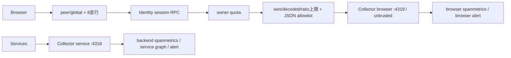

# ADR-0096: 認証済みBrowser OTLPの有界受付と信頼境界の分離

- Status: Accepted
- Date: 2026-09-12
- Decision owners: Product owner / Platform（Issue #111の受入条件）
- Supersedes: [ADR-0040](0040-full-path-observability-validation.md)（Browser OTLP proxy）
- Superseded by: N/A
- Related: [Issue #111](https://github.com/r4ai/news-podcast/issues/111)、[ADR-0032](0032-grafana-correlated-observability.md)

## Context and change trigger

GatewayのBrowser OTLPは認証前に任意のbodyをservice共通Collectorへ転送していた。未認証の `service.name=episode-production` と任意ERRORログが200で転送される再現テストが失敗した。1MiB/5秒だけでは偽装・cardinality・aggregate負荷を抑えられない。

## Decision

Gatewayで既存sessionからownerを解決する。IPはNode socket peerのみを用いる。global/IP admissionをsession RPCより前、owner admissionをbody処理より前に行う。60秒windowでglobal 300、IP 120、owner 30 request、8並行、最大1000 keyを保持し、active keyを追い出さない。deadlineは認証から応答まで5秒。

現在のSDKが使う[OTLP JSON](https://opentelemetry.io/docs/specs/otlp/)だけを受け付ける。wire 256KiB、decoded 1MiB、gzip ratio 20倍、record/datapoint合計128、resource 8、scope/resource 16、属性64/recordを上限とする。未知・入れ子データを転送せず、許可済みevent、HTTP method、例外の分類、Web Vitalsから出力を再構築する。ログ本文・span名・metric名・histogram境界は列挙値とする。job IDはUUID形式でlog/spanだけ許可し、metric属性はevent/result/failure.codeまたはvital name/ratingだけとする。

GatewayとCollector専用processorでservice.name、source、trustを固定する。browser traceのIDは相関用に保持し、未信頼であることをresourceに表示する。browserのspanmetrics namespaceを分離し、servicegraphへ投入しない。backend alertとbrowser alertを分け、拒否はGateway counterで観測する。

## Decision drivers

- 認証されていてもBrowser payloadをserviceの事実として信用しない。
- 既存same-origin session cookie・SDK serializerとの互換性を維持する。
- APIを巻き込まない固定のwork、memory、cardinality境界を設ける。

## Rejected alternatives

| Alternative | Reason rejected | Reconsider when |
| --- | --- | --- |
| Browserへ共有secret配布 | 誰でも取得でき、owner認証にならない | N/A |
| 共通pipelineでservice.nameだけ変更 | 任意metric名、span名、本文、属性とbackend alert汚染が残る | N/A |
| 短命tokenと共有rate-store | 現在のsessionと単一Gatewayで受入条件を満たす | 未ログイン診断または複数replicaが必要になった時 |

## Consequences

- 未認証POSTはCollectorへ届かない。認証済みBrowserは制限内の既存signalを送れる。
- ログイン前・logout後の診断は401で失われる。未知event/metricを追加するときはサーバーallowlistも更新する。
- reverse proxy配下ではIP枠を共有する。転送headerの暗黙信頼は導入しない。
- in-process quotaはprocess再起動でリセットされる。replica増設前に共有admissionが必要。
- ブラウザー報告の正しさ自体は保証しない。Collector/sinkは共用のため受信量上限とbackend監視を併用する。

## Impact and synchronization

| Surface | Change / evidence |
| --- | --- |
| Design | docs/design.md、docs/architecture.md、ADR-0040 successor link |
| Domain / storage | N/A — business stateと永続schemaは変更なし |
| External contract | 上記HTTP statusとallowlistをobservability READMEに記載。OTLPは既存どおりGateway business OpenAPI対象外 |
| Runtime / deployment | session resolver、peer binding、admission、専用Collector receiver、BROWSER_OTLP_HTTP_ORIGIN |
| Frontend | SDK trace/log batchを128に整合。installed exporterから採取した3signal fixtureで互換性確認 |
| Operations | browser用namespace/alert/dashboard、拒否counter、未認証401 smoke |

## Reconsideration conditions

- 正常ユーザーがIP quotaで継続的に拒否される。
- Gateway replicaが2以上になる、または未ログインの診断が必須になる。
- Browser SDKのserializer、histogram既定値、signal契約が変わる。

## Acceptance gates and open questions

- None — Issue #111の既存session認証・pipeline分離・有界受付の受入条件を実装する。

## Validation evidence

- 未認証転送Redから401 Green、実NATS session-port結合テスト。
- gzip/異常encoding/圧縮比/各quota/同時実行/任意body・metric・入れ子属性の回帰テスト。
- installed SDK 2.10.0 / OTLP exporter 0.221.0の3signal fixture。
- Gateway package test/typecheck、Collector 0.135.0公式binary config検証。
