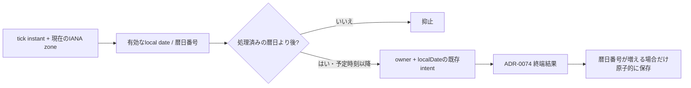

# ADR-0097: タイムゾーン変更を跨ぐ日次完了記録の単調性

- Status: Accepted
- Date: 2026-09-12
- Decision owners: Product owner / Identity Access / Episode Production
- Supersedes: [ADR-0074](0074-complete-daily-schedule-on-terminal-outcome.md)（完了日保存と設定変更時のdue判定）
- Superseded by: N/A
- Related: [Issue #109](https://github.com/r4ai/news-podcast/issues/109)、docs/design.md

## Context and change trigger

UTC `2026-08-30T08:00Z` に、完了済みのKiritimati 8/30からAdak 8/29へ設定を変えると、日付の不一致だけで過去日のjobを追加生成していた。遅延した完了RPCも保存日を後退させる。従来の文字列だけでは履歴の検証・監査ができない。

## Decision

「1日1回」はownerごとに**前進するGregorian暦日ラベルにつき1つの日次intent**とする。24時間の最小間隔ではない。`scheduled:{ownerId}:{localDate}`と終端結果に応じたclose規則は維持する。日付が進む変更は現行と同じく新しい現地時刻に従う。

- 日付は実在するcanonical日付として検証し、UTC午前0時から算出した整数の暦日番号で比較する。ローカルの1日が23/25時間になるDSTでも暦日を混同しない。
- 新しい完了記録はlocalDate、Identityが記録したUTC instant、記録時に適用中のtimeZoneを保持する。timeZoneはjob開始時のsnapshotを表すものではない。設定変更はこの記録を変更しない。
- SQLiteに暦日番号を保持し、`incomingDay > storedDay`の場合のみ日付と完了記録を同時更新する。同日再送は冪等、古い日付の通知は無変更。
- 既存データは暦日番号をbackfillし、未知の完了instant/timeZoneを捏造せず`source=legacy`として検証する。新しい完了時に`source=recorded`へ進む。
- 発見時の`past_local_day`と保存時の`stale_completion`を`identity.schedule.suppressed`へ計数する。metric labelは有限の`schedule.outcome`のみでowner IDを含めない。

## State transitions

| 状態・操作 | 結果 |
| --- | --- |
| 通常の翌日、予定時刻以降 | 新日付がdue |
| +14 → -9/-10で8/30 → 8/29 | 8/29と処理済み8/30を抑止し、8/31から再開 |
| -9 → +14で8/29 → 8/30 | 新日付の予定時刻以降ならdue。24時間未満になる場合もある |
| DSTで予定分が飛ぶ | 最初の予定時刻以降のtickで当日分を補完 |
| DSTで同じ時刻が2回来る | 同日intentを維持し、完了済みなら抑止 |
| 無効化 → 有効化、時刻変更 | 完了記録を維持。未完了日には新しい予定時刻を適用 |
| 遅延・逆順の完了通知 | 保存済み日付・instant・timeZoneを後退させない |

## Rejected alternatives

| Alternative | Reason rejected | Reconsider when |
| --- | --- | --- |
| 生の日付文字列で大小比較だけを追加 | 不正日付、保存時の後退、完了履歴の欠落を解決しない | N/A |
| 設定変更で完了markerを初期化 | 同日や過去日の重複を再開する | N/A |
| 24時間以上空ける | DSTの23時間の日と既存の暦日仕様を変える | 暦日ではなく最小間隔が商品要件になった時 |
| 日付が進む変更でも翌日まで待つ | 既存の未完了当日補完を変更する | 設定変更直後の新日付分も止めたいという要求がある時 |

## Consequences

後退する変更では最大日付に追いつくまで日次生成を休止する。進む変更では24時間未満の間隔で別暦日のintentが生成され得る。完了はEpisode成功だけでなく、ADR-0074で当日を閉じる未達結果も含む。手動生成は対象外。

## Impact and synchronization

| Surface | Change / evidence |
| --- | --- |
| Design / UI | design.md、architecture.md、schedule画面の説明、ADR-0074 successor link |
| Domain / application | 検証済み完了記録と暦日番号によるdue判定 |
| Storage | nullable day/completion追加、既存日付backfill、原子的な前進のみの更新 |
| Runtime / observability | server clockの分離、抑止counter、既存Daily schedule outcomes panel |
| REST / NATS | N/A — settingsとowner/localDateの既存契約を維持 |
| Production jobs | N/A — 日次idempotency key、終端結果調整、再試行は維持 |
| Tests | 実SQLite状態遷移、legacy SQL移行、不正日付、Production tick回帰 |

## Reconsideration conditions

- 旅行時に日付ラベルではなく24時間間隔・設定revisionごとの生成を要求する。
- 異なるタイムゾーンの同じ日付にも別番組を生成したい。

## Acceptance gates and open questions

None — 過去日抑止を追加し、進む日付には既存の当日補完動作を維持する。

## Validation evidence

- Issueの+14→-9/-10と遅延完了3ケースでRed→Green。
- 通常翌日、前進変更、DST両境界、無効化/再有効化、時刻変更、legacy移行を実SQLiteで検証。
