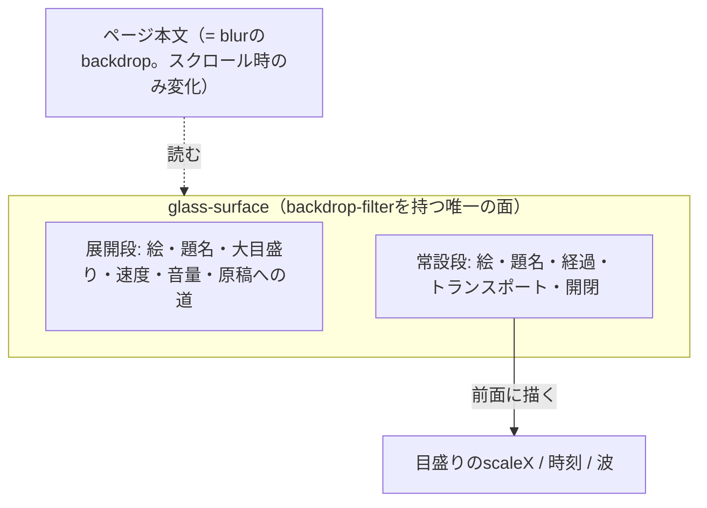

# ADR-0099: 再生バーを積層glassの浮き板にし、常設段と展開段へ分ける

- Status: Accepted
- Date: 2026-09-20
- Decision owners: Product owner / Web
- Supersedes: N/A
- Superseded by: N/A
- Related: ADR-0060、ADR-0064、`docs/design.md` §7.1 / §7.2

## コンテキストと変更契機

再生バーは「画面幅いっぱいの不透明な帯を2段」だった。確認済みの事実:

| 事象 | 由来 |
| --- | --- |
| 聴いていない時間まで本文が6rem削られる | 速度・音量・目盛り・題名を常時2段に並べていた |
| 帯が本文を切り落として見える | `bg-background`の不透明な帯が下端に張り付いていた |
| 今どの番組かを題名を読むまで判別できない | 番組を表す視覚的な目印が一切なかった |
| `backdrop-filter`を使えない | §7.2が「目盛りが毎秒数回動くので再生バー近傍にblurを置かない」と禁じていた |

最後の1点は**前提の取り違えを含んでいた**。`backdrop-filter`が読むのはその面より**後ろ**に描かれたものだけで、面の子として前面に描かれるものは滲みの再計算を呼ばない。実際に問題だったのは、動くものとblurを持つ面が**同じか後ろの階層**に隣接していた配置であって、blurそのものではない。

加えて、今後はアプリ全体をglassへ寄せる方針が決まった。禁止を維持したまま個別に例外を作ると、面ごとに判断が分かれる。

## 決定

### 1. glassは素材として1箇所に定義し、面はそれを使うだけにする

`packages/ui/src/styles/globals.css`に`--glass-*`のtokenと`@utility glass-surface`を置く。色・滲み量・縁・影を面ごとに書かない。

- 透過できない環境 (`@supports`が通らない) と、OSで透過を減らしている利用者 (`prefers-reduced-transparency: reduce`) には**不透明の面**へ落とす。見た目を落とした代替ではなく、同じ階層を成立させる正規の値として`--glass-bg-opaque`を持つ。
- 未対応のブラウザで`prefers-reduced-transparency`は成立しないので、glassのまま残る。「未対応＝透過を望まない」ではない。

### 2. 動くものは必ずglassの面の**前面**へ置く

§7.2の規則を「近傍に置かない」から「**積み方で制御する**」へ改める。

| 置き方 | 滲みの再計算 | 例 |
| --- | --- | --- |
| glassの面の**子**（前面） | 起きない | 目盛り、時刻、再生中の波 |
| glassの面と**同じか後ろ**の階層で重なる | **毎回起きる** | 下端に敷いた帯の上へ動くものを重ねる配置 |

モバイル下部ナビ (`z-20`) は再生バー (`z-30`) より後ろにあるので、バーの中で動くものはナビの背後に来ない。ただしナビ自身を透かすと滲みが読むのは本文になり、スクロールのたびに帯全体を計算し直すので、ナビは不透明のままにする。

### 3. 板は「常設1行」と「開いた中身」に分け、器は幅で変える

- 常設は1行だけ。**絵・題名・目盛り・トランスポート・閉じる**に限る。本文から恒久的に奪う高さを`6rem`→`5rem`へ減らす。
- **開くための専用ボタンは置かない**。板の押せない場所はどこでも開き、キーボードからは題名がその役を兼ねる。常設の行は幅が足りず、ボタンを1つ足すだけで最も長く取りたい題名が数文字ぶん削れる。
- **器は幅で変える**。`sm`以上では板がその場で伸び、`sm`未満では下端から立ち上がるDrawerになる。狭い幅でその場に伸ばすと、画面の3割を占める中身が下部ナビと本文の隙間へ押し込まれ、どこから来た面なのかも判らない。器の形そのものが違うのでCSSでは選べず、`useMediaQuery`が幅を読む。
- 音量は常設の1行ではアイコンだけを置き、押すとその場へ帯が重なって開く。帯を常に並べると題名から80px以上を奪う。
- 2ペインのページは本文末尾に板の分を空けない。板は内容の上に浮くので退ける必要がなく、空けると枠の下に何も無い帯ができる。
- 入り切らないもの（大きい目盛り・残り時間・速度・音量・原稿への道）は展開段が持つ。展開段は板の**上へ伸びる覆い**なので`--player-h`へは足さない。足すと開閉のたびに本文が跳ねる。
- 送り・戻しは狭い幅の折りたたみ時だけ隠し、**展開すればどの幅でも出す**。辿り着けなくなる道を作らない。
- **開閉ボタンの位置は段をまたいで変えない**。押した瞬間にその要素ごと作り直されると、focusが本文の先頭へ落ちる。常設行の同じ位置に固定する。
- Escapeは畳むだけで、音は止めない。板の外へは伝えない（記事一覧の選択解除を巻き添えにしない）。**畳む前にfocusを開閉ボタンへ移す**。音量・速度・原稿へのリンクはいずれも段の中にあり、focusを持ったまま消えると行き先を失って`body`へ落ちる。
- 再生の失敗を告げる行は板の高さそのものを変えるので、`--player-h`の確保も出ている間だけ厚くする。確保しないと、板より手前に浮く回線切れの案内がちょうどその行へ重なる。
- 下端に浮く案内の逃げ先は`--player-notice-h`が別に持つ。板を開くと上へ伸びるが、本文の確保は増やさない（増やすと開閉のたびに本文が跳ねる）。開いた段には高さの上限を置き、逃げ先が有限に決まるようにする。
- 板は**画面（サイドバーを含む）の中央**へ置き、サイドバーへは掛けない。左右の余白を「中央寄せに必要な量」と「サイドバー幅＋1rem」の**大きい方**に揃えることで、片方だけを寄せずに両方を満たす。サイドバーは板の高さを引かない（板が来ない領域なので、引くと末尾の操作だけが浮いて止まる）。
- 折りたたみ時の目盛りは、**幅で置き場所を変える**。`sm`以上では時刻の文字だけだった題名の下の行をそのまま実目盛りへ格上げし（経過を左端・残りを右端）、`sm`未満では同じ要素を板の上端の縁へ逃がす。狭い幅の題名の列は100px前後しかなく、両端に時刻を置くと帯が30pxまで縮んで掴めない。行を増やさないので、どちらでも板の高さは変わらない。
- **`<input type=range>`のつまみは幅を0にし、見えるつまみは自前で置く**。幅を持たせると、UAは`幅 − つまみ幅`の範囲でしか動かさず、全幅に対する`scaleX`の塗りと両端で「つまみ幅の半分」ずれる（実測: 14pxのつまみで7px）。幅を0にすれば値と位置が全幅で1対1になり、塗りの先端・つまみ・指の位置が完全に一致する（実測: 320〜2560pxの全幅・3つの目盛りすべてでずれ0px）。
- 板の上端の縁に置く目盛りは、**見えるものだけを板の形に切り、掴み代は切らない**。`overflow-hidden`による角の丸めは描画だけでなく**ヒットテストにも効く**ので、それで切ると両端が掴めない（実測: 左端+1pxのクリックが無反応で、+12pxから効き始めた）。板は`overflow`を切らず、帯が自分を`clip-path: inset(0 0 -200px 0 round …)`で切る。切る枠の上の角だけが板と同じ半径で丸まるので、帯は縁の曲がりまで辿って消える。当たり判定を持つ`input`は全幅のまま残すので、**板の角そのものを押しても先頭・末尾へ着く**（実測: 320〜1440pxで左端→0秒・右端→総時間・中央→ちょうど半分）。

### 4. 番組の絵はIDから決定的に導く

`Episode`契約に画像は無く、増やす予定も無い。`artworkHue(episodeId)`（FNV-1aの純粋関数）で色相を決め、その色相の斜めgradientをタイルにする。同じ番組は何度開いても同じ色になる。

- 読み上げには渡さない（隣に題名がある）。色は目印であって情報ではない。
- 色を持たせるのはこのタイルだけ。バーの他の部分は既存のsemantic colorのままにする。

### 5. 描画範囲の予算は展開時にも掛ける

展開段は絵・題名・速度・音量を抱えるので、位置を購読すると予算が一段で壊れる。開いたまま聴き続けるのは普通の使い方なので、`player-bar.render-count.test.tsx`へ**展開状態のケースを別に持つ**。

## 判断要因

- 下端の帯は「画面を見ていない時間」が長いpodcastで**常に視界にある唯一のUI**。ここが本文を切り落として見えるかどうかは、アプリ全体の印象を決める。
- §7.2の禁止は観測された現象（隣接する帯まで描き直された）から書かれていたが、原因の切り分けが「blurの有無」で止まっていた。原因は積み方だったので、規則を積み方の言葉へ直す方が、今後の面にも使える。
- 速度と音量は「聴きながら合わせる」ものだが、**毎秒見るものではない**。常設の1行を題名と再生に使い切る方が、狭い幅での可読性が上がる。
- 絵が無いと、一覧・バー・ロック画面のどこでも番組は題名の文字列でしかない。IDから導けば契約を変えずに目印が作れる。

## 却下案

| 案 | 却下理由 | 再検討条件 |
| --- | --- | --- |
| blurを使わず、半透明＋縁＋影で「glass風」に寄せる | 背景が透けないので、板が本文の上に載っている関係が伝わらない。禁止の根拠（積み方の誤り）を残したまま見た目だけ似せることになる | N/A |
| 全画面のNow Playingを立てる | 画面を覆う操作が1つ増える。今のバーが持つ情報量なら、板がその場で伸びれば足りる | 章立て・歌詞相当の長い内容を出すようになったとき |
| 速度と音量を常設の行へ残す | 320pxでは題名が数文字しか残らない。広い幅だけ出す分岐は、幅で操作が変わることを利用者が学べない | N/A |
| 展開状態を端末へ残す | 「今いじりたい」だけの意図を持ち越すことになり、開くたびに本文が1段ぶん余計に隠れた状態から始まる | N/A |
| 絵をサーバで生成して契約へ足す | 表示のためだけに保存とeventを変えることになる。IDから導けば足りる | 番組ごとに意味のある画像を持つようになったとき |
| 波（再生中の印）を常時動かさない | 「鳴っているか」を絵から読めるのは、操作列が視界の外にある狭い幅で効く。`transform`だけを動かすので合成で済む | 電池消費が測定で問題になったとき |

## 結果

### 利点

- 常設の占有が6rem→4.75rem（モバイルで約20%）減り、本文が広がる。
- 板の下に本文が透けるので、バーが本文を隠しているのではなく載っていることが判る。
- 番組ごとの色で、題名を読まずに「今どれか」が判る。
- 速度・音量・大きい目盛り・原稿への道が、**幅に関係なく**展開段から辿れる。
- 鳴っている間、展開していても操作列・音量・展開段・`AppShell`は**1回も**描き直されない（`player-bar.render-count.test.tsx`が2件の予算にしている）。
- glassの素材が1箇所にあるので、以降の面は`glass-surface`を使うだけで揃う。

### 欠点とリスク

- `backdrop-filter`は合成の負荷を上げる。板の後ろが動く場面（本文のスクロール）では毎フレーム滲みを計算し直す。今は下端の1枚だけなので許容するが、**同時に何枚も立てると効いてくる**。
- 折りたたみ時、狭い幅では送り・戻しが出ない。展開が要ることを利用者は最初の1回で学ぶ必要がある。
- 番組の色は意味を持たない。色覚特性によっては隣り合う番組が似て見えることがあり、目印として働かない場合がある（題名が常に併記されるので情報は失われない）。
- 透過を減らす設定を持たないブラウザ（Firefoxなど）では、利用者がOSで透過を切っていても滲む。

## 影響と同期

| 対象 | 必要な変更 | 状態 | 証拠 |
| --- | --- | --- | --- |
| 設計書 | §7.1へglassと番組の色、§7.2へ積み方の規則 | Done | `docs/design.md` |
| ドメイン/ユースケース | N/A — Web層の表示のみ | Done | 変更なし |
| OpenAPI/外部契約 | N/A — `Episode`は変えない（色はIDから導く） | Done | `packages/contracts/openapi/openapi.json` |
| コード/ポート | glass token/utility、`artworkHue`、展開段、絵、目盛りの2形態 | Done | `packages/ui/src/styles/globals.css`、`apps/web/src/features/player` |
| データ/ストレージ | N/A — 展開状態は端末へ残さない | Done | `apps/web/src/features/player/atoms.ts` |
| 実行/配備 | N/A | Done | N/A |
| 認証/セキュリティ | N/A — 端末へ増える値は無い | Done | N/A |
| フロント/品質保証 | 展開状態の描画予算、a11y検査、視覚回帰 | Done | `player-bar.render-count.test.tsx`、`tests/e2e/accessibility.spec.ts`、`tests/visual/app-pages.spec.ts` |
| テスト/運用 | 視覚回帰の基準画像を撮り直す | Done | `pnpm test:visual --update-snapshots=all` |

## 再検討条件

- glassの面を同時に何枚も立てるようになり、合成の負荷が実測で問題になる。
- 連続再生（キュー）が入り、常設の1行に「次の番組」が要るようになる。
- 番組に章立てが載り、展開段が目盛り以上のものを持つようになる（全画面のNow Playingを再検討する）。
- `Episode`に画像が載る（`artworkHue`を捨てる）。

## 受け入れゲートと未決事項

- None

## 検証証拠

- `pnpm --filter web typecheck` / `pnpm oxlint` / `pnpm format:check`
- `pnpm --filter web test`（展開の開閉、Escape、描画予算2件、`artworkHue`の決定性と分散）
- `pnpm --filter web test:e2e`（展開状態のaxe検査を含む全ページ）
- `pnpm test:visual`（折りたたみ・展開をlight/dark × desktop/mobileで固定）
