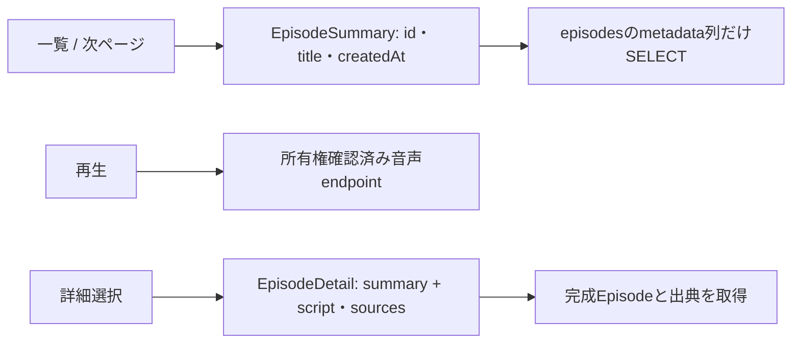

# ADR-0100: Episode一覧をsummaryに限定する

- Status: Proposed
- Date: 2026-09-20
- Decision owners: Platform
- Supersedes: N/A
- Superseded by: N/A
- Related: Issue #76、[design §5](../design.md#5-rest契約方針)

## Context and change trigger

一覧は20件それぞれ最大20,000文字の台本と全出典を返し、選択時に詳細APIで再取得していた。一覧表示・ページング・再生開始に本文は不要である。

## Decision

| 契約 | 責務 | 互換性 |
| --- | --- | --- |
| `GET /v1/episodes` / list RPC | summaryのみ、既存cursor・20件制限・owner認可を維持 | 台本・出典の削除は破壊的変更。下記の移行順を必須とする |
| `GET /v1/episodes/{id}` / get RPC | 台本・完全な出典を詳細選択時に取得 | JSON形状を維持。OpenAPI型名は`EpisodeDetail`、TSの`EpisodeSchema` import aliasは維持 |
| 音声endpoint | idから認可・再生開始 | 変更なし。詳細の先読みを要件にしない |

管理下のWeb/Gateway/Libraryを同一リリースで更新する。ローリング更新時は **Web → Gateway → Library** の順：新Webは旧full itemも扱え、新Gatewayは旧full RPCを旧detail schemaで厳密に検証してからsummaryへ変換する。新Libraryを旧Gatewayより先に出すと旧契約の必須本文が欠損するため禁止。長時間開いている旧Webは再読み込みを案内する。外部クライアントの並行互換保証はない。必要になれば別versionのsummary endpointを追加する。

一覧・Homeの最新番組は題名と作成日時のみを表示する。出典件数・台本字数は詳細で表示する。詳細のSuspense、error boundary、retryを継続する。

## Decision drivers

- ページングごとの転送・parse・cacheを本文の長さから独立させる。
- SQLでscript・音声列・出典行を取得しない。
- payload bytesと認証/RPCを含むhandler latencyの回帰を観測する。

## Rejected alternatives

| Alternative | Reason rejected | Reconsider when |
| --- | --- | --- |
| full listを圧縮する | SQL・展開後のparse/cache・detail二重取得が残る | summaryの40 KB budgetを継続的に超える |
| 出典件数・字数の一覧保持 | 集計・永続metadata追加が必要で、再生開始に不要 | 一覧での比較に必須との利用者要件が確定する |
| 新しいv2 endpointのみ追加 | 管理下クライアントに二重契約を維持する運用負担 | 独立リリースする外部consumerが生まれる |

## Consequences

### Positive

一覧の台本・出典転送をなくし、20件のUTF-8 JSONを40,000 bytes以下に制限できる。所有者、cursor、本文をmetric labelへ載せない。

### Negative and risks

旧Webは一覧本文への依存を持つため更新・再読み込みが必要。一覧から出典件数と字数が消える。詳細の読込失敗は選択時に初めて判明する。

## Impact and synchronization

| Surface | Status / Evidence |
| --- | --- |
| Design documents | `docs/design.md`、本ADR |
| Domain / ports | `OwnedEpisodeSummary`と公開summary、owner境界を維持 |
| OpenAPI / RPC | `EpisodeSummary` / `EpisodeDetail`と生成済みOpenAPI・TSを同期 |
| Storage | metadata専用projection。migrationはN/A（新列なし） |
| Runtime / deployment | 上記更新順、Gatewayのpayload/latency histogram、Grafana alert |
| Authentication / security | N/A — 既存owner認可を維持、SQL owner条件を検証 |
| Frontend / QA | summaryのみのページング・再生・詳細loading/error/retry検証 |
| Tests / operations | [性能計測・budget運用](../episode-list-performance.md) |

## Reconsideration conditions

- payloadが40 KB超、handler p95が500 ms超で10分継続。
- 独立デプロイされる旧API consumerが必要になる。
- 一覧で出典件数/台本字数を比較する機能要件が確定する。

## Acceptance gates and open questions

- Proposed: API削除と表示metadata縮小の設計承認はPRで行う。ユーザーはIssue #76対応・PR・レビュー・マージを依頼済み。

## Validation evidence

- application/repositoryのRedでfull本文混入を確認後、summaryへ変更してGreen。
- SQL投影、RPC owner隔離、Web一覧/詳細遷移、HTTP mobile performance、metric success/failureテスト。
