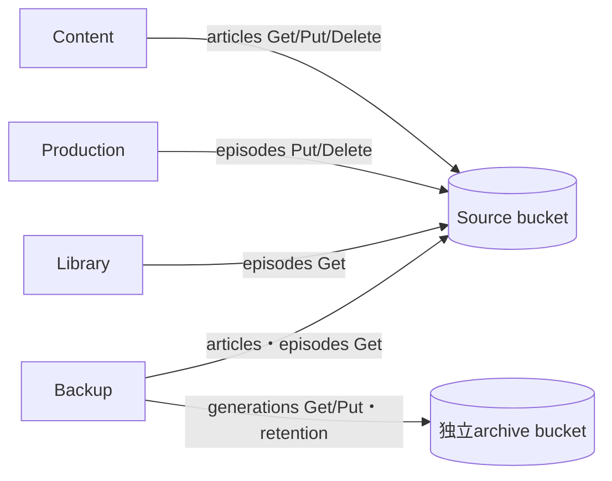

# ADR-0101: サービス単位で環境変数と S3 権限を分離する

- Status: Proposed
- Date: 2026-09-20
- Decision owners: repository maintainers
- Supersedes: N/A
- Superseded by: N/A
- Related: [Issue #117](https://github.com/r4ai/news-podcast/issues/117)、[ADR-0011](0011-s3-compatible-object-storage.md)、[設計](../design.md)

## Context and change trigger

5つのbounded contextへ単一 `.env` を全量配布しており、GatewayもOAuth/OpenAI/S3/backup credentialを保持していた。parserによる射影はprocess環境からsecretを除去しない。S3の共通鍵は記事・音声の読み書きとbackupの境界を無効化していた。

## Decision

Composeの明示 `environment` をサービス別allowlistとし、共有 `env_file` を廃止する。ホスト `.env` は補間入力として維持する。S3/OpenAIはcontext別変数から既存runtime parser名へ写す。S3は同じbucketの既存prefixを維持し、4つのsource principalと独立したarchive principalへ分割する。

機械可読allowlist、実コンテナの名前だけの検証、IAM policyとprivate SeaweedFS設定の生成、旧鍵失効runbookを同時に提供する。bucketはcredentialを持たない管理用one-shot jobで事前作成し、アプリへAdminを与えない。固定SeaweedFSがListBucketのresource判定にprefixを含めるため、ローカル設定だけbucket/prefix ARNを追加する。prefix conditionは維持し、AWS用policyは標準bucket ARNとする。

## Decision drivers

- bounded context間のcredential露出とS3操作権限を実行境界で制限する。
- 開発の `pnpm setup:env` / `pnpm dev:up` を維持する。
- secret値を観測出力へ出さず、漏えいと権限逸脱を自動検出する。

## Rejected alternatives

| Alternative | Reason rejected | Reconsider when |
| --- | --- | --- |
| parserで不要設定を無視 | process内にsecretが残る | 再検討しない |
| 全サービス共通S3鍵 | prefix・read/write境界を強制できない | 再検討しない |
| 各contextに別bucket | 既存object移行とbackup構成変更が必要 | bucket単位の保持・暗号化・availability要件が分かれた時 |
| 外部secret managerを必須化 | ローカル操作と配備依存が増える | ローテーション頻度・監査要件が手動運用を超える時 |

## Consequences

### Positive

- Gateway侵害時にIdentity/OpenAI/S3の鍵がprocess環境から流出しない。
- Libraryの音声書込、Contentの音声アクセス、Backupのsource書込をS3が拒否する。

### Negative and risks

- 既存 `.env` への項目追加、別鍵の発行・失効、再作成とbackup attestation更新が必要。
- 開発専用の公開fixtureと本番のprivate生成設定を使い分ける必要がある。
- ホスト・SeaweedFS・filer管理ネットワーク自体の権限分離は引き続き運用責任。ネットワーク分割は本ADRの対象外。

## Impact and synchronization

| Surface | Required change | Status | Evidence |
| --- | --- | --- | --- |
| Design documents | credential境界を記載 | Updated | [design](../design.md)、[runbook](../operations/service-secrets.md) |
| Domain / use cases / OpenAPI | N/A — API・業務契約は不変 | N/A | runtime注入のみ |
| Application code and ports | N/A — 既存parser名を維持 | N/A | Compose側で射影 |
| Data and storage | IAM policy追加、prefix維持 | Updated | `infra/security/s3-policy-*.json` |
| Runtime and deployment | allowlistとS3 provision | Updated | `compose.yaml` |
| Authentication and security | 専用鍵、値を出さない検査 | Updated | `scripts/check-service-environment.mjs` |
| Frontend | N/A — ブラウザ契約不変 | N/A | Gatewayの公開client IDのみ維持 |
| Tests and operations | 漏えい再現・generator・実S3拒否検証 | Updated | `scripts/service-environment.test.mjs`、`scripts/s3-permissions.integration.test.mjs` |

## Reconsideration conditions

- 新サービス・provider・secret追加時、allowlist検査が失敗する。
- object prefixやbackup inventory範囲を変える。
- SeaweedFS更新でListBucketのresource解釈が変わる。

## Acceptance gates and open questions

- 本番移行はrunbookの所有者による新鍵稼働検証と旧鍵失効を要する。PR内で本番credentialを変更しない。

## Validation evidence

- `node --test scripts/service-environment.test.mjs scripts/s3-identities.test.mjs scripts/setup-env.test.mjs`
- `node --test scripts/s3-permissions.integration.test.mjs`
- `pnpm security:env:runtime` — 専用Compose projectで5 contextとWatchdogの実process環境を検証。Backupは外部archive未接続のため同じ注入設定の待機processで検証。
- 対象スクリプトcoverage: line 84.23%、branch 81.82%。全workspace formattingと変更スクリプトlintも確認。
