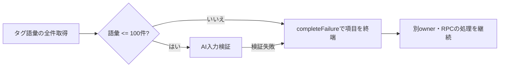

# ADR-0102: タグ語彙の件数上限を所有者ごとに統一する

- Status: Accepted
- Date: 2026-09-20
- Decision owners: Platform
- Supersedes: [ADR-0022](0022-tag-vocabulary-and-ai-tagging.md)（語彙の件数上限に限る）
- Superseded by: N/A
- Related: ADR-0084（有料試行の予約契約）、ADR-0063（owner単位のenrichment予算）、issue #138

## コンテキストと変更契機

タグ作成は件数上限なく受理される一方、記事AI処理の入力スキーマ（`EnrichmentProviderInputSchema`）は語彙を100件に制限している。101件以上の語彙を読み込むと、`Effect.orDie` により検証エラーがdefectへ変換され、共有Contentサービスの `Effect.all`（RPC・生成worker・schedulerと同列）まで停止する。通常のタグ追加でも到達し、語彙がDBへ残るため再処理時に再発する。

タグ保存とAI入力の件数契約が不一致であることが根本原因で、worker境界の `Effect.orDie` がその失敗を型付き処理できないdefectへ変換していた。

## 決定

- 所有者ごとのタグ語彙の件数上限を `TAG_VOCABULARY_LIMIT = 100` とし、**タグ作成・候補昇格・AI入力**の3箇所で同じ定数を共有する。
- タグ作成・候補昇格は上限到達時に `LimitExceeded` を返し、RPCで `409 Conflict`（`TAG_LIMIT_REACHED`）へ変換する。既に語彙にある名前の候補昇格は新規タグを作らないため、上限確認をせず残った候補の掃除だけを行う。
- AI入力検証は `Effect.orDie` を廃止し、語彙超過・入力検証失敗を `completeFailure`（非再試行）で項目単位に終端する。別ownerの処理とRPCを継続する。
- 失敗理由・件数はsanitizedなメッセージと `article.enrich.attempt` metricで観測し、語彙・記事本文をログへ含めない。

## 判断要因

- 共有Contentプロセスを1 ownerの破損語彙で落とさないこと（耐障害性・他owner隔離）。
- 件数契約を一箇所で定義し、作成・昇格・入力の不整合を将来にわたって防ぐこと。
- 失敗理由を観測可能にしつつ、本文・語彙を境界へ漏らさないこと。

## 却下案

| 案 | 却下理由 | 再検討条件 |
| --- | --- | --- |
| AI入力の件数チェックだけを残し、作成は無制限のまま | 作成と入力の契約不一致が残り、上限超過はバッチ時にしか検出されない | 語彙が事実上100件未満で推移し続けることが保証された場合 |
| 上限超過を `Effect.orDie` のままworker全体で隔離する | defectのままでは失敗理由・件数を観測できず、型付き契約に反する | 全defectを横断的に監視する仕組みが導入された場合 |
| 上限到達時に静かに拒否しUIへ通知しない | 利用者が語彙を増やせない理由を理解できない | 件数上限がUIで常時表示される設計になった場合 |

## 結果

### 利点

- 1 ownerの破損語彙による共有プロセス停止を防ぎ、他ownerのRPC・生成を継続する。
- 件数契約が単一定数に集約され、作成・昇格・入力の整合が静的に保たれる。

### 欠点とリスク

- 語彙が100件を超える利用者は、既存の超過分を削除するまで新規タグを追加できない（意図した制約）。
- `createTag` の戻り値が `Tag` から `CreateTagResult`（`Created | LimitExceeded`）へ変わり、content-knowledge内部の呼び出し元と契約テストの更新を伴う。

## 影響と同期

| 対象 | 必要な変更 | 状態 | 証拠 |
| --- | --- | --- | --- |
| 設計書 | 語彙件数上限とworkerの項目単位終端を追記 | Done | `docs/design.md` |
| ドメイン/ユースケース | `TAG_VOCABULARY_LIMIT` 新設、`CreateTagResult`/`PromoteSuggestionResult` の `LimitExceeded` 追加 | Done | `services/content-knowledge/src/domain/content-taxonomy.ts` |
| OpenAPI/外部契約 | `createTag`/`promoteTagSuggestion` に `409 ConflictProblem`、protocolのConflict codeへ `TAG_LIMIT_REACHED` 追加 | Done | `apps/gateway/src/contract.ts`、`packages/protocols/src/personalization-rpc.ts` |
| コード/ポート | 作成・昇格の上限強制、AI入力検証の `orDie` 廃止、RPC/Gatewayの409変換 | Done | `tag-vocabulary.ts`、`enrichment.ts`、`taxonomy-ports.ts` |
| データ/ストレージ | 追加のmigrationなし（既存スキーマで対応） | Done | N/A |
| 実行/配備 | 追加のワーカー/環境変数なし | Done | N/A |
| 認証/セキュリティ | 失敗メッセージはsanitized、本文・語彙をログへ含めない | Done | `enrichment.ts` |
| フロント/品質保証 | 409時に件数上限のメッセージを表示 | Done | `apps/web/src/routes/_authenticated/settings/-hooks/use-tag-vocabulary.ts` |
| テスト/運用 | 境界値・別owner継続・既存タグ同名候補の回帰テスト | Done | `enrichment.test.ts`、`sqlite-content-taxonomy.test.ts`、`nats-gateway-ports.test.ts` |

## 再検討条件

- タグ語彙の件数上限を100件から変更する必要が生じた場合（利用者からの上限変更要求や新たなAI入力契約）。
- 語彙件数が実運用で頻繁に上限へ達し、UI上の解除導線が強く求められるようになった場合。

## 受け入れゲートと未決事項

- None

## 検証証拠

- `pnpm --filter @news-podcast/content-knowledge test`（391 passed / 2 skipped）
- `pnpm --filter gateway test`（181 passed、新規409マッピング含む）
- `pnpm --filter @news-podcast/protocols test`（65 passed）
- `pnpm lint` / `pnpm format:check` / `pnpm contract:check` / 各 typecheck が pass
