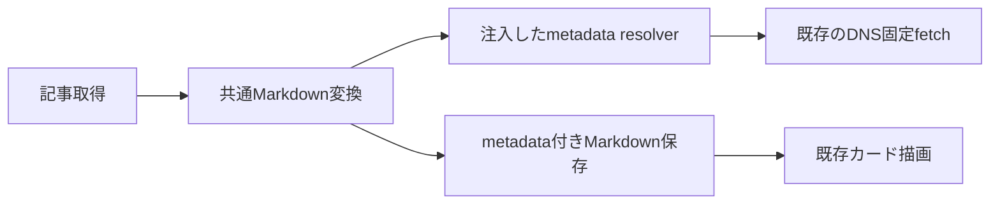

# ADR-0104: リンクカードのメタデータを記事取得時に保存する

- Status: Proposed
- Date: 2026-09-21
- Decision owners: Product owner / Content Platform
- Supersedes: N/A
- Superseded by: N/A
- Related: [ADR-0051](0051-extensible-article-markdown-conversion.md)、[ADR-0053](0053-markdown-corpus-bridges-converter-and-renderer.md)、[design.md](../design.md) §8

## Context and change trigger

ユーザーはURLだけのカードをタイトル・サムネイル付きにすること、および`alg.tus-ricora.com`のソースを参考にすることを要求した。[参考実装](https://github.com/ricora/alg.tus-ricora.com/blob/main/src/components/Elements/LinkCard/LinkCard.astro)はサーバー側でメタデータを取得し、タイトル・説明・ドメインと画像を横並びで表示する。本アプリの保存記事とブラウザ描画にはサービス境界がある。

## Decision

記事取得の既存DNS固定HTTP境界を再利用し、記事本文のカードだけを補完する。converterにはoptional resolverを注入し、通信・タイムアウト・観測はcapture adapterへ隔離する。

- 既存`@[card](URL)`のlink titleに`link-card:v1:`とJSON `{title, description?, image?, favicon?}`を格納する。remark-stringify/parseのエスケープを利用し、Webは版・型・文字数・画像URLを検証する。既存のmetadataなしカードとembed fallback契約は維持する。
- titleはOGP→Twitter→HTML title→hostname、description/imageはOGPを優先。画像はHTTP(S)のみ、取得先の最終URLで相対解決する。
- 本文の先頭側から最大12種類のカード、同時3件、補完全体4秒、各HTML最大1 MiB（archive設定が小さければその値）で制限する。重複URLは1回だけ取得する。失敗しても記事は保存する。
- タイトル256文字、説明512文字、画像URL2048文字。スクリプト・外部リソースを実行しない既存DOM境界を使う。画像は既存の本文画像と同様にブラウザでlazy loadし、no-referrerを指定する。
- 成否を`archive.link_card{result}`で観測し、URLをlabelに含めない。
- Webは横長カード、2行のタイトル・説明、ドメイン、右側のサムネイルを表示する。取得失敗時はドメイン・URL、画像失敗時は代替アイコンを表示する。

faviconはHTMLのlink rel=icon、apple-touch-icon、同一originの/favicon.icoの順で解決する。Webは読み込み失敗時に地球アイコンへ退避する。旧metadataも同一originの/favicon.icoで表示できる。

## Decision drivers

- 閲覧時の外部HTML取得とCORS依存を避け、保存時の情報を再現する。
- HTML変換とHTTP通信を分離し、既存のSSRF防御・Markdown経路を再利用する。

## Rejected alternatives

| 案 | 却下理由 | 再検討条件 |
| --- | --- | --- |
| 閲覧時のpreview API | 読むたびの通信、認証/API/cache責務が増える | 常に最新OGPを求める要件が確定 |
| unfurlをそのまま導入 | 既存DNS固定fetchと二重のHTTP境界になる | 安全なfetchを完全注入できる必要性がある |
| DBへpreview専用テーブル | immutable snapshotのMarkdownで完結できる | 記事間で大規模な共有cacheが必要 |

## Consequences

- API/DBスキーマ追加なしで保存カードを描画できる。
- 取得時間と第三者画像通信が増える。古い記事は再取得が必要で、OGPのないサイトや取得制限では画像・説明が欠ける。
- JSONをlink titleに持つ方言のため一般Markdownビューアではtooltipにmetadataが見える。

## Impact and synchronization

| 対象 | 変更・証拠 |
| --- | --- |
| 設計・開発文書 | design.md / development.mdに保存方言・更新手順 |
| domain / OpenAPI / DB | N/A —既存snapshotとMarkdown応答の形を維持 |
| converter / adapter | optional resolver / bounded metadata fetch |
| frontend | metadata検証、LinkCard、画像fallback |
| 観測 | archive.link_card counter |
| corpus / テスト | metadata注入fixture、fetch境界、描画、失敗経路 |
| 配備 | content-knowledgeとwebの再ビルド、必要な保存記事を再取得 |

## Reconsideration conditions

- 12件・4秒制限による欠落が頻発する。
- 画像の長期保存またはpreview更新が要件となる。

## Acceptance gates and open questions

- タイトル・サムネイル表示と必要な既存記事更新はユーザー指示済み。保存方言の設計は実装提案として記録し、ADRの明示承認は未取得。

## Validation evidence

- converter coverage、safe fetch/capture integration、metadata parsing、Markdown corpus、実ブラウザ確認。
