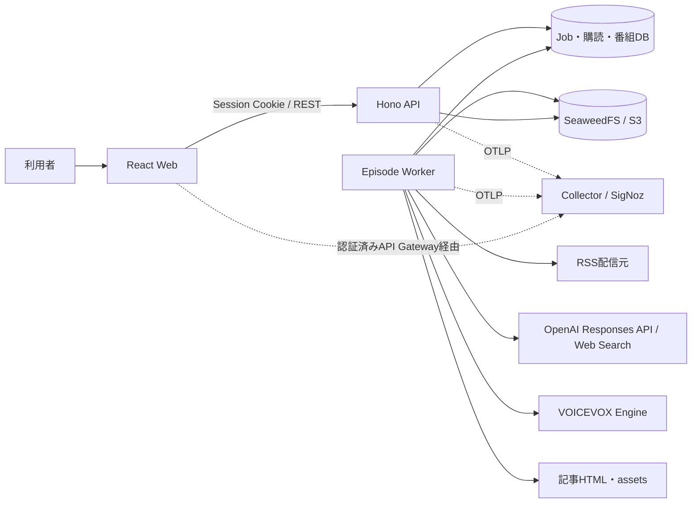
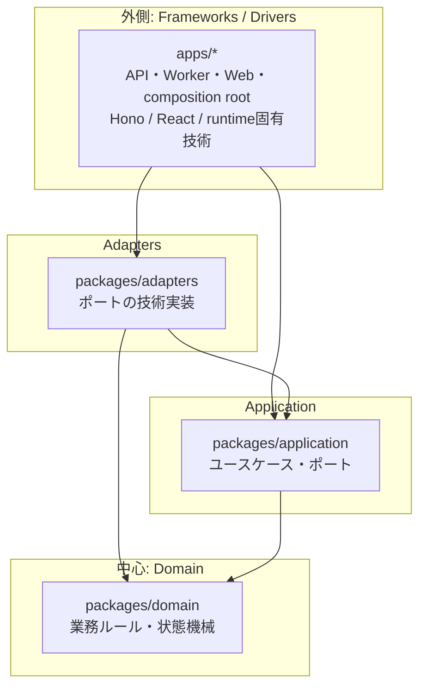
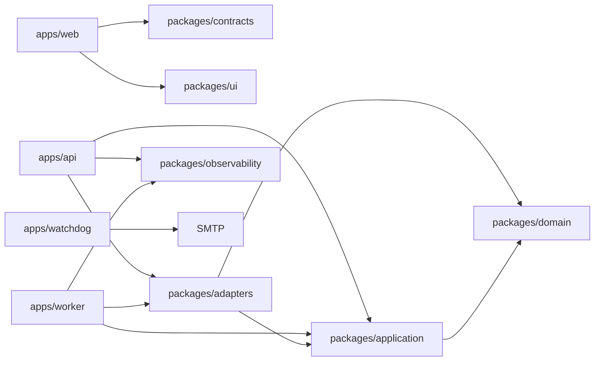
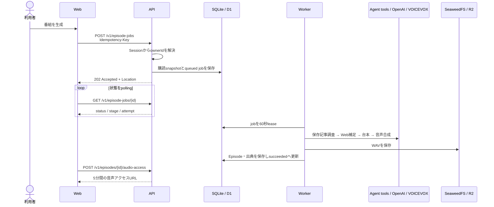
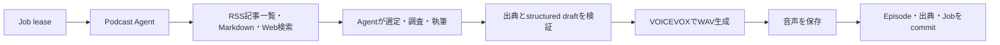
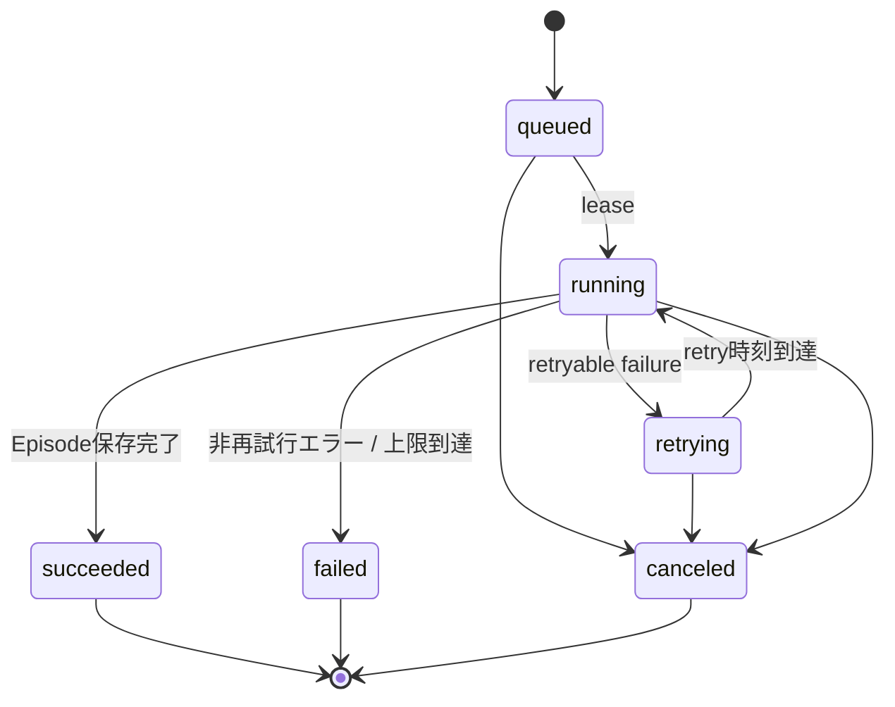
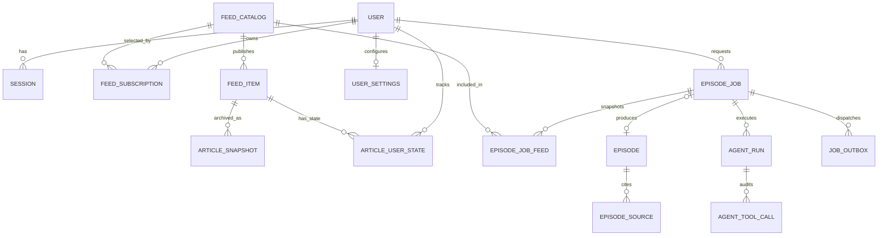

# システムアーキテクチャ

- 更新日: 2026-08-11
- 対象: 現在のリポジトリ実装
- 関連文書: [詳細設計](design.md) / [ADR](adr/) / [開発ガイド](development.md)

## 1. 全体像

本システムは、任意RSSを購読して新着記事を静的Webアーカイブへ保存し、tool駆動Agentが記事本文と補足Web検索から出典付きPodcastを制作する**モジュラーモノリス**である。長時間処理はWorkerへ分離し、本文・asset・音声はSeaweedFSへ保存する。

設計の軸は次の4点である。

| 設計方針 | 要点 |
| --- | --- |
| DDD | 認証、購読、番組生成、ライブラリを業務上の境界として捉える |
| オニオンアーキテクチャ | 外側の技術から内側の業務ルールへ一方向に依存する |
| Ports and Adapters | DB、LLM、RSS、TTS、音声保存をポート越しに差し替える |
| 非同期処理 | APIはジョブを受け付け、Workerが取得・台本・音声・保存を実行する |



## 2. ドメイン境界

現在は単一のDomain packageを共有しているが、業務上は次の境界に分かれる。境界は「別サービス」ではなく、同じモノリス内で変更理由を分離するためのものとする。

| 境界づけられた領域 | 責務 | 主なデータ・操作 |
| --- | --- | --- |
| Identity & Access | ログイン、セッション、所有者の特定 | Better Auth、Google OIDC、`ownerId` |
| Feed Management | RSSカタログとユーザー別購読 | Feed、Subscription、有効/無効 |
| Content Archive | 記事版、安全なreplay、Markdown | FeedItem、ArticleSnapshot、ArchiveAsset |
| Agent Runtime | tool権限、実行上限、承認、Memory、隔離実行 | AgentRun、AgentEvent、Approval、Memory、SandboxSession |
| Episode Production | 生成要求、Agent実行、状態遷移、生成パイプライン | EpisodeJob、AgentRun、Script、Audio |
| Episode Library | 完成番組、出典、所有者別アクセス | Episode、EpisodeSource、短期音声URL |

重要な不変条件は以下である。

- `ownerId` はセッションから導出し、URLやリクエスト本文から受け取らない。
- ジョブ作成は `owner + route + Idempotency-Key` で一意。同じキーと異なる入力の組み合わせは競合とする。
- ジョブ作成時の有効な購読フィードをsnapshotし、処理中の購読変更から切り離す。
- 台本が返す出典URLは、Agentが読んだRSS記事またはWeb検索で観測したURLだけを許可する。
- 番組、ジョブ、購読の検索はDB queryの時点で所有者を絞る。
- 署名付き音声URLは永続化せず、アクセス要求ごとに短期発行する。

## 3. レイヤー構成と依存方向

### 3.1 オニオン構造



矢印はcompile-timeの依存方向であり、すべて外側から内側へ向く。DomainはHTTP、DB、OpenAI、VOICEVOX、Cloudflareを知らない。Applicationが必要な外部能力をinterface（ポート）として定義し、Adaptersが実装する。

### 3.2 ディレクトリと責務

| パス | レイヤー | 現在の責務 |
| --- | --- | --- |
| `packages/domain` | Domain | ジョブ状態遷移、terminal判定、Idempotency-Key規則 |
| `packages/application` | Application | ジョブ作成ユースケース、RSS・要約・TTS・保存・dispatch等のポート |
| `packages/adapters` | Infrastructure Adapter | SQLite、Better Auth、RSS、OpenAI、VOICEVOX、local音声保存 |
| `apps/api` | Delivery / Composition Root | Hono route、認証・認可、OpenAPI schema、Node/Cloudflareの組み立て |
| `apps/worker` | Driver / Composition Root | scheduler、lease、生成パイプライン、Node/Cloudflare entrypoint |
| `apps/watchdog` | Operations | SigNoz非依存health/freshness監視、SMTP通知state |
| `apps/web` | Presentation | React、TanStack Router/Query、生成OpenAPI client |
| `packages/contracts` | Published Contract | Hono schemaから生成したOpenAPI JSONとTypeScript型 |
| `packages/ui` | Presentation Shared | shadcn/Base UIベースの共通UI部品とtoken |
| `packages/observability` | Cross-cutting Adapter | OpenTelemetry契約、Node adapter、privacy filter |
| `infra` | Deployment / Operations | Node image、Collector、SigNoz向け設定・dashboard・alert |

### 3.3 package依存関係



`apps/api/src/routes/**` のHono/Zod route schemaがHTTP契約の正本であり、そこから `openapi.json` とWeb用TypeScript型を生成する。Webはサーバー実装やDomain型ではなく、公開契約だけに依存する。

### 3.4 apps/api内部構成

`apps/api/src` はルーティングに沿ってディレクトリを分けている（ADR-0018のcolocationルールをAPI側にも適用）。

```
apps/api/src/
  app.ts              createApp(): ミドルウェア登録 + registerRoutes呼び出しのみ
  dependencies.ts      AppDependencies（中核依存/任意依存）
  node.ts / cloudflare.ts   composition root（Node/Workers）
  http/
    schemas.ts          Zod/OpenAPIスキーマの正本
    problem.ts           RFC 7807 Problem Detailsヘルパ
    context.ts            Variables/ApiApp/RouteRegistrar型
    sse.ts                 SSEのポーリング+ハートビートループ共通化
    middleware/            observability・authentication
  routes/
    index.ts             全ルートの登録順を決める唯一の場所
    <resource>/           1リソース1ディレクトリ、1ルート1ファイル
      <verb>.ts             createRoute定義とhandlerを併置
      presenter.ts           DTO変換（複数ルートから使う場合）
  testing/
    fixtures.ts          テスト用一時SQLite・JSONヘルパ
```

`routes/<resource>/<verb>.ts` は `createRoute` 定義と `app.openapi(route, handler)` を同一ファイルに持つ。ルート定義がHono route(=契約)である以上、契約とその実装を分けて別ファイルに置くと差分の把握がかえって難しくなるため、意図して併置している。

## 4. 主要なシステムフロー

### 4.1 手動生成



定期生成も同じ `CreateEpisodeJob` を `trigger=scheduled` で呼ぶ。Node Workerは1秒ごとにschedule確認とjob leaseを行い、IANA time zone上で同じローカル日付に二重生成しない。

### 4.2 生成パイプライン



外部provider由来の一時障害は5秒、30秒、120秒のbackoffで再試行する。初回を含め最大4回試行し、DB制約も5回目のleaseを拒否する。60秒leaseは15秒ごとに更新し、全状態変更とEpisode確定をlease tokenでfenceする。停止したWorkerのjobは期限後に再取得し、検証済み台本とVOICEVOX chunkのcheckpointから再開する。台本、各provider request、stage、job全体、応答byteには上限を設ける。

### 4.3 ジョブ状態



`running` 中の新規生成は`researching_sources`、`synthesizing_audio`、`storing_episode`を使う。従来stageは既存jobとの契約互換のため残す。

## 5. データ設計



| データ | 設計上の意味 |
| --- | --- |
| `feed_catalog` / `feed_subscriptions` | 共通の媒体カタログとユーザーの選択を分離 |
| `feed_items` / `article_snapshots` / `archive_assets` | RSS記事、版固定したHTML・Markdown、ObjectStore資産metadata |
| `article_user_states` | ユーザーごとの既読・保存状態 |
| `episode_jobs` / `episode_job_feeds` | 状態、lease、retry、冪等性、生成時点の購読snapshot |
| `episodes` / `episode_sources` | 台本・音声keyと、入力RSSへ遡れるprovenance |
| `agent_runs` / `agent_tool_calls` | Agent実行結果と、思考過程を含めないtool監査要約 |
| `user_settings` | 日次生成の有効化、local time、IANA time zone、最終実行日 |
| `job_outbox` | D1からQueueへの送信を安全に連携するための境界（cloud実装は未完） |
| Better Auth tables | user、session、account、verification |

SQLiteはforeign key、WAL、5秒のbusy timeout、`BEGIN IMMEDIATE` transactionを使用する。音声本体はDBへ格納せず、DBにはstorage keyとbyte lengthだけを保持する。

## 6. 実行環境

| 能力 | ローカル / オンプレミス | Cloudflare |
| --- | --- | --- |
| Web | Vite / React | 静的Web配信を想定 |
| API | Hono on Node | Hono on Workers |
| DB | SQLite | D1 |
| 非同期実行 | DB polling + lease | Queues consumer |
| object | SeaweedFS S3（記事・音声） | R2 |
| TTS | Compose内のVOICEVOX | Cloudflare外のVOICEVOX endpoint |
| 起動定義 | `compose.yaml` | `apps/*/wrangler.toml` |
| 現在の完成度 | 主要vertical slice実装済み | bindingとentrypointのみ。業務処理は未接続 |

Cloudflare APIは現在、D1認証・repository・queue dispatchがcomposition rootへ接続されていない。Cloudflare Workerもメッセージを処理せずretryする安全なstubである。このため、現時点の実動構成はNode + SQLite + SeaweedFSを正とする。

## 7. 横断設計

| 関心事 | 方針 |
| --- | --- |
| 認証 | Better Authのsession cookie。Google OIDCはログイン上流であり、Google tokenをAPI bearerとして扱わない |
| 認可 | 全 `/v1` resourceをowner scopeで検索し、他人のIDと存在しないIDをともに404へ正規化 |
| API契約 | Hono/Zod code-first OpenAPI、RFC 9457 Problem Details、生成型の差分検査 |
| 可観測性 | OpenTelemetryでlogs/traces/metricsを統一し、Collector経由でSigNozへ送る。自動計装（http/undici）を正本とし、入り口HTTPと全outbound HTTP（OpenAI・VOICEVOX・RSS・archive・AI enrich・S3）をspan自動生成する。W3C trace headerの注入はallowlist（既定api.openai.com・localhost・127.0.0.1、`OTEL_PROPAGATION_ALLOWLIST`で拡張）へ限定し、任意RSS等の管理外宛先へは送らない。非HTTP入口（Worker定期処理）は保証root spanでtraceを合成し、`trace.entry.synthesized`で監視する |
| Privacy | user ID、認証情報、RSS本文、台本、音声内容、完全URLをtelemetryへ送らない |
| 障害分離 | telemetry障害でAPIや生成処理を停止しない。計装欠落は非本番で`assertActiveSpan`がfail-fastし、本番は`synthesized`カウンタとruleで監視する。processクラッシュは構造化log + `process.error` + flush後にexit(1)し、有界実行の回収（ADR-0016）へ委ねる。エラー詳細はredact済み`error.message`をlogs/spansへ記録し、metricsは低cardinality属性に限定する。外部provider障害はjob retryへ変換する |
| テスト | Domain 100%、Application fake、Adapter契約、API/OpenAPI、Web unit/visual/E2Eをレイヤー別に実施 |

## 8. 現状評価と設計上の注意点

目標アーキテクチャと現在の実装には、次の意図的な差分がある。

| 項目 | 現状 | 次に境界を強化する場合の方向 |
| --- | --- | --- |
| Domain model | ジョブ状態と冪等性規則に限定され、比較的小さい | Feed、Episode、生成ポリシーの不変条件が増えた時だけDomainへ昇格する |
| Worker use case | 生成pipelineのオーケストレーションが `apps/worker` にある | `packages/application` のユースケースへ移し、Workerを純粋なdriverにする |
| 状態遷移 | Domainに状態機械はあるが、LocalStoreのSQL更新は直接statusを書き換える | repository境界でDomain遷移を必ず経由させるか、DB制約で同等規則を保証する |
| Adapter集約 | `LocalStore` が複数repository責務を兼ねる | 複雑化した時にFeed、Job、Episode、Settings単位へ分割する |
| Cloud runtime | topologyとbindingsは定義済み、実処理は未実装 | D1/R2/Queues adapter、outbox relay、Better Auth D1を接続する |
| Outbox | schemaのみ存在 | job作成transactionでoutboxへ書き、dispatcher/reconcilerでQueueへ送る |

現状の規模では、これらを先回りして細分化するより、境界を文書とinterfaceで維持し、変更理由や独立scaleの必要性が実測された時に分割する。サービス分割の再検討条件は、モジュールごとの独立配備・独立scale・組織所有境界が必要になった場合である。

## 9. 重要な設計判断

- [ADR-0001: DDDとオニオンアーキテクチャ](adr/0001-ddd-onion.md)
- [ADR-0002: OpenAPI RESTと非同期ジョブ](adr/0002-openapi-async-jobs.md)
- [ADR-0003: SQLite/DockerとD1/Cloudflare](adr/0003-dual-runtime.md)
- [ADR-0004: 外部VOICEVOX](adr/0004-external-voicevox.md)
- [ADR-0005: Better AuthとGoogle OIDC](adr/0005-authentication.md)
- [ADR-0007: 事実ベース台本と出典追跡](adr/0007-factual-provenance.md)
- [ADR-0008: Hono code-first OpenAPI](adr/0008-hono-code-first-openapi.md)
- [ADR-0009: TanStack Router/Query](adr/0009-async-react-tanstack.md)
- [ADR-0010: OpenTelemetryとSigNoz](adr/0010-opentelemetry-signoz.md)
- [ADR-0011: SeaweedFSとS3互換ObjectStore](adr/0011-s3-compatible-object-storage.md)
- [ADR-0012: RSS Readerと安全なWebアーカイブ](adr/0012-rss-reader-web-archive.md)
- [ADR-0013: Agent主導のPodcast生成](adr/0013-agent-directed-episode-production.md)
- [ADR-0015: Firecracker隔離型Agent Harness](adr/0015-firecracker-agent-harness.md)
- [ADR-0025: 自動計装を正本とするトレース保証](adr/0025-automatic-instrumentation-and-trace-guarantee.md)
