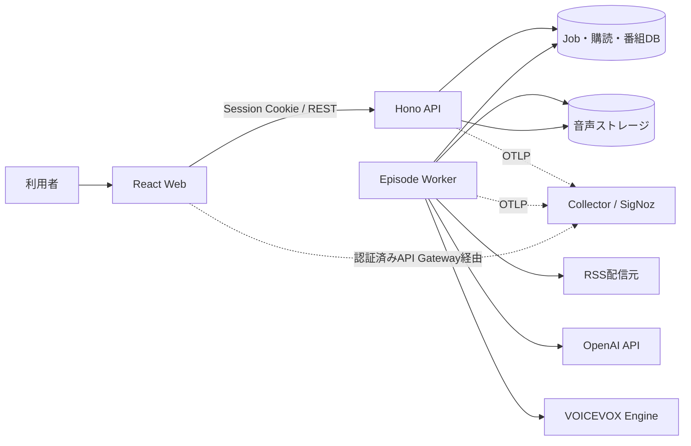
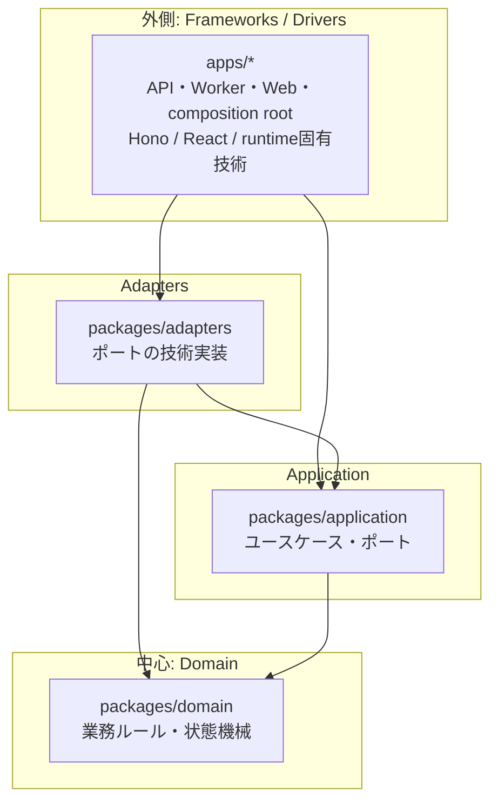
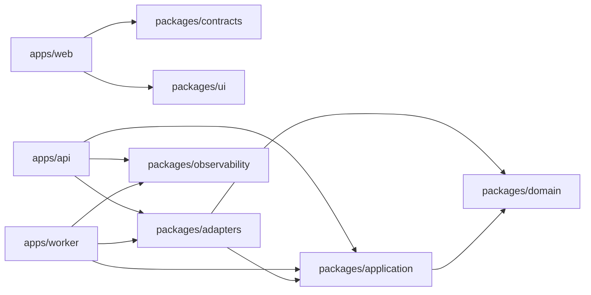
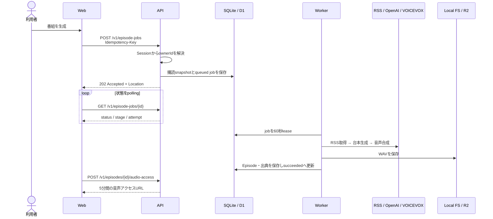
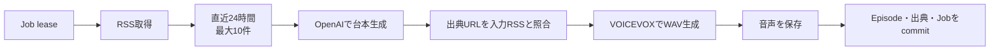
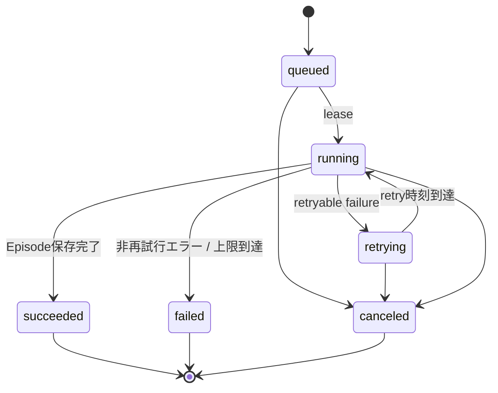
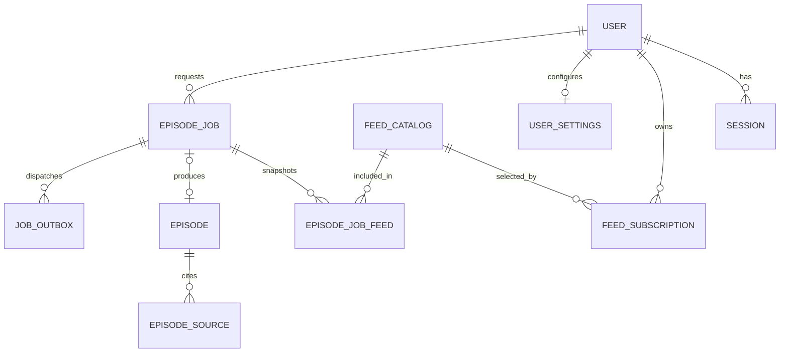

# システムアーキテクチャ

- 更新日: 2026-08-10
- 対象: 現在のリポジトリ実装
- 関連文書: [詳細設計](design.md) / [ADR](adr/) / [開発ガイド](development.md)

## 1. 全体像

本システムは、購読したRSSから直近のニュースを取得し、OpenAIで出典付きの台本を生成し、VOICEVOXで音声化する**モジュラーモノリス**である。長時間かかる生成処理を非同期ジョブへ分離し、Web、API、Workerで責務を分けている。

設計の軸は次の4点である。

| 設計方針 | 要点 |
| --- | --- |
| DDD | 認証、購読、番組生成、ライブラリを業務上の境界として捉える |
| オニオンアーキテクチャ | 外側の技術から内側の業務ルールへ一方向に依存する |
| Ports and Adapters | DB、LLM、RSS、TTS、音声保存をポート越しに差し替える |
| 非同期処理 | APIはジョブを受け付け、Workerが取得・台本・音声・保存を実行する |

## 2. ドメイン境界

現在は単一のDomain packageを共有しているが、業務上は次の境界に分かれる。境界は「別サービス」ではなく、同じモノリス内で変更理由を分離するためのものとする。

| 境界づけられた領域 | 責務 | 主なデータ・操作 |
| --- | --- | --- |
| Identity & Access | ログイン、セッション、所有者の特定 | Better Auth、Google OIDC、`ownerId` |
| Feed Management | RSSカタログとユーザー別購読 | Feed、Subscription、有効/無効 |
| Episode Production | 生成要求、冪等性、状態遷移、生成パイプライン | EpisodeJob、RSS snapshot、Script、Audio |
| Episode Library | 完成番組、出典、所有者別アクセス | Episode、EpisodeSource、短期音声URL |

重要な不変条件は以下である。

- `ownerId` はセッションから導出し、URLやリクエスト本文から受け取らない。
- ジョブ作成は `owner + route + Idempotency-Key` で一意。同じキーと異なる入力の組み合わせは競合とする。
- ジョブ作成時の有効な購読フィードをsnapshotし、処理中の購読変更から切り離す。
- 台本が返す出典URLは、入力したRSS項目に存在するURLだけを許可する。
- 番組、ジョブ、購読の検索はDB queryの時点で所有者を絞る。
- 署名付き音声URLは永続化せず、アクセス要求ごとに短期発行する。

## 3. レイヤー構成と依存方向

### 3.1 オニオン構造

矢印はcompile-timeの依存方向であり、すべて外側から内側へ向く。DomainはHTTP、DB、OpenAI、VOICEVOX、Cloudflareを知らない。Applicationが必要な外部能力をinterface（ポート）として定義し、Adaptersが実装する。

### 3.2 ディレクトリと責務

| パス | レイヤー | 現在の責務 |
| --- | --- | --- |
| `packages/domain` | Domain | ジョブ状態遷移、terminal判定、Idempotency-Key規則 |
| `packages/application` | Application | ジョブ作成ユースケース、RSS・要約・TTS・保存・dispatch等のポート |
| `packages/adapters` | Infrastructure Adapter | SQLite、Better Auth、RSS、OpenAI、VOICEVOX、local音声保存 |
| `apps/api` | Delivery / Composition Root | Hono route、認証・認可、OpenAPI schema、Node/Cloudflareの組み立て |
| `apps/worker` | Driver / Composition Root | scheduler、lease、生成パイプライン、Node/Cloudflare entrypoint |
| `apps/web` | Presentation | React、TanStack Router/Query、生成OpenAPI client |
| `packages/contracts` | Published Contract | Hono schemaから生成したOpenAPI JSONとTypeScript型 |
| `packages/ui` | Presentation Shared | shadcn/Base UIベースの共通UI部品とtoken |
| `packages/observability` | Cross-cutting Adapter | OpenTelemetry契約、Node adapter、privacy filter |
| `infra` | Deployment / Operations | Node image、Collector、SigNoz向け設定・dashboard・alert |

### 3.3 package依存関係

`apps/api/src/app.ts` のHono/Zod route schemaがHTTP契約の正本であり、そこから `openapi.json` とWeb用TypeScript型を生成する。Webはサーバー実装やDomain型ではなく、公開契約だけに依存する。

## 4. 主要なシステムフロー

### 4.1 手動生成

定期生成も同じ `CreateEpisodeJob` を `trigger=scheduled` で呼ぶ。Node Workerは1秒ごとにschedule確認とjob leaseを行い、IANA time zone上で同じローカル日付に二重生成しない。

### 4.2 生成パイプライン

外部provider由来の一時障害は5秒、30秒、120秒のbackoffで再試行する。初回を含め最大4回試行し、それでも完了しなければ `failed` とする。DB leaseにより、停止したWorkerが保持していたjobも期限後に再取得できる。

### 4.3 ジョブ状態

`running` 中の詳細stageは `fetching_sources`、`generating_script`、`synthesizing_audio`、`storing_episode` の4段階である。

## 5. データ設計

| データ | 設計上の意味 |
| --- | --- |
| `feed_catalog` / `feed_subscriptions` | 共通の媒体カタログとユーザーの選択を分離 |
| `episode_jobs` / `episode_job_feeds` | 状態、lease、retry、冪等性、生成時点の購読snapshot |
| `episodes` / `episode_sources` | 台本・音声keyと、入力RSSへ遡れるprovenance |
| `user_settings` | 日次生成の有効化、local time、IANA time zone、最終実行日 |
| `job_outbox` | D1からQueueへの送信を安全に連携するための境界（cloud実装は未完） |
| Better Auth tables | user、session、account、verification |

SQLiteはforeign key、WAL、5秒のbusy timeout、`BEGIN IMMEDIATE` transactionを使用する。音声本体はDBへ格納せず、DBにはstorage keyとbyte lengthだけを保持する。

## 6. 実行環境

| 能力 | ローカル / オンプレミス | Cloudflare |
| --- | --- | --- |
| Web | Vite / React | 静的Web配信を想定 |
| API | Hono on Node | Hono on Workers |
| DB | SQLite | D1 |
| 非同期実行 | DB polling + lease | Queues consumer |
| 音声 | local filesystem | R2 |
| TTS | Compose内のVOICEVOX | Cloudflare外のVOICEVOX endpoint |
| 起動定義 | `compose.yaml` | `apps/*/wrangler.toml` |
| 現在の完成度 | 主要vertical slice実装済み | bindingとentrypointのみ。業務処理は未接続 |

Cloudflare APIは現在、D1認証・repository・queue dispatchがcomposition rootへ接続されていない。Cloudflare Workerもメッセージを処理せずretryする安全なstubである。このため、現時点の実動構成はNode + SQLite + local audioを正とする。

## 7. 横断設計

| 関心事 | 方針 |
| --- | --- |
| 認証 | Better Authのsession cookie。Google OIDCはログイン上流であり、Google tokenをAPI bearerとして扱わない |
| 認可 | 全 `/v1` resourceをowner scopeで検索し、他人のIDと存在しないIDをともに404へ正規化 |
| API契約 | Hono/Zod code-first OpenAPI、RFC 9457 Problem Details、生成型の差分検査 |
| 可観測性 | OpenTelemetryでlogs/traces/metricsを統一し、Collector経由でSigNozへ送る |
| Privacy | user ID、認証情報、RSS本文、台本、音声内容、完全URLをtelemetryへ送らない |
| 障害分離 | telemetry障害でAPIや生成処理を停止しない。外部provider障害はjob retryへ変換する |
| テスト | Domain 100%、Application fake、Adapter契約、API/OpenAPI、Web unit/visual/E2Eをレイヤー別に実施 |

## 8. 現状評価と設計上の注意点

目標アーキテクチャと現在の実装には、次の意図的な差分がある。

| 項目 | 現状 | 次に境界を強化する場合の方向 |
| --- | --- | --- |
| Domain model | ジョブ状態と冪等性規則に限定され、比較的小さい | Feed、Episode、生成ポリシーの不変条件が増えた時だけDomainへ昇格する |
| Worker use case | 生成pipelineのオーケストレーションが `apps/worker` にある | `packages/application` のユースケースへ移し、Workerを純粋なdriverにする |
| 状態遷移 | Domainに状態機械はあるが、LocalStoreのSQL更新は直接statusを書き換える | repository境界でDomain遷移を必ず経由させるか、DB制約で同等規則を保証する |
| Adapter集約 | `LocalStore` が複数repository責務を兼ねる | 複雑化した時にFeed、Job、Episode、Settings単位へ分割する |
| Cloud runtime | topologyとbindingsは定義済み、実処理は未実装 | D1/R2/Queues adapter、outbox relay、Better Auth D1を接続する |
| Outbox | schemaのみ存在 | job作成transactionでoutboxへ書き、dispatcher/reconcilerでQueueへ送る |

現状の規模では、これらを先回りして細分化するより、境界を文書とinterfaceで維持し、変更理由や独立scaleの必要性が実測された時に分割する。サービス分割の再検討条件は、モジュールごとの独立配備・独立scale・組織所有境界が必要になった場合である。

## 9. 重要な設計判断

- [ADR-0001: DDDとオニオンアーキテクチャ](adr/0001-ddd-onion.md)
- [ADR-0002: OpenAPI RESTと非同期ジョブ](adr/0002-openapi-async-jobs.md)
- [ADR-0003: SQLite/DockerとD1/Cloudflare](adr/0003-dual-runtime.md)
- [ADR-0004: 外部VOICEVOX](adr/0004-external-voicevox.md)
- [ADR-0005: Better AuthとGoogle OIDC](adr/0005-authentication.md)
- [ADR-0007: 事実ベース台本と出典追跡](adr/0007-factual-provenance.md)
- [ADR-0008: Hono code-first OpenAPI](adr/0008-hono-code-first-openapi.md)
- [ADR-0009: TanStack Router/Query](adr/0009-async-react-tanstack.md)
- [ADR-0010: OpenTelemetryとSigNoz](adr/0010-opentelemetry-signoz.md)
