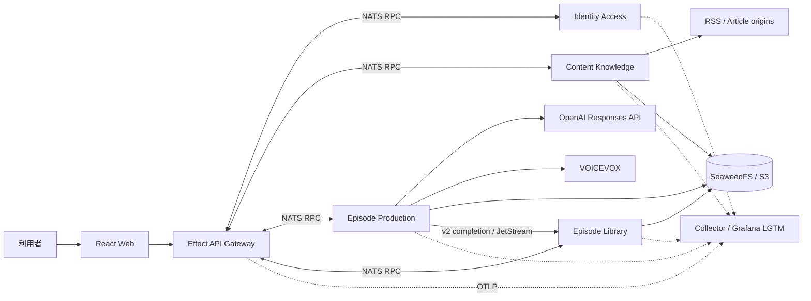
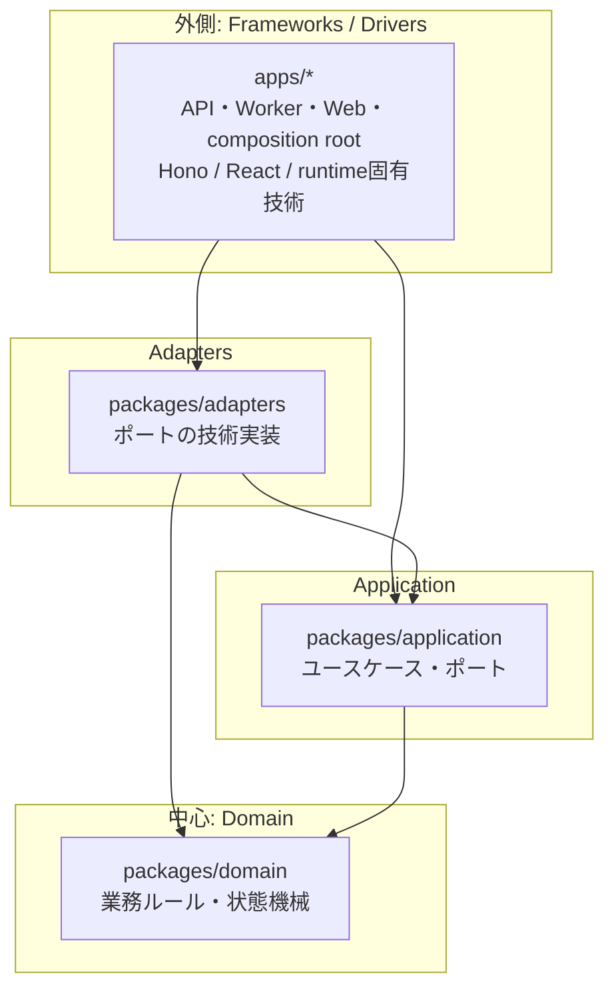
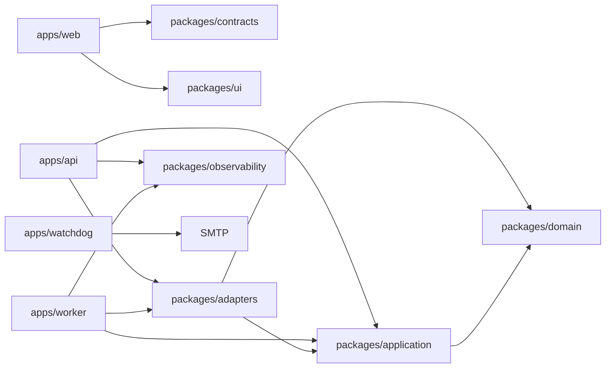
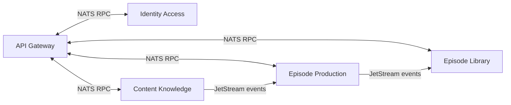
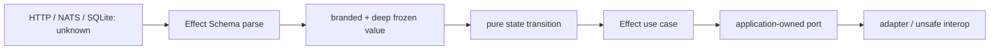
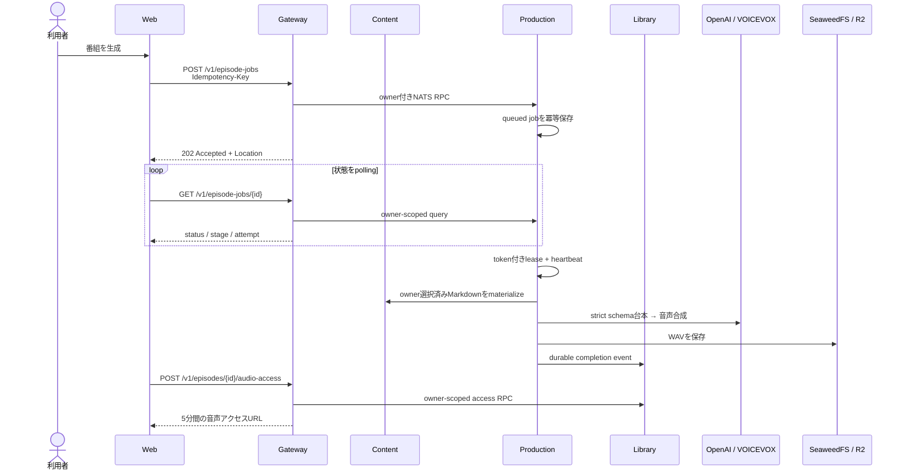
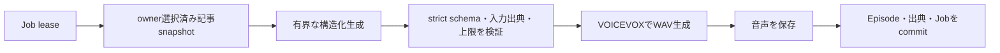
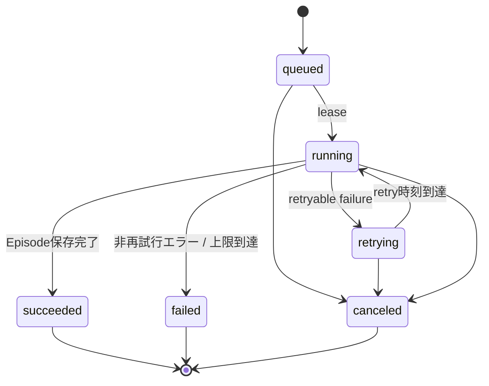
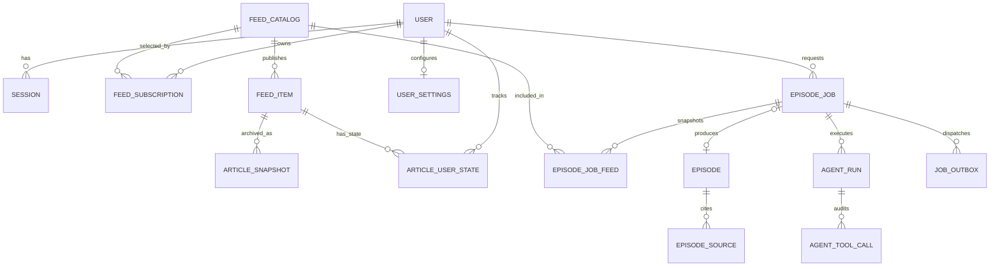

# システムアーキテクチャ

- 更新日: 2026-08-13
- 対象: 関数型マイクロサービス（supported scope移行完了）
- 関連文書: [詳細設計](design.md) / [移行ガイド](functional-ddd-migration.md) / [ADR](adr/) / [開発ガイド](development.md)

## 1. 全体像

本システムは、任意RSSを購読して新着記事を静的Webアーカイブへ保存し、ownerが選択した版固定済み記事から出典付きPodcastを制作する**関数型マイクロサービス**である。4 Bounded Contextを独立サービスとし、Gatewayとサービス間はNATS RPC、状態伝播はJetStream eventを使う。本文・asset・音声はSeaweedFSへ保存する。

設計の軸は次の4点である。

> 正本は`services/*`、`apps/gateway`、`packages/kernel`、`packages/protocols`である。default ComposeとWebは新topologyだけを使う。旧`apps/api`、`apps/worker`、`packages/domain|application|adapters`は1 releaseの比較用sourceであり、runtimeや新規実装先ではない。最終gateは[関数型DDDマイクロサービス移行ガイド](functional-ddd-migration.md)を正本とする。

| 設計方針 | 要点 |
| --- | --- |
| DDD | 認証、購読、番組生成、ライブラリを業務上の境界として捉える |
| オニオンアーキテクチャ | 外側の技術から内側の業務ルールへ一方向に依存する |
| Ports and Adapters | DB、LLM、RSS、TTS、音声保存をポート越しに差し替える |
| 非同期処理 | APIはジョブを受け付け、Workerが取得・台本・音声・保存を実行する |



## 2. ドメイン境界

業務規則は次の4 Bounded Contextが所有し、Contextごとに独立サービスとして配備する。Context間でdomain型やDBを共有しない。

| 境界づけられた領域 | 責務 | 主なデータ・操作 |
| --- | --- | --- |
| Identity & Access | ログイン、セッション、主体の特定 | Better Auth、Google OIDC、Actor |
| Content Knowledge | RSS購読、記事snapshot、安全なreplay、Markdown | Feed、Subscription、ArticleSnapshot、ArchiveAsset |
| Episode Production | 生成要求、構造化生成、実行監査、状態遷移 | EpisodeJob、AgentAudit、Script、Audio |
| Episode Library | 完成番組、出典、所有者別アクセス | Episode、EpisodeSource、短期音声URL |

重要な不変条件は以下である。

- `ownerId` はセッションから導出し、URLやリクエスト本文から受け取らない。
- ジョブ作成は `owner + route + Idempotency-Key` で一意。同じキーと異なる入力の組み合わせは競合とする。
- ジョブ作成時の有効な購読フィードをsnapshotし、処理中の購読変更から切り離す。
- 台本が返す出典URLは、ownerが選択しContentが版固定した入力記事だけを許可する。
- 番組、ジョブ、購読の検索はDB queryの時点で所有者を絞る。
- 署名付き音声URLは永続化せず、アクセス要求ごとに短期発行する。

## 3. レイヤー構成と依存方向

### 3.1 旧モジュラーモノリスのオニオン構造（移行元）



矢印はcompile-timeの依存方向であり、すべて外側から内側へ向く。DomainはHTTP、DB、OpenAI、VOICEVOX、Cloudflareを知らない。Applicationが必要な外部能力をinterface（ポート）として定義し、Adaptersが実装する。

### 3.2 移行元ディレクトリと責務

| パス | レイヤー | 現在の責務 |
| --- | --- | --- |
| `packages/domain` | Domain | ジョブ状態遷移、terminal判定、Idempotency-Key規則 |
| `packages/application` | Application | ジョブ作成ユースケース、RSS・要約・TTS・保存・dispatch等のポート |
| `packages/adapters` | Infrastructure Adapter | SQLite、Better Auth、RSS、OpenAI、VOICEVOX、local音声保存 |
| `apps/api` | Legacy source | 移行比較用。runtime・OpenAPIの正本ではない |
| `apps/worker` | Legacy source | 移行比較用。scheduler・生成の正本ではない |
| `apps/watchdog` | Operations | Grafana非依存health/freshness監視、SMTP通知state |
| `apps/web` | Presentation | React、TanStack Router/Query、生成OpenAPI client |
| `packages/contracts` | Published Contract | Gateway HttpApiから生成したOpenAPI JSONとTypeScript型 |
| `packages/ui` | Presentation Shared | shadcn/Base UIベースの共通UI部品とtoken |
| `packages/observability` | Cross-cutting Adapter | OpenTelemetry契約、Node adapter、privacy filter |
| `infra` | Deployment / Operations | Node image、Collector、Grafana/Prometheus/Loki/Tempo設定・dashboard・alert |

### 3.3 移行元package依存関係



この節の`apps/api`構造は移行比較用の記録である。HTTP契約の正本は`apps/gateway/src/contract.ts`であり、`packages/contracts`のOpenAPIとWeb用TypeScript型を生成する。Webはサーバー実装やDomain型ではなく、公開契約だけに依存する。

### 3.4 apps/api内部構成

`apps/api/src` はルーティングに沿ってディレクトリを分けている（ADR-0018のcolocationルールをAPI側にも適用）。

```
apps/api/src/
  app.ts              createApp(): ミドルウェア登録 + registerRoutes呼び出しのみ
  dependencies.ts      AppDependencies（中核依存/任意依存）
  node.ts / cloudflare.ts   composition root（Node/Workers）
  http/
    schemas.ts          Zod/OpenAPIスキーマの正本
    problem.ts           RFC 7807 Problem Detailsヘルパ
    context.ts            Variables/ApiApp/RouteRegistrar型
    sse.ts                 SSEのポーリング+ハートビートループ共通化
    middleware/            observability・authentication
  routes/
    index.ts             全ルートの登録順を決める唯一の場所
    <resource>/           1リソース1ディレクトリ、1ルート1ファイル
      <verb>.ts             createRoute定義とhandlerを併置
      presenter.ts           DTO変換（複数ルートから使う場合）
  testing/
    fixtures.ts          テスト用一時SQLite・JSONヘルパ
```

`routes/<resource>/<verb>.ts` は `createRoute` 定義と `app.openapi(route, handler)` を同一ファイルに持つ。ルート定義がHono route(=契約)である以上、契約とその実装を分けて別ファイルに置くと差分の把握がかえって難しくなるため、意図して併置している。

### 3.5 関数型マイクロサービスへの移行後構成

Bounded Contextと配備サービスは1対1にし、純粋な中核と実行shellを別top-level directoryへ分散させず、同じ所有単位へコロケーションする。Context間はdomain型をimportせず、version付きNATS protocolだけで通信する。

```text
apps/
  gateway/                  # 外部Effect HttpApi / OpenAPI
  web/
  watchdog/
services/
  identity-access/src/{domain,application,adapters,runtime}
  content-knowledge/src/{domain,application,adapters,runtime}
  episode-production/src/{domain,application,adapters,runtime}
  episode-library/src/{domain,application,adapters,runtime}
packages/
  protocols/                # NATS RPC/event Schema
  contracts/                # Gateway HttpApi/OpenAPI生成物
  observability/            # OTel contractとEffect Layer
  kernel/                   # Context非依存の最小primitive
```



各service内の依存は`runtime/adapters → application → domain`のみとし、package export、lint、architecture testで逆向きimportとContext横断importを拒否する。詳細は[ADR-0033](adr/0033-colocate-bounded-context-with-service.md)を正本とする。

### 3.6 型と副作用の境界



`parse, don't validate`を適用し、検査結果をBooleanで返して元の型を使い続けるAPIは作らない。外部入力、永続JSON、NATS messageは`unknown`として受け、余剰propertyも拒否する共通parserの成功値だけを内側へ渡す。job状態はdiscriminated unionで表し、例えば4回目の`Running`を`Retrying`へ渡せないことを型で保証する。詳細は[ADR-0034](adr/0034-functional-domain-model-and-effect-boundaries.md)を正本とする。

### 3.7 移行進捗

| Surface | 状態 | 現在の証拠 |
| --- | --- | --- |
| immutable kernel / protocol | Done | strict parse、deep freeze、correlation envelope、version付きsubject |
| 4 Context services | Implemented | `services/*/src/{domain,application,adapters,runtime}`、service別所有state |
| SQLite/NATS runtime | P0 done | service別single-writer、outbox/inbox、durable consumer、fenced heartbeat、Compose readiness |
| Grafana相関監視 | P0 done | LGTM provisioning、Effect/Node OTLP、Gateway/Identity/NATS span smoke |
| Effect HttpApi Gateway | Done | 公開API parity、認証proxy、Gateway OpenAPI、functional E2E |
| Web生成client | Done | Gateway生成型とproxyへ切替、Web E2E 13/13 |
| state migration/recovery | Implemented | service別DB、rollback backup、件数/hash照合、backup/restore tests |
| 旧API/Worker runtime | Removed | default Compose/importから除外。source物理削除は1 release比較後 |

移行順序と削除ゲートの詳細は[移行ガイド](functional-ddd-migration.md)を参照する。`Foundation done`を機能移植完了とはみなさない。

## 4. 主要なシステムフロー

### 4.1 手動生成



定期生成も同じ `CreateEpisodeJob` を `trigger=scheduled` で呼ぶ。Episode ProductionのschedulerはIANA time zoneでdue設定を問い合わせ、`scheduled:{localDate}`の冪等keyで同じローカル日付の二重生成を防ぐ。Identityの完了日はjob作成成功後だけ進める。

### 4.2 生成パイプライン



外部provider由来の一時障害は設定済みの指数backoffと総経過時間で再試行する。初回を含めjobは最大4回試行し、DB制約も5回目のleaseを拒否する。既定300秒leaseは60秒ごとに更新し、全状態変更とEpisode確定をlease tokenでfenceする。停止したprocessのjobは期限後に再取得し、検証済み台本と音声checkpointから再開する。台本、各provider request、job、応答byteには上限を設ける。

### 4.3 ジョブ状態



`running` 中の新規生成は`researching_sources`、`synthesizing_audio`、`storing_episode`を使う。従来stageは既存jobとの契約互換のため残す。

## 5. データ設計



| データ | 設計上の意味 |
| --- | --- |
| `feed_catalog` / `feed_subscriptions` | 共通の媒体カタログとユーザーの選択を分離 |
| `feed_items` / `article_snapshots` / `archive_assets` | RSS記事、版固定したHTML・Markdown、ObjectStore資産metadata |
| `article_user_states` | ユーザーごとの既読・保存状態 |
| `episode_jobs` / `episode_job_feeds` | 状態、lease、retry、冪等性、生成時点の購読snapshot |
| `episodes` / `episode_sources` | 台本・音声keyと、入力RSSへ遡れるprovenance |
| `agent_runs` / `agent_tool_calls` | Agent実行結果と、思考過程を含めないtool監査要約 |
| `user_settings` | 日次生成の有効化、local time、IANA time zone、最終実行日 |
| `job_outbox` | 移行元Cloud設計の比較用schema。supported runtimeでは使わない |
| Better Auth tables | user、session、account、verification |

SQLiteはforeign key、WAL、5秒のbusy timeout、`BEGIN IMMEDIATE` transactionを使用する。音声本体はDBへ格納せず、DBにはstorage keyとbyte lengthだけを保持する。

## 6. 実行環境

supported runtimeはNode self-hostだけである（[ADR-0039](adr/0039-support-node-self-host-runtime-only.md)）。

| 能力 | supported構成 |
| --- | --- |
| Web / Gateway | Vite React / Effect HttpApi on Node |
| 業務service | Identity、Content、Production、LibraryのNode process |
| DB / messaging | service別SQLite / NATS JetStream |
| object / TTS | SeaweedFS S3 / VOICEVOX |
| 起動定義 | `compose.yaml` |

Cloudflare/D1/R2/Queues adapterと旧API/Workerはruntime未接続の比較用sourceであり、SLO、復旧手順、運用supportの対象外である。再導入は事業要件、owner、contract suiteを揃えた後続ADRで判断する。

## 7. 横断設計

| 関心事 | 方針 |
| --- | --- |
| 認証 | Better Authのsession cookie。Google OIDCはログイン上流であり、Google tokenをAPI bearerとして扱わない |
| 認可 | 全 `/v1` resourceをowner scopeで検索し、他人のIDと存在しないIDをともに404へ正規化 |
| API契約 | Effect HttpApi code-first OpenAPI、RFC 9457 Problem Details、生成型の差分検査 |
| 可観測性 | OpenTelemetryでlogs/traces/metricsを統一し、CollectorからPrometheus/Loki/Tempoへ送りGrafanaで相関する。span metricsとservice graphを生成し、exemplar、trace ID、span IDでmetrics↔traces↔logsを往復できるようにする。自動計装（http/undici）に加えてNATS、outbox/inbox、DB、providerの意味的spanを作る。W3C trace headerの注入は管理先allowlistへ限定する |
| Privacy | user ID、認証情報、RSS本文、台本、音声内容、完全URLをtelemetryへ送らない |
| 障害分離 | telemetry障害でAPIや生成処理を停止しない。計装欠落は非本番で`assertActiveSpan`がfail-fastし、本番は`synthesized`カウンタとruleで監視する。processクラッシュは構造化log + `process.error` + flush後にexit(1)し、有界実行の回収（ADR-0016）へ委ねる。エラー詳細はredact済み`error.message`をlogs/spansへ記録し、metricsは低cardinality属性に限定する。外部provider障害はjob retryへ変換する |
| テスト | Domain 100%、Application fake、Adapter契約、API/OpenAPI、Web unit/visual/E2Eをレイヤー別に実施 |

## 8. 移行元の評価と設計上の注意点

目標アーキテクチャと現在の実装には、次の意図的な差分がある。

| 項目 | 現状 | 次に境界を強化する場合の方向 |
| --- | --- | --- |
| Domain model | ジョブ状態と冪等性規則に限定され、比較的小さい | Feed、Episode、生成ポリシーの不変条件が増えた時だけDomainへ昇格する |
| 旧Worker use case | `apps/worker`に移行元実装が残る | 比較用sourceに限定。新規生成はEpisode Productionだけへ追加する |
| 一般Agent/Web検索 | 旧sourceにHarness/tool-loopが残る | 本番未接続。品質要件とSLOが揃った時だけADR-0038を再検討する |
| Cloud runtime | 旧binding/entrypoint sourceが残る | unsupported。事業要件とcontract suiteが揃った時だけADR-0039を再検討する |
| 旧共有state | legacy SQLite schemaが残る | migration/rollback比較用。runtimeはservice別SQLiteだけを使う |

現状の規模では、これらを先回りして細分化するより、境界を文書とinterfaceで維持し、変更理由や独立scaleの必要性が実測された時に分割する。サービス分割の再検討条件は、モジュールごとの独立配備・独立scale・組織所有境界が必要になった場合である。

## 9. 重要な設計判断

- [ADR-0001: DDDとオニオンアーキテクチャ](adr/0001-ddd-onion.md)
- [ADR-0002: OpenAPI RESTと非同期ジョブ](adr/0002-openapi-async-jobs.md)
- [ADR-0003: SQLite/DockerとD1/Cloudflare](adr/0003-dual-runtime.md)
- [ADR-0004: 外部VOICEVOX](adr/0004-external-voicevox.md)
- [ADR-0005: Better AuthとGoogle OIDC](adr/0005-authentication.md)
- [ADR-0007: 事実ベース台本と出典追跡](adr/0007-factual-provenance.md)
- [ADR-0008: Hono code-first OpenAPI](adr/0008-hono-code-first-openapi.md)
- [ADR-0009: TanStack Router/Query](adr/0009-async-react-tanstack.md)
- [ADR-0032: Grafana相関監視基盤](adr/0032-grafana-correlated-observability.md)
- [ADR-0011: SeaweedFSとS3互換ObjectStore](adr/0011-s3-compatible-object-storage.md)
- [ADR-0012: RSS Readerと安全なWebアーカイブ](adr/0012-rss-reader-web-archive.md)
- [ADR-0013: Agent主導のPodcast生成](adr/0013-agent-directed-episode-production.md)
- [ADR-0015: Firecracker隔離型Agent Harness](adr/0015-firecracker-agent-harness.md)
- [ADR-0025: 自動計装を正本とするトレース保証](adr/0025-automatic-instrumentation-and-trace-guarantee.md)
- [ADR-0033: Bounded Contextとサービスのコロケーション](adr/0033-colocate-bounded-context-with-service.md)
- [ADR-0034: 関数型ドメインモデルとEffect境界](adr/0034-functional-domain-model-and-effect-boundaries.md)
- [ADR-0038: 保存済み出典による有界な構造化生成](adr/0038-bounded-structured-production-generation.md)
- [ADR-0039: Node self-host runtimeだけをsupport](adr/0039-support-node-self-host-runtime-only.md)
