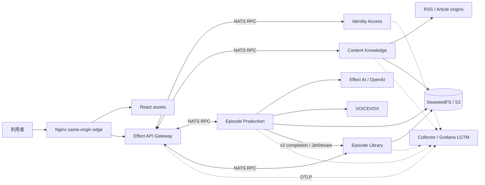
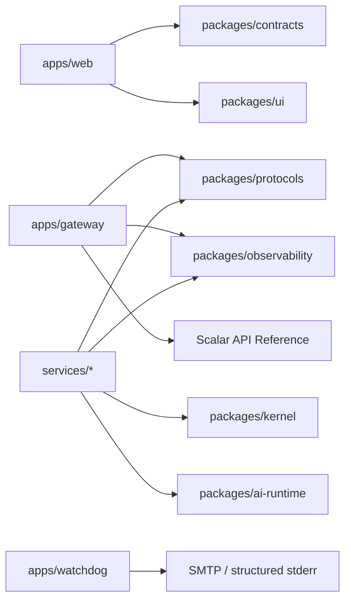
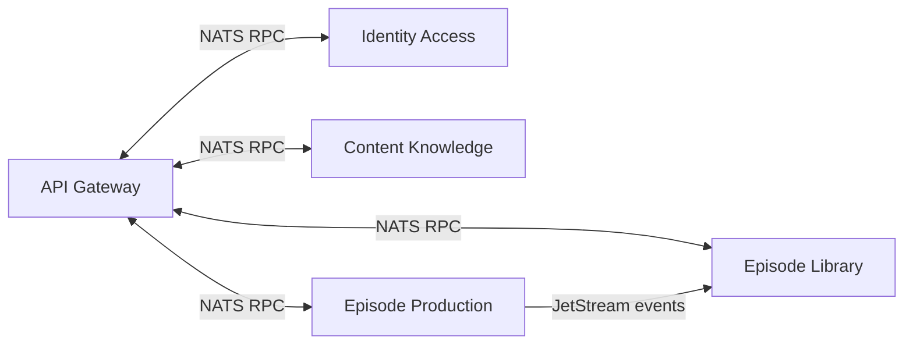
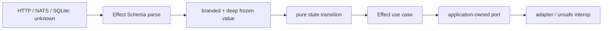
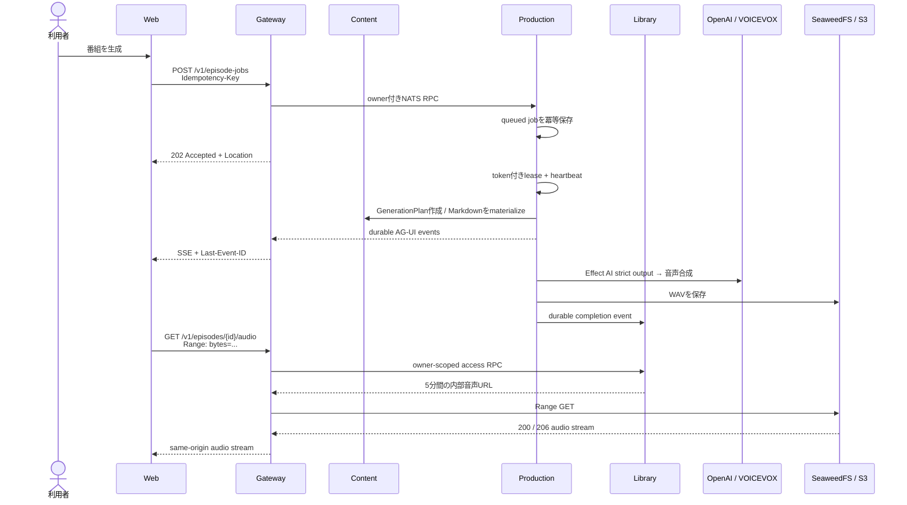
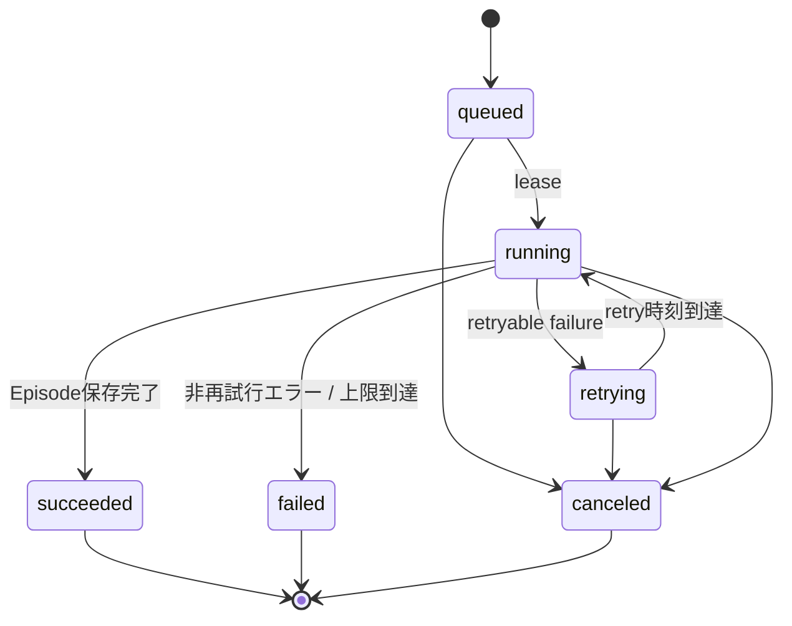
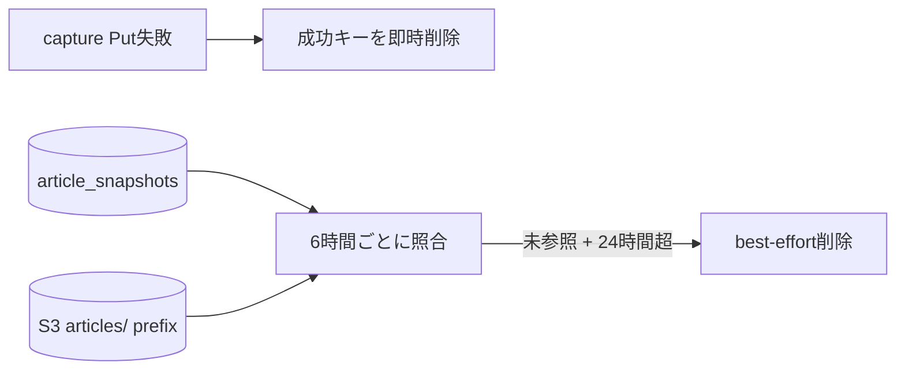
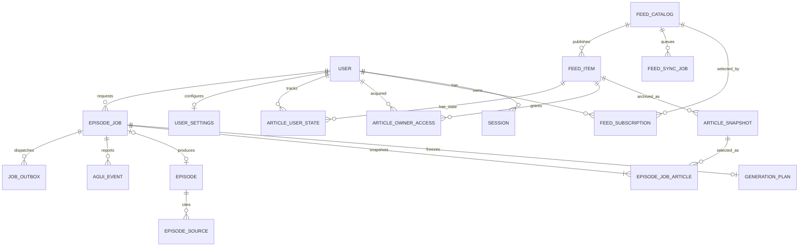

# システムアーキテクチャ

- 更新日: 2026-08-16
- 対象: 関数型マイクロサービス（旧実装削除済み）
- 関連文書: [詳細設計](design.md) / [移行ガイド](functional-ddd-migration.md) / [ADR](adr/) / [開発ガイド](development.md)

## 1. 全体像

本システムは、任意RSSを購読して新着記事を静的Webアーカイブへ保存し、ownerが選択した版固定済み記事から出典付きPodcastを制作する**関数型マイクロサービス**である。4 Bounded Contextを独立サービスとし、Gatewayとサービス間はNATS RPC、ProductionからLibraryへの完成通知だけをJetStream eventで伝える。本文・asset・音声はSeaweedFSへ保存する。

設計の軸は次の4点である。

> 正本は`services/*`、`apps/gateway`、`packages/kernel`、`packages/protocols`である。旧runtime、共有package、Cloud adapter、汎用Agent sandboxは物理削除済みで、後方互換経路は持たない。

| 設計方針 | 要点 |
| --- | --- |
| DDD | 認証、購読、番組生成、ライブラリを業務上の境界として捉える |
| オニオンアーキテクチャ | 外側の技術から内側の業務ルールへ一方向に依存する |
| Ports and Adapters | DB、LLM、RSS、TTS、音声保存をポート越しに差し替える |
| 非同期処理 | Gatewayはジョブを受け付け、Episode Productionが取得・台本・音声・保存を実行する |



## 2. ドメイン境界

業務規則は次の4 Bounded Contextが所有し、Contextごとに独立サービスとして配備する。Context間でdomain型やDBを共有しない。

| 境界づけられた領域 | 責務 | 主なデータ・操作 |
| --- | --- | --- |
| Identity & Access | ログイン、セッション、主体の特定 | Better Auth、Google OIDC、Actor |
| Content Knowledge | RSS購読、記事snapshot、安全なreplay、Markdown | Feed、Subscription、ArticleSnapshot、ArchiveAsset |
| Episode Production | 生成要求、GenerationPlan、構造化生成、AG-UI進捗、状態遷移 | EpisodeJob、GenerationPlan、Script、Audio |
| Episode Library | 完成番組、出典、所有者別アクセス | Episode、EpisodeSource、内部短期音声URL |

重要な不変条件は以下である。

- `ownerId` はセッションから導出し、URLやリクエスト本文から受け取らない。
- ジョブ作成は `owner + operation scope + Idempotency-Key` で一意。同じscope・キーと異なる入力の組み合わせは競合とする。retry scopeは元job IDを含み、作成操作や別jobのretryと衝突しない。
- 失敗ジョブの手動retryは新しいjobを作る。retry APIでキーを省略した呼び出しは毎回一意なキーをGatewayが発行し、明示キーの再送だけは既存jobの現在状態へ収束させる。
- 手動生成は選択記事IDを必須とする。定期生成は記事IDなしでjobを作り、worker開始時の最新InterestProfileから選定したGenerationPlanをfirst-write-winsで固定する。
- 台本が返す出典URLは、ownerが選択しContentが版固定した入力記事だけを許可する。
- 番組、ジョブ、購読の検索はDB queryの時点で所有者を絞る。
- 署名付き音声URLは永続化・公開せず、Gatewayがアクセス要求ごとに内部発行してRange streamする。

## 3. レイヤー構成と依存方向

### 3.1 ディレクトリと責務

| パス | レイヤー | 現在の責務 |
| --- | --- | --- |
| `apps/gateway` | Presentation / Integration | Effect HttpApi、認証proxy、NATS RPC adapter、OpenAPI正本 |
| `apps/watchdog` | Operations | 全service health/freshness監視、Prometheus metrics、SMTP/構造化log通知state |
| `apps/web` | Presentation | React、TanStack Router/Query、生成OpenAPI client |
| `services/*` | Bounded Context | service内のdomain、application、adapter、runtime |
| `packages/kernel` | Shared Kernel | Context非依存のimmutable primitive |
| `packages/protocols` | Integration Contract | version付きNATS RPC/event Schema |
| `packages/contracts` | Published Contract | Gateway HttpApiから生成したOpenAPI JSONとTypeScript型 |
| `packages/ai-runtime` | Cross-cutting AI Adapter | Effect AI OpenAI Layer、制限、redaction、失敗変換 |
| `packages/ui` | Presentation Shared | shadcn/Base UIベースの共通UI部品とtoken |
| `packages/observability` | Cross-cutting Adapter | OpenTelemetry契約、Node adapter、privacy filter |
| `packages/service-runtime` | Cross-cutting Runtime | named health、signal/fatal error、期限付きgraceful shutdown |
| `packages/nats-runtime` | Integration Runtime | 共通NATS RPC transport、逐次delivery隔離、terminal通知 |
| `infra` | Deployment / Operations | Node image、Collector、Grafana/Prometheus/Loki/Tempo設定・dashboard・alert |

### 3.2 package依存関係



HTTP契約の正本は`apps/gateway/src/contract.ts`であり、`packages/contracts`のOpenAPIとWeb用TypeScript型を生成する。Gatewayは生成契約とScalar API Referenceを読み取り専用で配信する。Webはservice実装やdomain型ではなく、公開契約だけに依存する。

### 3.3 service構成

Bounded Contextと配備サービスは1対1にし、純粋な中核と実行shellを別top-level directoryへ分散させず、同じ所有単位へコロケーションする。Context間はdomain型をimportせず、version付きNATS protocolだけで通信する。

```text
apps/
  gateway/                  # 外部Effect HttpApi / OpenAPI
  web/
  watchdog/
services/
  identity-access/src/{domain,application,adapters,runtime}
  content-knowledge/src/{domain,application,adapters,runtime}
  episode-production/src/{domain,application,adapters,runtime}
  episode-library/src/{domain,application,adapters,runtime}
packages/
  protocols/                # NATS RPC/event Schema
  contracts/                # Gateway HttpApi/OpenAPI生成物
  observability/            # OTel contractとEffect Layer
  service-runtime/          # process supervisorとnamed health
  nats-runtime/             # NATS transportとdelivery隔離
  kernel/                   # Context非依存の最小primitive
```



各service内の依存は`runtime/adapters → application → domain`のみとし、package export、lint、architecture testで逆向きimportとContext横断importを拒否する。各RPC serviceは全subjectを1本のNATS接続とcapacity 1の逐次loopへ束ねる。delivery失敗は共通loop内で隔離し、購読終了などのruntime terminalだけを共通Supervisorへ伝える。terminal時のdrainは期限付きで、失敗またはtimeout時は強制closeしてCompose再起動を妨げない。詳細は[ADR-0033](adr/0033-colocate-bounded-context-with-service.md)と[ADR-0052](adr/0052-rpc-failure-isolation-and-self-healing-runtime.md)を正本とする。

### 3.4 型と副作用の境界



`parse, don't validate`を適用し、検査結果をBooleanで返して元の型を使い続けるAPIは作らない。外部入力、永続JSON、NATS messageは`unknown`として受け、余剰propertyも拒否する共通parserの成功値だけを内側へ渡す。job状態はdiscriminated unionで表し、例えば4回目の`Running`を`Retrying`へ渡せないことを型で保証する。詳細は[ADR-0034](adr/0034-functional-domain-model-and-effect-boundaries.md)を正本とする。

NATS RPCは共有payload schemaを`messageEnvelope`で包む。受信時にproducer、actor種別/Service名、correlation、causationを共通policyで照合する。解析不能な外側envelopeへは返信せず、client timeoutを503へ畳む。NATS認証/ACLを使わない開発構成ではproducerとactorの同時偽装が残存する（[ADR-0045](adr/0045-shared-rpc-envelope-and-peer-policy.md)）。

### 3.5 完成状態

| Surface | 状態 | 現在の証拠 |
| --- | --- | --- |
| immutable kernel / protocol | Done | strict parse、deep freeze、correlation envelope、version付きsubject |
| 4 Context services | Implemented | `services/*/src/{domain,application,adapters,runtime}`、service別所有state |
| SQLite/NATS runtime | P0 done | 共通single-writer隔離、Production outbox/Library inbox、durable consumer、named readiness、Compose self-healing |
| Grafana相関監視 | P0 done | 8 dashboard、Gateway Browser OTLP proxy、Episode state metrics、LGTM provisioning、smoke script |
| Effect HttpApi Gateway | Done | 公開API parity、認証proxy、Gateway OpenAPI、functional E2E |
| Web生成client | Done | Gateway生成型とproxyへ切替、Web E2E 13/13 |
| state backup/recovery | Implemented | service種別検証、online backup、検証restore、rollback drill |
| 旧実装 | Removed | source、workspace、Docker、CI、文書から物理削除 |

削除内容と最終gateは[移行ガイド](functional-ddd-migration.md)を参照する。

## 4. 主要なシステムフロー

### 4.1 手動生成



定期生成も同じ `CreateEpisodeJob` を `trigger=scheduled` で呼ぶ。Episode ProductionのschedulerはIANA time zoneでdue設定を問い合わせ、`scheduled:{localDate}`の冪等keyで同じローカル日付の二重生成を防ぐ。Identityの完了日はjob作成成功後だけ進める。

completion consumerはLibrary保存transactionが成功してからACKする。DB保存失敗は上限付き指数backoffでNACKし、JetStream側では再配送を打ち切らない。設定済み回数は停止上限ではなくerror通知の開始閾値である。JSON・protocol・domain契約違反はACKして破棄し、poison payloadの無限再配送を防ぐ。詳細は[ADR-0070](adr/0070-recover-episode-completion-after-redelivery-threshold.md)を正本とする。

### 4.2 生成パイプライン

```mermaid
flowchart LR
  Lease["Job lease"] --> Plan["latest InterestProfile → immutable plan"]
  Plan --> Input["版固定記事snapshot"]
  Input --> Script["Effect AI structured generation"]
  Script --> Verify["strict schema・入力出典・上限を検証"]
  Verify --> Dictionary["owner辞書抽出・job snapshot"]
  Dictionary --> TTS["読み置換後にVOICEVOXでWAV生成"]
  TTS --> Store["音声を保存"]
  Store --> Commit["Episode・出典・Jobをcommit"]
```



外部provider由来の一時障害は設定済みの指数backoffと総経過時間で再試行する。初回を含めjobは最大4回試行し、DB制約も5回目のleaseを拒否する。既定300秒leaseは60秒ごとに更新し、全状態変更とEpisode確定をlease tokenでfenceする。停止したprocessのjobは期限後に再取得し、検証済み台本・採用source snapshot provenance・音声checkpointから再開する。台本checkpointがあるretryでは最新記事を再materializeせず、生成時のsnapshotをcompletionまで維持する（[ADR-0067](adr/0067-bind-script-checkpoints-to-source-snapshots.md)）。台本、各provider request、job、応答byteには上限を設ける。

外部契約はコード変更より先に公式仕様・稼働version/digest・匿名化した実応答を照合する。containerは検証済みdigestへ固定し、OpenAI alias変更は台本/補完の両smokeを必須にする（[ADR-0046](adr/0046-evidence-first-external-provider-contracts.md)）。

### 4.3 ジョブ状態



`running`中のstageは`selecting_articles`、`materializing_articles`、`generating_script`、`preparing_pronunciation`、`synthesizing_audio`、`storing_episode`に限定する。

### 4.4 記事archive objectの回収



SQLiteのsnapshot IDを参照正本とし、in-flight captureは保持期間で保護する。削除失敗はcapture結果やservice readinessを上書きせず、件数だけを`object.cleanup`とstructured logへ記録して次周期で再試行する。

## 5. データ設計



| データ | 設計上の意味 |
| --- | --- |
| `feed_catalog` / `feed_subscriptions` | 共通の媒体カタログとユーザーの選択を分離 |
| `feed_sync_jobs` | feedごとのRSS同期lease、状態、試行回数、発見・archive結果。個別記事失敗はdegradedな成功として保持し、feed取得失敗だけを試行上限へ数える |
| `feed_items` / `article_snapshots` / `archive_assets` | RSS記事、版固定したHTML・Markdown、ObjectStore資産metadata |
| `article_owner_access` | 購読解除後も残る、ownerが一度取り込んだ記事への恒久アクセス権 |
| `article_owner_states` | ユーザーごとの既読・保存状態 |
| `episode_jobs` / `episode_generation_plans` / `episode_job_articles` | 状態、lease、retry、冪等性、初回実行時に固定した嗜好・記事集合 |
| `episodes` / `episode_sources` | 台本・音声keyと、`articleId`・snapshot・入力RSSへ遡れるprovenance。legacy sourceだけ`articleId`がnullable |
| `episode_job_agui_events` | 公式AG-UI event envelopeを保存する再開可能な進捗ログ |
| `user_settings` | 日次生成の有効化、local time、IANA time zone、最終実行日 |
| `content_enrichment_daily_progress` | ownerとUTC日付ごとのAI記事補完使用量。別ownerの枯渇・リセットから分離 |
| `job_outbox` | Productionが完成eventをJetStreamへ確実に配信するtransactional outbox |
| Better Auth tables | user、session、account、verification |

SQLiteはforeign key、WAL、5秒のbusy timeout、`BEGIN IMMEDIATE` transactionを使用する。音声本体はDBへ格納せず、DBにはstorage keyとbyte lengthだけを保持する。

DBアクセスは全service で **Drizzle ORM** に統一する（[ADR-0043](adr/0043-drizzle-persistence-and-migrations.md)）。

| 関心事 | 置き場所 |
| --- | --- |
| table定義 | `services/<svc>/drizzle/schema.ts` |
| migration | `services/<svc>/drizzle/migrations/` — schemaの唯一の所有者 |
| 接続確立・PRAGMA・span属性 | `@news-podcast/persistence` |
| driver接触面 | `services/<svc>/src/infrastructure/unsafe/drizzle/open.ts` |
| query | `services/<svc>/src/adapters/persistence/<集約>/` |

接続はservice processにつき1本である。起動時DDL（`CREATE TABLE IF NOT EXISTS`）は存在せず、`bootstrap.ts` がmigrationを適用する。testも本番と同一のmigrationでDBを構築するため、test用schemaが本番から乖離する余地はない。

drizzle-kitが生成できない `STRICT` はmigration SQLへ手で追記し、`sqlite_master` を検査する `schema.test.ts` で固定する。

`episode_jobs`はjob状態機械を実カラムへ正規化しており、状態更新と`episode_job_agui_events`追記はtriggerではなく書き込み側が同一transactionで行う（[ADR-0044](adr/0044-normalized-episode-job-state.md)、[ADR-0058](adr/0058-durable-ag-ui-episode-progress.md)）。

## 6. 実行環境

supported runtimeはNode self-hostだけである（[ADR-0039](adr/0039-support-node-self-host-runtime-only.md)）。

| 能力 | supported構成 |
| --- | --- |
| Web / Gateway | Nginx static + same-origin proxy / React / Effect HttpApi on Node |
| 業務service | Identity、Content、Production、LibraryのNode process |
| DB / messaging | service別SQLite / NATS JetStream |
| object / TTS | SeaweedFS S3 / VOICEVOX |
| 起動定義 | `compose.yaml` |

Cloudflare/D1/R2/Queues runtimeは実装しない。再導入する場合は、事業要件、owner、contract suiteを揃えた後続ADRで新規設計する。

## 7. 横断設計

| 関心事 | 方針 |
| --- | --- |
| 認証 | Better Authのsession cookie。Google OIDCはログイン上流であり、Google tokenをAPI bearerとして扱わない |
| 認可 | 全 `/v1` resourceをowner scopeで検索し、他人のIDと存在しないIDをともに404へ正規化 |
| API契約 | Effect HttpApi code-first OpenAPI、RFC 9457 Problem Details、生成型の差分検査 |
| 可観測性 | OpenTelemetryでlogs/traces/metricsを統一し、CollectorからPrometheus/Loki/Tempoへ送りGrafanaで相関する。BrowserはGatewayの相対OTLP proxyを経由し、Collector originを公開しない。span metricsとservice graphを生成し、exemplar、trace ID、span IDでmetrics↔traces↔logsを往復できるようにする。自動計装（http/undici）に加えてNATS、outbox/inbox、DB、providerの意味的spanを作る。W3C trace headerの注入は管理先allowlistへ限定する |
| Privacy | user ID、認証情報、RSS本文、台本、音声内容、完全URLをtelemetryへ送らない |
| 障害分離 | telemetry障害でAPIや生成処理を停止しない。計装欠落は非本番で`assertActiveSpan`がfail-fastし、本番は`synthesized`カウンタとruleで監視する。processクラッシュは構造化log + `process.error` + flush後にexit(1)し、有界実行の回収（ADR-0016）へ委ねる。エラー詳細はredact済み`error.message`をlogs/spansへ記録し、metricsは低cardinality属性に限定する。外部provider障害はjob retryへ変換する |
| テスト | Domain 100%、Application fake、Adapter契約、API/OpenAPI、Web unit/visual/E2Eをレイヤー別に実施 |

## 8. 設計上の注意点

| 項目 | 現在の判断 | 再検討条件 |
| --- | --- | --- |
| Domain model | 各service内で必要な不変条件だけを純粋関数として表す | 規則増加時に同じservice内で昇格する |
| 一般Agent/Web検索 | 実装しない | 品質要件、出典保存、費用・latency SLOが揃う |
| Cloud runtime | 実装しない | Cloud固有要件と同一contract suiteが揃う |

サービス境界は文書、protocol、architecture testで維持する。独立scaleや組織所有境界が変わった場合は後続ADRで分割を再検討する。

## 9. 重要な設計判断

- [ADR-0001: DDDとオニオンアーキテクチャ](adr/0001-ddd-onion.md)
- [ADR-0002: OpenAPI RESTと非同期ジョブ](adr/0002-openapi-async-jobs.md)
- [ADR-0003: SQLite/DockerとD1/Cloudflare](adr/0003-dual-runtime.md)
- [ADR-0043: Drizzle ORMへの統一とmigration導入](adr/0043-drizzle-persistence-and-migrations.md)
- [ADR-0044: episode_jobs状態の正規化](adr/0044-normalized-episode-job-state.md)
- [ADR-0004: 外部VOICEVOX](adr/0004-external-voicevox.md)
- [ADR-0045: RPC返信封筒とpeer policy](adr/0045-shared-rpc-envelope-and-peer-policy.md)
- [ADR-0046: 外部provider契約の実証](adr/0046-evidence-first-external-provider-contracts.md)
- [ADR-0005: Better AuthとGoogle OIDC](adr/0005-authentication.md)
- [ADR-0007: 事実ベース台本と出典追跡](adr/0007-factual-provenance.md)
- [ADR-0008: Hono code-first OpenAPI](adr/0008-hono-code-first-openapi.md)
- [ADR-0009: TanStack Router/Query](adr/0009-async-react-tanstack.md)（ADR-0047が置き換え）
- [ADR-0047: Async UIの責務を宣言的な仕組みへ固定する](adr/0047-declarative-async-ui-responsibilities.md)
- [ADR-0032: Grafana相関監視基盤](adr/0032-grafana-correlated-observability.md)
- [ADR-0048: Grafana LGTM向けプロジェクト単位MCP](adr/0048-grafana-mcp-observability.md)
- [ADR-0052: RPC障害隔離と自己回復可能なサービスランタイム](adr/0052-rpc-failure-isolation-and-self-healing-runtime.md)
- [ADR-0040: 全経路Observabilityと再起動検証](adr/0040-full-path-observability-validation.md)
- [ADR-0041: RSS同期を永続キューで実行し購読直後に起動する](adr/0041-durable-rss-sync-queue.md)
- [ADR-0042: 構造化入力を著名なパーサーとAST pipelineで処理する](adr/0042-structured-input-parser-boundaries.md)
- [ADR-0011: SeaweedFSとS3互換ObjectStore](adr/0011-s3-compatible-object-storage.md)
- [ADR-0012: RSS Readerと安全なWebアーカイブ](adr/0012-rss-reader-web-archive.md)
- [ADR-0013: Agent主導のPodcast生成](adr/0013-agent-directed-episode-production.md)
- [ADR-0015: Firecracker隔離型Agent Harness](adr/0015-firecracker-agent-harness.md)
- [ADR-0025: 自動計装を正本とするトレース保証](adr/0025-automatic-instrumentation-and-trace-guarantee.md)
- [ADR-0033: Bounded Contextとサービスのコロケーション](adr/0033-colocate-bounded-context-with-service.md)
- [ADR-0034: 関数型ドメインモデルとEffect境界](adr/0034-functional-domain-model-and-effect-boundaries.md)
- [ADR-0038: 保存済み出典による有界な構造化生成](adr/0038-bounded-structured-production-generation.md)
- [ADR-0067: 台本checkpointを生成元snapshotへ固定する](adr/0067-bind-script-checkpoints-to-source-snapshots.md)
- [ADR-0068: 個別記事の同期失敗をfeed継続性から分離する](adr/0068-isolate-feed-item-sync-failures.md)
- [ADR-0069: 購読と過去記事への恒久アクセス権を分離する](adr/0069-separate-subscription-from-article-access.md)
- [ADR-0070: Episode完了配送の監視閾値と復旧上限を分離する](adr/0070-recover-episode-completion-after-redelivery-threshold.md)
- [ADR-0039: Node self-host runtimeだけをsupport](adr/0039-support-node-self-host-runtime-only.md)
