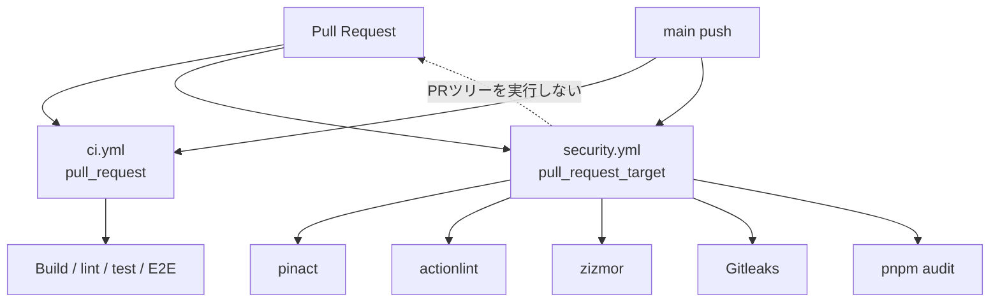

# CIとサプライチェーン防御

GitHub Actionsは、通常の品質検査と、PRから隔離したセキュリティ検査を分離する。



## 必須チェック

| Check | 内容 |
| --- | --- |
| `CI / static` | format、lint、typecheck、build、契約、Compose、Storybook |
| `CI / unit` | unit/integration test、functional coverage |
| `CI / web-e2e` | fake providerを使うPlaywright E2E |
| `CI / visual` | desktop/mobile visual regression |
| `CI / functional-e2e` | Docker上のNATSとbackend縦断E2E |
| `CI / observability` | fake observed stack、Collector、Grafana、service graph |
| `CI / security` | Action固定、workflow lint、zizmor、秘密情報、依存脆弱性 |

`main`のRulesetでは7つすべてをrequired status checkにする。live OpenAI、VOICEVOX、Google OAuth、SMTPなどの資格情報はCIへ渡さない。

observability smokeはCIでhermeticなdev loginから認証済みfeed subscription APIまでの実サービスフローを通し、続けて機密情報を含まないOTLP client/server traceをCollectorへ送る。これにより、アプリの計装結果だけに依存せず、Collectorのservice graph契約も検証する。service graphのstore TTL（30秒）、metric flush（15秒）、remote write遅延を考慮してPrometheusにsynthetic edgeが現れるまで最大90秒待ってから判定する。ブラウザジョブは`web` workspaceから次のコマンドでChromiumとOS依存パッケージを準備する。

```bash
pnpm --filter web exec playwright install --with-deps chromium
```

visual regressionは実行環境の日本語フォント差を避けるため、`@fontsource-variable/noto-sans-jp@5.3.0`をUIへ同梱する。

snapshot比較ではフォントのアンチエイリアスによる小さな差だけを`maxDiffPixelRatio: 0.04`まで許容する。フォント欠落、大きなレイアウト差、表示内容の変更は引き続き失敗する。snapshot更新は原因を確認した対象ファイルだけに限定する。

## セキュリティworkflowのtrust boundary

`security.yml`は`pull_request_target`でベースブランチのworkflowを実行する。PRのheadはcheckoutせず、GitHub APIから取得したtarballを静的解析の入力としてだけ扱う。

- PR由来のJavaScript、shell、Docker Compose、package lifecycle scriptは実行しない
- `ci.yml`と`security.yml`がPRから削除されていれば検査を失敗させる
- pinactとzizmorの設定はベースブランチのファイルを使用する
- PR依存関係を調べる場合も`pnpm install --ignore-pnpmfile --ignore-scripts --frozen-lockfile`だけを実行する
- Secrets、書き込み可能なGITHUB_TOKEN、`security-events: write`を使わない

## Action固定と更新

workflow内の`uses:`は、リリースの40文字コミットSHAと`# vX.Y.Z`コメントで固定する。`.pinact.yaml`は7日間のminimum release ageを要求する。

```bash
# pinact v4.1.1を公式releaseからchecksum検証してPATHへ配置した後
pinact run --update --min-age 7
git diff -- .github/workflows
pinact run --check --verify-comment --verify-min-age --min-age 7
```

更新はDependabotの週次PR、またはレビュー済みの手動PRで行う。CIは自動修正・自動mergeをしない。Actionの許可リストは次の5つに限定する。

- `actions/checkout`
- `actions/setup-node`
- `actions/upload-artifact`
- `pnpm/action-setup`
- `zizmorcore/zizmor-action`

## ローカル検証

```bash
pnpm install --frozen-lockfile
pnpm format:check
pnpm lint
pnpm typecheck
pnpm test
pnpm test:e2e
pnpm test:e2e:functional
pnpm test:visual
pnpm observability:validate
pnpm audit --audit-level=high
```

`pnpm test:visual`はPlaywright公式コンテナの中で実行するためDockerを必要とする。CIも同じイメージ(digest固定)をjobのcontainerとして使い、スナップショットの環境差を無くしている。イメージのversionは`apps/web`の`@playwright/test`と揃えること。

Dockerを使うobservability smokeをローカルで初めて実行する場合は、先に`pnpm setup:env`で`.env`を生成する。CIも同じスクリプトで一時的な開発用secretを生成し、実シークレットを使わない。

security workflowの検査ツールは公式release assetをダウンロードし、固定したSHA256 checksumを検証する。Gitleaksの結果や診断artifactへ実シークレットを出力しない。

## GitHub設定

Repository Settingsで次を設定する。

1. ActionsのデフォルトGITHUB_TOKEN権限をread-onlyにする
2. Actionsの許可対象を上記allowlistへ制限する
3. `main`への直接pushを禁止し、PR、approval、branch up-to-date、7つのrequired checkを要求する
4. workflowとsecurity policyの変更にreviewerを要求する

現在のリポジトリはprivate・個人所有のため、GitHub.comのSecret Scanning/Push Protectionの対象外である。当面はrequiredなGitleaksで検査する。public化、対象組織への移管、またはGitHub Secret Protectionの利用開始後に、Secret ScanningとPush Protectionを有効化する。
