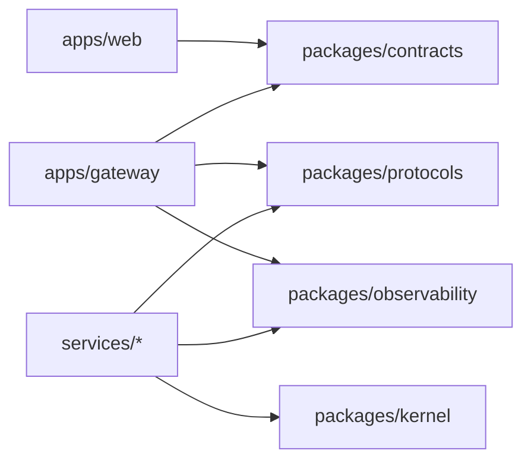
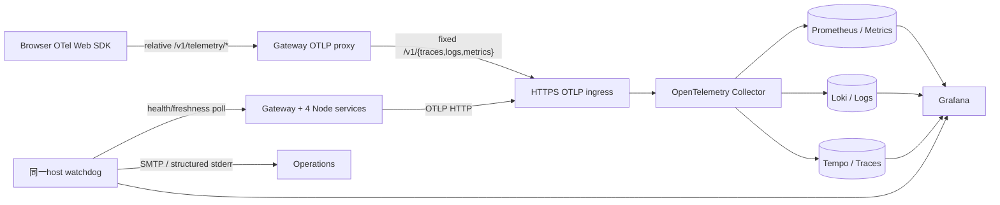
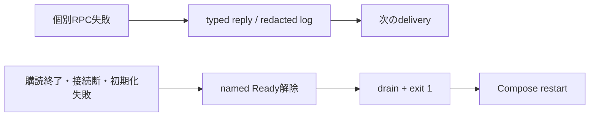
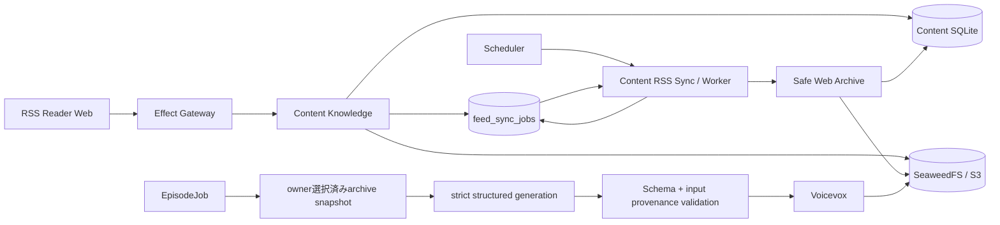
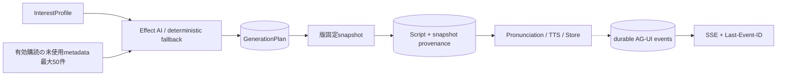
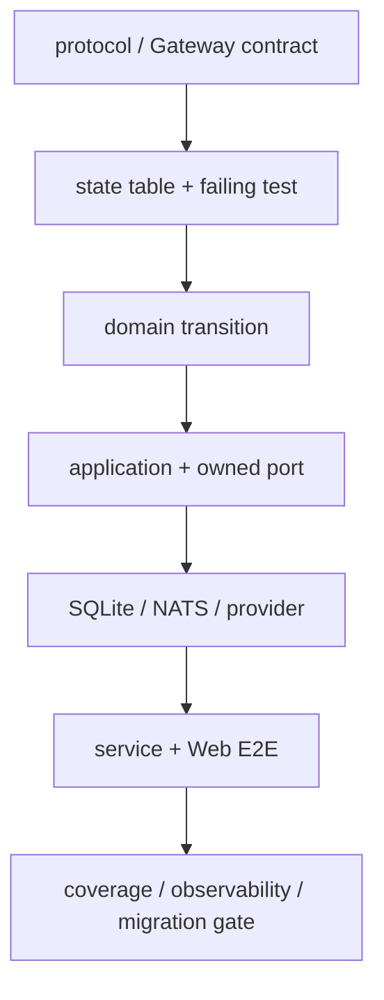

# RSSニュース・ポッドキャスト 設計書

- 状態: 関数型マイクロサービス移行・旧実装削除完了
- 更新日: 2026-08-23
- 契約の正本: `apps/gateway` のEffect HttpApi
- Context間契約: `packages/protocols` のEffect Schemaとversion付きNATS subject
- RPC返信: 共有payload schemaの`messageEnvelope`。producer/actor/correlation/causationを共通policyで照合
- 生成契約: Gateway HttpApiから生成するOpenAPI
- 判断記録: `docs/adr/`

## 1. 目的と実装範囲

RSSからニュース項目を取得し、ownerが選択した版固定済み記事から出典を追跡できる台本を生成し、VOICEVOXで音声化してWebで配信・再生する。重い処理は非同期ジョブとし、Node self-host runtimeだけをsupportする。

実装範囲はGateway、4 Context services、Web、service別state、配備・観測基盤である。公開ユースケースは、ログイン後のRSS購読・記事管理・個人設定、手動または定期生成、進捗/再試行/取消、完成音声と出典の再生に確定した。

## 2. 確定事項

- Web: Vite / React / TypeScript / Tailwind CSS / shadcn/ui neutral / Base UI。
- API: Effect HttpApi、code-first OpenAPI。
- 認証: Better Authのアプリセッション。初期ログインはGoogle OIDCで、将来ほかのOIDCを追加可能にする。
- session終了: serverの終了成功後だけ、再生・owner依存Jotai/localStorage・Query cacheを破棄してlogin documentへ置き換える。失敗時は認証済みstateを保持して再試行する（[ADR-0078](adr/0078-terminate-session-before-clearing-owner-state.md)）。
- ニュース源: RSSのみ。初期カタログはZenn、azukiazusaさんの技術ブログ、Hacker News。媒体カタログとユーザー購読は分離する。
- AI: Effect AI + `@effect/ai-openai`のstrict structured outputを正本とする。OpenAI `gpt-5.6-luna` が既定で、base URLとモデルIDは環境変数で差し替える。キーなしでビルド・テストできる。
- TTS: 外部VOICEVOX Engine。既定キャラクター名は「ずんだもん」。数値style IDは起動中Engineの `/speakers` から解決し、固定しない。
- runtime: Docker Compose、Nginx edge、service別SQLite、NATS JetStream、SeaweedFS、VOICEVOX。
- Cloudflare runtimeは実装しない（ADR-0039）。
- 非同期生成: `POST /v1/episode-jobs`、`202 Accepted`、`Location`、`Idempotency-Key`、状態 `queued/running/retrying/succeeded/failed/canceled`。

## 3. モジュールと依存方向

service構成は[システムアーキテクチャ](architecture.md) §3、型・副作用境界は[ADR-0034](adr/0034-functional-domain-model-and-effect-boundaries.md)を正本とする。



各service内の依存は`runtime/adapters → application → domain`だけにする。DomainはHTTP、DB、OpenAI、VOICEVOXを知らず、Applicationがportを所有する。WebはOpenAPIから生成した型だけをHTTP契約として使う。

### 境界づけたモジュール

| モジュール        | 所有する規則                   | 主な外部seam                                       |
| ----------------- | ------------------------------ | -------------------------------------------------- |
| IdentityAccess    | セッション主体、認可           | Better Auth、Google OIDC                           |
| FeedManagement    | 媒体カタログ、所有者別購読     | FeedReader                                         |
| EpisodeProduction | ジョブ、GenerationPlan、構造化生成、冪等性、出典、AG-UI進捗 | LanguageModel、SpeechSynthesizer、JobDispatcher |
| EpisodeLibrary    | 所有者別一覧、音声アクセス、原稿と出典の提示 | ObjectStore、短期URL発行                  |

## 4. 非同期パイプライン

1. 認証済みユーザーが `Idempotency-Key` 付きで生成ジョブを作成する。
2. APIは `owner + method + canonical route + key` を一意に保存し、同一request hashなら同じreceiptを返す。異なるhashなら409にする。
3. Episode Productionはジョブをleaseして `queued -> running` へ遷移する。
4. 実行開始時に最新InterestProfileと候補metadataから`GenerationPlan`をfirst-write-winsで固定し、その記事snapshot取得、台本生成、独立quality gate、VOICEVOX合成、音声保存を順に実行する。quality rejectはcheckpoint前のterminal failureとし、音声化・公開しない。
5. 成功時はfenced transactionでEpisodeを一度だけ関連づけて `succeeded`、失敗時は共有`EpisodeFailureCode`だけを持つfailureへ `failed`。RPC/Gatewayはrolling deployment中の未知コードをboundedな文字列として中継する。Webは既知コードを利用者向け説明と`retry / reselect / admin`へ変換し、未知コードでは上流messageを表示せず安全な汎用文言とjob IDを示す。内部コードとjob IDはlog/traceに保持し、job IDをmetric属性へ入れない（[ADR-0083](adr/0083-share-episode-failure-code-contract.md)）。terminal状態からは遷移しない。
6. 完成eventはoutboxへ原子的に記録し、JetStreamへ再送する。Libraryはdurable consumerとinboxで重複配送を吸収する。
7. Webはjobの`succeeded`を生成完了として受け取った後、`episodeId`の詳細がLibraryから読めるまで初回を含む最大5回・500ms間隔で確認する。確認中は再生可能な「完成」と区別し、上限到達後は利用者の再確認操作で回復できる。

日次予約はjob受付では完了しない。`scheduled:{ownerId}:{localDate}`をschedule intentの相関キーとして、active jobは`retrying`、Episode完成は`succeeded`、利用者cancelと回復対象外の終端失敗は`missed`として調整する。候補記事なしは同じjobを再queueし、後続feed同期後に同日中の生成へ回復する。REST/Webと`episode.schedule.outcomes` metricはこの3状態を同じ語彙で示す。詳細は[ADR-0074](adr/0074-complete-daily-schedule-on-terminal-outcome.md)を正本とする。

RSS購読登録も非同期境界を持つ。Content Knowledgeは`feed_sync_jobs`へfeedごとに1件のjobを保存し、`queued -> processing -> succeeded / failed`をlease tokenでfenceしたworkerで進める。claim・完了ごとに現在時刻を再取得し、期限切れleaseのworkerによる完了上書きを拒否する。購読登録時はpollerへwake通知を送り、既定5分の定期cycleを待たずに初回同期を開始する。所有者は`POST /v1/me/feed-subscriptions/{subscriptionId}/sync`で有効な購読を同じキューへ再投入でき、失敗後の再試行や最新RSSの確認を明示的に開始できる。feed取得・catalog永続化・worker基盤の失敗だけを`failed`として最大4回の試行上限へ数え、個別記事のvalidation・archive失敗は件数とerrorを持つdegradedな`succeeded`として試行回数を引き継がず、次回の定期同期を継続する。Webは`GET /v1/me/feed-sync-jobs`を表示し、処理中だけ状態と記事一覧を短い間隔で再取得する。degraded時は失敗記事数を警告し、runtimeは`rss.sync.degraded`、feed scope failureは`rss.sync.failed`を記録する。詳細は[ADR-0068](adr/0068-isolate-feed-item-sync-failures.md)を正本とする。

購読登録のHTTP入力はGatewayでWHATWG URLへ1回canonicalizeし、その結果にHTTP(S)・userinfoなし・fragmentなし・2,048文字以下を検証する。内部RPC/domain/DBはcanonical-onlyとし、`feed_catalog.feed_url`をfeed identity、`feed_subscriptions`をownerごとの購読状態として分離する。同値URLと同じownerは409 `feed_subscription_exists`へ収束し同期を再発火せず、削除後の再購読は同じfeedへ新しい購読を作る。pause/resumeはfeed identityを変えず`enabled`だけを扱う。取得不能と非RSS/Atom応答は非同期同期jobのsanitized reasonとしてWebに区別表示する（[ADR-0087](adr/0087-canonicalize-feed-url-at-http-boundary.md)）。

RSS記事の`articleId`は`feedId + GUID`で安定させ、capture intentだけをcanonical URL・title・published/updated時刻・本文系field（XHTMLのelement・属性を含む）のSHA-256 fingerprintでversion化する。同じ配送retryは既存snapshotへ収束し、同じGUIDの実更新はimmutable snapshotを追加してlatest参照を更新する。fingerprint列追加前の既存記事はlatest URL・title一致時に再取得せずbaseline化し、archive成功後だけfingerprintを進める。手動archiveはRPC message IDごとに明示refreshし、同じdelivery retryだけを冪等にする。詳細は[ADR-0073](adr/0073-version-article-capture-intents.md)を正本とする。

購読は将来の同期・自動生成・AI enrichment対象、`article_owner_access`はownerが一度取り込んだ記事への恒久的な参照権として分離する。RSS itemのcatalog登録時は有効な購読ownerだけへaccessを付与し、一時停止中のownerへ共有同期由来の新着を配布しない。再開時は停止中に保存されたitemを明示的にbackfillする。購読解除・一時停止では既存access、記事状態、snapshotを削除しないため、一覧・詳細・Markdown・手動生成の保存版出典は引き続き参照できる。一方、自動生成候補とAI queueは有効な購読とのjoinを維持する。詳細は[ADR-0069](adr/0069-separate-subscription-from-article-access.md)を正本とする。

任意登録feedはprivate-by-defaultとし、`/v1/feeds`はrequest owner自身が購読するfeedと`public_feed_listings`へ明示掲載したfeedだけを返す。query/path tokenを文字列判定やredactionで加工せず、DB可視性条件で別ownerから閉じる。既存feedはmigrationで公開推測せず全件privateにする。将来の公開化は、認証なしの取得可能性・credential非包含・owner同意を検証するworkflowができるまで提供しない（[ADR-0071](adr/0071-keep-user-registered-feed-urls-private.md)）。

AI記事補完のキュー、結果、タグ、日次AI試行枠はすべてowner単位である。workerはownerごとに`CONTENT_ENRICH_DAILY_LIMIT`の使用量を読み、枯渇したownerだけをskipして次のownerを処理する。本文・語彙・profile・入力schemaを検証した後、provider送信の直前にlive leaseと残枠を同じtransactionで検査し、`(owner_id, UTC local_date)`へ有料試行を予約する。OpenAI adapterは内部retryをせず、1予約を1 HTTP requestへ固定する。成功だけでなく429、timeout、不正応答も1試行を消費する一方、送信前失敗と期限切れleaseは消費しない。日次枠resetはContent KnowledgeのRPC境界で既定拒否し、非productionでserver flagを明示した場合だけactor自身のowner枠へ許可する。予約・枯渇とresetの成功・拒否を低cardinality metricへ記録する。所有境界は[ADR-0063](adr/0063-scope-enrichment-daily-budget-by-owner.md)、試行契約は[ADR-0084](adr/0084-reserve-paid-enrichment-attempts.md)、reset認可は[ADR-0076](adr/0076-fail-closed-enrichment-budget-reset.md)を正本とする。

Episode Productionのloopは単一flightで動く。leaseは期限切れRunning、dueなRetrying、Queuedの順に優先し、同一状態では`leasedUntil`、`retryAt`、`enqueuedAt`の昇順、同時刻だけ`jobId`で決定する。選択したready時刻はqueue wait計測にも使い、oldest ageと実行順を一致させる。すべての更新とEpisode確定はstatus・token・期限でfenceし、初回込み4回、job 30分、台本6,000文字、chunk 16 MiB、完成音声128 MiBをSQLite制約とruntimeの両方で強制する。OpenAI、VOICEVOX、ObjectStoreへ同じAbortSignalを伝播し、cancel・lease喪失・deadlineで外部処理も停止する。cancelは永続化後の同一process通知で即時abortし、別processはleaseを延長しないread-only checkで既定250ms・最大5秒以内に検知する。commit安全性の正本は引き続きSQLite fencingとする。詳細は[ADR-0016](adr/0016-bounded-observable-episode-execution.md)、[ADR-0072](adr/0072-propagate-episode-cancellation-immediately.md)、[ADR-0086](adr/0086-order-episode-leases-by-ready-time.md)を正本とする。

Content KnowledgeとEpisode Productionのprovider modeは共有runtime parserで決定する。productionは厳密な`APP_ENV=production`、`PROVIDER_MODE=live`、必須key/modelの組み合わせだけを受理し、未指定・fake・未知値・大文字違いはReady前に拒否する。development/testのfakeは明示的なno-network境界として維持する。成功構成はsecretを含めず`app.env`と`provider.mode`をlog/metricへ記録する。詳細は[ADR-0077](adr/0077-fail-closed-production-provider-mode.md)を正本とする。

## 5. REST契約方針

- `/v1/feeds` は媒体カタログ、`/v1/me/feed-subscriptions` は現在ユーザーの購読。body/pathにuserIdを置かない。
- `/v1/me/settings` はGET/PATCHとし、Gatewayが各Contextのowner-scoped projectionを合成する。
- ジョブとエピソードはrepository query自体をownerで絞る。他人のIDと存在しないIDは404へ正規化する。
- 401はセッション欠落/失効、403は認証済みだが許可されない操作。エラーはRFC 9457 Problem Details。
- 一覧はopaque cursor、`limit` 1..100、安定順序、filterに束縛する。`totalCount`は初期契約に入れない。
  - 記事一覧`GET /v1/me/articles`は`cursor`クエリと`page.hasMore` / `page.nextCursor`で継続する。cursorは`(公開日時 ?? 発見日時, articleId)`のkeyset位置をbase64urlへ畳んだ不透明tokenで、Content Knowledgeだけが解釈する。OFFSETと違い、ページを跨いで記事が増減しても重複・欠落しない。復号できないcursorは不正要求として閉じる。
  - `q`はownerの記事全体をタイトル・出典URL・ownerタグ名と、決定的に選んだ最新snapshotの保存済みMarkdown本文でliteral部分一致する。本文はquery時にobjectを走査せず、durable queueが更新するFTS5 trigram（3文字以上）/short gram索引（1〜2文字）を使う。手動番組の記事選択は読み込み済みの先頭ページをクライアントで再検索せず、入力をdeferして同じAPIの先頭から再取得する。取得中は直前の候補を保持し、空結果と失敗は別状態として表示する。詳細は[ADR-0082](adr/0082-index-latest-article-markdown-for-search.md)を正本とする。
- 手動archive `POST /v1/me/articles/{articleId}/archive` は同期結果を返す。GatewayはContent captureと同じ30秒のend-to-end deadlineを送り、archive RPCだけ5秒の返信余裕を加えて待つ。Contentは期限切れ処理を中断してcommitしないため、Gatewayの失敗後にarchiveだけ成功する状態を作らない。詳細は[ADR-0065](adr/0065-bound-manual-archive-rpc-deadline.md)を正本とする。
  - S3の一部Put失敗は全Putのsettle後に成功キーをbest-effort削除する。process停止・DB commit失敗・Delete失敗は、SQLiteの`article_snapshots.snapshot_id`を参照正本とする定期照合で回収する。未参照でも24時間以内のobjectは in-flight capture 保護のため残す。詳細は[ADR-0066](adr/0066-reconcile-orphan-article-archive-objects.md)を正本とする。
- 保存replayは`GET /v1/me/article-snapshots/{snapshotId}/replay`でowner権限と存在を先に確認し、返されたsame-origin URLを`sandbox=""` iframeで開く。HTMLとassetの各readでも`article_owner_access`とsnapshot metadataを再照合し、Contentが発行した1分の内部署名URLをGatewayだけが使用する。HTMLは5 MiB、assetは20 MiB、保存時`Content-Length`完全一致を要求し、CSP `sandbox`/`default-src 'none'`、`nosniff`、`private, no-store`を付ける。取得失敗時は再試行とMarkdown fallbackを残す（[ADR-0079](adr/0079-deliver-owned-private-artifacts-through-gateway.md)）。
- Episodeへ署名URLを保存・公開しない。`GET /v1/episodes/{episodeId}/audio`はGatewayがowner認可後にprivate S3からRange streamし、`Cache-Control: private, no-store`を返す。
- Better Authの `/api/auth/**` はBetter Auth側の生成契約を正本とし、アプリOpenAPIへ複製しない。Google tokenを `/v1` のbearer tokenとして扱わない。

`POST /v1/episode-jobs` は手動生成を表し、重複のない1〜20件の`articleIds`を必須とする。重複IDはqueueへ入れる前にHTTP境界で拒否し、Episode ProductionのRPC境界でも同じ不変条件を再検証する。定期生成は記事IDなしの`automatic` jobを作成し、workerが最新InterestProfileを1回だけ読み、有効な購読に属する未使用記事を最大50件取得して1〜20件を選定する。成功済み自動GenerationPlanの記事は期限なしで候補から除外し、手動指定では再利用を許す。空profileではLLMを呼ばず媒体を跨ぐ決定論的fallbackを使う。`POST`の成功は現在のjob状態と`Location`を返し、冪等再送でもqueuedへ巻き戻さない。Webは記事選択を確定した論理送信ごとにkeyを1つ割り当て、receipt未確認の同一選択では再利用する。選択変更、dialog破棄、明示的新規生成だけがkeyを切り替える。failed jobの`POST .../retry`もkey必須で、同じsource jobへの曖昧な再送は同じkeyを使う。永続化境界はkeyを記録せず`accepted / replay / conflict`を観測する（[ADR-0085](adr/0085-bind-idempotency-keys-to-logical-generation-actions.md)）。`GET /v1/episode-jobs/{jobId}/events`はdurable AG-UI eventを100件ずつreplayし、`Last-Event-ID`以降をterminal状態まで追尾する。詳細は[進捗protocol](protocols/episode-job-ag-ui.md)を正本とする。`PATCH /v1/me/settings` は日次のlocal time、IANA time zone、有効/無効を更新する。

## 6. 配備トポロジー

| 能力 | supported Node self-host構成 |
| --- | --- |
| Web / API / service | Nginx static + same-origin reverse proxy / Effect Gateway + 4 Node Context services |
| DB / messaging | service別SQLite + NATS JetStream |
| Object / TTS | SeaweedFS S3 + VOICEVOX |
| Auth | Better Auth + Identity SQLite、Gateway固定origin proxy |

Cloudflare/D1/R2/Queuesは実装しない。再導入条件は[ADR-0039](adr/0039-support-node-self-host-runtime-only.md)を正本とする。

### 6.1 監視トポロジー



Domain/Applicationは監視実装を知らず、runtimeとadapterだけが`packages/observability`を使う。BrowserからGatewayまでの同期HTTPはW3C parentを継続する。生成要求時のcontextをジョブへ保存し、Productionは試行ごとの独立traceからenqueue spanへlinkする。OpenAI、VOICEVOX、S3はProduction trace内のclient spanで計測するが、管理外serviceへtrace headerを送らない。台本qualityはmodel・生成prompt version・quality prompt version・pass/reject・固定reasonだけをmetric/logへ記録し、記事と台本は記録しない。Collector障害時はtelemetryだけを有界queueから破棄し、API・生成処理を継続する。

Browserは匿名操作、例外、Web Vitalsだけを送り、通常traceを20% samplingする。OTLPはGatewayの相対proxyを通し、Collector originをBrowserへ公開しない。属性allowlistでユーザーID、入力、RSS・台本・音声内容、完全URL、認証情報を拒否する。job IDは生成trace/logだけで許可し、metric adapterが物理的に除去する。Collectorはspan metricsとservice graphを生成する。Grafana provisioningで8 dashboard、alert、metrics exemplar、trace-to-logs、logs-to-traceを管理する。watchdogは通常構成でも常駐し、SMTP完全設定時はメール、未設定時は構造化stderrへ通知する。DNTまたは設定OFFならSDKを開始しない。詳細は[ADR-0032](adr/0032-grafana-correlated-observability.md)、[ADR-0040](adr/0040-full-path-observability-validation.md)、[ADR-0048](adr/0048-grafana-mcp-observability.md)、[ADR-0052](adr/0052-rpc-failure-isolation-and-self-healing-runtime.md)、[ADR-0016](adr/0016-bounded-observable-episode-execution.md)、[ADR-0017](adr/0017-linked-distributed-tracing.md)、[運用手順](../infra/observability/README.md)を正本にする。

### 6.2 常駐serviceの障害境界



Gatewayと4 Context serviceは`@news-podcast/service-runtime`のSupervisorを使い、RPCは`@news-podcast/nats-runtime`の逐次delivery境界で隔離する。全必須subscription/resourceが獲得できるまでReadyにせず、completion relayのような整合性必須background処理が失敗中は503にする。Docker healthは状態観測だけを担い、回復不能なruntimeは自ら終了して`restart: unless-stopped`へ接続する。詳細契約は[ADR-0052](adr/0052-rpc-failure-isolation-and-self-healing-runtime.md)を正本にする。

ProductionからLibraryへのcompletionは、LibraryのinboxとEpisodeを同一transactionで保存してからACKする。保存失敗はJetStreamで無制限に再配送し、`EPISODE_LIBRARY_COMPLETION_MAXIMUM_DELIVERIES`到達後はerror eventを発生させながらNACKを継続する。決定的なpayload・契約エラーはACKして破棄するため、一時DB障害からの自動復旧とpoison message隔離を両立する（[ADR-0070](adr/0070-recover-episode-completion-after-redelivery-threshold.md)）。

計装は呼び出しごとの手動spanではなく、**自動計装（`instrumentation-http` + `instrumentation-undici`）を正本**にする。Node processはbootstrapで`@news-podcast/observability/node/register`を初期化してからcomposition rootを動的importし、依存moduleの評価より先に`node:http`をpatchする。入り口HTTPと全outbound HTTP（OpenAI、VOICEVOX、RSS、記事archive、AI enrich、S3）へspanを自動生成する。W3C trace headerの注入はallowlist（既定`api.openai.com`・`localhost`・`127.0.0.1`、`OTEL_PROPAGATION_ALLOWLIST`で拡張）へ限定し、任意RSS等の管理外宛先へは注入しない（ADR-0017の「外部へ送らない」方針を部分改訂）。span自体は生成・記録され続け、受信は常にW3Cで継続する。schedulerやconsumerなど非HTTP入口は`withGuaranteedSpan`でroot spanを合成して`trace.entry.synthesized`を計数し、本番はmetric/ruleで、非本番は`assertActiveSpan`で計装欠落を検出する。エラー詳細はredact済み`error.message`・`error.type`をlogs/spansへ記録し、metric属性は低cardinalityに限定する（高cardinalityの`error.message`はmetricsへ入れない）。詳細は[ADR-0025](adr/0025-automatic-instrumentation-and-trace-guarantee.md)を正本とする。

記事replay proxyはbounded bodyの読了とSHA-256照合後だけ成功として`article.replay_proxy`を記録し、途中切断・digest不一致を失敗に含める。属性は`object_kind`（`replay`/`asset`）、`outcome`、`duration_ms`だけに限定する。署名URL、object key、元記事URL、owner/snapshot IDは記録しない。

## 7. 品質戦略

- Domain: 公開interfaceから確認できる規則をunit testし、ドメインロジック100%を維持する。行カバレッジを全体KPIにはしない。
- Application: portのfakeを使ったユースケース統合テスト。
- Adapters: SQLite、SeaweedFS S3、VOICEVOX、OpenAIの契約テスト。OpenAIリクエストは採用モデルのstrict schemaと実行時allow-listを通し、モデル変更時は実API smokeとversion固定prompt-injection evalで適合性を確認する。外部実通信は資格情報のないCIでは行わない。
- External contract gate: 公式仕様→稼働version/digest→実データの順に照合し、匿名fixtureを`provider-contract:check`でoffline再生する。詳細は[外部provider契約台帳](external-provider-contracts.md)。
- API: OpenAPI lint/validation、型生成差分、認証matrix、Problem Details、owner isolation、pagination、冪等性競合。
- Web: Storybookで状態別story、interaction、a11y、Playwright screenshot差分。機能画面は視覚設計承認後に追加する。
- Web(a11y): axe検査は視覚回帰から切り離し、`tests/e2e/accessibility.spec.ts`が全ページ（ログイン、今日、記事、記事表示中、購読、生成時刻、ライブラリ、設定）を検査する。スキップリンクと非同期状態のlive regionも同じところで確認する。
- Web(性能): 本番ビルドに対する実測を常設する。Web Vitals（FCP/LCP/CLS/INP）は`pnpm --filter web perf:vitals`としてCIで非ブロッキング、初期ロードと6主要routeのgzipサイズは`perf:bundle`としてrequiredな`static` jobでblocking検査する。route payloadはVite manifestの静的依存から初期資産との重複を除いて測る。描画回数はVitestで予算化する（`shared/test/render-count`）。予算変更はbaseline、計測差、理由を同じdiffへ残す（[ADR-0060](adr/0060-atom-scoped-rendering-and-measured-frontend-budgets.md)）。
- E2E: ログイン後の購読管理、生成ジョブ作成、状態追跡、再生に加え、owner Aのlogoutからowner Bへの切替でprivate client stateが残らないことを重要導線として確認する。

### 7.1 UI設計原則

- 視覚方針は装飾を増やさないneutral UIとする。白い背景、意味のある境界線、既存のsemantic color、控えめな角丸だけで階層を表し、独自gradient、glow、装飾illustration、不要なbadgeやshadowを追加しない。
- Apple製品に通じる明瞭さを、ブランドの模倣ではなく、揃った余白、十分な呼吸、連続した角丸、見出しと補助文の明確な階層、safe area対応として取り入れる。
- PCは左の固定ナビゲーションと主領域の2カラムで、生成状況、最新番組、生成時刻、購読フィードを同じviewportで確認できる情報密度にする。
- モバイルは上部の短いapp barと下部の4項目ナビゲーションを使い、内容は1カラムへ落とす。固定下部ナビゲーションはsafe-area insetを確保し、本文末尾を隠さない。
- タップ対象はモバイルで高さ44px以上とし、desktopでは内容密度を保つため32〜36pxを許容する。キーボードfocus ring、semantic landmark、見出し順、`aria-current`、進捗の`progressbar`を必須にする。
- breakpointはTailwindの標準を使う。`md`でdesktop navigationへ切り替え、`lg`で主領域を2カラム化する。特定端末専用の幅やUser-Agent分岐は持たない。
- UI部品はshadcn/ui neutral + Base UIを優先し、layoutだけをTailwindで構成する。色や状態はsemantic tokenを使い、独自のraw colorを置かない。
- 記事ページはdesktop(`lg`)でページヘッダーを置かず、記事一覧と本文リーダーをそれぞれ独立したスクロール領域にする。モバイルは1カラムの自然スクロールに落とす。
- 記事一覧はカードにしない。角丸と枠で浮かせず、境界の罫1本だけで本文と分ける。高さは列いっぱいに取り、狭い幅では主領域の余白ごと打ち消して画面の端まで広げる（打ち消すのは上と左右だけで、下端はモバイルのナビと再生バーの逃げ場として残す）。カードにすると一覧の枠が画面の中で二重の縁になり、1件48〜72pxの行の密度と釣り合わない。
- 設定は「興味とAI処理」「タグ語彙」「読み辞書」の3項目に分け、開いている項目だけを描く。扱う対象が違うものを1本のスクロールへ積むと、読み辞書を1件直すのに他の全部を通り過ぎることになり、登録が増えるほど遠くなる。開いている項目は`?section=`がURLで持ち、戻る/進むとリンク共有が効く。項目の切り替えは`<nav aria-label="設定の項目">`1つで描き、狭い時は横並び、`lg`から左のレールにする(同じラベルの`<nav>`を2つ置くとaxeの`landmark-unique`に触れる)。
- 設定ページは主領域の幅をそのまま使う。区画へ`max-w-*`を掛けて内容を細い柱に閉じ込めない。タグ語彙は「持っている語彙」と「AIからの提案」を`xl`で横に並べる。前者は眺めて整理する対象、後者は1件ずつ採否を決める待ち行列で、縦に積むと採用した結果が見えない。
- 登録済みの一覧では名前を省略しない。`truncate`で潰すのではなく、折り返すか行を増やす。読み辞書は狭い時に表記と読みを2行へ積み、広い時は表記・読み・操作の3列へ揃えて列見出しを添え、表のように読ませる。増え続ける一覧(読み辞書はAIが自動で足す)には絞り込み・由来・並び順を常設する。
- 取り消せない操作は、何が失われるかを言ってから実行する。タグの削除は記事側の付与ごと消え(`content_article_tags`のFKが`ON DELETE CASCADE`)、読みの削除は次の合成から効かなくなる。どちらもAlertDialogで内容を述べてから消す。
- 契約が課す入力規則は、送る前に画面側でも当てる。読みは`packages/protocols`の`reading`が全角カタカナだけを通すが、HTTPの入口は長さしか見ないので、ひらがなのまま送ると受理された後にRPC境界で落ち、画面には汎用のエラーしか出ない。直せる入力(ひらがな・半角カナ)は「こう登録します」と見せてから直し、直せない入力は理由を出して送らせない。
- カードの見出しと本文の境目は`CardHeader`の`border-b`で作る。`--card-spacing`分の余白だけでは説明文と最初の入力欄が地続きに見える。また`<Card>`の内側に`<form>`を挟まない。Card自身の`flex gap`が子1つにしか掛からず、見出しと本文の間隔が0になる。
- 記事の既読は「開いた瞬間」ではなく「離れたタイミング」(別記事への切り替え・一覧へ戻る・ページ遷移・タブを閉じる)で反映する。開いている間は一覧でも未読表示のまま保つ。
- 記事一覧のヘッダー(検索・状態タブ)は常設し、スクロール位置に関わらず操作できる。日付見出しはそのヘッダーの直下へ吸着する。吸着位置は`--app-bar-h`と`--article-header-h`だけで決め、各所へ数値を散らさない。スクロール領域の祖先に`overflow-hidden`を置くと吸着が死ぬので使わない。
- 読み込み中の骨組みは、実際に待っている範囲だけに掛ける。記事一覧の表示境界(`Panel`)は記事行だけを包み、ヘッダーは境界の外に置く。パネルごと包むと、絞り込みを変えて取り直すたびに検索欄と状態タブまで骨組みへ差し替わり、打った直後に打ち直せなくなる。リーダーの「一覧へ戻る」も同じ理由で境界の外に置く。取得を待たずに描けるものを骨組みへ含めると、押せるまでの空白と、届いた瞬間の位置のずれを自分で作ることになる。骨組みは待っている中身と同じ骨格・同じ余白で、待っている分だけを描く。
- 1カラム(`lg`未満)では一覧と本文がページのスクロールを共有する。位置を移すのは「切り替え先が描き上がったcommit」で、paintの前(`useLayoutEffect`)に行う。押した瞬間に動かすのは早すぎる(記事の取得を待つ間、一覧はまだ画面に残っている)し、描いた後まで放っておくのも遅い(ブラウザの切り詰めやrouterのリセットが位置を動かし、先に出ている「一覧へ戻る」が上へ飛んでから戻る)。routerには触らせない(`resetScroll: false`)。戻り先は「記事を開いた時に見ていた一覧の位置」で、先頭へ放り出さない。同じ理由で、本文へ現在地を移す`focus`は`preventScroll`を付ける(記事が画面へ収まらない時、ブラウザが本文を見える所まで送ってしまう)。
- ページには必ずlevel-1見出しを置く。記事ページのようにヘッダーを視覚化しない画面では`sr-only`の`h1`を置き、見出しレベルを飛ばさない。
- ページはタブの題でも名乗る。どの画面でも同じ題だと、タブを並べても履歴を辿ってもブックマークしても見分けが付かず、読み上げでも移動先が伝わらない。題はrouteの`head`が宣言し、根に置いた`HeadContent`がdocumentへ流す。組み方（ページ名を先、アプリ名を後）は`shared/lib/page-title`が1箇所で持つ。タブが細くなると末尾から削られるので、消えてよい方を後ろへ置く。
- アプリ内の行き先は必ずrouterの`<Link>`で繋ぐ。素の`<a href>`はアプリごと読み込み直しになり、鳴っている`<audio>`が要素ごと捨てられて音が切れ、cacheもスクロール位置も失われる。押す前の先読み（`defaultPreload: "intent"`）も効かない。
- 2ペインの詳細側は、開き直すたびに頭から見せる。スクロールしているのは外側の枠で`key`で差し替わるのは中身だけなので、位置は前の中身のまま残り、題名も操作列も画面の外から始まる。記事とライブラリで同じ`usePaneScrollReset`を使い、移すのはpaintの前（`useLayoutEffect`）にする。`useEffect`だと新しい本文が前の位置で1フレーム見えてから跳ねる。
- 隠れた操作は、押せることを伝える場所を持つ。記事とライブラリの`j`/`k`/`o`/`s`/`e`/`u`/`/`は、知っている人だけが速い状態になっていた。目録は`shared/lib/keyboard-shortcuts`が持ち、入口は`?`と見えるボタンの2つにする（キーだけにすると、そのキーを知らない人には届かない）。目録と実装がずれると「書いてあるのに効かない」になるので、記事の項目はhookの対応表と一致することをテストで固定する。修飾キー付き・入力中・modalの中を素通しする判定は`useGlobalKeydown`が1箇所で持つ。modalが開いている間、その裏のページは操作の対象ではない（素通しすると`j`が裏の選択を動かし、`/`は閉じ込めたはずのfocusを裏の検索欄へ連れ出す）。
- Markdown本文はグローバルCSS（`prose`など）ではなく、要素ごとのReactコンポーネントで描画する。`rehype-react`のcomponent mapに`h1`〜`h6`、`p`、`ul/ol/li`、`table/thead/tbody/tr/th/td`、`blockquote`、`pre/code`、`hr`、`img`などを個別に割り当て、表はshadcn/uiのTableへ、解析失敗の表示はAlertへ委ねる。取りこぼしは`corpus.test.tsx`が「Reactコンポーネントを持たずに描画された要素の一覧」として検出する（[ADR-0053](adr/0053-markdown-corpus-bridges-converter-and-renderer.md)）。
- 画像は「段落の唯一の中身」であるときだけ図版として扱い、中央寄せと枠を付ける。文中に埋め込まれた画像（リンクカードのfaviconなど）に同じ装飾を掛けると本文が崩れるため、判定は`rehype-mark-block-images`が印を付ける。キャプションは``の`title`があるときだけ出す。`alt`は代替テキストであってキャプションではなく、実記事では図を説明した長文であることが多い。取得元は第三者サイトなので`referrerPolicy="no-referrer"`を付ける。
- 変換器が本文末尾へ必ず足す`Source: <url>`は、裸のURL段落ではなく出典フッターとして描く。判定は末尾の1要素に限り、「テキスト`Source: `」と「URLを表示文言に持つリンク」の2要素という形に厳密一致する場合だけ置き換える。本文中に偶然現れた同じ書き出しの段落は壊さない。
- 見出しにはテキスト由来のidを振り、その見出しへのリンクを添える。アンカーは支援技術から隠す（見出しの中のリンクはアクセシブル名へ混ざり、読み上げが二重になる）。キーボードと支援技術から見出しへ飛ぶ経路は目次が持つ。
- リーダーは本文の見出しから目次を作る。幅に余裕がある時（`xl`）は右へ格納できるレール、それ未満は本文の前に置く。`<aside>`にはしない（AppShellのサイドバーが既にcomplementaryランドマークを持つため、axeの`landmark-unique`に触れる）。同じ名前の`nav`が2つ露出するのも同じ理由で避け、幅による出し分けは`display:none`で行う。字下げは絶対レベルではなく最も浅い見出しからの相対の深さで決め、2階層までに留める。GFM脚注の`sr-only`な「Footnotes」見出しは目次に載せない。
- 目次を畳む方向は幅で変える。狭い幅では縦に畳む（Base UIのCollapsible。高さは`--collapsible-panel-height`へのtransitionで補間する。`auto`は補間できず、JSで高さを測る実装も要らない）。畳んだ中身は`hidden="until-found"`でDOMへ残し、ページ内検索から見つかるようにする。本文の前に置く器は畳んで始める（開いたままだと記事を開くたびに本文がその分だけ下へ押される）。
- `xl`のレールは縦ではなく横へ畳む。縦に畳んでも空いた1列は空いたままで、本文は1文字も広がらない。格納した目次は並びから外して画面の外へ送り、本文にその幅を返す。格納中は右端の掴み代へ触れると覆いとして滑り出し、覆いの見出しの行を押すと列として固定される。固定中に同じ行を押すと再び画面外へ戻る。押す場所は狭い幅の開閉と同じ位置に置き、幅が変わっても手が迷わないようにする。掴み代は`button`にしてキーボードからも入れるようにし、画面外にある覆いは`inert`で掴めなくする（透明な板が右端に居座ると、その下の本文を選べなくなる）。
- 目次の追従（sticky）は器の`div`が持ち、`self-start`で高さを中身へ戻す。リーダーを縦並び(`flex-col`)のスクロール領域の子にすることで、枠の高さは中身の分に収まり、追従できる範囲が本文の長さと一致する。横並びの子にすると領域の高さまで引き伸ばされ、追従が1画面ぶんで尽きる。この回帰は実際に長い本文を送らないと見えないので、e2eで確かめる。
- 目次の階層は通しの罫1本で表さない。罫はどの項目がどの節に属するかを示さないまま、目次の丈だけを伸ばす。深さごとに形の違う小さな目印（上位は点、下位は短い線）を左に置き、現在地はその目印の色と字の濃さで示す。行の背景は塗らない。面が増えて本文と競う。
- 取り込んだ本文の見出しは、埋め込み先の階層へ接ぎ木する。`<Markdown headingBaseLevel>`は「本文の最も浅い見出しに与えるレベル」を指定する。固定のオフセットにしないのは、タイトル再掲の除去で最浅レベルが変わり、見出し順に穴が空くため。リーダー本文は`3`（ページh1 + 記事タイトルh2の下）、AI要約内は`4`。
- リーダーは記事タイトルを自前の見出しで表示するので、本文先頭の同じ見出しは`omitLeadingTitle`で落とす。判定は先頭ノードに限り、本文中の見出しには触れない。
- 失敗の表示は「何が起きたか」ではなく「次に何ができるか」へ寄せる。回線断はブラウザが`TypeError: Failed to fetch`を投げ、APIはRFC 9457のProblem Detailsを返すが、どちらも利用者向けの言葉ではない。`shared/lib/error-message`が回線断とHTTPの状態から言い換える。全画面側の題は起きたことだけを言い、指示は説明側が状態に応じて出す（「接続を確認」と決め打つと、サーバ側の不調や見つからない場合に的外れになる）。
- 回線が切れている間は、パネルごとの取得失敗より先に原因を1か所で言う。案内は下端に居座るもののすぐ上へ重ね、本文の流れには入れない（入れると記事・ライブラリが吸着の基準にしている`--app-bar-h`と実際の高さがずれ、日付見出しがヘッダーへ潜る）。切れている間に落ちたパネルとルートは、戻った瞬間に一度だけ自分で取り直す。繋がったまま落ちたもの（サーバエラー）は原因が消えていないので叩き直さない。見るのは状態ではなく遷移で、`useReconnect`が1箇所で持つ。
- 文字色は背景ごとに4.5:1を確認する。選択行(`accent`)やセグメンテッドコントロールの溝(`muted`)の上では`muted-foreground`が基準を割るため、前景寄りの色へ上げる。
- 行内の操作(保存など)をhoverだけで出さない。タッチとキーボードから到達できなくなるため、フォーカス時と選択済み状態では常に見せる。
- 音声は画面遷移から独立させる。`<audio>`は`AppShell`の中・`Outlet`の外に1つだけ置き、routeのcomponentには持たせない。routeの中にあると、ページを移った瞬間に要素ごと外れて音が切れる。再生位置と再生中かどうかの正本は要素側にあり、atomはその写しを配るだけにする(逆向きにすると、OSのメディアキーやロック画面が要素を直接動かしたときに正本が2つになる)。詳細は[ADR-0064](adr/0064-persistent-playback-outside-the-router-outlet.md)。
- 再生バーは下端に常設し、モバイルでは下部ナビの上へ載せる。本文末尾がバーに隠れないよう、確保する高さは`--player-h`が1箇所で宣言し、バーがDOMに在るかどうか(`:has()`)で決める。有無をstateで配ると、鳴らし始めた瞬間に画面全体が描き直される。
- バーは2段に組む。上段が「何を、どこまで」（題名・生成時刻・経過/総時間/残り・閉じる）、下段が「どう鳴らすか」（15秒戻し/30秒送り/再生・速度・音量）。1段に詰めると、狭い幅では題名か操作のどちらかが潰れる。
- 目盛りはバーの上端の縁に置き、幅いっぱいを掴めるようにする。掴み代は帯より広く取り、つまみは触れた時だけ出す（3pxの帯の上に丸を常駐させると、帯そのものが掴む対象に見えなくなる）。操作列の中へ入れると狭い幅では数十pxまで縮み、幅ごとに操作性が変わる。
- 速度は巡回ボタンではなく選択にする。巡回だと狙った速度へ着くまで候補の数だけ押すことになり、今どこに居るかも押してみるまで判らない。音量は押して開くpopoverにせず常設する。鳴らしながら合わせるものなので、開く操作を挟むと合わせている間ずっと本文が覆われる。消音は音量とは別に持つ（0へ絞って消すと、戻したときの音量が判らなくなる）。
- `timeupdate`は毎秒数回届く。購読するのは目盛りと時刻表示だけに閉じ、操作ボタンは「鳴っているか」、一覧の行は「その番組が鳴っているか」と「その番組の再生記録」だけを購読する。一覧全体で`isPlayingAtom`を購読すると、1回の再生/停止で全行が描き直される。予算は`player-bar.render-count.test.tsx`が固定していて、ナビゲーションと操作列は位置が動いても0回。
- 鳴っている間に動く面の周りへ`backdrop-filter`を置かない。透過とぼかしを持つ面は背後が変わるたびに焼き直しになるので、目盛りが動くだけで再生バーと下部ナビまで描き直される。下端に居座る帯は不透明にし、進んだ量は背景のグラデーションではなく`transform: scaleX()`で示す（帯そのものを描き直さずに済む）。
- 押してから鳴り始めるまでの間を、失敗と区別して伝える。音声はGateway経由でS3からstreamされるので間が空くが、その間`playbackStatus`は既に`playing`で、ボタンだけが一時停止の形になり何も聞こえない。`waiting`/`playing`から導いた待ち状態を操作の隣へ出し、再生ボタンには`aria-busy`を付ける（名札と押し所は変えない）。鳴らせなかった場合は`alert`で伝え、同じ行から再試行させる。同じURLを代入し直しても要素は取りに行かないので`load()`を明示し、戻る位置は端末の記録から取る（失敗時の`currentTime`は0へ落ちていることがある）。
- ロック画面の目盛りへは長さ・位置・速度を渡す（`setPositionState`）。渡さないとOS側の目盛りは長さを持たないまま止まって見え、掴んで飛ばす操作も出ない。報告はまばらな出来事（総時間の判明・飛ばし・速度変更・再生/停止）のときだけにする。OSは最後に報告した位置を実時間で外挿するので毎秒叩く必要がなく、逆に位置を購読すると`PlayerHost`ごと毎秒数回描き直されて再生バー全体を巻き込む。飛ばしはまばらな値（`seekGenerationAtom`）として取り出す。
- 端末に残す再生の記録は、明示logoutではserver session終了成功後、失効sessionでlogin画面へ到達した場合はその時点で捨てる。保存領域はorigin単位なので、同じブラウザで別の利用者がログインすると前の利用者の番組名と続きが復元される。明示logoutでは鳴っているaudioも停止・unloadしてからdocumentを置き換える。別タブの書き込みを取り込むのは単独で意味を持つ値、つまり再生記録だけ。載っている番組・速度・音量・消音はいずれもそのタブの`<audio>`と対で初めて意味を持つので取り込まない。詳細は[ADR-0078](adr/0078-terminate-session-before-clearing-owner-state.md)。
- OSのロック画面やメディアキーから届くのは命令であって切り替えではない。再生と停止は別々に持ち、同じ命令が二度届いても状態が反転しないようにする。切り替えるのは画面のボタンだけ。
- 再生位置は番組ごとに端末へ残し、続きから再開する。末尾の15秒以内まで達していれば再生済みとして次は先頭から鳴らす(末尾から再開しても何も鳴らない)。リロード後はバーに前回の番組が戻るが、音は自動では鳴らさない。
- ライブラリは記事ページと同じ2ペインにする。左が番組一覧(日付で括った行だけ)、右が詳細で、原稿を主・出典を右レールに置く。台本は最大20,000字あり、カードへ積むと一覧性と可読性のどちらも成り立たない。選択は`?episode=`でURLが正本。
- 原稿はMarkdownの描画器へ通さない。台本は読み上げ用の地の文で、Markdownとして書かれていない。連続する改行を1つの区切りとして段落へ割り、行間を広く取る。
- 出典は`articleId`があれば保存版の記事への導線も並べる。外部URLは失効するが、保存した記事は残る。

### 7.2 状態の所在と描画範囲

- client state（テーマ、入力の下書き、ダイアログの開閉）はjotai atomが持ち、**購読はその値を実際に描くcomponentまで下ろす**。1つのhookがまとめて返しpropsで配ると、購読の単位がツリーの形に縛られ、無関係な部分木まで描き直される。実測では検索欄に5文字打つだけで記事行が180回描き直されていた。
- 読みは`useAtomValue`、書きは`useSetAtom`と分ける。送信時にだけ値が要る場合は`useStore()`で購読せずに読む。
- 派生値は読み取り専用の派生atomにし、冗長なstateを持たない。「URLが外から変われば下書きを捨てる」のような規則は、由来を値に含める（`{ base, value }`）ことで純粋な関数として書ける。前の値を覚えるstateやEffectは要らない。
- OSの配色やキーボードショートカットのような外部への購読はatomの`onMount`へ置く。リスナの寿命が購読の有無と一致し、依存配列が消える。
- 定期取得する応答は`select`で実際に描く分まで絞る。キュー状態のように明細を丸ごと含む応答をそのまま購読すると、無関係な進捗だけで参照が変わり、ポーリングのたびに描き直される。`select`の結果にも構造共有が掛かるので、絞れば値が動いた時だけ描き直る（設定のAI処理パネルは30秒ごとに1回 → 0回。`ai-enrich-panel.render-count.test.tsx`が予算にしている）。
- server stateはTanStack Queryのまま。ただし**suspendしない読み**（件数、同期状態）は`atomWithQuery`にして購読の単位を分ける。suspendする読みはTanStack Queryのsuspense hookを使う。`Panel`の表示・回復境界がそれに依存しており、`jotai-tanstack-query`のsuspense系atomはReact 19のSuspenseで解決しないことを実測している。
- **流れ続ける外部イベントも同じ扱い**。生成中のAG-UIストリームは数分にわたり毎秒フレームを送るので、畳み込んだ結果をhookの返り値にすると購読が呼び出し位置に固定され、1フレームごとにダッシュボード全体（購読フィード、最新エピソード、記事選択ダイアログ）が描き直される。結果は`generationStreamAtom`が持ち、`selectAtom`で「実際に描く値」まで切り出して配る。段階と状態は文字列、採用記事は中身での同一性（`sameAdoptedArticles`）で比べ、値が動いた時だけ描き直す（実測: 3フレームで3回 → 0回。`generation-dashboard.render-count.test.tsx`が予算にしている）。
- **表示境界は情報源ごとに割る**。1つのhookが画面全部のqueryを読むと、最も遅い1本が画面全体の初回表示を止める。ダッシュボードの右カラム（生成時刻・購読フィード）は設定/購読/フィードの3queryを自分で読み、自分の`Panel`を持つ。生成ステータスはジョブとエピソードだけを待って先に出る。
- 初回フレームに要らないものはcritical pathへ置かない。OTelのSDK、Markdownのコンパイル器（KaTeX・Shiki・parse5）、トースト、better-authのclient、再生バー一式はいずれも動的importにする。再生バーは速度の選択と音量がpopupを組む部品を連れてくるが、初めて開いた利用者のバーは空で押せるものが1つも無いので、番組が載っているときだけ取りに行く（−16.6 kB gz）。遅延で観測が欠けないよう、計装が載るまでのfetchは`pre-init-fetch`が記録し、後からspanへ起こす（ADR-0025）。
- **画面が読むものはrouteのloaderで先読みする**。mount後に初めて取りに行くと、そのぶん往復1回分だけ空のカードが見える。読むものが画面の状態で変わる場合（設定画面の節）は`loaderDeps`へ入れ、開く節のqueryも一緒に走らせる。`queryOptions`はloaderと画面とinvalidationが同じ定義を指すよう1箇所に置く（ADR-0047）。
- **確定を待たずに見せられる操作は`useOptimistic`で先に見せる**。追加・削除・切り替えは、更新と取り直しで往復2回分待たせると「押したのに何も起きない」時間になる。楽観適用は純粋なreducer（`applyDraft`／`applyTagVocabularyDraft`／`applyReadingDictionaryDraft`）として切り出し、環境非依存にテストする。確定値は常にサーバ応答で、失敗時の巻き戻しはTransitionの終了時にReactが行う。

### 7.3 初期画面構成

| 領域                     | PC           | モバイル            | 表示する確定ユースケース                 |
| ------------------------ | ------------ | ------------------- | ---------------------------------------- |
| グローバルナビゲーション | 左固定rail   | 下部4項目navigation | 今日、購読、生成時刻、ライブラリ         |
| 今日の番組               | 主カラム上部 | 最上部              | 手動生成、queued/running/succeededの進捗 |
| 最新の番組               | 主カラム下部 | 生成状況の次        | 完成音声、出典、empty状態                |
| 生成時刻                 | 右カラム     | 主内容の後半        | 日次local timeとtime zone                |
| 購読フィード             | 右カラム     | 主内容の後半        | 現在ユーザーの購読一覧と管理導線         |
| ライブラリ               | 一覧+詳細の2ペイン | 選択で1カラムを入れ替え | 番組の一覧、原稿、出典、聴取状態  |
| 再生バー                 | 下端に常設   | 下部ナビの上に常設  | 再生/一時停止、15秒戻し/30秒送り、シーク、速度、音量 |

実アプリは生成OpenAPI型とTanStack Query/RouterでAPIへ接続する。StorybookのfixtureはUIの独立確認専用で、実アプリのデータ源には使用しない。

## 8. RSS Reader・アーカイブ・構造化生成

セルフホスト環境を正とし、RSS同期で発見した新着記事を静的archiveへ変換する。記事本文と音声を含む大きなobjectはSeaweedFS、検索・認可・状態・provenanceはSQLiteへ保存する。Podcast生成はownerが選択した版固定済み記事だけを入力にし、strict schemaで有界な台本を生成する。

任意URLを取得するContent serviceは、protocol・credential・解決IPを検査し、その検査済みpublic IP集合をsocket lookupへ固定する。通常fetchによるDNS再解決は許可せず、redirectごとに再検査する。pinはrequest単位の参照としてprocess memoryだけに保持し、接続確立・失敗時に解放する。同時hostname数を1,024件へ制限し、停止時にconnection dispatcherをcloseする。テスト注入はruntime固有のfetch seamを維持する。詳細は[ADR-0023](adr/0023-node-dns-pinned-safe-fetch.md)を正本とする。



### 8.1 モジュール境界

| 境界 | 所有する規則 | 主なport |
| --- | --- | --- |
| FeedManagement | 任意feed登録、購読、同期、記事状態 | FeedReader、FeedRepository |
| ContentArchive | 安全な取得、snapshot、HTML replay、Markdown | ArticleFetcher、ArchiveBuilder、ObjectStore |
| GenerationPlanning | 最新InterestProfile、候補選定、first-write-wins plan | LanguageModel、GenerationPlanRepository |
| EpisodeProduction | 有界生成、draft検証、出典、TTS、durable進捗、完成処理 | LanguageModel、SpeechSynthesizer、EpisodeRepository |

構造化入力は専用parserを通す。RSS/Atomは`fast-xml-parser`で整形式検証後、validなFeedItemとsanitized validation failureへ分離する。title/link欠落、非HTTP(S) URL、title長超過は原文を含まない定数reasonとして`discovered`/`failed`へ数え、valid/invalid混在時もvalid itemのarchiveを継続する。全件不正はdegradedな同期としてAPI/UIへ件数と理由を返す。記事HTMLはscript/resource無効の`jsdom`でDOM化し、共有Feature Ruleでcode/callout/embed/mathを保持してから、Site Profileの明示root、semantic `article`、Readabilityの順で本文を抽出する。その後`rehype-parse` → `rehype-sanitize` → `rehype-remark` → `remark-stringify`でMarkdownへ変換する。Profileはselectorと意味対応だけを所有し、汎用抽出・serializeを複製しない。XML/HTML/Markdownのタグ境界を正規表現で解釈せず、`pnpm parser:check`で依存境界を検査する（[ADR-0042](adr/0042-structured-input-parser-boundaries.md)、[ADR-0051](adr/0051-extensible-article-markdown-conversion.md)、[ADR-0068](adr/0068-isolate-feed-item-sync-failures.md)）。

保存MarkdownはGFM、math、Mermaid、Obsidian/GitHub型callout、`@[card]`、`@[embed]`、code fence metadataを扱う。code言語は明示属性、filename、shebang/modeline、閾値付きoffline検出の順に決める。Webはcalloutを`@r4ai/remark-callout`で描画し、embedはHTTPS provider allowlist、sandbox、`no-referrer`を満たす場合だけ自動ロードする。sandboxの権限はprovider単位で宣言し、必要な物だけを与える。動画プレイヤーやスライドはJavaScriptなしでは何も描けないため`allow-scripts`を与えるが、`allow-same-origin`は型で表現できないようにして決して与えない（両方揃うとiframeが自分でsandbox属性を外せる）。許可リストに載らないhostnameは、URLがどれだけ安全に見えてもiframeにせずリンクへ落とす。

この方言は、変換器が実際に出力したMarkdownを描画して検証する。`pnpm markdown:corpus`が`services/content-knowledge/fixtures/article-markdown/`のfixtureを変換して`apps/web/src/shared/markdown/__fixtures__/`へ書き出し（`apps/web`は`services/**`をimportできないので、橋渡しは生成物のcommitで行う）、`corpus.test.tsx`がそれを実際のパイプラインで描画する。CIは`pnpm markdown:corpus:check`でdriftを検出する。e2eと視覚回帰が使う偽Gatewayの応答形もOpenAPIとの一致を検査する — テストダブルが実装のバグへ合わせると、どの層も嘘を検知できなくなる（[ADR-0053](adr/0053-markdown-corpus-bridges-converter-and-renderer.md)）。

保存するMarkdownは「取得元ページの断片」であり、埋め込み先の見出し階層は保存時点では決まらない。そこで変換時に見出しを**最も浅いものがlevel 1になる正規形**へ畳み、相対関係だけを残す（`<h2>`から始まるサイトと`<h1>`から始まるサイトの差を吸収する）。実際の見出しレベルは、埋め込み文脈を知っている表示側が決める。

### 8.2 保存規則

```text
articles/{snapshot-id}/raw/response.html
articles/{snapshot-id}/raw/response.json
articles/{snapshot-id}/replay/index.html
articles/{snapshot-id}/markdown/article.md
articles/{snapshot-id}/assets/{content-hash}.{extension}
episodes/{sha256(owner-id)}/{job-id}/{episode-id}.wav
```

bucketは公開しない。アーカイブHTMLはscriptと外部通信を除去し、認可済みの専用routeからCSP付きで返す。記事更新時は上書きせずsnapshotを追加する。

Episode出典から保存版を開く場合は、出典が保持する`articleId + snapshotId`をURL stateへ渡し、metadataとMarkdownをowner/article/snapshot複合認可、replayをowner認可済みsnapshot routeで読む。これにより同じ記事の新snapshot追加後も生成時のtitle・本文・保存ページを表示する。snapshot IDがないlegacy sourceだけarticle単位latestへfallbackし、UIでは「外部サイト」「生成時の保存版」「最新の保存版」を区別する（[ADR-0081](adr/0081-bind-episode-reader-to-source-snapshot.md)）。

初期HTMLで参照される静的resourceは、linked stylesheetを起点にCSSの`@import`と`url()`を再帰取得し、inline style、画像、`srcset`、font、audio/videoも同一snapshotへ保存する。content hashが同じresourceは上限へ重複計上しない。既定上限はHTML 5 MiB、単一asset 20 MiB、snapshotあたりasset 512件かつ合計100 MiBとし、環境変数で変更できる。主要stylesheetが取得失敗または上限超過した場合は、壊れた元レイアウトではなく保存本文をreader viewで返す。JavaScript実行後にだけ生成されるDOMは対象外とする。

### 8.3 構造化生成の裁量と制約

| LLMへ委ねる | Applicationが強制する |
| --- | --- |
| owner選択済み記事の構成、語り口 | 入力snapshot、strict schema、deadline、byte上限 |
| 記事間の説明順序 | 入力外source拒否、TTS可能性、retry分類 |

台本完成後・音声合成前に、英略語・英数字技術語・固有名詞の読み候補をstrict JSON Schemaで最大30件抽出する。全角カタカナ・長さ・アクセントを検証し、ownerの既存辞書とNFKC正規化キーで重複を除いた候補だけをSQLiteへ保存する。ジョブ固定snapshotを最長一致・非連鎖で台本へ適用し、VOICEVOXの共有辞書は変更しない。抽出失敗は`reading_dictionary.extraction_failed`として記録し、番組生成自体は継続する。詳細は[ADR-0056](adr/0056-owner-safe-reading-replacement.md)を正本とする。

LLM応答はJSON Schemaの形だけでなく、要求集合との完全な対応を永続化前に検証する。バッチIDは入力と出力を1対1にし、選択記事は全件の読込と引用を要求する。HTTP 200後の空・不完全・不正応答はbounded retryへ、request 4xxとrefusalは終端へ、caller cancellationは理由を変換せず元の状態遷移へ渡す。任意成果物の失敗は主要成果物から隔離するが、正常な空集合へ偽装せず既存の失敗イベントへ記録する。詳細は[ADR-0031](adr/0031-complete-isolated-llm-response-boundaries.md)を正本とする。

hosted Web検索と一般Agent Harnessは本番経路へ接続しない。入力外sourceを必要とする品質要件とSLOが得られた場合だけ[ADR-0038](adr/0038-bounded-structured-production-generation.md)を再検討する。

記事要約では本文を必須成果物、Mermaidを任意の補助成果物として分離する。Mermaidは保存前に検証して1回だけ修復し、それでも不正なら図だけを除去して本文を保存する。縮退は`article.enrich.summary.degraded`へ記録し、反復時にalertする。本文まで空になる場合だけ要約を失敗させる。詳細は[ADR-0030](adr/0030-degrade-invalid-summary-diagrams.md)を正本とする。

6件以上の選択記事は1 sectionあたり最大6件へ分けて生成し、最後に1本の台本へ統合する。分類と統合はEffect AIの`LanguageModel.generateObject`と各Context所有のEffect Schemaで拘束し、SDKが検証済みobjectとtoken usageを返した後にapplication側でも出典集合を照合する。分類の重複・未知IDは拒否し、統合処理は新しいsourceを生成せず、各sectionで検証済みのsourceだけを継承する。schema不適合・空・不完全応答はbounded retry、refusalとrequest 4xxは終端失敗とする。詳細は[ADR-0029](adr/0029-validated-sectional-response-boundary.md)、[ADR-0057](adr/0057-effect-ai-as-llm-boundary.md)を正本とする。

AG-UI timelineは標準`RUN_ERROR`と`RUN_FINISHED`で未完了stepを閉じる。retry時は`STATE_SNAPSHOT retrying`の後、次attemptの`RUN_STARTED`と`STEP_STARTED`で再開する。`CUSTOM`、`STATE_DELTA`、tool/reasoning eventは使わない。

### 8.4 GenerationPlanとdurable進捗

自動生成はContent Knowledgeが所有する最新InterestProfileと、有効な購読に属し成功済み自動Planで未使用の記事metadataから選定し、本文取得前にGenerationPlanを固定する。候補取得・手動選択・初回の本文materializeは、`captured_at DESC, snapshot_id DESC`で決める記事ごとの最新snapshotだけを共通述語で参照し、再archive後も同じ`articleId`を重複候補へ出さない。手動生成は使用済みかどうかに関係なく指定記事を全件維持し、profileは台本の重点にだけ利用する。台本checkpointは採用sourceの`articleId`・`snapshotId`・URL・titleを同時に固定し、retryでは本文を再materializeしない。完成eventの各sourceはそのcheckpoint provenanceを使い、Libraryが外部URL失効後も台本生成時の保存記事まで追跡できるようにする。詳細は[ADR-0067](adr/0067-bind-script-checkpoints-to-source-snapshots.md)を正本とする。



旧Agent run/tool/memory監査は本番経路で使われないため、HTTP API、NATS subject、domain/application/adapters、5 tableを削除した。生成の再現性はGenerationPlan、source provenance付きcheckpoint、完成outboxで、進捗監査はAG-UI event logで担う。詳細は[ADR-0058](adr/0058-durable-ag-ui-episode-progress.md)、[ADR-0059](adr/0059-latest-interest-profile-generation-plan.md)、[ADR-0061](adr/0061-exclude-used-articles-from-automatic-generation.md)、[ADR-0062](adr/0062-preserve-article-id-in-episode-provenance.md)、[ADR-0067](adr/0067-bind-script-checkpoints-to-source-snapshots.md)を正本とする。

## 9. 実装と変更の順序



新規変更はContextごとの縦断sliceを「契約test → domain/application → adapter → Gateway → Web → E2E」の順で閉じる。

## 10. 追加機能の確認ゲート

次は初期ユースケースの外側に残し、ユーザーが決めるまでrouteと画面を追加しない。

1. 期間、件数、個別記事選択を生成条件へ追加するか。
2. 任意RSS登録はADR-0012で採用済み。SSRF対策とredirect再検査を維持する。
3. 動的JavaScript実行後のページまでarchive対象にするか。
4. 台本の長さ、構成、引用粒度をユーザー設定にするか。
5. ずんだもん内のstyle、速度/抑揚など追加個人設定。
6. ユーザーcancel/retry、Idempotency-Key保持期間の変更。
7. 個人podcast RSS/enclosureを公開するか。
8. 音声/台本/元記事snapshotの保持期間を無期限から変更するか。

## 11. 主要リスク

- RSSだけで事実確認できる範囲と著作権上許容される引用量。
- VOICEVOXのstyle ID変動。数値固定を避け、名前解決と起動時検証を行う。
- Better Authのcookie設定。セッションcookie名をOpenAPIへ手書き固定しない。
- OpenAIのproviderエラーや生成根拠を外部レスポンスへ露出しない。
- 任意RSSと記事redirectによるSSRF。接続前とredirectごとに解決IPを検査する。
- SQLiteとObjectStore間の孤児object。現在は冪等keyと再試行で利用経路を保護し、運用reconcilerを追加する。
- LLMの費用・latency・非決定性と、同一modelの生成/評価に残るprompt injection false negative。strict schema、公開前quality gate、実行limit、version固定evalを持つ。

## 12. ADR一覧

- [ADR-0001 DDDとオニオンアーキテクチャ](adr/0001-ddd-onion.md)
- [ADR-0002 OpenAPI-first RESTと非同期ジョブ](adr/0002-openapi-async-jobs.md)
- [ADR-0003 二つの配備形態](adr/0003-dual-runtime.md)
- [ADR-0004 VOICEVOXの外部配置](adr/0004-external-voicevox.md)
- [ADR-0005 Better AuthとGoogle OIDC](adr/0005-authentication.md)
- [ADR-0006 フロントエンド品質保証](adr/0006-frontend-quality.md)
- [ADR-0007 事実ベース台本と出典追跡](adr/0007-factual-provenance.md)
- [ADR-0008 Hono code-first OpenAPI](adr/0008-hono-code-first-openapi.md)
- [ADR-0009 TanStack Router/QueryとAsync React](adr/0009-async-react-tanstack.md)
- [ADR-0032 OTelの後段をGrafana相関監視基盤へ移行する](adr/0032-grafana-correlated-observability.md)
- [ADR-0011 SeaweedFSとS3互換ObjectStore](adr/0011-s3-compatible-object-storage.md)
- [ADR-0012 RSS Readerと安全なWebアーカイブ](adr/0012-rss-reader-web-archive.md)
- [ADR-0013 Agent主導のPodcast生成](adr/0013-agent-directed-episode-production.md)
- [ADR-0014 静的Webアーカイブの完全性とresource上限](adr/0014-static-archive-completeness.md)
- [ADR-0015 Firecracker隔離型Agent Harness](adr/0015-firecracker-agent-harness.md)
- [ADR-0016 Episode生成を有界leaseと永続checkpointで実行する](adr/0016-bounded-observable-episode-execution.md)
- [ADR-0017 同期HTTPを継続し非同期生成をSpan Linkで相関する](adr/0017-linked-distributed-tracing.md)
- [ADR-0025 自動計装を正本とするトレース保証](adr/0025-automatic-instrumentation-and-trace-guarantee.md)
- [ADR-0038 保存済み出典による有界な構造化生成](adr/0038-bounded-structured-production-generation.md)
- [ADR-0039 Node self-host runtimeだけをsupport](adr/0039-support-node-self-host-runtime-only.md)
- [ADR-0041 RSS同期を永続キューで実行し購読直後に起動する](adr/0041-durable-rss-sync-queue.md)
- [ADR-0042 構造化入力を著名なパーサーとAST pipelineで処理する](adr/0042-structured-input-parser-boundaries.md)
- [ADR-0048 Grafana LGTM向けプロジェクト単位MCP](adr/0048-grafana-mcp-observability.md)
- [ADR-0052 RPC障害隔離と自己回復可能なサービスランタイム](adr/0052-rpc-failure-isolation-and-self-healing-runtime.md)
- [ADR-0053 変換器の実出力をgolden corpusとして描画側へ橋渡しする](adr/0053-markdown-corpus-bridges-converter-and-renderer.md)
- [ADR-0054 埋め込みのsandbox権限をprovider単位で宣言する](adr/0054-per-provider-embed-sandbox.md)
- [ADR-0060 描画範囲をatomで区切り、フロントエンドの予算を実測で守る](adr/0060-atom-scoped-rendering-and-measured-frontend-budgets.md)
- [ADR-0064 再生をrouteの外へ出し、ライブラリを一覧と原稿の2ペインにする](adr/0064-persistent-playback-outside-the-router-outlet.md)
- [ADR-0065 手動記事archiveをend-to-end RPC deadlineで拘束する](adr/0065-bound-manual-archive-rpc-deadline.md)
- [ADR-0067 台本checkpointを生成元snapshotへ固定する](adr/0067-bind-script-checkpoints-to-source-snapshots.md)
- [ADR-0068 個別記事の同期失敗をfeed継続性から分離する](adr/0068-isolate-feed-item-sync-failures.md)
- [ADR-0069 購読と過去記事への恒久アクセス権を分離する](adr/0069-separate-subscription-from-article-access.md)
- [ADR-0070 Episode完了配送の監視閾値と復旧上限を分離する](adr/0070-recover-episode-completion-after-redelivery-threshold.md)
- [ADR-0071 ユーザー登録RSS URLをprivate-by-defaultにする](adr/0071-keep-user-registered-feed-urls-private.md)
- [ADR-0072 Episode取消を実行中providerへ即時伝播する](adr/0072-propagate-episode-cancellation-immediately.md)
- [ADR-0073 記事identityとcapture intent versionを分離する](adr/0073-version-article-capture-intents.md)
- [ADR-0074 日次予約をEpisode終端結果まで追跡する](adr/0074-complete-daily-schedule-on-terminal-outcome.md)
- [ADR-0080 未信頼記事から生成した台本を独立quality gateで公開前に拒否する](adr/0080-gate-untrusted-article-scripts-before-publication.md)
- [ADR-0081 Episode readerを生成元snapshotへ固定する](adr/0081-bind-episode-reader-to-source-snapshot.md)
- [ADR-0082 最新記事Markdownを本文検索用に索引する](adr/0082-index-latest-article-markdown-for-search.md)
- [ADR-0083 Episode生成失敗コードと利用者向け復旧案内を分離する](adr/0083-share-episode-failure-code-contract.md)
- [ADR-0084 AI記事補完の有料試行をprovider送信前に予約する](adr/0084-reserve-paid-enrichment-attempts.md)
- [ADR-0086 Episode leaseを優先度とready時刻で決定する](adr/0086-order-episode-leases-by-ready-time.md)
