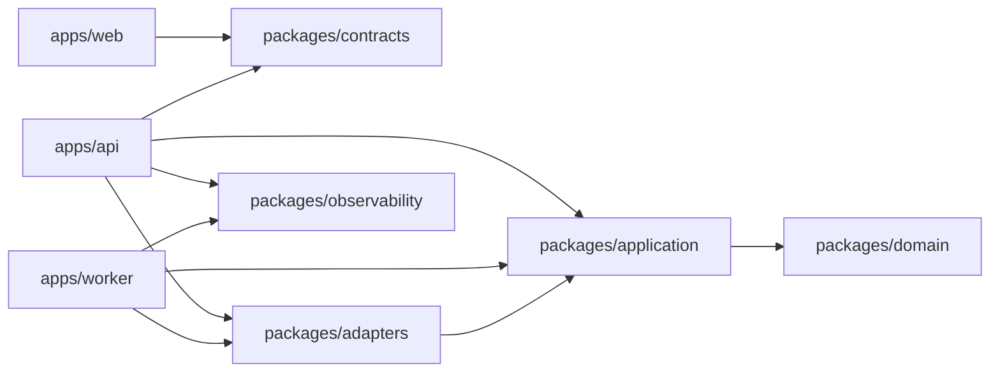
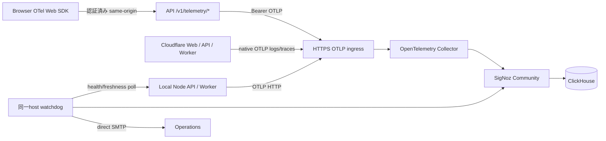
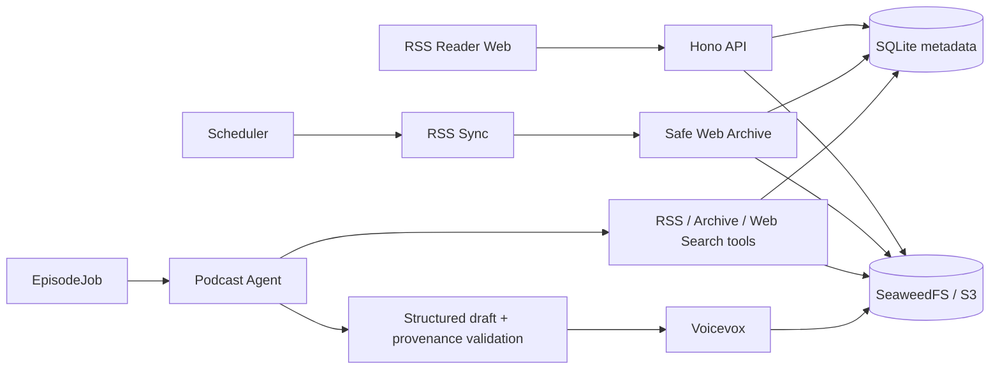
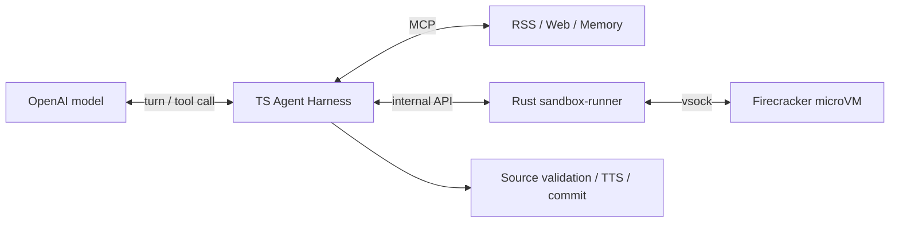
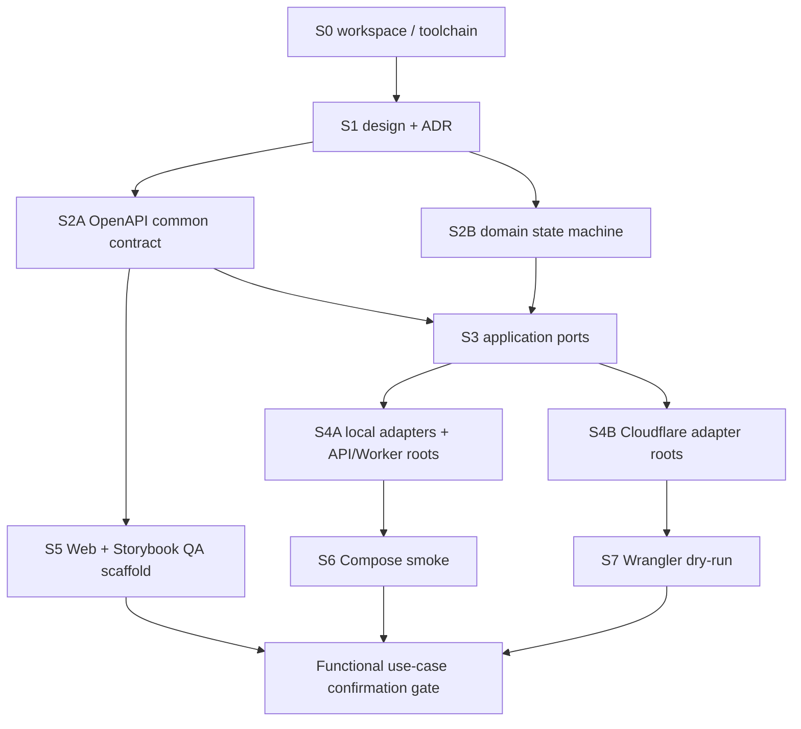

# RSSニュース・ポッドキャスト 設計書

- 状態: RSS Reader・記事アーカイブ・Agent生成 Accepted、実装中
- 更新日: 2026-08-10
- 契約の正本: `apps/api/src/app.ts` のHono/Zod route schema
- 生成契約: `packages/contracts/openapi/openapi.json`
- 判断記録: `docs/adr/`

## 1. 目的と今回の停止位置

RSSからニュース項目を取得し、出典を追跡できる事実ベースの台本を生成し、VOICEVOXで音声化してWebで配信・再生する。重い処理は非同期ジョブとし、オンプレミスとCloudflareの二つの配備形態を同じ中核で支える。

今回実装するのは、リポジトリ、契約、ドメイン状態機械、ポート、アダプター設定、API/Worker/Webのcomposition root、配備スキャフォールドまでである。初期ユースケースは、ログイン後のRSS購読、日次生成時刻設定、手動または定期生成、進捗確認、完成音声と出典の再生に確定した。

## 2. 確定事項

- Web: Vite / React / TypeScript / Tailwind CSS / shadcn/ui neutral / Base UI。
- API: Hono、OpenAPI-first REST。
- 認証: Better Authのアプリセッション。初期ログインはGoogle OIDCで、将来ほかのOIDCを追加可能にする。
- ニュース源: RSSのみ。初期カタログはZenn、azukiazusaさんの技術ブログ、Hacker News。媒体カタログとユーザー購読は分離する。
- 要約: OpenAI `gpt-5.6-luna` が既定。モデルIDは環境変数で差し替える。APIキーはユーザーが後で設定し、キーなしでビルド・テストできる。
- TTS: 外部VOICEVOX Engine。既定キャラクター名は「ずんだもん」。数値style IDは起動中Engineの `/speakers` から解決し、固定しない。
- オンプレ: Docker Compose、SQLiteジョブ表、ポーリングWorker、ローカル音声保存。
- Cloudflare: Workers、D1、R2、Queues。VOICEVOXはCloudflare外部に配置する。
- 非同期生成: `POST /v1/episode-jobs`、`202 Accepted`、`Location`、`Idempotency-Key`、状態 `queued/running/retrying/succeeded/failed/canceled`。

## 3. モジュールと依存方向



依存は外側から内側へだけ向ける。DomainはHTTP、DB、Cloudflare、OpenAI、VOICEVOXを知らない。Applicationはユースケースのポートを所有する。Adaptersはそのポートを実装し、appsは実行環境ごとのcomposition rootになる。WebはOpenAPIから生成した型だけをHTTP契約として使う。

### 境界づけたモジュール

| モジュール        | 所有する規則                   | 主な外部seam                                       |
| ----------------- | ------------------------------ | -------------------------------------------------- |
| IdentityAccess    | セッション主体、認可           | Better Auth、Google OIDC                           |
| FeedManagement    | 媒体カタログ、所有者別購読     | FeedReader                                         |
| EpisodeProduction | ジョブ、Agent実行、冪等性、出典 | PodcastAgentRunner、SpeechSynthesizer、JobDispatcher |
| EpisodeLibrary    | 所有者別一覧、音声アクセス       | ObjectStore、短期URL発行                              |

## 4. 非同期パイプライン

1. 認証済みユーザーが `Idempotency-Key` 付きで生成ジョブを作成する。
2. APIは `owner + method + canonical route + key` を一意に保存し、同一request hashなら同じreceiptを返す。異なるhashなら409にする。
3. Workerはジョブをleaseして `queued -> running` へ遷移する。
4. RSS取得、台本生成、VOICEVOX合成、音声保存を各段階で再実行可能にし、検証済み台本と音声chunkから再開する。
5. 成功時はfenced transactionでEpisodeを一度だけ関連づけて `succeeded`、失敗時は秘密を含まないfailureへ `failed`。terminal状態からは遷移しない。
6. D1からQueuesへの送信はoutboxで原子的に記録し、reconcilerで再送する。Queuesの重複配送はジョブleaseと段階冪等性で吸収する。

Node Workerは単一flightの逐次loopで動き、60秒leaseを15秒ごとに更新する。すべての更新とEpisode確定はstatus・token・期限でfenceし、初回込み4回、job 30分、台本6,000文字、chunk 16 MiB、完成音声128 MiBをSQLite制約とruntimeの両方で強制する。Agent、VOICEVOX、ObjectStoreへ同じAbortSignalを伝播し、cancel・lease喪失・deadlineで外部処理も停止する。詳細は[ADR-0016](adr/0016-bounded-observable-episode-execution.md)を正本とする。

## 5. REST契約方針

- `/v1/feeds` は媒体カタログ、`/v1/me/feed-subscriptions` は現在ユーザーの購読。body/pathにuserIdを置かない。
- `/v1/me/settings` はPATCH。ただし設定項目は確認ゲートまでスキーマを確定しない。
- ジョブとエピソードはrepository query自体をownerで絞る。他人のIDと存在しないIDは404へ正規化する。
- 401はセッション欠落/失効、403は認証済みだが許可されない操作。エラーはRFC 9457 Problem Details。
- 一覧はopaque cursor、`limit` 1..100、安定順序、filterに束縛する。`totalCount`は初期契約に入れない。
- Episodeへ署名URLを保存しない。音声アクセス操作が短期URLを発行し、`Cache-Control: private, no-store`を返す。
- Better Authの `/api/auth/**` はBetter Auth側の生成契約を正本とし、アプリOpenAPIへ複製しない。Google tokenを `/v1` のbearer tokenとして扱わない。

`POST /v1/episode-jobs` は手動生成を表し、その時点の有効購読をsnapshotする。定期生成は同じapplication commandをschedulerが `scheduled` triggerで呼ぶ。`PATCH /v1/me/settings` は日次のlocal time、IANA time zone、有効/無効を更新する。

## 6. 配備トポロジー

| 能力  | オンプレミス                           | Cloudflare                      |
| ----- | -------------------------------------- | ------------------------------- |
| API   | Hono / Node                            | Hono / Workers                  |
| DB    | SQLite                                 | D1                              |
| Job   | SQLite table + polling Worker          | D1 outbox + Queues consumer     |
| Object | SeaweedFS S3 + opaque access token | R2 + short-lived authorized URL |
| TTS   | Composeの別VOICEVOX service            | 外部VOICEVOX endpoint           |
| Auth  | Better Auth + SQLite                   | Better Auth + D1 adapter        |

SQLiteとD1で共有できるSQL制約はmigrationに置くが、ランタイムadapterは別exportにしてNode専用依存をWorkers bundleへ混ぜない。

### 6.1 監視トポロジー



Cloudflareへのアプリ配備とLinux上の監視基盤は独立させる。Domain/Applicationは監視実装を知らず、appsとadapterだけが`packages/observability`を使う。BrowserからAPIまでの同期HTTPはW3C parentを継続する。生成要求時のcontextをジョブへ保存し、Workerは試行ごとの独立traceからenqueue spanへlinkする。OpenAI、VOICEVOX、S3はWorker trace内のclient spanで計測するが、管理外serviceへtrace headerを送らない。Collector障害時はtelemetryだけを有界queueから破棄し、API・生成処理を継続する。

Browserは匿名操作、例外、Web Vitalsだけを送り、通常traceを20% samplingする。属性allowlistでユーザーID、入力、RSS・台本・音声内容、完全URL、認証情報を拒否する。job IDは生成trace/logだけで許可し、metric adapterが物理的に除去する。Dashboard、rule、routingは公式SigNoz Terraform providerで管理し、watchdogはSigNoz停止中もSMTPへ通知する。DNTまたは設定OFFならSDKを開始しない。詳細は[ADR-0010](adr/0010-opentelemetry-signoz.md)、[ADR-0016](adr/0016-bounded-observable-episode-execution.md)、[ADR-0017](adr/0017-linked-distributed-tracing.md)、[運用手順](../infra/observability/README.md)を正本にする。

## 7. 品質戦略

- Domain: 公開interfaceから確認できる規則をunit testし、ドメインロジック100%を維持する。行カバレッジを全体KPIにはしない。
- Application: portのfakeを使ったユースケース統合テスト。
- Adapters: SQLite/D1、local/R2、VOICEVOX、OpenAIの契約テスト。外部実通信は資格情報のないCIでは行わない。
- API: OpenAPI lint/validation、型生成差分、認証matrix、Problem Details、owner isolation、pagination、冪等性競合。
- Web: Storybookで状態別story、interaction、a11y、Playwright screenshot差分。機能画面は視覚設計承認後に追加する。
- E2E: ログイン後の購読管理、生成ジョブ作成、状態追跡、再生を重要導線として確認するが、確認ゲート後に実装する。

### 7.1 UI設計原則

- 視覚方針は装飾を増やさないneutral UIとする。白い背景、意味のある境界線、既存のsemantic color、控えめな角丸だけで階層を表し、独自gradient、glow、装飾illustration、不要なbadgeやshadowを追加しない。
- Apple製品に通じる明瞭さを、ブランドの模倣ではなく、揃った余白、十分な呼吸、連続した角丸、見出しと補助文の明確な階層、safe area対応として取り入れる。
- PCは左の固定ナビゲーションと主領域の2カラムで、生成状況、最新番組、生成時刻、購読フィードを同じviewportで確認できる情報密度にする。
- モバイルは上部の短いapp barと下部の4項目ナビゲーションを使い、内容は1カラムへ落とす。固定下部ナビゲーションはsafe-area insetを確保し、本文末尾を隠さない。
- タップ対象はモバイルで高さ44px以上とし、desktopでは内容密度を保つため32〜36pxを許容する。キーボードfocus ring、semantic landmark、見出し順、`aria-current`、進捗の`progressbar`を必須にする。
- breakpointはTailwindの標準を使う。`md`でdesktop navigationへ切り替え、`lg`で主領域を2カラム化する。特定端末専用の幅やUser-Agent分岐は持たない。
- UI部品はshadcn/ui neutral + Base UIを優先し、layoutだけをTailwindで構成する。色や状態はsemantic tokenを使い、独自のraw colorを置かない。

### 7.2 初期画面構成

| 領域                     | PC           | モバイル            | 表示する確定ユースケース                 |
| ------------------------ | ------------ | ------------------- | ---------------------------------------- |
| グローバルナビゲーション | 左固定rail   | 下部4項目navigation | 今日、購読、生成時刻、ライブラリ         |
| 今日の番組               | 主カラム上部 | 最上部              | 手動生成、queued/running/succeededの進捗 |
| 最新の番組               | 主カラム下部 | 生成状況の次        | 完成音声、出典、empty状態                |
| 生成時刻                 | 右カラム     | 主内容の後半        | 日次local timeとtime zone                |
| 購読フィード             | 右カラム     | 主内容の後半        | 現在ユーザーの購読一覧と管理導線         |

実アプリは生成OpenAPI型とTanStack Query/RouterでAPIへ接続する。StorybookのfixtureはUIの独立確認専用で、実アプリのデータ源には使用しない。

## 8. RSS Reader・アーカイブ・Agent生成

セルフホスト環境を正とし、RSS同期で発見した新着記事を自動的に静的archiveへ変換する。記事本文と音声を含む大きなobjectはSeaweedFS、検索・認可・状態・provenanceはSQLiteへ保存する。Podcast生成は固定promptの一括変換ではなく、read-only toolを使うagentが記事選定、本文読解、補足検索、構成、執筆を行う。

任意URLを取得するNode API/Workerは、protocol・credential・解決IPを検査し、その検査済みpublic IP集合をsocket lookupへ固定する。通常fetchによるDNS再解決は許可せず、redirectごとに再検査する。pinはrequest単位の参照としてprocess memoryだけに保持し、接続確立・失敗時に解放する。同時hostname数を1,024件へ制限し、停止時にconnection dispatcherをcloseする。Cloudflareとテスト注入はruntime固有のfetch seamを維持する。詳細は[ADR-0023](adr/0023-node-dns-pinned-safe-fetch.md)を正本とする。



### 8.1 モジュール境界

| 境界 | 所有する規則 | 主なport |
| --- | --- | --- |
| FeedManagement | 任意feed登録、購読、同期、記事状態 | FeedReader、FeedRepository |
| ContentArchive | 安全な取得、snapshot、HTML replay、Markdown | ArticleFetcher、ArchiveBuilder、ObjectStore |
| AgentRuntime | tool権限、turn/費用制限、実行監査 | PodcastAgentRunner、AgentTool |
| EpisodeProduction | draft検証、出典、TTS、完成処理 | SpeechSynthesizer、EpisodeRepository |

### 8.2 保存規則

```text
articles/{snapshot-id}/raw/response.html
articles/{snapshot-id}/raw/response.json
articles/{snapshot-id}/replay/index.html
articles/{snapshot-id}/markdown/article.md
articles/{snapshot-id}/assets/{content-hash}.{extension}
episodes/{owner-id}/{episode-id}.wav
```

bucketは公開しない。アーカイブHTMLはscriptと外部通信を除去し、認可済みの専用routeからCSP付きで返す。記事更新時は上書きせずsnapshotを追加する。

初期HTMLで参照される静的resourceは、linked stylesheetを起点にCSSの`@import`と`url()`を再帰取得し、inline style、画像、`srcset`、font、audio/videoも同一snapshotへ保存する。content hashが同じresourceは上限へ重複計上しない。既定上限はHTML 5 MiB、単一asset 20 MiB、snapshotあたりasset 512件かつ合計100 MiBとし、環境変数で変更できる。主要stylesheetが取得失敗または上限超過した場合は、壊れた元レイアウトではなく保存本文をreader viewで返す。JavaScript実行後にだけ生成されるDOMは対象外とする。

### 8.3 Agentの裁量と制約

| Agentへ委ねる | Applicationが強制する |
| --- | --- |
| 記事選定、調査順序、番組構成 | owner scope、read-only tool |
| 話題数、語り口、補足検索 | turn、tool call、HTTP時間上限 |
| 使用する根拠の選択 | source ID検証、structured result、TTS可能性 |

初期toolは`list_rss_articles`、`read_article`、Responses APIのhosted `web_search`、`submit_episode_draft`とする。RSS記事を主題の起点にし、Web検索は補足と事実確認に使い、異なるsource kindとして保存する。RSS出典はagentが保存済みMarkdown本文を読んだ記事だけを受理する。

### 8.4 隔離型Agent Harness

Agentはjob処理中だけTypeScript Worker上のHarnessとして動き、shell/Python/CLIは専用KVM hostのFirecracker microVMへ委譲する。RSS、Web検索、Memoryはowner scopedなMCP Tool Brokerが仲介し、出典検証、VOICEVOX、Episode commitはsandbox外のApplicationが行う。



Agentは常駐せず、手動・定期jobのlease時に開始し、terminal時にVMを破棄する。承認待ちはworkspaceをcheckpointしてVMを止める。一時障害はtool call台帳とcheckpointから新VMへ復元する。長期Memoryは`owner + Agent instance`で分離し、生workspaceではなく検証済みMemoryだけを次runへread-onlyで渡す。詳細なuse case、状態、権限は[ADR-0015](adr/0015-firecracker-agent-harness.md)を正本とする。

## 9. 実装DAGと順序



実装順は S0 → S1 → S2A/S2B（並行）→ S3 → S4A/S4B/S5 → S6/S7 → 確認ゲート。確認後は最小縦スライスを「契約test → domain/application → adapter → API → UI story → E2E」の順で追加する。

## 10. 追加機能の確認ゲート

次は初期ユースケースの外側に残し、ユーザーが決めるまでrouteと画面を追加しない。

1. 期間、件数、個別記事選択を生成条件へ追加するか。
2. 任意RSS登録はADR-0012で採用済み。SSRF対策とredirect再検査を維持する。
3. 動的JavaScript実行後のページまでarchive対象にするか。
4. 台本の長さ、構成、引用粒度をユーザー設定にするか。
5. ずんだもん内のstyle、速度/抑揚など追加個人設定。
6. ユーザーcancel/retry、Idempotency-Key保持期間の変更。
7. 個人podcast RSS/enclosureを公開するか。
8. 音声/台本/元記事snapshotの保持期間を無期限から変更するか。

## 11. 主要リスク

- RSSだけで事実確認できる範囲と著作権上許容される引用量。
- Cloudflareから外部VOICEVOXへのTLS、認証、到達性、長文分割。
- VOICEVOXのstyle ID変動。数値固定を避け、名前解決と起動時検証を行う。
- D1/Queuesのat-least-once配送とD1→Queue間の原子性。outboxを必須とする。
- Better AuthのSQLite/D1 adapter差とcookie設定。セッションcookie名をOpenAPIへ手書き固定しない。
- OpenAIのproviderエラーや生成根拠を外部レスポンスへ露出しない。
- 任意RSSと記事redirectによるSSRF。接続前とredirectごとに解決IPを検査する。
- SQLiteとObjectStore間の孤児object。現在は冪等keyと再試行で利用経路を保護し、運用reconcilerを追加する。
- agentの費用・latency・非決定性。実行limitと代表fixtureのevalを持つ。

## 12. ADR一覧

- [ADR-0001 DDDとオニオンアーキテクチャ](adr/0001-ddd-onion.md)
- [ADR-0002 OpenAPI-first RESTと非同期ジョブ](adr/0002-openapi-async-jobs.md)
- [ADR-0003 二つの配備形態](adr/0003-dual-runtime.md)
- [ADR-0004 VOICEVOXの外部配置](adr/0004-external-voicevox.md)
- [ADR-0005 Better AuthとGoogle OIDC](adr/0005-authentication.md)
- [ADR-0006 フロントエンド品質保証](adr/0006-frontend-quality.md)
- [ADR-0007 事実ベース台本と出典追跡](adr/0007-factual-provenance.md)
- [ADR-0008 Hono code-first OpenAPI](adr/0008-hono-code-first-openapi.md)
- [ADR-0009 TanStack Router/QueryとAsync React](adr/0009-async-react-tanstack.md)
- [ADR-0010 OpenTelemetryとSigNoz](adr/0010-opentelemetry-signoz.md)
- [ADR-0011 SeaweedFSとS3互換ObjectStore](adr/0011-s3-compatible-object-storage.md)
- [ADR-0012 RSS Readerと安全なWebアーカイブ](adr/0012-rss-reader-web-archive.md)
- [ADR-0013 Agent主導のPodcast生成](adr/0013-agent-directed-episode-production.md)
- [ADR-0014 静的Webアーカイブの完全性とresource上限](adr/0014-static-archive-completeness.md)
- [ADR-0015 Firecracker隔離型Agent Harness](adr/0015-firecracker-agent-harness.md)
- [ADR-0016 Episode生成を有界leaseと永続checkpointで実行する](adr/0016-bounded-observable-episode-execution.md)
- [ADR-0017 同期HTTPを継続し非同期生成をSpan Linkで相関する](adr/0017-linked-distributed-tracing.md)
