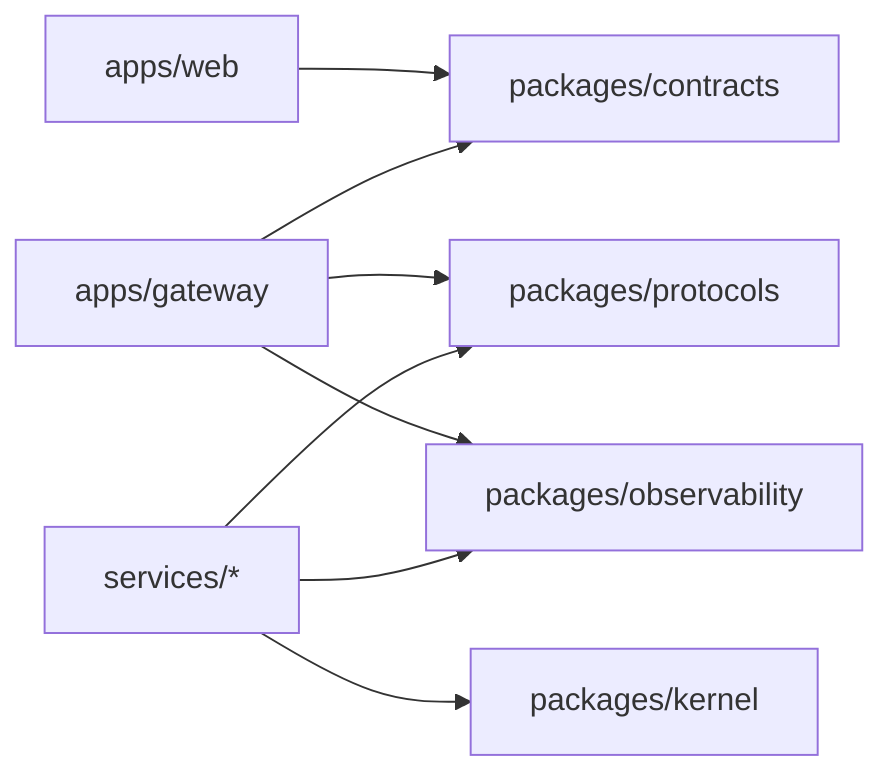
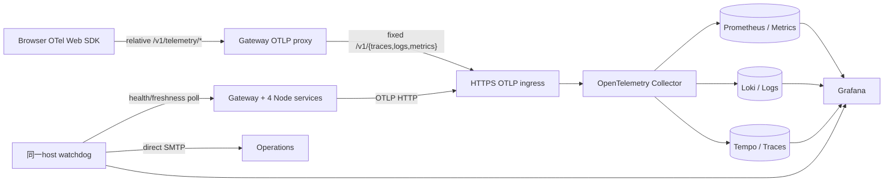
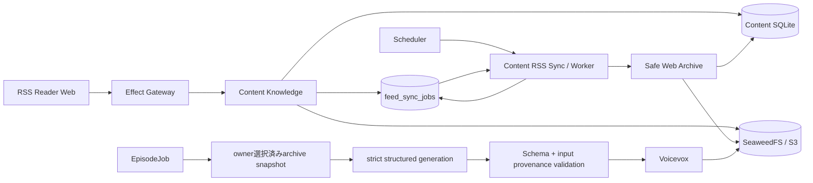
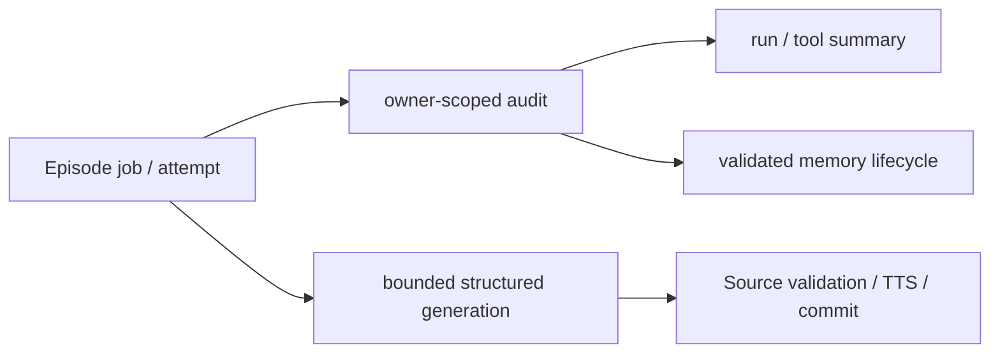
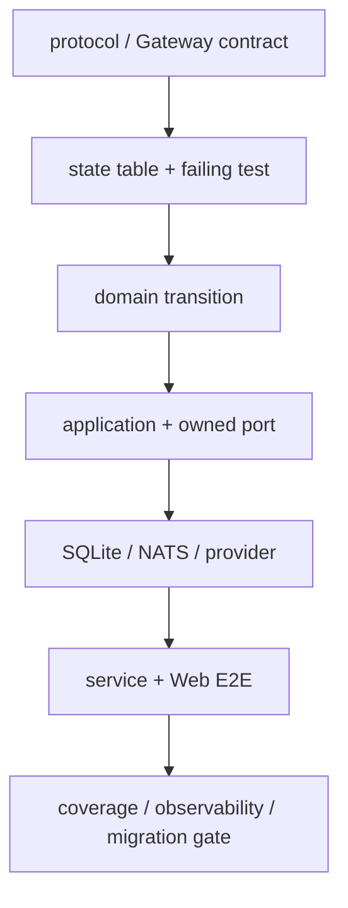

# RSSニュース・ポッドキャスト 設計書

- 状態: 関数型マイクロサービス移行・旧実装削除完了
- 更新日: 2026-08-13
- 契約の正本: `apps/gateway` のEffect HttpApi
- Context間契約: `packages/protocols` のEffect Schemaとversion付きNATS subject
- RPC返信: 共有payload schemaの`messageEnvelope`。producer/actor/correlation/causationを共通policyで照合
- 生成契約: Gateway HttpApiから生成するOpenAPI
- 判断記録: `docs/adr/`

## 1. 目的と実装範囲

RSSからニュース項目を取得し、ownerが選択した版固定済み記事から出典を追跡できる台本を生成し、VOICEVOXで音声化してWebで配信・再生する。重い処理は非同期ジョブとし、Node self-host runtimeだけをsupportする。

実装範囲はGateway、4 Context services、Web、service別state、配備・観測基盤である。公開ユースケースは、ログイン後のRSS購読・記事管理・個人設定、手動または定期生成、進捗/再試行/取消、完成音声と出典の再生に確定した。

## 2. 確定事項

- Web: Vite / React / TypeScript / Tailwind CSS / shadcn/ui neutral / Base UI。
- API: Effect HttpApi、code-first OpenAPI。
- 認証: Better Authのアプリセッション。初期ログインはGoogle OIDCで、将来ほかのOIDCを追加可能にする。
- ニュース源: RSSのみ。初期カタログはZenn、azukiazusaさんの技術ブログ、Hacker News。媒体カタログとユーザー購読は分離する。
- 要約: OpenAI `gpt-5.6-luna` が既定。モデルIDは環境変数で差し替える。APIキーはユーザーが後で設定し、キーなしでビルド・テストできる。
- TTS: 外部VOICEVOX Engine。既定キャラクター名は「ずんだもん」。数値style IDは起動中Engineの `/speakers` から解決し、固定しない。
- runtime: Docker Compose、service別SQLite、NATS JetStream、SeaweedFS、VOICEVOX。
- Cloudflare runtimeは実装しない（ADR-0039）。
- 非同期生成: `POST /v1/episode-jobs`、`202 Accepted`、`Location`、`Idempotency-Key`、状態 `queued/running/retrying/succeeded/failed/canceled`。

## 3. モジュールと依存方向

service構成は[システムアーキテクチャ](architecture.md) §3、型・副作用境界は[ADR-0034](adr/0034-functional-domain-model-and-effect-boundaries.md)を正本とする。



各service内の依存は`runtime/adapters → application → domain`だけにする。DomainはHTTP、DB、OpenAI、VOICEVOXを知らず、Applicationがportを所有する。WebはOpenAPIから生成した型だけをHTTP契約として使う。

### 境界づけたモジュール

| モジュール        | 所有する規則                   | 主な外部seam                                       |
| ----------------- | ------------------------------ | -------------------------------------------------- |
| IdentityAccess    | セッション主体、認可           | Better Auth、Google OIDC                           |
| FeedManagement    | 媒体カタログ、所有者別購読     | FeedReader                                         |
| EpisodeProduction | ジョブ、構造化生成、冪等性、出典、実行監査 | ScriptGenerator、SpeechSynthesizer、JobDispatcher |
| EpisodeLibrary    | 所有者別一覧、音声アクセス       | ObjectStore、短期URL発行                              |

## 4. 非同期パイプライン

1. 認証済みユーザーが `Idempotency-Key` 付きで生成ジョブを作成する。
2. APIは `owner + method + canonical route + key` を一意に保存し、同一request hashなら同じreceiptを返す。異なるhashなら409にする。
3. Episode Productionはジョブをleaseして `queued -> running` へ遷移する。
4. 受付時に固定した記事snapshotの取得、台本生成、VOICEVOX合成、音声保存を各段階で再実行可能にし、検証済み台本と音声checkpointから再開する。
5. 成功時はfenced transactionでEpisodeを一度だけ関連づけて `succeeded`、失敗時は秘密を含まないfailureへ `failed`。terminal状態からは遷移しない。
6. 完成eventはoutboxへ原子的に記録し、JetStreamへ再送する。Libraryはdurable consumerとinboxで重複配送を吸収する。

RSS購読登録も非同期境界を持つ。Content Knowledgeは`feed_sync_jobs`へfeedごとに1件のjobを保存し、`queued -> processing -> succeeded / failed`をlease tokenでfenceしたworkerで進める。claim・完了ごとに現在時刻を再取得し、期限切れleaseのworkerによる完了上書きを拒否する。購読登録時はpollerへwake通知を送り、既定5分の定期cycleを待たずに初回同期を開始する。所有者は`POST /v1/me/feed-subscriptions/{subscriptionId}/sync`で有効な購読を同じキューへ再投入でき、失敗後の再試行や最新RSSの確認を明示的に開始できる。Webは`GET /v1/me/feed-sync-jobs`を表示し、処理中だけ状態と記事一覧を短い間隔で再取得する。

Episode Productionのloopは単一flightで動く。すべての更新とEpisode確定はstatus・token・期限でfenceし、初回込み4回、job 30分、台本6,000文字、chunk 16 MiB、完成音声128 MiBをSQLite制約とruntimeの両方で強制する。OpenAI、VOICEVOX、ObjectStoreへ同じAbortSignalを伝播し、cancel・lease喪失・deadlineで外部処理も停止する。詳細は[ADR-0016](adr/0016-bounded-observable-episode-execution.md)を正本とする。

## 5. REST契約方針

- `/v1/feeds` は媒体カタログ、`/v1/me/feed-subscriptions` は現在ユーザーの購読。body/pathにuserIdを置かない。
- `/v1/me/settings` はGET/PATCHとし、Gatewayが各Contextのowner-scoped projectionを合成する。
- ジョブとエピソードはrepository query自体をownerで絞る。他人のIDと存在しないIDは404へ正規化する。
- 401はセッション欠落/失効、403は認証済みだが許可されない操作。エラーはRFC 9457 Problem Details。
- 一覧はopaque cursor、`limit` 1..100、安定順序、filterに束縛する。`totalCount`は初期契約に入れない。
  - 記事一覧`GET /v1/me/articles`は`cursor`クエリと`page.hasMore` / `page.nextCursor`で継続する。cursorは`(公開日時 ?? 発見日時, articleId)`のkeyset位置をbase64urlへ畳んだ不透明tokenで、Content Knowledgeだけが解釈する。OFFSETと違い、ページを跨いで記事が増減しても重複・欠落しない。復号できないcursorは不正要求として閉じる。
- Episodeへ署名URLを保存しない。音声アクセス操作が短期URLを発行し、`Cache-Control: private, no-store`を返す。
- Better Authの `/api/auth/**` はBetter Auth側の生成契約を正本とし、アプリOpenAPIへ複製しない。Google tokenを `/v1` のbearer tokenとして扱わない。

`POST /v1/episode-jobs` は手動生成を表し、1〜20件の`articleIds`を必須とする。定期生成はその時点の有効購読から対象記事IDを解決した後、同じapplication commandを`scheduled` triggerで呼ぶ。どちらもjobへ受付時の記事ID集合を保存する。`GET /v1/episode-jobs/{jobId}/events`は`Last-Event-ID`以降を追尾し、terminal状態までSSE接続を維持する。`PATCH /v1/me/settings` は日次のlocal time、IANA time zone、有効/無効を更新する。

## 6. 配備トポロジー

| 能力 | supported Node self-host構成 |
| --- | --- |
| API / service | Effect Gateway + 4 Node Context services |
| DB / messaging | service別SQLite + NATS JetStream |
| Object / TTS | SeaweedFS S3 + VOICEVOX |
| Auth | Better Auth + Identity SQLite、Gateway固定origin proxy |

Cloudflare/D1/R2/Queuesは実装しない。再導入条件は[ADR-0039](adr/0039-support-node-self-host-runtime-only.md)を正本とする。

### 6.1 監視トポロジー



Domain/Applicationは監視実装を知らず、runtimeとadapterだけが`packages/observability`を使う。BrowserからGatewayまでの同期HTTPはW3C parentを継続する。生成要求時のcontextをジョブへ保存し、Productionは試行ごとの独立traceからenqueue spanへlinkする。OpenAI、VOICEVOX、S3はProduction trace内のclient spanで計測するが、管理外serviceへtrace headerを送らない。Collector障害時はtelemetryだけを有界queueから破棄し、API・生成処理を継続する。

Browserは匿名操作、例外、Web Vitalsだけを送り、通常traceを20% samplingする。OTLPはGatewayの相対proxyを通し、Collector originをBrowserへ公開しない。属性allowlistでユーザーID、入力、RSS・台本・音声内容、完全URL、認証情報を拒否する。job IDは生成trace/logだけで許可し、metric adapterが物理的に除去する。Collectorはspan metricsとservice graphを生成する。Grafana provisioningで8 dashboard、alert、metrics exemplar、trace-to-logs、logs-to-traceを管理し、watchdogはGrafana停止中もSMTPへ通知する。DNTまたは設定OFFならSDKを開始しない。詳細は[ADR-0032](adr/0032-grafana-correlated-observability.md)、[ADR-0040](adr/0040-full-path-observability-validation.md)、[ADR-0016](adr/0016-bounded-observable-episode-execution.md)、[ADR-0017](adr/0017-linked-distributed-tracing.md)、[運用手順](../infra/observability/README.md)を正本にする。

計装は呼び出しごとの手動spanではなく、**自動計装（`instrumentation-http` + `instrumentation-undici`）を正本**にする。Node processはbootstrapで`@news-podcast/observability/node/register`を初期化してからcomposition rootを動的importし、依存moduleの評価より先に`node:http`をpatchする。入り口HTTPと全outbound HTTP（OpenAI、VOICEVOX、RSS、記事archive、AI enrich、S3）へspanを自動生成する。W3C trace headerの注入はallowlist（既定`api.openai.com`・`localhost`・`127.0.0.1`、`OTEL_PROPAGATION_ALLOWLIST`で拡張）へ限定し、任意RSS等の管理外宛先へは注入しない（ADR-0017の「外部へ送らない」方針を部分改訂）。span自体は生成・記録され続け、受信は常にW3Cで継続する。schedulerやconsumerなど非HTTP入口は`withGuaranteedSpan`でroot spanを合成して`trace.entry.synthesized`を計数し、本番はmetric/ruleで、非本番は`assertActiveSpan`で計装欠落を検出する。エラー詳細はredact済み`error.message`・`error.type`をlogs/spansへ記録し、metric属性は低cardinalityに限定する（高cardinalityの`error.message`はmetricsへ入れない）。詳細は[ADR-0025](adr/0025-automatic-instrumentation-and-trace-guarantee.md)を正本とする。

## 7. 品質戦略

- Domain: 公開interfaceから確認できる規則をunit testし、ドメインロジック100%を維持する。行カバレッジを全体KPIにはしない。
- Application: portのfakeを使ったユースケース統合テスト。
- Adapters: SQLite、SeaweedFS S3、VOICEVOX、OpenAIの契約テスト。OpenAIリクエストは採用モデルのstrict schemaと実行時allow-listを通し、モデル変更時は実API smokeで適合性を確認する。外部実通信は資格情報のないCIでは行わない。
- External contract gate: 公式仕様→稼働version/digest→実データの順に照合し、匿名fixtureを`provider-contract:check`でoffline再生する。詳細は[外部provider契約台帳](external-provider-contracts.md)。
- API: OpenAPI lint/validation、型生成差分、認証matrix、Problem Details、owner isolation、pagination、冪等性競合。
- Web: Storybookで状態別story、interaction、a11y、Playwright screenshot差分。機能画面は視覚設計承認後に追加する。
- E2E: ログイン後の購読管理、生成ジョブ作成、状態追跡、再生を重要導線として確認するが、確認ゲート後に実装する。

### 7.1 UI設計原則

- 視覚方針は装飾を増やさないneutral UIとする。白い背景、意味のある境界線、既存のsemantic color、控えめな角丸だけで階層を表し、独自gradient、glow、装飾illustration、不要なbadgeやshadowを追加しない。
- Apple製品に通じる明瞭さを、ブランドの模倣ではなく、揃った余白、十分な呼吸、連続した角丸、見出しと補助文の明確な階層、safe area対応として取り入れる。
- PCは左の固定ナビゲーションと主領域の2カラムで、生成状況、最新番組、生成時刻、購読フィードを同じviewportで確認できる情報密度にする。
- モバイルは上部の短いapp barと下部の4項目ナビゲーションを使い、内容は1カラムへ落とす。固定下部ナビゲーションはsafe-area insetを確保し、本文末尾を隠さない。
- タップ対象はモバイルで高さ44px以上とし、desktopでは内容密度を保つため32〜36pxを許容する。キーボードfocus ring、semantic landmark、見出し順、`aria-current`、進捗の`progressbar`を必須にする。
- breakpointはTailwindの標準を使う。`md`でdesktop navigationへ切り替え、`lg`で主領域を2カラム化する。特定端末専用の幅やUser-Agent分岐は持たない。
- UI部品はshadcn/ui neutral + Base UIを優先し、layoutだけをTailwindで構成する。色や状態はsemantic tokenを使い、独自のraw colorを置かない。
- 記事ページはdesktop(`lg`)でページヘッダーを置かず、記事一覧と本文リーダーをそれぞれ独立したスクロール領域にする。モバイルは1カラムの自然スクロールに落とす。
- 記事の既読は「開いた瞬間」ではなく「離れたタイミング」(別記事への切り替え・一覧へ戻る・ページ遷移・タブを閉じる)で反映する。開いている間は一覧でも未読表示のまま保つ。
- 記事一覧のヘッダー(検索・状態タブ)は常設し、スクロール位置に関わらず操作できる。日付見出しはそのヘッダーの直下へ吸着する。吸着位置は`--app-bar-h`と`--article-header-h`だけで決め、各所へ数値を散らさない。スクロール領域の祖先に`overflow-hidden`を置くと吸着が死ぬので使わない。
- ページには必ずlevel-1見出しを置く。記事ページのようにヘッダーを視覚化しない画面では`sr-only`の`h1`を置き、見出しレベルを飛ばさない。
- Markdown本文はグローバルCSS（`prose`など）ではなく、要素ごとのReactコンポーネントで描画する。`rehype-react`のcomponent mapに`h1`〜`h6`、`p`、`ul/ol/li`、`table`、`blockquote`、`pre/code`などを個別に割り当て、shadcn/uiのtypographyに倣った見た目をコンポーネント側が持つ。
- 取り込んだ本文の見出しは、埋め込み先の階層へ接ぎ木する。`<Markdown headingBaseLevel>`は「本文の最も浅い見出しに与えるレベル」を指定する。固定のオフセットにしないのは、タイトル再掲の除去で最浅レベルが変わり、見出し順に穴が空くため。リーダー本文は`3`（ページh1 + 記事タイトルh2の下）、AI要約内は`4`。
- リーダーは記事タイトルを自前の見出しで表示するので、本文先頭の同じ見出しは`omitLeadingTitle`で落とす。判定は先頭ノードに限り、本文中の見出しには触れない。
- 文字色は背景ごとに4.5:1を確認する。選択行(`accent`)やセグメンテッドコントロールの溝(`muted`)の上では`muted-foreground`が基準を割るため、前景寄りの色へ上げる。
- 行内の操作(保存など)をhoverだけで出さない。タッチとキーボードから到達できなくなるため、フォーカス時と選択済み状態では常に見せる。

### 7.2 初期画面構成

| 領域                     | PC           | モバイル            | 表示する確定ユースケース                 |
| ------------------------ | ------------ | ------------------- | ---------------------------------------- |
| グローバルナビゲーション | 左固定rail   | 下部4項目navigation | 今日、購読、生成時刻、ライブラリ         |
| 今日の番組               | 主カラム上部 | 最上部              | 手動生成、queued/running/succeededの進捗 |
| 最新の番組               | 主カラム下部 | 生成状況の次        | 完成音声、出典、empty状態                |
| 生成時刻                 | 右カラム     | 主内容の後半        | 日次local timeとtime zone                |
| 購読フィード             | 右カラム     | 主内容の後半        | 現在ユーザーの購読一覧と管理導線         |

実アプリは生成OpenAPI型とTanStack Query/RouterでAPIへ接続する。StorybookのfixtureはUIの独立確認専用で、実アプリのデータ源には使用しない。

## 8. RSS Reader・アーカイブ・構造化生成

セルフホスト環境を正とし、RSS同期で発見した新着記事を静的archiveへ変換する。記事本文と音声を含む大きなobjectはSeaweedFS、検索・認可・状態・provenanceはSQLiteへ保存する。Podcast生成はownerが選択した版固定済み記事だけを入力にし、strict schemaで有界な台本を生成する。

任意URLを取得するContent serviceは、protocol・credential・解決IPを検査し、その検査済みpublic IP集合をsocket lookupへ固定する。通常fetchによるDNS再解決は許可せず、redirectごとに再検査する。pinはrequest単位の参照としてprocess memoryだけに保持し、接続確立・失敗時に解放する。同時hostname数を1,024件へ制限し、停止時にconnection dispatcherをcloseする。テスト注入はruntime固有のfetch seamを維持する。詳細は[ADR-0023](adr/0023-node-dns-pinned-safe-fetch.md)を正本とする。



### 8.1 モジュール境界

| 境界 | 所有する規則 | 主なport |
| --- | --- | --- |
| FeedManagement | 任意feed登録、購読、同期、記事状態 | FeedReader、FeedRepository |
| ContentArchive | 安全な取得、snapshot、HTML replay、Markdown | ArticleFetcher、ArchiveBuilder、ObjectStore |
| AgentAudit | owner/job/attempt lineage、memory lifecycle | AgentAuditRepository |
| EpisodeProduction | 有界生成、draft検証、出典、TTS、完成処理 | ScriptGenerator、SpeechSynthesizer、EpisodeRepository |

構造化入力は専用parserを通す。RSS/Atomは`fast-xml-parser`で整形式検証後にFeedItemへ正規化する。記事HTMLはscript/resource無効の`jsdom`でDOM化し、共有Feature Ruleでcode/callout/embed/mathを保持してから、Site Profileの明示root、semantic `article`、Readabilityの順で本文を抽出する。その後`rehype-parse` → `rehype-sanitize` → `rehype-remark` → `remark-stringify`でMarkdownへ変換する。Profileはselectorと意味対応だけを所有し、汎用抽出・serializeを複製しない。XML/HTML/Markdownのタグ境界を正規表現で解釈せず、`pnpm parser:check`で依存境界を検査する（[ADR-0042](adr/0042-structured-input-parser-boundaries.md)、[ADR-0051](adr/0051-extensible-article-markdown-conversion.md)）。

保存MarkdownはGFM、math、Mermaid、Obsidian/GitHub型callout、`@[card]`、`@[embed]`、code fence metadataを扱う。code言語は明示属性、filename、shebang/modeline、閾値付きoffline検出の順に決める。Webはcalloutを`@r4ai/remark-callout`で描画し、embedはHTTPS provider allowlist、sandbox、`no-referrer`を満たす場合だけ自動ロードする。

保存するMarkdownは「取得元ページの断片」であり、埋め込み先の見出し階層は保存時点では決まらない。そこで変換時に見出しを**最も浅いものがlevel 1になる正規形**へ畳み、相対関係だけを残す（`<h2>`から始まるサイトと`<h1>`から始まるサイトの差を吸収する）。実際の見出しレベルは、埋め込み文脈を知っている表示側が決める。

### 8.2 保存規則

```text
articles/{snapshot-id}/raw/response.html
articles/{snapshot-id}/raw/response.json
articles/{snapshot-id}/replay/index.html
articles/{snapshot-id}/markdown/article.md
articles/{snapshot-id}/assets/{content-hash}.{extension}
episodes/{sha256(owner-id)}/{job-id}/{episode-id}.wav
```

bucketは公開しない。アーカイブHTMLはscriptと外部通信を除去し、認可済みの専用routeからCSP付きで返す。記事更新時は上書きせずsnapshotを追加する。

初期HTMLで参照される静的resourceは、linked stylesheetを起点にCSSの`@import`と`url()`を再帰取得し、inline style、画像、`srcset`、font、audio/videoも同一snapshotへ保存する。content hashが同じresourceは上限へ重複計上しない。既定上限はHTML 5 MiB、単一asset 20 MiB、snapshotあたりasset 512件かつ合計100 MiBとし、環境変数で変更できる。主要stylesheetが取得失敗または上限超過した場合は、壊れた元レイアウトではなく保存本文をreader viewで返す。JavaScript実行後にだけ生成されるDOMは対象外とする。

### 8.3 構造化生成の裁量と制約

| LLMへ委ねる | Applicationが強制する |
| --- | --- |
| owner選択済み記事の構成、語り口 | 入力snapshot、strict schema、deadline、byte上限 |
| 記事間の説明順序 | 入力外source拒否、TTS可能性、retry分類 |

台本完成後・音声合成前に、英略語・英数字技術語・固有名詞の読み候補をstrict JSON Schemaで最大30件抽出する。全角カタカナ・長さ・アクセントを検証し、ownerの既存辞書とNFKC正規化キーで重複を除いた候補だけをSQLiteとVOICEVOX辞書へ同期する。抽出失敗は`reading_dictionary.extraction_failed`として記録し、番組生成自体は継続する。詳細は[ADR-0028](adr/0028-structured-reading-dictionary-extraction.md)を正本とする。

LLM応答はJSON Schemaの形だけでなく、要求集合との完全な対応を永続化前に検証する。バッチIDは入力と出力を1対1にし、選択記事は全件の読込と引用を要求する。HTTP 200後の空・不完全・不正応答はbounded retryへ、request 4xxとrefusalは終端へ、caller cancellationは理由を変換せず元の状態遷移へ渡す。任意成果物の失敗は主要成果物から隔離するが、正常な空集合へ偽装せず既存の失敗イベントへ記録する。詳細は[ADR-0031](adr/0031-complete-isolated-llm-response-boundaries.md)を正本とする。

hosted Web検索と一般Agent Harnessは本番経路へ接続しない。入力外sourceを必要とする品質要件とSLOが得られた場合だけ[ADR-0038](adr/0038-bounded-structured-production-generation.md)を再検討する。

記事要約では本文を必須成果物、Mermaidを任意の補助成果物として分離する。Mermaidは保存前に検証して1回だけ修復し、それでも不正なら図だけを除去して本文を保存する。縮退は`article.enrich.summary.degraded`へ記録し、反復時にalertする。本文まで空になる場合だけ要約を失敗させる。詳細は[ADR-0030](adr/0030-degrade-invalid-summary-diagrams.md)を正本とする。

6件以上の選択記事は1 sectionあたり最大6件へ分けて生成し、最後に1本の台本へ統合する。分類と統合はResponses APIのstrict JSON Schemaで拘束し、`output`の固定位置ではなく`output_text`判別子を探索してからapplication側でも検証する。分類の重複・未知IDは除外し、未割当記事は決定論的に補完する。統合処理は新しいsourceを生成せず、各sectionで検証済みのsourceだけを継承する。空・不完全応答はbounded retry、refusalとrequest 4xxは終端失敗とする。詳細は[ADR-0029](adr/0029-validated-sectional-response-boundary.md)を正本とする。

AG-UI timelineは`job.retrying`、`RUN_ERROR`、`RUN_FINISHED`で未完了step/toolを閉じる。retry時は次の`RUN_STARTED`と`STEP_STARTED`で同じstageを再開し、backendが停止中または終端済みなのにspinnerだけが動き続ける状態を許さない。

### 8.4 Agent監査境界

Episode Productionはrun/tool/memoryをowner・job・attemptで分離して監査するが、一般Agent、shell、workspace、Firecrackerは実行しない。credential、記事本文全体、chain-of-thoughtは保存しない。



過去のHarness判断はADR-0015に履歴として残すが、現行判断は[ADR-0038](adr/0038-bounded-structured-production-generation.md)がsupersedeする。

## 9. 実装と変更の順序



新規変更はContextごとの縦断sliceを「契約test → domain/application → adapter → Gateway → Web → E2E」の順で閉じる。

## 10. 追加機能の確認ゲート

次は初期ユースケースの外側に残し、ユーザーが決めるまでrouteと画面を追加しない。

1. 期間、件数、個別記事選択を生成条件へ追加するか。
2. 任意RSS登録はADR-0012で採用済み。SSRF対策とredirect再検査を維持する。
3. 動的JavaScript実行後のページまでarchive対象にするか。
4. 台本の長さ、構成、引用粒度をユーザー設定にするか。
5. ずんだもん内のstyle、速度/抑揚など追加個人設定。
6. ユーザーcancel/retry、Idempotency-Key保持期間の変更。
7. 個人podcast RSS/enclosureを公開するか。
8. 音声/台本/元記事snapshotの保持期間を無期限から変更するか。

## 11. 主要リスク

- RSSだけで事実確認できる範囲と著作権上許容される引用量。
- VOICEVOXのstyle ID変動。数値固定を避け、名前解決と起動時検証を行う。
- Better Authのcookie設定。セッションcookie名をOpenAPIへ手書き固定しない。
- OpenAIのproviderエラーや生成根拠を外部レスポンスへ露出しない。
- 任意RSSと記事redirectによるSSRF。接続前とredirectごとに解決IPを検査する。
- SQLiteとObjectStore間の孤児object。現在は冪等keyと再試行で利用経路を保護し、運用reconcilerを追加する。
- LLMの費用・latency・非決定性。strict schema、実行limit、代表fixtureのevalを持つ。

## 12. ADR一覧

- [ADR-0001 DDDとオニオンアーキテクチャ](adr/0001-ddd-onion.md)
- [ADR-0002 OpenAPI-first RESTと非同期ジョブ](adr/0002-openapi-async-jobs.md)
- [ADR-0003 二つの配備形態](adr/0003-dual-runtime.md)
- [ADR-0004 VOICEVOXの外部配置](adr/0004-external-voicevox.md)
- [ADR-0005 Better AuthとGoogle OIDC](adr/0005-authentication.md)
- [ADR-0006 フロントエンド品質保証](adr/0006-frontend-quality.md)
- [ADR-0007 事実ベース台本と出典追跡](adr/0007-factual-provenance.md)
- [ADR-0008 Hono code-first OpenAPI](adr/0008-hono-code-first-openapi.md)
- [ADR-0009 TanStack Router/QueryとAsync React](adr/0009-async-react-tanstack.md)
- [ADR-0010 OpenTelemetryとSigNoz](adr/0010-opentelemetry-signoz.md)
- [ADR-0011 SeaweedFSとS3互換ObjectStore](adr/0011-s3-compatible-object-storage.md)
- [ADR-0012 RSS Readerと安全なWebアーカイブ](adr/0012-rss-reader-web-archive.md)
- [ADR-0013 Agent主導のPodcast生成](adr/0013-agent-directed-episode-production.md)
- [ADR-0014 静的Webアーカイブの完全性とresource上限](adr/0014-static-archive-completeness.md)
- [ADR-0015 Firecracker隔離型Agent Harness](adr/0015-firecracker-agent-harness.md)
- [ADR-0016 Episode生成を有界leaseと永続checkpointで実行する](adr/0016-bounded-observable-episode-execution.md)
- [ADR-0017 同期HTTPを継続し非同期生成をSpan Linkで相関する](adr/0017-linked-distributed-tracing.md)
- [ADR-0025 自動計装を正本とするトレース保証](adr/0025-automatic-instrumentation-and-trace-guarantee.md)
- [ADR-0038 保存済み出典による有界な構造化生成](adr/0038-bounded-structured-production-generation.md)
- [ADR-0039 Node self-host runtimeだけをsupport](adr/0039-support-node-self-host-runtime-only.md)
- [ADR-0041 RSS同期を永続キューで実行し購読直後に起動する](adr/0041-durable-rss-sync-queue.md)
- [ADR-0042 構造化入力を著名なパーサーとAST pipelineで処理する](adr/0042-structured-input-parser-boundaries.md)
