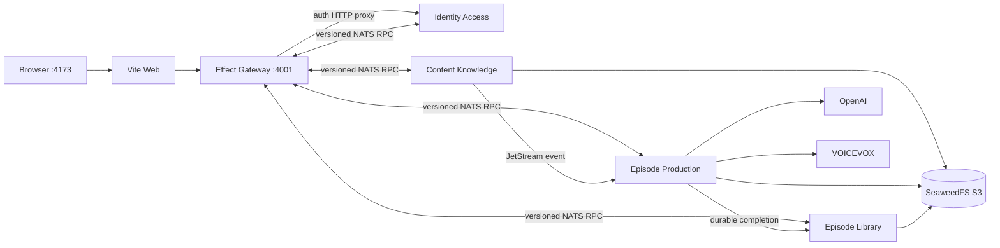
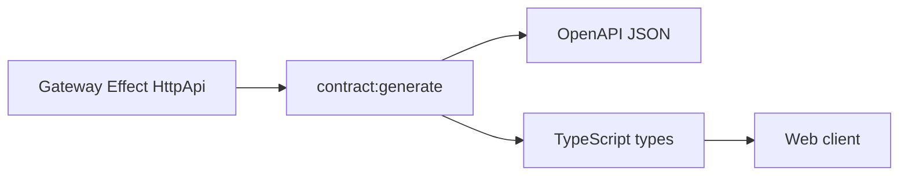
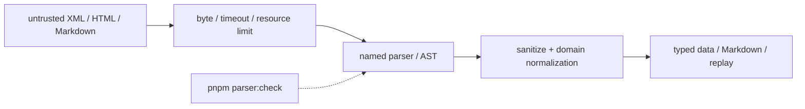
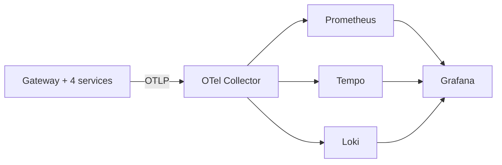

# 開発ガイド

このガイドは、唯一のruntimeであるNode self-host構成をローカルで起動・検証する手順を示す。正本はGatewayと4 Context servicesである。

## クイックスタート

### 必要なもの

| ツール | バージョン | 用途 |
| --- | --- | --- |
| Node.js | 24以上 | build、test、migration |
| pnpm | 11.16.0 | workspace管理 |
| Docker Compose | 現行版 | Gateway、4 services、NATS、SeaweedFS、VOICEVOX、Web |

```bash
corepack enable
corepack prepare pnpm@11.16.0 --activate
pnpm install --frozen-lockfile
pnpm setup:env
pnpm dev:up
```

`pnpm setup:env`は`.env`がない場合だけ`.env.example`から作成し、開発用secretを生成する。既存`.env`は更新しないため、項目追加時は手動で差分を反映する。

| 接続先 | URL |
| --- | --- |
| Web | <http://localhost:4173> |
| Gateway health | <http://localhost:4001/health> |
| NATS monitoring | <http://localhost:8222> |
| SeaweedFS S3 | <http://localhost:8333> |
| VOICEVOX | <http://localhost:50021> |

開発ログインは`.env`の`DEV_AUTH_PASSWORD`を使う。`APP_ENV=production`では開発ログインとfake providerを有効にできない。

終了時はvolumeを残して停止する。

```bash
pnpm dev:down
```

`docker compose down --volumes`はservice DB、NATS、objectを削除するため、初期化する意図がある場合だけ実行する。

## supported topology



各Contextは専用SQLiteを所有する。Context間でDBを共有せず、同期query/commandはNATS RPC、確実な状態伝播はJetStreamを使う。

| service | health port | state |
| --- | ---: | --- |
| Gateway | 4101 | 業務stateなし |
| Identity Access | 4102 | identity SQLite |
| Content Knowledge | 4103 | content SQLite |
| Episode Production | 4104 | production SQLite |
| Episode Library | 4105 | library SQLite |

NATSだけを確認する場合:

```bash
docker compose up -d nats
curl --fail --silent --show-error \
  'http://127.0.0.1:8222/healthz?js-enabled-only=true'
```

host上でserviceを直接起動する場合は`NATS_SERVERS=nats://127.0.0.1:4222`を使う。Compose内は`nats://nats:4222`である。

## 開発シナリオ

### Webをhostでhot reloadする

```bash
docker compose up -d --build gateway identity-access content-knowledge episode-production episode-library nats-provision seaweedfs voicevox
VITE_API_PROXY_TARGET=http://localhost:4001 pnpm --filter web dev
```

Webの`/api`と`/v1`はGatewayだけへproxyする。認証routeもGatewayが固定originのIdentity HTTPへ転送する。

### 外部APIなしで検証する

`.env`の既定値は`PROVIDER_MODE=fake`である。固定providerを使って認証、購読、記事、非同期job、Library、音声accessを確認できる。

```bash
pnpm test:e2e:functional
pnpm test:e2e
```

functional E2Eは実NATS/JetStreamを使うbackend縦断、Web E2Eは分離したfake stackを使う主要journeyである。外部API keyや課金requestは不要である。

### OpenAIとVOICEVOXを使う

```dotenv
PROVIDER_MODE=live
OPENAI_API_KEY=your-api-key
```

```bash
pnpm dev:up
```

本番生成はownerが選択しContentが版固定した記事だけを入力にする。Episode ProductionはOpenAI Responses APIへstrict JSON schema、request deadline、応答byte上限、一時障害だけの有界retryを適用する。hosted Web検索と一般Agent Harnessは本番経路へ接続しない（[ADR-0038](adr/0038-bounded-structured-production-generation.md)）。

## OpenAPI契約

`apps/gateway/src/contract.ts`が外部HTTP契約の正本である。生成物は`packages/contracts/openapi/openapi.json`と`packages/contracts/src/generated/openapi.ts`へ保存し、Webが利用する。runtimeはOpenAPI文書をHTTP公開せず、repositoryのversion固定生成物を検査する。



```bash
pnpm contract:generate
pnpm contract:check
pnpm contract:lint
```

契約変更では生成物を同じ変更に含め、`contract:check`で差分がないことを確認する。Better Authの`/api/auth/**`は認証provider側の契約で、アプリOpenAPIへ複製しない。

## 品質gate

| コマンド | 検証内容 |
| --- | --- |
| `pnpm format:check` | oxfmt差分 |
| `pnpm lint` | oxlint、Spectral、architecture gate、structured parser gate |
| `pnpm typecheck` | workspace型検査 |
| `pnpm test` | unit/integration tests |
| `pnpm test:coverage:functional` | 8 functional packagesのlines 75% / branches 60% |
| `pnpm test:e2e:functional` | Gateway→4 services、NATS/JetStream縦断 |
| `pnpm test:e2e` | Web主要journey |
| `pnpm test:sqlite-state` | service別backup/restore拒否規則 |
| `pnpm db:generate` | drizzle schemaからmigration SQLを生成（要レビュー） |
| `pnpm observability:validate` | LGTM構文、Dashboard UID、未確認metric参照 |
| `pnpm observability:smoke` | 起動後のGrafana API、datasource、Collector、Browser OTLP、依存endpoint |

bug修正は再現testを先に追加する。LLM接続ではsuccessだけでなく、timeout、429/5xx、invalid schema、response上限、non-retryable failureをprovider境界で確認する。

### 構造化入力のparser方針

RSS/Atom、HTML、Markdownの文書構造は正規表現で解釈しない。専用parserでASTまたは構造化データへ変換し、sanitize・正規化・serializeを別段階に分ける。



現在のContent境界は、RSS/Atomに`fast-xml-parser`、記事HTML→Markdownに`rehype-parse` + `rehype-remark` + `remark-stringify`を使う。記事変換には専用の入力1 MiB、ASTノード5万、深さ128、Markdown出力1 MiBの上限を設け、上限超過は`ResourceLimit`として保存前に拒否する。正規表現はURL・固定語彙などの字句検証に限定し、構造解釈へ戻さない。詳細は[ADR-0042](adr/0042-structured-input-parser-boundaries.md)を参照する。

```bash
pnpm parser:check
```

## State backupと復旧

online backup、別pathへの検証restore、offline cutover、rollbackは[Service state backup / restore](operations/service-state-recovery.md)を正本とする。既存DBへの上書きと別serviceのbackup復元はCLIが拒否する。

## Observability

```bash
pnpm dev:up:observed
pnpm observability:validate
pnpm observability:smoke
```

Grafanaは<http://localhost:3100>。DashboardはOverview、Service Map、Service Drilldown、Logs、Episode、Web、Dependencies、Platformの8つを自動provisionする。障害時は`Alert → Overview → Service Drilldown → Service Map → Tempo trace → 同じtrace_idのLoki log → Prometheus metric/exemplar`の順に追う。default `OTEL_ENABLED=false`ではno-op adapterを使い、Collector障害で業務処理を止めない。

BrowserのOTLPはWebの相対URLからGatewayへ転送され、GatewayがCollectorの`/v1/traces`、`/v1/logs`、`/v1/metrics`へ固定マッピングする。Collector originをBrowserへ公開しない。Gatewayのproxyにはrequest/response byte上限とtimeoutを設定する。

observed stackは課金APIへ接続しないため、`compose.observability.yaml`がEpisode Productionの`PROVIDER_MODE=fake`と空の`OPENAI_API_KEY`を強制する。初期paintのWeb Vitalを収集するため、Browser SDKはアプリ描画前に開始する。

`pnpm dev:up:observed`をremote host上で実行している場合、以下のワンライナーで公開している全portをlocalへforwardできる。

```bash
ssh -N user@remote-host \
  -L 4001:localhost:4001 -L 4101:localhost:4101 \
  -L 4173:localhost:4173 \
  -L 4222:localhost:4222 -L 8222:localhost:8222 \
  -L 8333:localhost:8333 -L 9333:localhost:9333 \
  -L 50021:localhost:50021 \
  -L 4317:localhost:4317 -L 4318:localhost:4318 -L 8888:localhost:8888 \
  -L 9090:localhost:9090 \
  -L 3100:localhost:3100
```



## 主な環境変数

全項目と既定値は`.env.example`を正本とする。

| 領域 | 主な変数 |
| --- | --- |
| runtime | `APP_ENV`、`PROVIDER_MODE`、`NATS_SERVERS` |
| auth | `BETTER_AUTH_SECRET`、`BETTER_AUTH_URL`、`DEV_AUTH_*`、`GOOGLE_CLIENT_*` |
| Gateway/Identity HTTP | `GATEWAY_PORT`、`IDENTITY_HTTP_ORIGIN`、`AUTH_PROXY_*` |
| service DB | `IDENTITY_DATABASE_PATH`、`CONTENT_KNOWLEDGE_DATABASE_PATH`、`EPISODE_PRODUCTION_DATABASE_PATH`、`EPISODE_LIBRARY_DATABASE_PATH` |
| LLM | `OPENAI_API_KEY`、`OPENAI_MODEL`、`OPENAI_REQUEST_TIMEOUT_MS`、`PROVIDER_*` |
| storage/TTS | `S3_*`、`VOICEVOX_*` |
| scheduler | `EPISODE_SCHEDULER_INTERVAL_MS`、`EPISODE_SCHEDULER_FAILURE_BACKOFF_MS`、`EPISODE_SCHEDULER_REQUEST_TIMEOUT_MS` |

secretをGitへ追加しない。`DEV_AUTH_ENABLED=true`と`APP_ENV=production`の組み合わせは起動時に拒否する。

## トラブルシューティング

```bash
docker compose config
docker compose ps
docker compose logs gateway identity-access content-knowledge episode-production episode-library
```

| 症状 | 確認 |
| --- | --- |
| 開発ログイン失敗 | `DEV_AUTH_ENABLED`、password、Identity/Gateway log |
| Gateway 503 | 対象service readiness、NATS、RPC timeout |
| 生成が進まない | Production log、OpenAI/VOICEVOX、lease/scheduler設定 |
| 番組がLibraryへ出ない | JetStream stream/consumer、Production outbox、Library inbox |
| Webだけ接続失敗 | `VITE_API_PROXY_TARGET=http://localhost:4001` |

## 関連ドキュメント

- [システムアーキテクチャ](architecture.md)
- [関数型DDD移行ガイド](functional-ddd-migration.md)
- [Service state backup / restore](operations/service-state-recovery.md)
- [品質ベースライン](quality-baseline.md)
- [負荷テストとProvider Chaos](operations/load-testing.md)
- [Architecture Decision Records](adr/)
