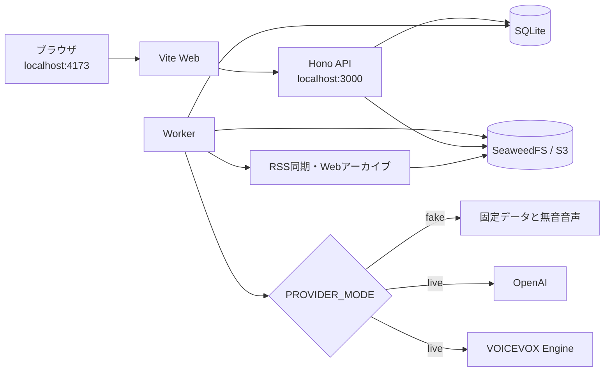

# 開発ガイド

このガイドは、News Podcastをローカルで動かし、変更を検証するための手順をまとめたものです。
初回はfake providerで一連の操作を確認し、必要になった段階でOpenAIとVOICEVOXを使う構成へ切り替えます。

## クイックスタート

### 必要なもの

| ツール | バージョン | 用途 |
| --- | --- | --- |
| Node.js | 24以上 | セットアップ、テスト、ビルド |
| pnpm | 11.16.0 | ワークスペースの依存関係とコマンドの管理 |
| Docker | Docker Composeを利用できる版 | Web、API、Worker、VOICEVOX、SeaweedFSの起動 |

バージョンを確認します。

```bash
node --version
pnpm --version
docker compose version
```

pnpmが未導入の場合は、Node.js付属のCorepackで有効化できます。

```bash
corepack enable
corepack prepare pnpm@11.16.0 --activate
```

### 1. 依存関係と環境変数を準備する

リポジトリのルートで次のコマンドを実行します。

```bash
pnpm install --frozen-lockfile
pnpm setup:env
```

`pnpm setup:env` は `.env.example` から `.env` を作り、ローカル認証に必要なシークレットを生成します。
既存の `.env` は変更しません。
`.env already exists` と表示された場合は `.env.example` と比較し、追加された項目を手動で反映します。
少なくとも `BETTER_AUTH_SECRET`、`AUDIO_ACCESS_SECRET`、`DEV_AUTH_PASSWORD` が空でないことを確認してください。

### 2. アプリ全体を起動する

```bash
pnpm dev:up
```

初回は依存パッケージとVOICEVOXイメージを取得するため、起動に時間がかかります。
APIのヘルスチェックが通ると、Webアプリを開けます。

Node imageはlockfileだけで依存取得layerを作り、BuildKitのpnpm storeを再利用する。通常のソース変更ではinstallをofflineで再利用するためregistryへ接続しない。Compose buildはruntime networkを変えず、build工程だけ`network: host`としてDocker bridgeのDNS遅延を回避する。Composeを使わず直接buildする場合も次のように指定する。

```bash
docker build --network=host -f infra/Dockerfile.node .
```

container内だけ名前解決が数秒以上遅い場合は、containerの`/etc/resolv.conf`に応答しないDNS serverが先頭登録されていないか確認する。host全体で直す場合はDocker daemonのDNS設定を正常なresolverへ変更してdaemonを再起動する必要があり、実行中containerへ影響するため運用者がmaintenanceとして行う。

| 接続先 | URL |
| --- | --- |
| Webアプリ | <http://localhost:4173> |
| APIヘルスチェック | <http://localhost:3000/health> |
| OpenAPIドキュメント | <http://localhost:3000/openapi.json> |
| VOICEVOX Engine | <http://localhost:50021> |
| SeaweedFS S3 API | <http://localhost:8333> |
| SeaweedFS Master UI | <http://localhost:9333> |

### 3. 番組生成を確認する

1. `.env` の `DEV_AUTH_PASSWORD` を確認します。
2. <http://localhost:4173> を開きます。
3. パスワードを入力し、「開発ユーザーでログイン」を選びます。
4. 「購読」で初期フィードが表示されることを確認します。
5. 「今日」で「番組を生成」を選び、状態が「完成」になるまで待ちます。
6. 「ライブラリ」で音声を再生し、出典を開きます。

既定の `PROVIDER_MODE=fake` では、固定のニュース、台本、無音音声を使います。
外部APIを使わずに、認証、非同期ジョブ、音声配信、出典表示まで確認できます。

### 4. 終了する

```bash
pnpm dev:down
```

SQLiteデータ、記事アーカイブ、生成音声はDocker volumeに残ります。
初期状態へ戻す場合だけ、`docker compose down --volumes` でvolumeも削除してください。

## ローカル構成



APIは生成要求をSQLiteへ保存し、Workerはジョブを定期的に取得します。
APIとWorkerはSQLiteをメタデータの正本とし、記事HTML、Markdown、asset、音声をSeaweedFSへ保存します。従来のローカル音声は初回再生時にObjectStoreへ遅延移行します。

## 技術スタックとリポジトリ構成

| 領域 | 主な技術 |
| --- | --- |
| Web | React、Vite、TypeScript、TanStack Router、TanStack Query、Tailwind CSS、shadcn/ui、Base UI |
| API | Hono、Zod、コードファーストOpenAPI |
| Worker | Node.js、RSS、Webアーカイブ、OpenAI Responses API、VOICEVOX |
| データ | セルフホストではSQLiteとSeaweedFS、将来cloud runtimeではD1、R2、Queues |
| 品質 | oxlint、oxfmt、Vitest、Storybook、Playwright、Spectral |

```text
apps/
  api/          HTTP APIとOpenAPI定義
  web/          React Webアプリ
  worker/       RSS取得、台本生成、音声合成
packages/
  domain/       ドメインモデルと不変条件
  application/  ユースケースと外部依存のport
  adapters/     SQLite、RSS、OpenAI、VOICEVOXなどの実装
  contracts/    OpenAPIドキュメントと生成したTypeScript型
  ui/           共有UIコンポーネント
  observability/ 匿名event契約、privacy、Node/no-op adapter
docs/
  adr/          Architecture Decision Records
infra/          コンテナ定義
scripts/        開発用スクリプト
```

依存関係の向きと配備構成は[設計書](design.md)を参照してください。

## OpenTelemetryをローカルで有効にする

既定の`OTEL_ENABLED=false`ではno-op adapterを使うため、SigNozなしで通常のbuild、test、E2Eを実行できる。Collectorへ送る場合だけ`.env`へ次を設定する。

```dotenv
OTEL_ENABLED=true
OTEL_EXPORTER_OTLP_ENDPOINT=https://otel.example.com
OTEL_EXPORTER_OTLP_HEADERS=Authorization=Bearer replace-me
OTEL_SERVICE_VERSION=git-sha-or-release
OTEL_TRACE_SAMPLE_RATE=0.2
TELEMETRY_PROXY_ORIGIN=https://otel.example.com
TELEMETRY_PROXY_TOKEN=replace-me
VITE_TELEMETRY_ENABLED=true
```

Node SDKはAPI/Workerのcomposition rootでアプリ本体より先に初期化する。Browserは同意設定とDNTを確認してから動的importされ、OTLPを`/v1/telemetry/{traces|logs|metrics}`へ送る。このgatewayはアプリsession、same-origin、Content-Type、256KB、所有者単位60 request/分を検証する。

セルフホスト手順、公開port、保持期間、dashboard、alert、backupは[`infra/observability/README.md`](../infra/observability/README.md)を参照する。Windowsの通常検証にSigNozは不要で、SigNoz smoke/restore試験はLinuxまたはWSL2内のnative Docker Engineで行う。

### ローカルのSigNozを起動する

初回だけFoundry CLIを導入する。

```bash
curl -fsSL https://signoz.io/foundry.sh | bash
```

リポジトリのルートで監視基盤とアプリをまとめて起動する。生成されたComposeとデータはGit管理外に置かれる。

```bash
pnpm dev:up:observed
```

`.env`ではNodeプロセスとbrowser telemetry proxyの送信先を、Docker hostで公開されたOTLP HTTP endpointへ向ける。

```dotenv
OTEL_ENABLED=true
OTEL_EXPORTER_OTLP_ENDPOINT=http://signoz-ingester:4318
TELEMETRY_PROXY_ORIGIN=http://signoz-ingester:4318
TELEMETRY_PROXY_TOKEN=news-podcast-local-observability
```

このコマンドはFoundryで監視基盤を生成・起動した後、監視用Compose overrideでAPIとWorkerを`signoz-network`へ接続する。監視基盤なしの通常起動には`pnpm dev:up`を使う。

本番相当のdashboard・alert検証は`SIGNOZ_ENDPOINT`とAdmin service accountの`SIGNOZ_ACCESS_TOKEN`をexportし、`infra/observability/terraform`で`terraform init / validate / plan`を実行する。SMTP channel bootstrap、Terraform apply、watchdog synthetic試験の正確な順序は[監視運用手順](../infra/observability/README.md)に従う。

| 接続先 | URL |
| --- | --- |
| SigNoz UI | <http://localhost:8080> |
| OTLP gRPC | `localhost:4317` |
| OTLP HTTP | `localhost:4318` |

開発用ComposeはWeb、API、SigNoz UI、OTLP endpoint、SeaweedFS、VOICEVOXをすべて`127.0.0.1`へbindする。LANやInternetへ直接公開せず、SSH先では必要なportだけをforwardする。

#### SSH先で起動したサービスへ接続する

通常利用ではWebアプリの4173番とSigNoz UIの8080番だけをforwardする。WebがAPIをproxyするため、APIの3000番を直接forwardする必要はない。

```bash
ssh -N \
  -o ExitOnForwardFailure=yes \
  -o ServerAliveInterval=30 \
  -L 4173:127.0.0.1:4173 \
  -L 8080:127.0.0.1:8080 \
  user@ssh-host
```

接続後はWebアプリを<http://localhost:4173>、SigNozを<http://localhost:8080>で開く。

直接確認やデバッグが必要な場合だけ、次のportを追加でforwardする。

| port | 用途 |
| ---: | --- |
| 3000 | API、health check、OpenAPI |
| 8333 | SeaweedFS S3 API |
| 9333 | SeaweedFS Master UI |
| 50021 | VOICEVOX Engine |
| 4317 | OTLP gRPC |
| 4318 | OTLP HTTP |

すべてをforwardする場合は次のコマンドを使う。

```bash
ssh -N \
  -o ExitOnForwardFailure=yes \
  -o ServerAliveInterval=30 \
  -L 4173:127.0.0.1:4173 \
  -L 3000:127.0.0.1:3000 \
  -L 8080:127.0.0.1:8080 \
  -L 8333:127.0.0.1:8333 \
  -L 9333:127.0.0.1:9333 \
  -L 50021:127.0.0.1:50021 \
  -L 4317:127.0.0.1:4317 \
  -L 4318:127.0.0.1:4318 \
  user@ssh-host
```

OTLPは通常サーバー内のDocker networkで通信するため、ローカルPCからtelemetryを送らない限り4317番と4318番のforwardは不要である。

終了時はアプリと監視基盤を個別に停止する。volumeは保持される。

```bash
pnpm dev:down:observed
```

監視基盤だけを操作する低レベルコマンドとして、`pnpm observability:infra:up`と`pnpm observability:infra:down`も利用できる。

## シナリオ別の開発手順

### フロントエンドをホットリロードする

API、Worker、VOICEVOXをコンテナで起動し、Webだけをホスト上で動かします。
この構成では、Reactの変更がブラウザへ即座に反映されます。

```bash
docker compose up -d --build api worker voicevox
pnpm --filter web dev
```

Webは既定で `http://localhost:3000` のAPIへプロキシします。
終了時はWebのプロセスを `Ctrl+C` で止め、コンテナを削除します。

```bash
pnpm dev:down
```

### UIコンポーネントだけを確認する

APIを起動せずにStorybookを使えます。

```bash
pnpm --filter web storybook
```

<http://localhost:6006> を開きます。
表示変更をまとめて検証する場合は、後述の `pnpm test:visual` を使います。

### ブラウザE2Eを実行する

```bash
pnpm test:e2e
```

E2Eは一時ディレクトリにSQLiteと音声を作り、fake providerを使うWebとAPIを自動起動します。
Docker、`.env`、外部APIキーは不要です。
テスト用サーバーが使う4273番と3100番ポートは空けておく必要があります。

### OpenAIとVOICEVOXで実際に生成する

`.env` の次の値を変更します。

```dotenv
PROVIDER_MODE=live
OPENAI_API_KEY=your-api-key
```

その後、アプリ全体を再ビルドして起動します。

```bash
pnpm dev:up
```

liveモードでは、新着RSS記事を自動アーカイブします。Podcast Agentは保存済みMarkdownをtoolで読み、必要な場合はWeb検索で補足確認してから、台本を構造化して提出します。検証済み台本だけをVOICEVOXで音声化します。
OpenAIの利用料金が発生し、RSS、OpenAI、VOICEVOXへのネットワーク接続が必要です。

## コマンドリファレンス

コマンドはリポジトリのルートで実行します。

### セットアップと実行

| コマンド | 説明 |
| --- | --- |
| `pnpm install --frozen-lockfile` | lockfileを変更せずに依存関係を導入する |
| `pnpm setup:env` | `.env` がない場合にローカル用シークレットを生成する |
| `pnpm dev:up` | ローカルの全サービスをbuildしてバックグラウンド起動する |
| `pnpm dev:down` | アプリのコンテナとnetworkを削除する。volumeは残す |
| `pnpm dev:up:observed` | SigNozと、監視networkへ接続したアプリをまとめて起動する |
| `pnpm dev:down:observed` | アプリとSigNozを停止・削除する。volumeは残す |
| `pnpm observability:infra:up` | FoundryでSigNoz構成を生成し、監視基盤だけを起動する |
| `pnpm observability:infra:down` | SigNozコンテナだけを停止・削除する。volumeは残す |
| `pnpm dev` | 全ワークスペースの開発プロセスを起動する。環境変数と依存サービスは別途用意する |
| `pnpm --filter web dev` | WebだけをViteで起動する |
| `pnpm --filter web storybook` | Storybookを起動する |

### 品質チェック

| コマンド | 説明 |
| --- | --- |
| `pnpm format` | oxfmtでファイルを書き換える |
| `pnpm format:check` | フォーマット差分がないか確認する |
| `pnpm lint` | oxlintとOpenAPIのSpectralルールを実行する |
| `pnpm lint:fix` | oxlintで自動修正できる問題を直す |
| `pnpm typecheck` | 全ワークスペースを型チェックする |
| `pnpm test` | Vitestのユニットテストを実行する |
| `pnpm build` | 全ワークスペースをビルドする |
| `pnpm storybook:build` | Storybookの静的ビルドを作る |
| `pnpm test:e2e` | fake providerを使うブラウザE2Eを実行する |
| `pnpm test:visual` | Storybookを起動してデスクトップとモバイルの画像を比較する |
| `docker compose config` | Compose設定を展開して検証する |

### OpenAPI契約

| コマンド | 説明 |
| --- | --- |
| `pnpm contract:lint` | 生成済みOpenAPIドキュメントをSpectralで検査する |
| `pnpm contract:generate` | Honoの定義からOpenAPI JSONとTypeScript型を再生成する |
| `pnpm contract:check` | 生成物がHonoの定義と一致するか確認する |

APIのrouteやschemaを変更した場合は `pnpm contract:generate` を実行し、生成物も変更へ含めます。

## 環境変数リファレンス

`.env.example` が設定項目のテンプレートです。
`.env` にはシークレットが含まれるため、Gitへ追加しないでください。

### 実行モードと外部サービス

| 変数 | 未設定時またはテンプレート値 | 必須になる条件 | 説明 |
| --- | --- | --- | --- |
| `APP_ENV` | `development` | いいえ | 実行環境。`production` ではfake providerと開発ログインを禁止する |
| `PROVIDER_MODE` | テンプレートは `fake`、未設定時は `live` | いいえ | `fake` は固定データ、`live` はRSS、OpenAI、VOICEVOXを使う |
| `OPENAI_API_KEY` | なし | `PROVIDER_MODE=live` | OpenAI APIキー |
| `OPENAI_MODEL` | `gpt-5.6-luna` | いいえ | 台本生成に使うモデル |
| `VOICEVOX_BASE_URL` | `http://voicevox:50021` | `PROVIDER_MODE=live` | Workerから見たVOICEVOX EngineのURL |
| `VOICEVOX_CHARACTER_NAME` | `ずんだもん` | いいえ | `/speakers` から検索するキャラクター名 |
| `VOICEVOX_STYLE_NAME` | なし | いいえ | 同じキャラクターに複数のスタイルがある場合の名前 |

### 認証

| 変数 | 未設定時またはテンプレート値 | 必須になる条件 | 説明 |
| --- | --- | --- | --- |
| `BETTER_AUTH_SECRET` | 自動生成 | 常時 | セッション署名用の秘密値 |
| `BETTER_AUTH_URL` | `http://localhost:4173` | 常時 | 認証と音声アクセスURLの基準となる公開URL |
| `DEV_AUTH_ENABLED` | `true` | いいえ | `true` でローカル用パスワードログインを有効にする |
| `DEV_AUTH_USER_ID` | 固定の開発用UUID | いいえ | 開発ログインで使うユーザーID |
| `DEV_AUTH_PASSWORD` | 自動生成 | `DEV_AUTH_ENABLED=true` | 開発ログイン用パスワード |
| `GOOGLE_CLIENT_ID` | なし | Googleログインを使う場合 | Google OAuthクライアントID。secretと対で設定する |
| `GOOGLE_CLIENT_SECRET` | なし | Googleログインを使う場合 | Google OAuthクライアントsecret。IDと対で設定する |

`DEV_AUTH_ENABLED=true` と `APP_ENV=production` の組み合わせではAPIが起動しません。

### ストレージとポート

| 変数 | 未設定時またはテンプレート値 | 必須になるサービス | 説明 |
| --- | --- | --- | --- |
| `DATABASE_PATH` | `/app/data/news-podcast.sqlite` | API、Worker | 共有するSQLiteファイルのパス |
| `AUDIO_DIRECTORY` | `/app/audio` | API、fake Worker | 従来音声の遅延移行とfake E2E用ディレクトリ |
| `S3_ENDPOINT` | `http://seaweedfs:8333` | API、Worker | SeaweedFSのS3 endpoint |
| `S3_REGION` | `us-east-1` | API、Worker | S3署名に使うregion |
| `S3_BUCKET` | `news-podcast` | API、Worker | 記事と音声を保存する非公開bucket |
| `S3_ACCESS_KEY_ID` | 開発用値 | API、Worker、SeaweedFS | S3 access key |
| `S3_SECRET_ACCESS_KEY` | 開発用値 | API、Worker、SeaweedFS | S3 secret key。本番では変更する |
| `ARCHIVE_MAX_HTML_BYTES` | `5242880` | Worker | 元HTML 1件の最大byte数 |
| `ARCHIVE_MAX_ASSET_BYTES` | `20971520` | Worker | 保存resource 1件の最大byte数 |
| `ARCHIVE_MAX_TOTAL_ASSET_BYTES` | `104857600` | Worker | 1 snapshotに保存するresource合計の最大byte数 |
| `ARCHIVE_MAX_ASSETS` | `512` | Worker | 1 snapshotに保存する重複除外後resourceの最大件数 |
| `AUDIO_ACCESS_SECRET` | 自動生成 | API | 音声アクセス用トークンの署名に使う秘密値 |
| `API_PORT` | `3000` | API | APIが待ち受けるポート |
| `VITE_API_PROXY_TARGET` | `http://localhost:3000` | Web | Viteが `/api`、`/v1` などを転送するAPIのURL |

ComposeではWebの `VITE_API_PROXY_TARGET` を `http://api:3000` に上書きします。
ホスト上で `pnpm --filter web dev` を実行する場合は、既定の `http://localhost:3000` が使われます。

## トラブルシューティング

### 開発ログインに失敗する

- `.env` の `DEV_AUTH_ENABLED` が `true` か確認します。
- 画面へ入力した値が `.env` の `DEV_AUTH_PASSWORD` と一致するか確認します。
- `.env` を変更した後は、`pnpm dev:up` でコンテナを作り直します。

### APIが起動しない

```bash
docker compose logs api
docker compose config
```

`BETTER_AUTH_SECRET`、`BETTER_AUTH_URL`、`DATABASE_PATH`、`AUDIO_ACCESS_SECRET`、`S3_*` が空でないことを確認します。
`pnpm setup:env` は既存の `.env` を更新しないため、項目が増えた場合は `.env.example` と手動で比較します。

### 番組生成が完了しない

```bash
docker compose logs worker
docker compose logs voicevox
```

fakeモードでは `PROVIDER_MODE=fake` と `APP_ENV=development` を確認します。
liveモードではOpenAI APIキー、RSSへの接続、VOICEVOXのヘルスチェックを順に確認します。

### ポートが使用中と表示される

4173、3000、50021番ポートを使う別プロセスを終了するか、起動中のCompose環境を停止します。

```bash
pnpm dev:down
```

## 関連ドキュメント

- [設計書](design.md)
- [品質ベースライン](quality-baseline.md)
- [Architecture Decision Records](adr/)
