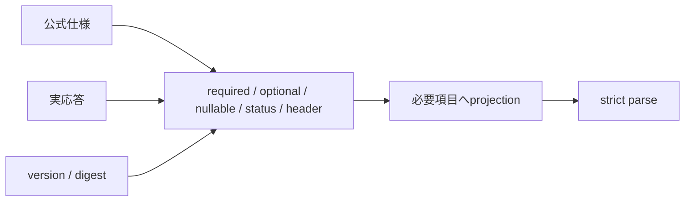

# 外部provider契約台帳

最終実証: 2026-08-15 JST。正本の優先順位は「公式仕様 → 稼働version/digest → 匿名化した実応答構造」である。既存fixtureだけを根拠にDTOを広げない。

| 境界 | 公式仕様 | 稼働対象 | 実証結果 | version方針 |
|---|---|---|---|---|
| VOICEVOX | [Engine/API](https://github.com/VOICEVOX/voicevox_engine)、稼働`/openapi.json` | image 24.04 / engine 0.25.2 | `/version`、`/speakers`、`/audio_query` 200。queryを欠落なく渡した`/synthesis`は`audio/wav`のRIFF/WAVE | 検証済みdigest固定 |
| OpenAI | [Structured Outputs](https://developers.openai.com/api/docs/guides/structured-outputs)、[gpt-5.6-luna](https://developers.openai.com/api/docs/models/gpt-5.6-luna) | `gpt-5.6-luna` alias | 累計12 request。修正後は台本・補完とも5回連続で`completed`、`reasoning`/`message(output_text)`、usageを確認 | alias維持。変更時は両adapterを再実証 |
| S3/SeaweedFS | [PutObject](https://docs.aws.amazon.com/AmazonS3/latest/API/API_PutObject.html)、[SeaweedFS](https://github.com/seaweedfs/seaweedfs) | 4.21 | 専用一時prefixでPut/Head/Get/署名URL/Delete。200、23 bytes一致、削除後Head 404 | 検証済みdigest固定 |
| RSS/Atom/HTML | [RSS 2.0](https://www.rssboard.org/rss-specification)、[Atom RFC 4287](https://datatracker.ietf.org/doc/html/rfc4287)、[RSS 1.0](https://web.resource.org/rss/1.0/spec) | live `feed_catalog` 1件 | safe-fetchでRSS 2.0を200/application/xml、459 items。先頭記事を200/text/htmlで確認 | 仕様・取得日・匿名化構造を記録 |

## 契約照合

### VOICEVOX AudioQuery

`accent_phrases`、各scale、phoneme length、sampling rate、stereoはrequired。`kana`はoptional string、`pauseLength`はoptional `number | null`、`pauseLengthScale`はoptional number（default 1）。provider-onlyのspeaker metadataは`name/styles.name/styles.id`へprojectionしてからstrict parseする。AudioQueryはsynthesis requestへ全項目を渡す。

### OpenAI Responses

要求は`text.format={type:"json_schema",strict:true}`。objectの全propertyをrequiredとし、`additionalProperties:false`にする。Structured Outputsが明記するarray制約は`minItems/maxItems`であり、`uniqueItems`はsubsetにない。一意性はapplication payload schemaでfail closedする。`max_output_tokens`は記事補完2,048、台本4,096に固定し、上限到達の`incomplete`を成功扱いしない。

応答はstatus `completed`、output item union内の`output_text`または`refusal`、必要なadapterではusageのinput/output tokensだけをprojectionし、その後strict parseする。provider-onlyのreasoning、ID、annotations、本文は保持しない。message contentに検証済みunion外のpartが現れた場合は捨てずにcontract driftとしてfail closedする。

### S3

Put/Head/Get成功はHTTP 200。Headの`Content-Type`と`Content-Length`、Get bytes一致を検証する。存在しないkeyは404。署名URLは署名queryの存在だけを検査し、URL自体を保存しない。一時prefixは`finally`でも削除する。

### Feed / HTML

RSS 2.0は`rss/channel/title/link/description`、Atomは`feed/id/title/updated`、RSS 1.0はRDF rootとchannel/itemを基準にする。item identityは`guid` / Atom `id` / RDF `about` / 解決済みlinkの順。CDATA、namespace extension、相対URL、複数linkを許容するが、未知root、壊れたXML、非HTTP(S)、private/reserved destination、redirect上限、byte上限は拒否する。

## 証拠管理と更新

- commitするのは[匿名fixture](../contracts/provider-contracts.json)だけ。秘密、本文、provider ID、署名URL、完全feed/article URLは保存しない。
- offline CIは`pnpm provider-contract:check`を実行する。
- live再調査は`PROVIDER_CONTRACT_REFRESH=1 pnpm provider-contract:refresh`のpreflight後、この文書の4 probeを明示実行する。OpenAIは既存keyを表示せず、各serviceの`*.contract.test.ts`を実行する。`OPENAI_CONTRACT_SAMPLES`は既定3、最大25/adapter（合計最大50 request）で、retryは行わない。
- 公式仕様と実データが矛盾した場合はDTOを広げず停止し、version、status/header/content type、匿名化した構造差分を報告する。
