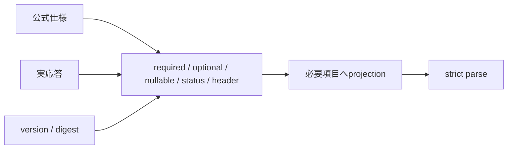

# 外部provider契約台帳

最終実証: 2026-08-16 JST。正本の優先順位は「公式仕様 → 稼働version/digest → 匿名化した実応答構造」である。既存fixtureだけを根拠にDTOを広げない。

| 境界 | 公式仕様 | 稼働対象 | 実証結果 | version方針 |
|---|---|---|---|---|
| VOICEVOX | [Engine/API](https://github.com/VOICEVOX/voicevox_engine)、稼働`/openapi.json` | image 24.04 / engine 0.25.2 | `/version`、`/speakers`、`/audio_query` 200。queryを欠落なく渡した`/synthesis`は`audio/wav`のRIFF/WAVE | 検証済みdigest固定 |
| OpenAI | [Structured Outputs](https://developers.openai.com/api/docs/guides/structured-outputs)、[gpt-5.6-luna](https://developers.openai.com/api/docs/models/gpt-5.6-luna) | `@effect/ai-openai@4.0.0-rc.109` / `gpt-5.6-luna` alias | Effect AIの`generateObject`で台本・読み辞書・記事補完・自動選定を検証。SDKが返すusageを採用 | SDKとmodelを固定。変更時は全adapterを再実証 |
| S3/SeaweedFS | [PutObject](https://docs.aws.amazon.com/AmazonS3/latest/API/API_PutObject.html)、[SeaweedFS](https://github.com/seaweedfs/seaweedfs) | 4.21 | 専用一時prefixでPut/Head/Get/署名URL/Delete。200、23 bytes一致、削除後Head 404 | 検証済みdigest固定 |
| RSS/Atom/HTML | [RSS 2.0](https://www.rssboard.org/rss-specification)、[Atom RFC 4287](https://datatracker.ietf.org/doc/html/rfc4287)、[RSS 1.0](https://web.resource.org/rss/1.0/spec) | live `feed_catalog` 1件 | safe-fetchでRSS 2.0を200/application/xml、459 items。先頭記事を200/text/htmlで確認 | 仕様・取得日・匿名化構造を記録 |

## 契約照合

### VOICEVOX AudioQuery

`accent_phrases`、各scale、phoneme length、sampling rate、stereoはrequired。`kana`はoptional string、`pauseLength`はoptional `number | null`、`pauseLengthScale`はoptional number（default 1）。provider-onlyのspeaker metadataは`name/styles.name/styles.id`へprojectionしてからstrict parseする。AudioQueryはsynthesis requestへ全項目を渡す。

### OpenAI via Effect AI

各adapterは`effect@4.0.0-rc.109`の`LanguageModel.generateObject`へEffect Schemaを渡す。`@effect/ai-openai@4.0.0-rc.109`がOpenAIのstrict structured outputへ変換し、`packages/ai-runtime`がbase URL、Redacted API key、deadline、応答byte上限、`AiError`変換を集約する。`OPENAI_API_URL`は既定`https://api.openai.com/v1`のbase URLであり、Responses endpointの完全URLは設定しない。

adapterはSDKがschema検証したobjectとusageだけを受け取る。手書きBearer header、request JSON、`output_text`探索、JSON parse、JSON Schema生成は行わない。一意性、候補部分集合、出典完全性、タグallowlist、台本内の読み候補など、provider schemaだけでは保証できない業務契約はapplication側でfail closedする。台本生成では出典を`source-1`形式のopaque IDでmodelへ渡し、検証後に版固定snapshotのURLへ戻すため、完全URLをmodelに再生成させない。prompt、記事本文、台本、完全URL、API key、provider-onlyのreasoning/ID/annotationは保存・telemetry属性へ出さない。

429の`Retry-After`、一時的な5xx/network failure、schema不適合、refusal、timeout、caller cancellationは`AiError`から既存policyへ分類する。最大試行・最大経過時間・30秒の待機上限を維持し、token数はmodelに生成させずSDK usageを利用する。

### S3

Put/Head/Get成功はHTTP 200。Headの`Content-Type`と`Content-Length`、Get bytes一致を検証する。存在しないkeyは404。署名URLは署名queryの存在だけを検査し、URL自体を保存しない。一時prefixは`finally`でも削除する。

### Feed / HTML

RSS 2.0は`rss/channel/title/link/description`、Atomは`feed/id/title/updated`、RSS 1.0はRDF rootとchannel/itemを基準にする。item identityは`guid` / Atom `id` / RDF `about` / 解決済みlinkの順。CDATA、namespace extension、相対URL、複数linkを許容するが、未知root、壊れたXML、非HTTP(S)、private/reserved destination、redirect上限、byte上限は拒否する。

## 証拠管理と更新

- commitするのは[匿名fixture](../contracts/provider-contracts.json)だけ。秘密、本文、provider ID、署名URL、完全feed/article URLに加え、観測時刻、実リクエスト数、実feed件数も保存しない。
- offline CIは`pnpm provider-contract:check`を実行する。
- live再調査は`PROVIDER_CONTRACT_REFRESH=1 pnpm provider-contract:refresh`のpreflight後、この文書の4 probeを明示実行する。OpenAIは既存keyを表示せず、各serviceの`*.contract.test.ts`を実行する。`OPENAI_CONTRACT_SAMPLES`は既定3、最大25/adapter（合計最大50 request）で、retryは行わない。Effect AIまたはOpenAI adapterのversion更新も再調査条件とする。
- 公式仕様と実データが矛盾した場合はDTOを広げず停止し、version、status/header/content type、匿名化した構造差分を報告する。
