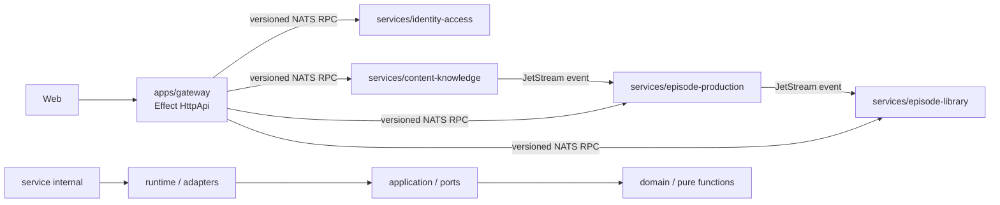
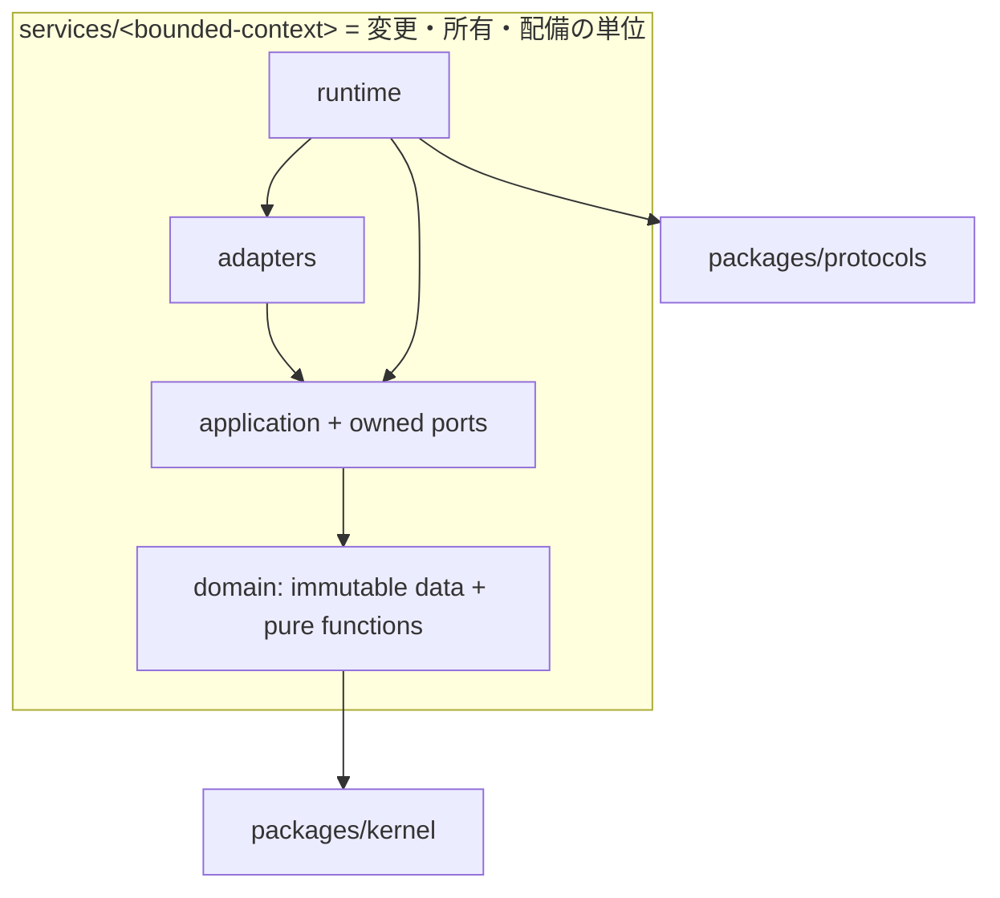
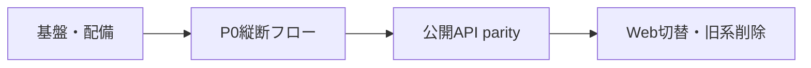
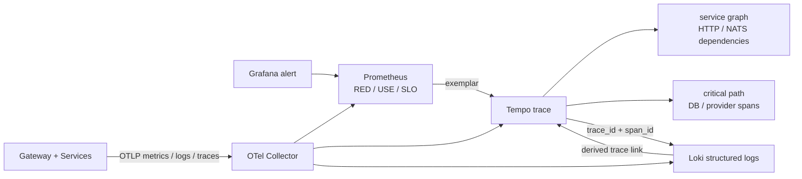
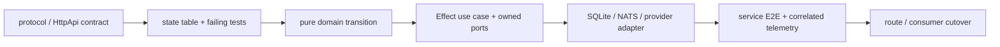
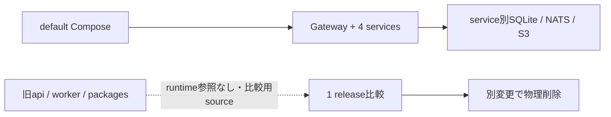

# 関数型DDDマイクロサービス移行ガイド

- 更新日: 2026-08-13
- 状態: 100% — supported scopeの移行完了
- 対象判断: 新旧どちらへ実装するか、旧実装をいつ削除できるか
- 関連: [システムアーキテクチャ](architecture.md) / [開発ガイド](development.md) / [ADR-0032](adr/0032-grafana-correlated-observability.md) / [ADR-0033](adr/0033-colocate-bounded-context-with-service.md) / [ADR-0034](adr/0034-functional-domain-model-and-effect-boundaries.md) / [ADR-0038](adr/0038-bounded-structured-production-generation.md) / [ADR-0039](adr/0039-support-node-self-host-runtime-only.md)

> 新Gatewayと4 servicesへの機能実装、Web/OpenAPI切替、service別state migration、全suite・coverage・Compose/E2E gateが完了した。default Composeは新topologyだけを起動する。旧`apps/api` / `apps/worker`と旧packagesは比較用sourceとして残すが、runtime正本ではない。

## 1. 移行の正本と依存方向

新規の業務実装は`services/*`、外部HTTP契約は`apps/gateway`、Context間契約は`packages/protocols`へ追加する。旧`apps/api`、`apps/worker`、`packages/domain|application|adapters`へ新規機能を増やさない。

依存の矢印は必ず内向きにする。外部入力は`unknown`として境界でparseし、余剰propertyを拒否したdeep-frozenな値だけをapplication/domainへ渡す。Context間でdomain型やDBを共有しない。認証主体IDはUUIDと仮定せず、Identityでparseしたbounded opaque値をActorとして伝播する（ADR-0035）。

## 2. `contexts/`と`services/`を分離しない理由

4 Bounded Contextと配備サービスが現在は1対1であるため、純粋中核だけを`contexts/`へ分けると、1変更の所有範囲が2つのtop-level treeへ分散する。Onionの境界は物理的な遠さではなく、service内の構造とCIで保証する。

`contexts/`分離を再検討するのは、同じdomain/applicationを2つ以上の独立配備が共有することが確定した場合だけとする。偶然似た型や関数は共有理由にしない。

## 3. 現在地

### 完成済みの移行基盤

| Surface | 実装済みの範囲 | 証拠 |
| --- | --- | --- |
| immutable kernel | strict parse、全エラー収集、循環安全なdeep freeze | `packages/kernel` |
| Context間protocol | version付きsubject/envelope、Actor、correlation/causation、W3C trace context | `packages/protocols` |
| 4 Contextの縦断スライス | 関数型domain/application port、境界parse、SQLite/NATS adapterの代表経路 | `services/*` |
| Gatewayの縦断スライス | Effect HttpApi契約、handler、NATS port | `apps/gateway` |
| Architecture gate | 逆向きimport、Context横断import、新規自己定義classをCIで拒否 | `scripts/check-architecture.mjs` |
| Observability基盤 | OTel、Grafana、Prometheus、Loki、Tempo、Collector、5 dashboard、7 alert | `packages/observability`、`infra/observability` |
| 実行topology | Gateway + 4 services、service別SQLite、readiness、JetStream provision | `compose.yaml`、`packages/service-runtime` |
| P0業務縦断 | 認証、購読CRUD、RSS/HTML安全取得、OpenAI、VOICEVOX、S3、完成Library | `pnpm test:e2e:functional` |
| 耐障害性 | outbox/inbox、durable ack/nack、provider deadline/retry、fenced lease heartbeat | Production/Library/Content integration tests |
| coverage gate | 8つの関数型packageで最低lines 75%、branches 60% | `pnpm test:coverage:functional` |

「縦断スライス完了」は、そのContextの全ユースケース移植完了を意味しない。

### 最終gate

supported scopeは次のgateをすべてGreenにして完了した。

| Gate | 実装状態 | 最終確認 |
| --- | --- | --- |
| Gateway + 4 servicesの公開API parity | Green | service/Gateway/functional E2E |
| Gateway OpenAPI + Web client | Green | contract diff、Web unit/lint/typecheck、Web E2E 13/13 |
| service別migration/backup/restore | Green | migration 4、SQLite state 3 tests |
| 相関監視 | Green | Gateway→Identityの実trace、observed Compose config |
| coverage | Green | 8 packageでlines 75% / branches 60% gate通過 |

一般Agent Harness/hosted Web検索とCloud runtimeは未移植ではない。本番要件とSLOがないため、[ADR-0038](adr/0038-bounded-structured-production-generation.md)と[ADR-0039](adr/0039-support-node-self-host-runtime-only.md)で意図的にsupported scopeから外した。

### 進捗の数え方

2026-08-13時点でsupported scopeの移行は100%である。旧sourceの物理削除は、1 releaseの比較とrollback演習後に行う別の運用変更であり、この進捗には含めない。

### 公開ユースケース移植matrix

| 業務surface | 新系の状態 | 次の完了ゲート |
| --- | --- | --- |
| auth/session | Done | Identity HTTP + Gateway固定origin proxy |
| feed subscription | Implemented | add/list/delete/pause/resume |
| RSS/archive/materialize | Implemented | Content RPCと記事公開API |
| episode job create/execution | Done | create/get/list/cancel/retry/eventsとscheduler |
| episode library/audio access | Implemented | list/detail/accessとcursor pagination |
| article state/search/facets | Implemented | owner-scoped Content RPC + Gateway |
| settings/schedule/time zone | Implemented | Identity ownership、due/complete RPC |
| tag/suggestion | Implemented | Content ownershipとtransaction |
| reading dictionary | Implemented | Production ownershipと生成時snapshot |
| enrichment queue | Implemented | Content provider境界、queue/reprocess |
| agent audit/memory | Done | Production ownership、owner/job/attempt lineage |
| telemetry ingest | Replaced | Collector経由のOTLP相関監視 |
| OpenAPI/Web | Done | Gateway生成物が正本、Web proxy/client切替、E2E 13/13 |

## 4. Grafanaでの障害切り分け

OpenTelemetryを計装と転送の唯一の契約として維持し、保存・検索だけをPrometheus/Loki/Tempoへ分離する。Grafanaのprovisioning fileがdashboard、datasource相関、alertの正本である。

調査は次の順に行う。

1. `Overview`または`Episode Production`でerror rate、latency、queue ageを特定する。
2. exemplarまたは`Service Map & Tracing`から代表traceを開き、失敗edgeとcritical pathを特定する。
3. Tempoのtrace-to-logsから同じ`trace_id`、必要なら`span_id`のログへ絞る。
4. `Telemetry Platform`でCollector queue/export failureを確認し、観測欠落と業務障害を分離する。
5. Grafana自体が見えない場合は、独立watchdogのSMTP通知と各health endpointを確認する。

バックエンドtraceは100%収集し、metricsへ高cardinality IDを入れない。message/job IDはtrace/logだけに置き、認証情報、本文、完全URL、DB statementは送信前にredactする。

## 5. 移植の進め方

1ユースケースを次の単位で完結させてから次へ進む。

- bug修正は再現testを先に追加する。
- mutable SDK interopは`infrastructure/unsafe`に閉じ、parse直後にimmutable値へ変換する。
- protocol変更は後方互換または新versionを選び、producer/consumerを同時変更前提にしない。
- dashboard/alertもユースケースの受け入れ条件として同じ変更で更新する。

## 6. Cutoverと旧sourceの扱い

- default Compose、Web proxy、OpenAPI生成は新Gateway/4 servicesだけを参照する。
- 旧`apps/api` / `apps/worker`と`packages/domain|application|adapters`へ新規機能を追加しない。
- 旧共有SQLiteは`state:migrate:functional-ddd`でservice別DBへ変換する。実行時はrollback backupが必須で、件数/hash/owner/FK/integrityを検証してからpublishする。
- backup/restoreはservice種別を検証し、既存DBへ上書きしない。手順は[Service state backup / restore](operations/service-state-recovery.md)を正本とする。
- 旧sourceの物理削除は、最終gate Green、1 releaseの比較、rollback演習後に別変更として行う。sourceが残ることをruntime併存と解釈しない。
