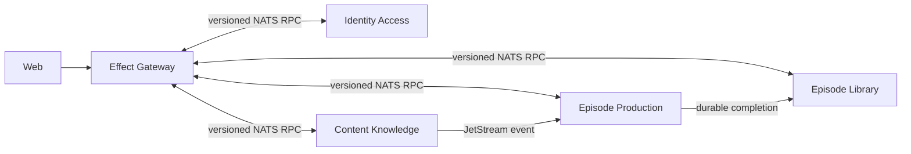
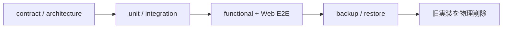
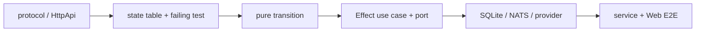

# 関数型DDDマイクロサービス移行記録

- 更新日: 2026-08-13
- 状態: 100% — 移行と旧実装の物理削除を完了
- 関連: [システムアーキテクチャ](architecture.md) / [開発ガイド](development.md) / [ADR-0033](adr/0033-colocate-bounded-context-with-service.md) / [ADR-0038](adr/0038-bounded-structured-production-generation.md) / [ADR-0039](adr/0039-support-node-self-host-runtime-only.md)

> Gateway、4 Context services、Web、service別state、配備・観測基盤が唯一の実装である。旧API/Worker、共有domain/application/adapter、汎用Agent sandbox、Cloud runtime、旧共有DB migration CLIは削除し、後方互換経路を持たない。

## 1. 完成した構成

各service内の依存は`runtime/adapters → application → domain`だけにする。外部入力は`unknown`として境界でparseし、Context間でdomain型やDBを共有しない。認証主体はIdentityが確定したActorだけを伝播する。

| Surface | 完成内容 | 証拠 |
| --- | --- | --- |
| immutable kernel / protocol | strict parse、deep freeze、version付きsubject、相関envelope | `packages/kernel`、`packages/protocols` |
| 4 Context services | service内domain/application/adapters/runtime、専用SQLite | `services/*` |
| Gateway / Web | Effect HttpApi、認証proxy、生成OpenAPI client | `apps/gateway`、`apps/web`、`packages/contracts` |
| 非同期実行 | NATS/JetStream、outbox/inbox、fenced lease、scheduler | Production/Library integration tests |
| provider境界 | 安全なRSS取得、strict OpenAI応答、VOICEVOX、S3 | adapter tests、functional E2E |
| 可観測性 | OTLP、Grafana、Prometheus、Loki、Tempo | `packages/observability`、`infra/observability` |
| 復旧 | service別backup、profile検証、別path restore | `pnpm test:sqlite-state`、運用runbook |

## 2. 公開ユースケース

| 業務surface | 状態 |
| --- | --- |
| auth/session | Identity HTTP + Gateway固定origin proxy |
| feed/article/tag/enrichment | Content owner-scoped RPC + Gateway API |
| settings/schedule | Identity owner-scoped RPC + Production scheduler |
| episode job / dictionary / audit | Production RPC、cancel/retry、lineage |
| episode library / audio access | Library RPC、短期アクセスURL |
| OpenAPI / Web | Gateway生成契約、主要journey E2E |

一般Agent Harness、hosted Web検索、Cloud runtimeは未移植項目ではない。要件とSLOがないためADR-0038/0039で廃止し、関連sourceも削除した。

## 3. 最終gate

| Gate | 状態 |
| --- | --- |
| Gateway + 4 servicesの公開API | Green |
| Gateway OpenAPI + Web client | Green |
| NATS/JetStream functional E2E | Green |
| Web主要journey E2E | Green |
| functional package coverage | Green |
| architecture / lint / typecheck | Green |
| service別backup / restore | Green |
| 旧source、workspace、Docker、CI参照 | Removed |

## 4. 削除した境界

| 削除対象 | 理由 | 現在の置換先 |
| --- | --- | --- |
| 旧API / Worker | 二重composition rootと共有stateを排除 | Gateway / 4 Context services |
| 共有domain/application/adapters | Context所有を曖昧にする | 各`services/*`内のlayer |
| Agent Runtime / Firecracker crates | 本番要件がなく攻撃面と運用負荷が増える | Productionの有界構造化生成 |
| Cloudflare adapter | contract suiteと運用ownerがない | Node self-host runtime |
| 旧共有DB migration CLI | 旧schemaを受け入れ続ける互換面になる | service別DBのbackup/restore |

削除済み実装の復活や旧DB形式の受け入れは行わない。必要になった能力は、現在の境界と契約に沿って新規設計し、後続ADRで承認する。

## 5. 継続する変更手順

- bug修正は再現testを先に追加する。
- mutable SDK interopは`infrastructure/unsafe`へ閉じる。
- protocol変更はproducer/consumerと生成契約を同じ変更で更新する。
- dashboard、alert、復旧手順も受け入れ条件に含める。
